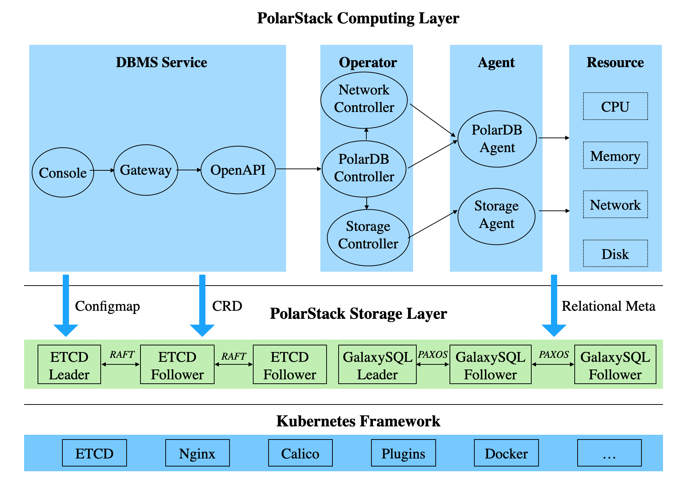

<div align="center">

[](https://developer.aliyun.com/topic/polardb-for-pg)

# PolarDB for PostgreSQL

**阿里云自主研发的云原生数据库产品**

[](https://developer.aliyun.com/topic/polardb-for-pg)

[](https://github.com/ApsaraDB/PolarDB-for-PostgreSQL/actions/workflows/build-and-test.yml)
[](https://github.com/ApsaraDB/PolarDB-for-PostgreSQL/actions/workflows/build-and-test.yml)
[](https://github.com/ApsaraDB/PolarDB-for-PostgreSQL/actions/workflows/build-and-test.yml)
[](doc/PolarDB-CN/LICENSE.txt)
[](https://GitHub.com/ApsaraDB/PolarDB-for-PostgreSQL/issues)
[](https://GitHub.com/ApsaraDB/PolarDB-for-PostgreSQL/pulls)
[](https://github.com/ApsaraDB/PolarDB-for-PostgreSQL/network/members)
[](https://github.com/ApsaraDB/PolarDB-for-PostgreSQL/stargazers)
[](https://github.com/ApsaraDB/PolarDB-for-PostgreSQL/graphs/contributors)

</div>

# 什么是 PolarDB PostgreSQL


PolarDB PostgreSQL（下文简称为 PolarDB）是一款阿里云自主研发的云原生数据库产品，100% 兼容 PostgreSQL，采用基于 Shared-Storage 的存储计算分离架构，具有极致弹性、毫秒级延迟、HTAP 的能力。

1. 极致弹性：存储与计算能力均可独立地横向扩展。
    - 当计算能力不够时，可以单独扩展计算集群，数据无需复制。
    - 当存储容量或 I/O 不够时，可以单独扩展存储集群，而不中断业务。
2. 毫秒级延迟：
    - WAL 日志存储在共享存储上，RW 到所有 RO 之间仅复制 WAL 的元数据。
    - 独创的 *LogIndex* 技术，实现了 Lazy 回放和 Parallel 回放，理论上最大程度地缩小了 RW 和 RO 节点间的延迟。
3. HTAP 能力：基于 Shared-Storage 的分布式并行执行框架，加速在 OLTP 场景下的 OLAP 查询。一套 OLTP 型的数据，可支持 2 套计算引擎：
    - 单机执行引擎：处理高并发的 TP 型负载。
    - 分布式执行引擎：处理大查询的 AP 型负载。

PolarDB 还支持时空、GIS、图像、向量、搜索、图谱等多模创新特性，应对企业对数据处理日新月异的需求。

另外，除了上述 Shared-Storage 云原生的模式，PolarDB 还支持以 Shared-Nothing 模式部署，详见 **distribute** 分支的 [README](https://github.com/ApsaraDB/PolarDB-for-PostgreSQL/blob/distributed/README.md)。

# 分支说明

PolarDB 后续默认分支为 main 分支，支持存储计算分离的形态。分布式形态由 distribute 分支支持（对应之前的 master 分支）。

# 产品架构和版本规划

PolarDB 采用了基于 Shared-Storage 的存储计算分离架构。数据库由传统的 Share-Nothing 架构，转变成了 Shared-Storage 架构。由原来的 N 份计算 + N 份存储，转变成了 N 份计算 + 1 份存储。虽然共享存储上数据是一份，但是数据在各节点内存中的状态是不同的，需要通过内存状态的同步来维护数据的一致性；同时主节点在刷脏时也需要做协调，避免只读节点读取到超前的 **“未来页面”**，也要避免只读节点读取到过时的没有在内存中被正确回放的 **“过去页面”**。为了解决该问题，PolarDB 创造性地设计了 *LogIndex* 数据结构来维护页面的回放历史，该结构能够实现主节点与只读节点之间的同步。

在存储计算分离后，I/O 单路延迟变大的同时，I/O 的吞吐也变大了。在处理分析型查询时，仅使用单个只读节点无法发挥出存储侧的大 I/O 带宽优势，也无法利用其他只读节点的 CPU、内存和 I/O 资源。为了解决该问题，PolarDB 研发了基于 Shared-Storage 的并行执行引擎，能够在 SQL 级别上弹性利用任意数目的 CPU 来加速分析查询，支持 HTAP 的混合负载场景。

详情请查阅 [产品架构](/doc/PolarDB-CN/Architecture.md) 和 [版本规划](/doc/PolarDB-CN/Roadmap.md)。

# 文档

- [产品架构](/doc/PolarDB-CN/Architecture.md)
- [版本规划](/doc/PolarDB-CN/Roadmap.md)
- PolarDB PostgreSQL 1.0 版本功能特性
    - [Buffer 管理](/doc/PolarDB-CN/Buffer_Management.md)
    - [DDL 同步](/doc/PolarDB-CN/DDL_Synchronization.md)
    - [LogIndex](/doc/PolarDB-CN/LogIndex.md)
- 数据库监控（即将上线）
- [PolarDB Stack](https://github.com/ApsaraDB/PolarDB-Stack-Operator/blob/master/README.md)
- PolarVFS（即将上线）

# 快速入门

我们提供了5种方式来使用PolarDB数据库：阿里巴巴云服务、搭建本地存储的实例、搭建基于NBD共享存储的实例、搭建基于ceph共享存储的实例、搭建基于PolarDB Stack共享存储的实例。

## 方式1：阿里巴巴云服务

阿里云云原生关系型数据库 PolarDB PostgreSQL 引擎：[官网地址](https://www.aliyun.com/product/polardb)。

## 方式2：搭建本地存储的实例

我们提供了一键部署脚本，助您快速编译 PolarDB 内核并搭建本地实例。本节介绍了如何通过提供的一键部署脚本，快速搭建存储为本地磁盘的 PolarDB 实例。

**操作系统要求**：CentOS 7.5 及以上。以下步骤在 CentOS 7.5 上通过测试。

> 说明：请使用同一个用户进行以下步骤。请勿使用 *root* 用户搭建实例。

1. 从 [这里](https://github.com/ApsaraDB/PolarDB-for-PostgreSQL/tree/main) 下载 PolarDB 源代码。
2. 安装相关依赖：

    ```bash
    sudo yum install readline-devel zlib-devel perl-CPAN bison flex
    sudo cpan -fi Test::More IPC::Run
    ```
3. 根据不同的搭建场景，可选择不同的脚本执行命令：
    - 只编译数据库源码，不创建本地实例：

        ```bash
        ./polardb_build.sh --noinit
        ```
    - 编译并创建本地单节点实例，节点为主节点（端口为 5432）：

        ```bash
        ./polardb_build.sh
        ```
    - 编译并创建本地多节点实例，节点包括：
        - 1 个主节点（端口为 5432）
        - 1 个只读节点（端口为 5433）

        ```bash
        ./polardb_build.sh --withrep --repnum=1
        ```
    - 编译并创建本地多节点实例，节点包括：
        - 1 个主节点（端口为 5432）
        - 1 个只读节点（端口为 5433）
        - 1 个备库节点（端口为 5434）

        ```bash
        ./polardb_build.sh --withrep --repnum=1 --withstandby
        ```
    - 编译并创建本地多节点实例，节点包括：
        - 1 个主节点（端口为 5432）
        - 2 个只读节点（端口分别为 5433 与 5434）
        - 1 个备库节点（端口为 5435）

        ```bash
        ./polardb_build.sh --withrep --repnum=2 --withstandby
        ```
4. 部署完成后，需要进行实例检查和测试，确保部署正确。
    - 实例检查：

        ```bash
        $HOME/tmp_basedir_polardb_pg_1100_bld/bin/psql -p 5432 -c 'select version();'
        $HOME/tmp_basedir_polardb_pg_1100_bld/bin/psql -p 5432 -c 'select * from pg_replication_slots;'
        ```
    - 一键执行全量回归测试：

        ```bash
        ./polardb_build.sh --withrep --repnum=1 --withstandby -r-check-all -e -r-contrib -r-pl -r-external -r-installcheck-all
        ```

## 方式3：搭建基于NBD共享存储的实例
Network Block Device（NBD）是一种网络协议，可以在多个主机间共享块存储设备，它是Client-Server的架构，因此至少需要两台物理机来部署。

以两台物理机环境为例，本小节介绍基于NBD共享存储的实例构建方法大体如下：首先，两台主机通过NBD共享一个块设备；然后，两台主机上均部署PolarDB-FileSystem（PFS）来初始化并挂载到同一个块设备；最后，在两台主机上分别部署PolarDB-for-PostgreSQL内核，构建主节点、只读节点已形成简单的一写多读实例。

**操作系统要求**：CentOS 7.5 及以上。以下步骤在 CentOS 7.5 上通过测试。

1. 安装NBD
- 操作系统支持NBD驱动
    > 说明：操作系统内核需要支持NBD内核模块，如果操作系统当前不支持该内核模块，则需要自己通过对应内核版本进行编译和加载NBD内核模块。
    - [CentOS官网](https://www.centos.org/)下载对应内核源码包并解压：
        ```bash
        rpm -ihv kernel-3.10.0-862.el7.src.rpm
        cd ~/rpmbuild/SOURCES
        tar Jxvf linux-3.10.0-862.el7.tar.xz -C /usr/src/kernels/
        cd /usr/src/kernels/linux-3.10.0-862.el7/
        ```
    - NBD驱动源码路径位于：drivers/block/nbd.c；
    - 编译操作系统内核依赖和组件：
        ```bash
        cp ../$(uname -r)/Module.symvers ./
        make menuconfig # Device Driver -> Block devices -> Set 'M' On 'Network block device support'
        make prepare && make modules_prepare && make scripts
        make CONFIG_BLK_DEV_NBD=m M=drivers/block
        ```
    - 检查是否正常生成驱动：
        ```bash
        modinfo drivers/block/nbd.ko
        ```
    - 拷贝、生成依赖并安装驱动：
        ```bash
        cp drivers/block/nbd.ko /lib/modules/$(uname -r)/kernel/drivers/block
        depmod -a
        modprobe nbd # 或者 modprobe -f nbd 可以忽略模块版本检查
        ```
    - 检查是否安装成功：
        ```bash
        # 检查已安装内核模块
        lsmod | grep nbd
        # 如果NBD驱动已经安装，则会生成/dev/nbd*设备（例如：/dev/nbd0、/dev/nbd1等）
        ls /dev/nbd*
        ```
- 安装NBD软件包
    ```bash
    yum install nbd
    ```
2. 使用NBD来共享块设备
- 服务端部署
    - 拉起NBD服务端，按照同步方式(sync/flush=true)配置，在指定端口(例如：1921)上监听对指定块设备(例如：/dev/vdb)的访问。
        ```bash
        nbd-server -C /root/nbd.conf
        ```
    - 配置文件/root/nbd.conf的内容举例如下：
        ```bash
        [generic]
            #user = nbd
            #group = nbd
            listenaddr = 0.0.0.0
            port = 1921
        [export1]
            exportname = /dev/vdb
            readonly = false
            multifile = false
            copyonwrite = false
            flush = true
            fua = true
            sync = true
        ```
- 客户端部署
    - NBD驱动安装成功后会看到/dev/nbd*设备, 根据服务端的配置把远程块设备映射为本地的某个NBD设备即可：
        ```bash
        nbd-client x.x.x.x 1921 -N export1 /dev/nbd0
        # x.x.x.x是NBD服务端主机的IP地址
        ```
3. PolarDB-FileSystem安装部署
- PFS编译安装，参见其[README](https://github.com/ApsaraDB/polardb-file-system/blob/master/Readme-CN.md)
- 块设备重命名
    - PFS仅支持特定字符开头的块设备进行访问，建议所有块设备访问节点都通过软链接使用相同名字访问共享块设备。例如：在NBD服务端主机上执行：ln -s /dev/vdb /dev/nvme0n1， NBD客户端主机上执行：ln -s /dev/nbd0 /dev/nvme0n1。
    - 如此，便可以在服务端和客户端2台主机，使用相同的路径/dev/nvme0n1来访问同一个块设备。
- 块设备初始化
    - 只在NBD服务端执行PFS操作来格式化共享块设备即可：
        ```bash
        sudo pfs -C disk mkfs nvme0n1
        ```
- 块设备挂载
    - 在NBD服务端和客户端上，分别启动PFS，挂载共享盘：
        ```bash
        sudo /usr/local/polarstore/pfsd/bin/start_pfsd.sh -p nvme0n1
        ```
4. PolarDB-for-PostgreSQL内核安装部署
  
    > 说明：请使用同一个用户进行以下步骤。请勿使用 *root* 用户搭建实例。
- 主节点部署
    - 内核编译：
        ```bash
        ./polardb_build.sh --noinit --with-pfsd
        ```
    - 节点初始化
        ```bash
        $HOME/tmp_basedir_polardb_pg_1100_bld/bin/initdb -D primary
        # 共享存储初始化
        sudo pfs -C disk mkdir /nvme0n1/shared_data
        sudo /home/[$USER]/tmp_basedir_polardb_pg_1100_bld/bin/polar-initdb.sh /home/[$USER]/primary/ /nvme0n1/shared_data/
        ```
    - 节点配置
        - 打开postgresql.conf，增加以下配置项：
            ```bash
            port=5432
            polar_hostid=1
            polar_enable_shared_storage_mode=on
            polar_disk_name='nvme0n1'
            polar_datadir='/nvme0n1/shared_data/'
            polar_vfs.localfs_mode=off
            shared_preload_libraries='$libdir/polar_vfs,$libdir/polar_worker'
            polar_storage_cluster_name='disk'
            logging_collector=on
            log_line_prefix='%p\t%r\t%u\t%m\t'
            log_directory='pg_log'
            listen_addresses='*'
            max_connections=1000
            synchronous_standby_names='replica1'
            ```
        - 打开pg_hba.conf，增加以下配置项：
            ```bash
            host	replication	[$USER]	0.0.0.0/0	trust
            ```
    - 启动与检查
        - 启动
            ```bash
            $HOME/tmp_basedir_polardb_pg_1100_bld/bin/pg_ctl start -D $HOME/primary
            ```
        - 检查
            ```bash
            $HOME/tmp_basedir_polardb_pg_1100_bld/bin/psql -p 5432 -d postgres -c 'select version();'
            ```
    - 只读节点的流复制准备
        - 创建相应的replication slot，用于接下来创建的只读节点的物理流复制
            ```bash
            $HOME/tmp_basedir_polardb_pg_1100_bld/bin/psql -p 5432 -d postgres -c "select pg_create_physical_replication_slot('replica1');"
            ```
- 只读节点部署
    - 内核编译
        ```bash
        ./polardb_build.sh --noinit --with-pfsd
        ```
    - 节点初始化
        ```bash
        $HOME/tmp_basedir_polardb_pg_1100_bld/bin/initdb -D replica1
        ```
    - 节点配置
        - 打开postgresql.conf，增加以下配置项：
            ```bash
            port=5433
            polar_hostid=2
            polar_enable_shared_storage_mode=on
            polar_disk_name='nvme0n1'
            polar_datadir='/nvme0n1/shared_data/'
            polar_vfs.localfs_mode=off
            shared_preload_libraries='$libdir/polar_vfs,$libdir/polar_worker'
            polar_storage_cluster_name='disk'
            logging_collector=on
            log_line_prefix='%p\t%r\t%u\t%m\t'
            log_directory='pg_log'
            listen_addresses='*'
            max_connections=1000
            ```
        - 创建recovery.conf，增加以下配置项：
            ```bash
            polar_replica='on'
            recovery_target_timeline='latest'
            primary_slot_name='replica1'
            primary_conninfo='host=[主节点所在容器的IP] port=5432 user=[$USER] dbname=postgres application_name=replica1'
            ```
    - 启动与检查
        - 启动
            ```bash
            $HOME/tmp_basedir_polardb_pg_1100_bld/bin/pg_ctl start -D $HOME/replica1
            ```
        - 检查
            ```bash
            $HOME/tmp_basedir_polardb_pg_1100_bld/bin/psql -p 5433 -d postgres -c 'select version();'
            ```
- 实例检查和测试
    - 部署完成后，需要进行实例检查和测试，确保主节点可正常写入数据、只读节点可以正常读取。
    - 登录主节点，创建测试表并插入样例数据：
        ```bash
        $HOME/tmp_basedir_polardb_pg_1100_bld/bin/psql -q -p 5432 -d postgres -c "create table t(t1 int primary key, t2 int);insert into t values (1, 1),(2, 3),(3, 3);"
        ```
    - 登录只读节点，查询刚刚插入的样例数据：
        ```bash
        $HOME/tmp_basedir_polardb_pg_1100_bld/bin/psql -q -p 5433 -d postgres -c "select * from t;"
        ```

## 方式4：搭建基于ceph共享存储的实例
ceph是一个统一的分布式存储系统，由于它可以提供较好的性能、可靠性和可扩展性，被广泛的应用在存储领域。
以下是在ceph分布式集群上部署PolarDB-FileSystem以及PolarDB-for-PostgreSQL的教程。

ceph搭建需要2台及以上的物理机/虚拟机实现存储共享与数据备份，本教程以3台虚拟机机环境为例，介绍基于ceph共享存储的实例构建方法。大体如下：
- 1.获取在同一网段的虚拟机三台，互相之间配置ssh免密登录，用作ceph密钥与配置信息的同步；
- 2.在主节点启动mon进程，查看状态，并复制配置文件至其余各个节点，完成mon启动；
- 3.在三个环境中启动osd进程配置存储盘，并在主节点环境启动mgr进程、rgw进程；
- 4.创建存储池与rbd块设备镜像，并对创建好的镜像在各个节点进行映射即可实现块设备的共享；
- 5.对块设备进行PolarFS的格式化与PolarDB的部署。

**操作系统要求**：CentOS 7.5 及以上。以下步骤在 CentOS 7.5 上通过测试。

1. 环境准备
    - 使用的虚拟机环境如下：

    ```
    IP                  hostname
    192.168.1.173       ceph001
    192.168.1.174       ceph002
    192.168.1.175       ceph003
    ```
    - 安装docker
        > 说明：本教程使用阿里云镜像站提供的docker包。
        - 安装docker依赖包:

            ```
            yum install -y yum-utils device-mapper-persistent-data lvm2
            ```
        - 安装并启动docker：

            ```
            yum-config-manager --add-repo http://mirrors.aliyun.com/docker-ce/linux/centos/docker-ce.repo
            yum makecache
            yum install -y docker-ce
            
            systemctl start docker
            systemctl enable docker
            ```
        - 检查是否安装成功：

            ```
            docker run hello-world
            ```
    - 配置ssh免密登录
        - 密钥的生成与拷贝：

            ```
            ssh-keygen
            ssh-copy-id -i /root/.ssh/id_rsa.pub    root@ceph001
            ssh-copy-id -i /root/.ssh/id_rsa.pub    root@ceph002
            ssh-copy-id -i /root/.ssh/id_rsa.pub    root@ceph003
            ```
        - 检查是否配置成功

            ```
            ssh root@ceph003
            ```
    - 下载ceph daemon

        ```bash
        docker pull ceph/daemon
        ```
2. mon部署
    - ceph001上mon进程启动

        ```
        docker run -d \
                   --net=host \
                   --privileged=true \
                   -v /etc/ceph:/etc/ceph \
                   -v /var/lib/ceph/:/var/lib/ceph/ \
                   -e MON_IP=192.168.1.173  \
                   -e CEPH_PUBLIC_NETWORK=192.168.1.0/24 \
                   --security-opt seccomp=unconfined \
                   --name=mon01 \
                   ceph/daemon mon
        ```
        **注意：根据实际网络环境修改IP、子网掩码位数。**
    - 查看容器状态

        ```
        docker exec mon01 ceph -s
        cluster:
          id:     937ccded-3483-4245-9f61-e6ef0dbd85ca
          health: HEALTH_OK
        
        services:
          mon: 1 daemons, quorum ceph001 (age 26m)
          mgr: no daemons active
          osd: 0 osds: 0 up, 0 in
        
        data:
          pools:   0 pools, 0 pgs
          objects: 0 objects, 0 B
          usage:   0 B used, 0 B / 0 B avail
          pgs:
        ```
        **注意：如果遇到mon is allowing insecure global_id reclaim的报错，使用以下命令解决。**

        ```
        docker exec mon01 ceph config set mon   auth_allow_insecure_global_id_reclaim false
        ```
    - 生成必须的keyring

        ```
        docker exec mon01  ceph auth get client.    bootstrap-osd -o /var/lib/ceph/bootstrap-osd/   ceph.keyring
        docker exec mon01 ceph auth get client. bootstrap-rgw -o /var/lib/ceph/bootstrap-rgw/    ceph.keyring
        ```
    - 配置文件同步

        ```
        ssh root@ceph002 mkdir -p /var/lib/ceph
        scp -r /etc/ceph root@ceph002:/etc
        scp -r /var/lib/ceph/bootstrap* root@ceph002:/  var/lib/ceph
        ssh root@ceph003 mkdir -p /var/lib/ceph
        scp -r /etc/ceph root@ceph003:/etc
        scp -r /var/lib/ceph/bootstrap* root@ceph003:/  var/lib/ceph
        ```
    - 在ceph002与ceph003中启动mon

        ```bash
         docker run -d \
            --net=host \
            --privileged=true \
            -v /etc/ceph:/etc/ceph \
            -v /var/lib/ceph/:/var/lib/ceph/ \
            -e MON_IP=192.168.1.174  \
            -e CEPH_PUBLIC_NETWORK=192.168.1.0/24 \
            --security-opt seccomp=unconfined \
            --name=mon02 \
            ceph/daemon mon
        
         docker run -d \
            --net=host \
            --privileged=true \
            -v /etc/ceph:/etc/ceph \
            -v /var/lib/ceph/:/var/lib/ceph/ \
            -e MON_IP=1192.168.1.175  \
            -e CEPH_PUBLIC_NETWORK=192.168.1.0/24 \
            --security-opt seccomp=unconfined \
            --name=mon03 \
            ceph/daemon mon
        ```
    - 查看当前集群状态
      
        ```
        docker exec mon01 ceph -s
        cluster:
          id:     937ccded-3483-4245-9f61-e6ef0dbd85ca
          health: HEALTH_OK
        
        services:
          mon: 3 daemons, quorum ceph001,ceph002,   ceph003 (age 35s)
          mgr: no daemons active
          osd: 0 osds: 0 up, 0 in
        
        data:
          pools:   0 pools, 0 pgs
          objects: 0 objects, 0 B
          usage:   0 B used, 0 B / 0 B avail
          pgs:
        ```
        **注意：从mon节点信息查看是否有添加在另外两个节点创建的mon添加进来。**
3. osd部署
    - osd准备阶段：
        >本环境的虚拟机只有一个/dev/vdb磁盘可用，因此为每个虚拟机只创建了一个osd节点。

        ```
        docker run --rm --privileged=true --net=host -  -ipc=host \
                        --security-opt seccomp=unconfined \
                        -v /run/lock/lvm:/run/lock/lvm:z \
                        -v /var/run/udev/:/var/run/udev/:z \
                        -v /dev:/dev -v /etc/ceph:/etc/ceph:z \
                        -v /run/lvm/:/run/lvm/ \
                        -v /var/lib/ceph/:/var/lib/ceph/:z \
                        -v /var/log/ceph/:/var/log/ceph/:z \
                        --entrypoint=ceph-volume \
                        docker.io/ceph/daemon \
                        --cluster ceph lvm prepare --bluestore --data /dev/vdb
        ```
        **注意：以上命令在三个节点都是一样的，只需要根据磁盘名称进行修改调整即可。**
    - osd激活阶段：

        ```
        docker run -d --privileged=true --net=host  --pid=host --ipc=host \
	    				--security-opt  seccomp=unconfined \
                        -v /dev:/dev \
                        -v /etc/localtime:/etc/ localtime:ro \
                        -v /var/lib/ceph:/var/lib/  ceph:z \
                        -v /etc/ceph:/etc/ceph:z \
                        -v /var/run/ceph:/var/run/  ceph:z \
                        -v /var/run/udev/:/var/run/ udev/ \
                        -v /var/log/ceph:/var/log/  ceph:z \
                        -v /run/lvm/:/run/lvm/ \
                        -e CLUSTER=ceph \
                        -e  CEPH_DAEMON=OSD_CEPH_VOLUME_ACT  IVATE \
                        -e CONTAINER_IMAGE=docker.io/   ceph/daemon \
                        -e OSD_ID=0 \
                        --name=ceph-osd-0 \
                        docker.io/ceph/daemon
        ```
        **注意：各个节点需要修改OSD_ID与name属性，OSD_ID是从编号0递增的，其余节点为OSD_ID=1、OSD_ID=2。**
    - 查看集群状态

        ```
        docker exec mon01 ceph -s
        cluster:
          id:     e430d054-dda8-43f1-9cda-c0881b782e17
          health: HEALTH_WARN
                  no active mgr
        
        services:
          mon: 3 daemons, quorum ceph001,ceph002,   ceph003 (age 44m)
          mgr: no daemons active
          osd: 3 osds: 3 up (since 7m), 3 in (since     13m)
        
        data:
          pools:   0 pools, 0 pgs
          objects: 0 objects, 0 B
          usage:   0 B used, 0 B / 0 B avail
          pgs:
        ```
4. mgr、mds、rgw部署
    - 以下命令均在ceph001进行：

        ```
        docker run -d --net=host \
                      --privileged=true \
                      --security-opt seccomp=unconfined \
                      -v /etc/ceph:/etc/ceph \
                      -v /var/lib/ceph/:/var/lib/ceph/ \
                      --name=ceph-mgr-0 \
                      ceph/daemon mgr
        
        docker run -d --net=host \
                      --privileged=true \
                      --security-opt seccomp=unconfined \
                      -v /var/lib/ceph/:/var/lib/ceph/ \
                      -v /etc/ceph:/etc/ceph \
                      -e CEPHFS_CREATE=1 \
                      --name=ceph-mds-0 \
                      ceph/daemon mds
        
        docker run -d --net=host \
                      --privileged=true \
                      --security-opt seccomp=unconfined \
                      -v /var/lib/ceph/:/var/lib/ceph/ \
                      -v /etc/ceph:/etc/ceph \
                      --name=ceph-rgw-0 \
                      ceph/daemon rgw
        ```
    - 查看集群状态

        ```
        docker exec mon01 ceph -s
        cluster:
          id:     e430d054-dda8-43f1-9cda-c0881b782e17
          health: HEALTH_OK
        
        services:
          mon: 3 daemons, quorum ceph001,ceph002,   ceph003 (age 92m)
          mgr: ceph001(active, since 25m)
          mds: 1/1 daemons up
          osd: 3 osds: 3 up (since 54m), 3 in (since    60m)
          rgw: 1 daemon active (1 hosts, 1 zones)
        
        data:
          volumes: 1/1 healthy
          pools:   7 pools, 145 pgs
          objects: 243 objects, 7.2 KiB
          usage:   50 MiB used, 2.9 TiB / 2.9 TiB avail
          pgs:     145 active+clean
        ```
5. rbd块设备创建
    >以下命令均在容器mon01中进行。
    - 存储池的创建：

        ```
           docker exec -it mon01 bash
           ceph osd pool create rbd_polar
        ```
    - 创建镜像文件并查看信息

        ```
        rbd create --size 512000 rbd_polar/image02
        rbd info rbd_polar/image02
        
        rbd image 'image02':
	    size 500 GiB in 128000 objects
	    order 22 (4 MiB objects)
	    snapshot_count: 0
	    id: 13b97b252c5d
	    block_name_prefix: rbd_data.13b97b252c5d
	    format: 2
	    features: layering, exclusive-lock,     object-map, fast-diff, deep-flatten
	    op_features:
	    flags:
	    create_timestamp: Thu Oct 28 06:18:07 2021
	    access_timestamp: Thu Oct 28 06:18:07 2021
	    modify_timestamp: Thu Oct 28 06:18:07 2021
        ```
    - 映射镜像文件

        ```
        rbd map rbd_polar/image02
        
        rbd: sysfs write failed
        RBD image feature set mismatch. You can     disable features unsupported by the kernel  with "rbd feature    disable rbd_polar/image02   object-map fast-diff deep-flatten".
        In some cases useful info is found in syslog -  try "dmesg | tail".
        rbd: map failed: (6) No such device or address
        ```
        **注意：某些特性内核不支持，需要关闭才可以映射成功。如下进行：关闭rbd不支持特性，重新映射镜像，并查看映射列表。**

        ```
        rbd feature disable rbd_polar/image02   object-map fast-diff deep-flatten
        rbd map rbd_polar/image02
        rbd device list
        
        id  pool       namespace  image    snap  device
        0   rbd_polar             image01  -     /dev/  rbd0
        1   rbd_polar             image02  -     /dev/  rbd1
        ```
        >此处我已经先映射了一个image01，所以有两条信息。
    - 查看块设备
        >回到容器外，进行操作。查看系统中的块设备：

        ```
        lsblk
        
        NAME                                                               MAJ:MIN RM  SIZE RO TYPE  MOUNTPOINT
        vda                                                                253:0    0  500G  0 disk
        └─vda1                                                             253:1    0  500G  0 part /
        vdb                                                                253:16   0 1000G  0 disk
        └─ceph--7eefe77f--c618--4477--a1ed--b4f44520dfc 2-osd--block--bced3ff1--42b9--43e1--8f63--e853b  ce41435
                                                                           252:0    0 1000G  0 lvm
        rbd0                                                               251:0    0  100G  0 disk
        rbd1                                                               251:16   0  500G  0 disk
        ```
        **注意：块设备镜像需要在各个节点都进行映射才可以在本地环境中通过lsblk命令查看到，否则不显示。ceph002与ceph003上映射命令与上述一致。**

6. PolarDB-FileSystem安装部署
  
    >请参考 方式3：搭建基于NBD共享存储 — PolarDB-FileSystem安装部署
    
7. PolarDB-for-PostgreSQL内核安装部署
  
    >请参考 方式3：搭建基于NBD共享存储 — PolarDB-for-PostgreSQL内核安装部署

## 方式5：搭建基于 PolarDB Stack共享存储的实例

PolarDB Stack是轻量级PolarDB PaaS软件。基于共享存储提供一写多读的PolarDB数据库服务，特别定制和深度优化了数据库生命周期管理。通过PolarDB Stack可以一键部署PolarDB-for-PostgreSQL内核和PolarDB-FileSystem。

PolarDB Stack架构如下图所示，[进入PolarDB Stack的部署文档](https://github.com/ApsaraDB/PolarDB-Stack-Operator/blob/master/README.md)



# Software License

PolarDB code is released under the Apache License (Version 2.0), developed based on the PostgreSQL which is released under the PostgreSQL License. This product contains various third-party components under other open source licenses. 
See the License and [NOTICE](./NOTICE.txt) file for more information.

# 致谢

部分代码和设计思路参考了其他开源项目，例如：PG-XC/XL (pgxc_ctl)、TBase (部分基于时间戳的 vacuum 和 MVCC)、Greenplum 以及 Citus (pg_cron)。感谢以上开源项目的贡献。

# 联系我们

- PolarDB PostgreSQL Slack：[https://app.slack.com/client/T023NM10KGE/C023VEMKS02](https://app.slack.com/client/T023NM10KGE/C023VEMKS02)
- 使用钉钉扫描如下二维码，加入PolarDB技术推广组钉钉群

    

---

Copyright © Alibaba Group, Inc.

