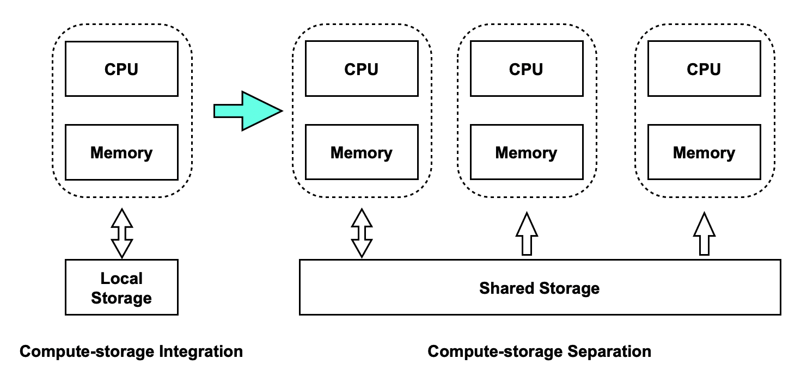

<div align="center">

[](https://www.polardbpg.com/home)

# PolarDB for PostgreSQL

**A cloud-native database developed by Alibaba Cloud**

#### English | [简体中文](README-CN.md)

[](https://www.polardbpg.com/home)

[](https://cirrus-ci.com/github/ApsaraDB/PolarDB-for-PostgreSQL/POLARDB_11_STABLE)
[](https://cirrus-ci.com/github/ApsaraDB/PolarDB-for-PostgreSQL/POLARDB_11_DEV)
[](LICENSE)
[](https://GitHub.com/ApsaraDB/PolarDB-for-PostgreSQL/issues)
[](https://GitHub.com/ApsaraDB/PolarDB-for-PostgreSQL/pulls)
[](https://github.com/ApsaraDB/PolarDB-for-PostgreSQL/network/members)
[](https://github.com/ApsaraDB/PolarDB-for-PostgreSQL/stargazers)
[](https://github.com/ApsaraDB/PolarDB-for-PostgreSQL/graphs/contributors)
[](https://opensource.alibaba.com/contribution_leaderboard/details?projectValue=polardb-pg)

</div>

## Overview



PolarDB for PostgreSQL (hereafter simplified as PolarDB) is a cloud native database service independently developed by Alibaba Cloud. This service is 100% compatible with PostgreSQL and uses a shared-storage-based architecture in which computing is decoupled from storage. This service features flexible scalability, millisecond-level latency and hybrid transactional/analytical processing (HTAP) capabilities.

1. Flexible scalability: You can use the service to scale out a compute cluster or a storage cluster based on your business requirements.
   - If the computing power is insufficient, you can scale out only the compute cluster.
   - If the storage capacity or the storage I/O is insufficient, you can scale out a storage cluster without interrupting your service.
2. Millisecond-level latency:
   - Write-ahead logging (WAL) logs are stored in the shared storage. Only the metadata of WAL records is replicated from the read-write node to read-only nodes.
   - The _LogIndex_ technology provided by PolarDB features two record replay modes: lazy replay and parallel replay. The technology can be used to minimize the record replication latency from the read-write node to read-only nodes.
3. HTAP: HTAP is implemented by using a shared-storage-based massively parallel processing (MPP) architecture. The architecture is used to accelerate online analytical processing (OLAP) queries in online transaction processing (OLTP) scenarios. PolarDB supports a complete suite of data types that are used in OLTP scenarios. PolarDB supports two computing engines that can process these types of data:
   - Standalone execution: processes OLTP queries that feature high concurrency.
   - Distributed execution: processes large OLAP queries.

PolarDB provides a wide range of innovative multi-model database capabilities to help you process, analyze, and search for different types of data, such as spatio-temporal, geographic information system (GIS), image, vector, and graph data.

## Branch Introduction

The `POLARDB_11_STABLE` is the stable branch based on PostgreSQL 11.9, which supports compute-storage separation architecture. The `distributed` branch supports distributed architecture.

## Architecture and Roadmap

PolarDB for PostgreSQL uses a shared-storage-based architecture in which computing is decoupled from storage. The conventional shared-nothing architecture is changed to the shared-storage architecture. N copies of data in the compute cluster and N copies of data in the storage cluster are changed to N copies of data in the compute cluster and one copy of data in the storage cluster. The shared storage stores one copy of data, but the data states in memory are different. The WAL logs must be synchronized from the primary node to read-only nodes to ensure data consistency. In addition, when the primary node flushes dirty pages, it must be controlled to prevent the read-only nodes from reading future pages. Meanwhile, the read-only nodes must be prevented from reading the outdated pages that are not correctly replayed in memory. To resolve this issue, PolarDB provides the index structure _LogIndex_ to maintain the page replay history. LogIndex can be used to synchronize data from the primary node to read-only nodes.

After computing is decoupled from storage, the I/O latency and throughput increase. When a single read-only node is used to process analytical queries, the CPUs, memory, and I/O of other read-only nodes and the large storage I/O bandwidth cannot be fully utilized. To resolve this issue, PolarDB provides the shared-storage-based MPP engine. The engine can use CPUs to accelerate analytical queries at SQL level and support a mix of OLAP workloads and OLTP workloads for HTAP.

For more information, see [Architecture](https://apsaradb.github.io/PolarDB-for-PostgreSQL/theory/arch-overview.html).

## Quick Start with PolarDB

If you have Docker installed already，then you can pull the instance image of PolarDB for PostgreSQL based on local storage. Create, run and enter the container, and use PolarDB instance directly:

```bash
# pull the instance image from DockerHub
docker pull polardb/polardb_pg_local_instance
# create, run and enter the container
docker run -it --rm polardb/polardb_pg_local_instance psql
# check
postgres=# SELECT version();
            version
--------------------------------
 PostgreSQL 11.9 (POLARDB 11.9)
(1 row)
```

For more advanced deployment way, please refer to [Advanced Deployment](https://apsaradb.github.io/PolarDB-for-PostgreSQL/deploying/deploy.html). Before your deployment, we recommand to figure out the [architecture](https://apsaradb.github.io/PolarDB-for-PostgreSQL/deploying/introduction.html) of PolarDB for PostgreSQL.

## Development

Please refer to [Development Guide](https://apsaradb.github.io/PolarDB-for-PostgreSQL/development/dev-on-docker.html) to compile and development PolarDB for PostgreSQL.

## Documentation

Please refer to [Online Documentation Website](https://apsaradb.github.io/PolarDB-for-PostgreSQL/) to see the whole documentations.

If you want to explore or develop documentation locally, see [Document Contribution](https://apsaradb.github.io/PolarDB-for-PostgreSQL/contributing/contributing-polardb-docs.html).

## Contributing

You are welcome to make contributions to PolarDB for PostgreSQL, no matter code or documentation.

Here are the contributors:

<a href="https://github.com/ApsaraDB/PolarDB-for-PostgreSQL/graphs/contributors">
  
</a>

Made with [contrib.rocks](https://contrib.rocks).

## Software License

PolarDB code is released under the Apache License (Version 2.0), developed based on the PostgreSQL which is released under the PostgreSQL License. This product contains various third-party components under other open source licenses.

See the [LICENSE](./LICENSE) and [NOTICE](./NOTICE) file for more information.

## Acknowledgments

Some code and design ideas are based on other open source projects, such as PG-XC/XL (pgxc_ctl), TBase (Timestamp-based vacuum and MVCC), Greenplum and Citus (pg_cron). We thank the contributions of the preceding open source projects.

## Join the Community

- PolarDB PostgreSQL at Slack: [https://app.slack.com/client/T023NM10KGE/C023VEMKS02](https://app.slack.com/client/T023NM10KGE/C023VEMKS02)
- Use the DingTalk application to scan the following QR code and join the DingTalk group for PolarDB technology promotion.

  

---

Copyright © Alibaba Group, Inc.
