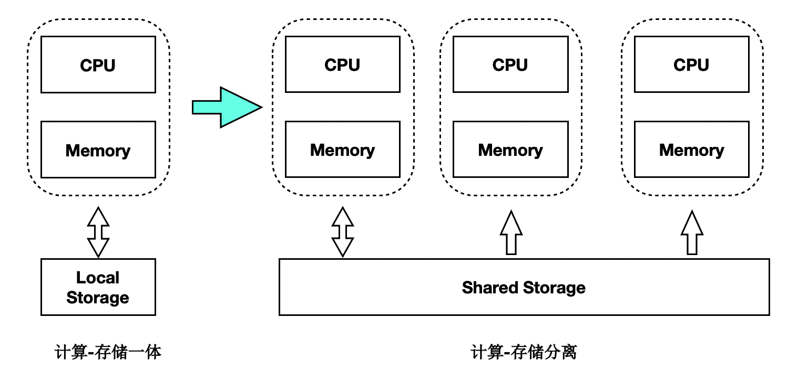

<div align="center">

[](https://www.polardbpg.com/home)

# PolarDB for PostgreSQL

**阿里云自主研发的云原生数据库**

#### [English](./README.md) | 简体中文

[](https://www.polardbpg.com/home)

[](./LICENSE)
[](https://github.com/ApsaraDB/PolarDB-for-PostgreSQL/issues)
[](https://github.com/ApsaraDB/PolarDB-for-PostgreSQL/pulls)
[](https://github.com/ApsaraDB/PolarDB-for-PostgreSQL/discussions)
[](https://github.com/ApsaraDB/PolarDB-for-PostgreSQL/network/members)
[](https://github.com/ApsaraDB/PolarDB-for-PostgreSQL/stargazers)
[](https://github.com/ApsaraDB/PolarDB-for-PostgreSQL/graphs/contributors)
[>)](https://apsaradb.github.io/PolarDB-for-PostgreSQL/zh/)
[>)](https://github.com/ApsaraDB/PolarDB-for-PostgreSQL/tree/POLARDB_15_STABLE)
[](https://opensource.alibaba.com/contribution_leaderboard/details?projectValue=polardb-pg)

</div>

## 什么是 PolarDB for PostgreSQL



PolarDB for PostgreSQL（下文简称为 PolarDB）是一款阿里云自主研发的云原生数据库，100% 兼容 PostgreSQL，采用基于 Shared-Storage 的存储计算分离架构，具有极致弹性、毫秒级延迟、HTAP 的能力。

1. 极致弹性：存储与计算能力均可独立地横向扩展。
   - 当计算能力不够时，可以单独扩展计算集群，数据无需复制
   - 当存储容量或 I/O 不够时，可以单独扩展存储集群，而不中断业务
2. 毫秒级延迟：
   - WAL 日志存储在共享存储上，RW 到所有 RO 之间仅复制 WAL 日志的元数据
   - 独创的 _LogIndex_ 技术，实现了 Lazy 回放和 Parallel 回放，最大程度地缩小了 RW 和 RO 节点间的延迟
3. HTAP 能力：基于 Shared-Storage 的分布式并行执行框架，加速在 OLTP 场景下的 OLAP 查询。一套 OLTP 型的数据，可支持 2 套计算引擎：
   - 单机执行引擎：处理高并发的 TP 型负载
   - 分布式执行引擎：处理大查询的 AP 型负载

PolarDB 还支持时空、GIS、图像、向量、搜索、图谱等多模创新特性，应对企业对数据处理日新月异的需求。

## 分支说明

`POLARDB_15_STABLE` 为稳定分支，持存储计算分离的云原生形态。

## 产品架构

PolarDB for PostgreSQL 采用了基于 Shared-Storage 的存储计算分离架构。数据库由传统的 Shared-Nothing 架构，转变成了 Shared-Storage 架构。由原来的 N 份计算 + N 份存储，转变成了 N 份计算 + 1 份存储。虽然共享存储上数据是一份，但是数据在各节点内存中的状态是不同的，需要通过内存状态的同步来维护数据的一致性；同时主节点在刷脏时也需要做协调，避免只读节点读取到超前的 **“未来页面”**，也要避免只读节点读取到过时的没有在内存中被正确回放的 **“过去页面”**。为了解决该问题，PolarDB 创造性地设计了 _LogIndex_ 数据结构来维护页面的回放历史，该结构能够实现主节点与只读节点之间的同步。

在存储计算分离后，I/O 单路延迟变大的同时，I/O 的吞吐也变大了。在处理分析型查询时，仅使用单个只读节点无法发挥出存储侧的大 I/O 带宽优势，也无法利用其他只读节点的 CPU、内存和 I/O 资源。为了解决该问题，PolarDB 研发了基于 Shared-Storage 的并行执行引擎，能够在 SQL 级别上弹性利用任意数目的 CPU 来加速分析查询，支持 HTAP 的混合负载场景。

详情请查阅 [产品架构](https://apsaradb.github.io/PolarDB-for-PostgreSQL/zh/theory/arch-overview.html)。

## 快速部署

如果您已安装 Docker，那么拉取 PolarDB-PG 的单机实例镜像，创建、运行并进入容器，然后直接使用 PolarDB-PG 实例：

```bash
# 拉取镜像并运行容器
docker pull polardb/polardb_pg_local_instance:15
docker run -it --cap-add=SYS_PTRACE --privileged=true --rm polardb/polardb_pg_local_instance:15 psql
# 测试实例可用性
postgres=# SELECT version();
                                   version
----------------------------------------------------------------------
 PostgreSQL 15.x (PolarDB 15.x.x.x build xxxxxxxx) on {your_platform}
(1 row)
```

对于更多进阶部署方式，请移步在线文档中的 [进阶部署](https://apsaradb.github.io/PolarDB-for-PostgreSQL/zh/deploying/deploy.html)。在部署前，了解 PolarDB for PostgreSQL 的 [架构简介](https://apsaradb.github.io/PolarDB-for-PostgreSQL/zh/deploying/introduction.html) 能够深化对每个步骤的理解。

## 开发

参考 [开发指南](https://apsaradb.github.io/PolarDB-for-PostgreSQL/zh/development/dev-on-docker.html) 进行源码编译和开发。

## 文档

请移步本项目的 [在线文档网站](https://apsaradb.github.io/PolarDB-for-PostgreSQL/zh/) 查阅完整文档。

如果需要在本地预览或开发文档，请参考 [贡献文档](https://apsaradb.github.io/PolarDB-for-PostgreSQL/zh/contributing/contributing-polardb-docs.html)。

## 参与贡献

我们诚挚欢迎社区参与 PolarDB for PostgreSQL 的贡献。以下是贡献者列表（由 [contrib.rocks](https://contrib.rocks) 支持）：

<a href="https://github.com/ApsaraDB/PolarDB-for-PostgreSQL/graphs/contributors">
  
</a>

## Star 历史

[](https://star-history.com/#ApsaraDB/PolarDB-for-PostgreSQL&Date)

## 软件许可

PolarDB for PostgreSQL 的源代码遵循 Apache 2.0 许可证，基于遵循 PostgreSQL 许可证的 PostgreSQL 开发，请阅读 [LICENSE](./LICENSE) 了解更多信息。其中还包含了部分遵循其它开源许可证的第三方组件，请阅读 [NOTICE](./NOTICE) 了解更多信息。

## 加入社区

点击 [链接](https://qr.dingtalk.com/action/joingroup?code=v1,k1,AEOqzSc8Uwzer7yhpNeYp8okNX3KVqpDMk/2oZ3ZRnQ=&_dt_no_comment=1&origin=11) 使用钉钉加入钉群。

## 版权声明

Copyright © Alibaba Group, Inc.
