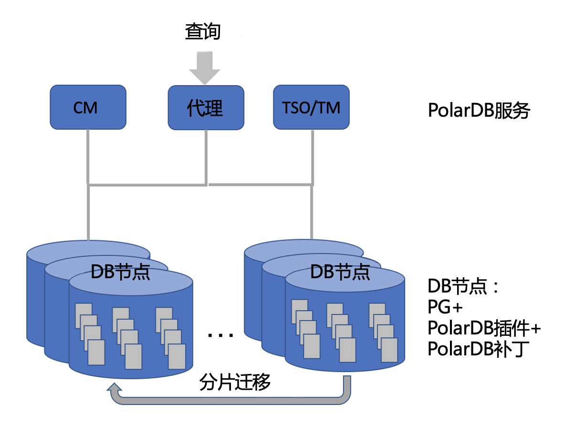

# 系统架构和主要功能

PolarDB PostgreSQL实现了以PostgreSQL为主要组件的Shared-Nothing架构。除非特别声明，下文使用PolarDB作为PolarDB PostgreSQL的简称。PolarDB完全兼容PostgreSQL，支持大部分PostgreSQL的SQL函数。作为一个分布式数据库系统，PolarDB实现了与单机数据库系统相同的数据一致性和ACID能力。PolarDB实现了基于Paxos的复制，在节点故障或者集群变配的情况下，也能保证高可用性、数据冗余和跨节点的一致性。细粒度的分片和透明的分片迁移使PolarDB可以有效利用云资源，以适应不同的计算和存储需求。PolarDB的分布式SQL引擎融合了PostgreSQL优化器的全面性以及跨节点或节点内并行查询的高效率，可以快速处理复杂查询。

总体而言，PolarDB在通用硬件或标准云资源（如ECS和块存储服务）方面提供了可扩展的SQL计算和具有ACID特性的关系型数据存储服务。

## PolarDB系统架构

PolarDB集群由三个主要组件构成：数据库节点（DN）、集群管理器（CM）和事务&时间服务（TM）。这些组件的进程不同，可以部署在多个服务器或ECS实例上。DN是主要的数据库引擎，它接收来自客户端或负载均衡器的SQL请求并对其进行处理。每个DN都可以充当协调器（coordinator），在多个DN之间分配查询和协调事务。每个DN负责处理存储在数据库中的一部分数据。对这些数据的任何操作（包括读和写）都由其对应的DN处理。一个DN中的数据被进一步划分为分片。当PolarDB扩展或重新均衡工作负载时，这些分片可以被迁移到其他DN上。通过基于Paxos的复制机制，DN上的各个副本都存储了相同的数据。DN及其副本组成一个复制组。在这个复制组中，主DN处理所有写请求，并将它们的结果传播到副本DN（或Follower DN）上。Paxos复制还支持Logger DN。Logger DN只存储日志记录，不存储数据。

TM是一种集中式服务，可以支持全局一致的、有序的状态或计数器，比如升序时间戳和全局事务ID。

CM监控每个DN的状态并维护集群配置。CM还支持管理PolarDB集群的工具和命令，如启动或停止DN、升级、获取备份和均衡工作负载。

PolarDB仍在不断进化中。上述三个组件的功能正逐步开放。点击[此处](roadmap.md)了解详细的路线图。

## PolarDB主要功能

* 具备ACID能力的分布式OLTP
* 100%兼容PostgreSQL的SQL
* 分布式SQL执行
* 使用最新版本的PostgreSQL快速升级
* [基于Paxos的复制能力以确保数据一致性](ha_paxos.md)
* 细粒度分片
* 在线分片迁移
* 高性能
   * [基于时间戳的MVCC](cts.md)
   * [并行重做](parallel_redo.md)
   * [防止整页写](no_fpw.md)
   * 快速查询下推
   * 一阶段提交
   * ……
* 可扩展性和弹性
   * 混合逻辑时钟
   * 可扩展协调
   * 单节点事务优化
   * ……
* 高可用性
   * 在线集群扩展
   * 低RTO故障切换
   * 零中断和透明切换
   * 跨可用区或跨机房零RPO部署
   * 即时页面损坏修复
   * ……

___

© 阿里巴巴集团控股有限公司 版权所有

