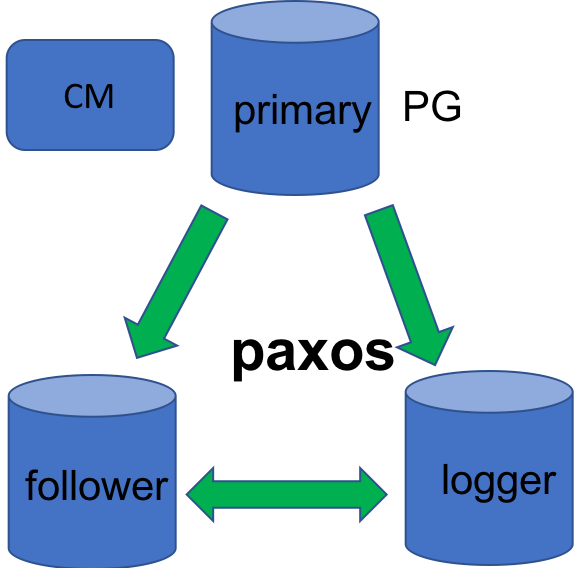
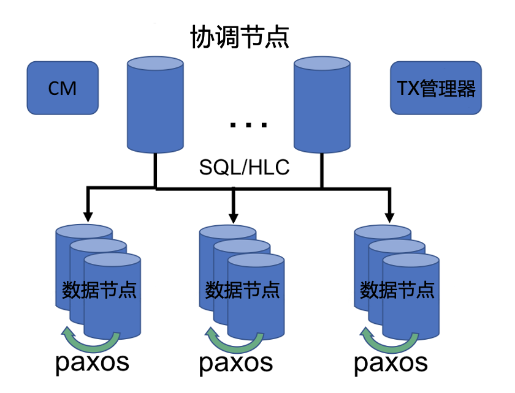
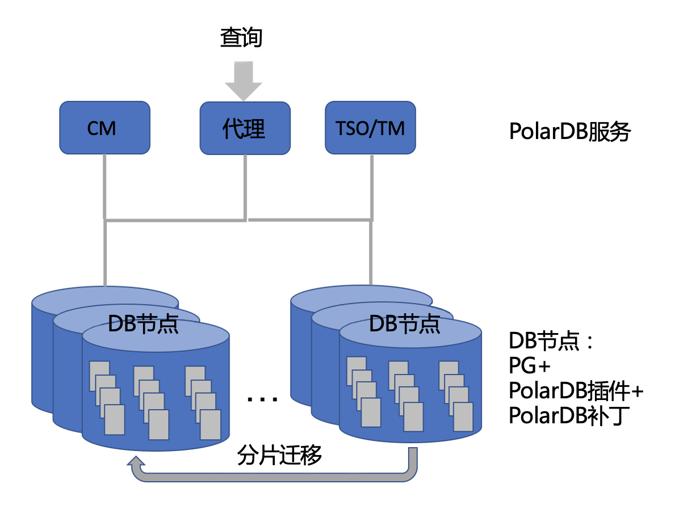

## PolarDB PostgreSQL路线图

PolarDB PostgreSQL（以下简称PolarDB）项目将逐步推出功能特性和组件，最终形成一个Shared-Nothing架构的分布式数据库。每个主要版本都可以作为一个关系数据库管理系统（RDMBS），提供完整的功能。我们计划推出三个主要版本。

在第一个版本中，目标是推出基于Paxos复制协议的集群版本，增强单节点PostgreSQL系统的性能和可用性。

在第二个版本中，引入分布式事务、分布式MVCC多版本控制、分布式SQL计算等技术，支持Shared-Nothing架构的OLTP系统。在该版本中，PolarDB支持线性扩展，每个集群可以扩展至包含100多个节点。同时，在SQL功能和ACID能力方面，PolarDB与单节点PostgreSQL兼容。

在第三个版本中，实现细粒度的分片。数据库组件（如协调节点（Coordinator Node）和数据节点（Data Node））进一步一体化，成为统一的数据库节点（Database Node）。PolarDB扩展的大多数功能特性都是以PostgreSQL内核扩展（extension）或插件（plug-in）的形式实现。这使得PolarDB可以通过社区版本轻松、及时地进行升级。用户可以以最小的代价使用新的社区版本，同时享受PolarDB提供的高可用性和可扩展性。

### PolarDB PostgreSQL V1.0

如上图所示，该版本支持基于Paxos的复制和集群管理。我们把PostgreSQL转换成一个高可用的数据库集群。当某个数据库节点发生故障时，集群也能对外正常提供服务。数据的一致性由其他正常的数据库节点来保持。因此，数据不会丢失。该版本中使用的Paxos复制协议广泛应用于阿里巴巴集团中数百个产品和平台。这些实施方案支持阿里巴巴集团满足不断变化以及密集的业务需求，其正确性和可靠性得到了全面验证。请点击[此处](ha_paxos.md)了解更多详情。

此外，该版本还引入了一些针对提升单节点PostgreSQL性能的功能，如[使用时间戳作为事务快照](cts.md)、[并行WAL重做](parallel_redo.md)以及[移除全页写入的WAL](no_fpw.md)。

该版本提供的主要功能如下：
* 高可用性
   * 一个Leader和两个Follower的复制配置：零数据丢失和跨节点故障的数据一致性
   * 自动Leader选举
   * 多角色支持：支持Leader、Follower、Logger角色，用来平衡数据冗余和存储空间以及平衡恢复速度和存储成本
   * 集群管理：集群状态监控、启动/停止节点或集群、主从切换和负载均衡
   * 并行WAL重做：支持多粒度的并行重做，如文件级或者页面级
* 高性能
   * 使用时间戳作为事务快照：消除ProcArray相关瓶颈
   * CTS（timestamp control data structure）多核可扩展性
   * 移除全页写入的WAL：避免写密集型业务场景中产生大量WAL I/O操作

### PolarDB PostgreSQL V2.0

该版本引入了分布式Shared-Nothing OLTP系统的基本功能，支持全局数据一致性、跨节点的ACID能力以及分布式SQL流程。数据库数据根据选定的列进行分区。这些分区被分发到PolarDB集群中的数据节点。该版本引入了一个新组件，即协调节点，来处理SQL请求，并决定如何在数据节点之间执行这些请求。数据节点是基于PostgreSQL的组件，用于存储分区数据并处理来自协调节点的SQL查询。PolarDB支持分布式DML、DDL和DCL。协调节点根据访问数据向数据节点发送查询，以便执行。协调节点还决定哪些操作或子查询可以下推到数据节点，并对数据节点返回的结果进行合并或聚合操作。为了保证数据一致性和事务的ACID能力，PolarDB使用分布式事务、混合逻辑时钟（HLC）、分布式MVCC和基于HLC的VACUUM和热链裁剪。

该版本提供了以下功能：
* 基于HLC的事务ACID能力
   * 混合逻辑时钟（HLC）
   * 基于HLC的数据一致性和分布式MVCC
   * 分布式事务的两阶段提交
   * 分布式事务的容错
   * 分布式死锁的预防和检测
   * 分布式VACUUM
* 分布式SQL计算
   * SQL语言
      * 兼容SQL 2003
      * 支持大多数PostgreSQL的SQL语法、数据类型和内部函数
      * 事务相关语句的分布式处理
      * 数据控制语句（GRANT/REVOKE）的分布式处理
      * 支持游标（CURSOR）和触发器（TRIGGER）
      * 规则（RULE）
      * 用户自定义函数（UDF）
   * 分布式查询执行
      * 简单DML和查询的直接分发
      * 基于CBO的复杂查询处理
      * 语句下推
   * 分布式DDL
      * 支持多种类型的分布式表的创建和删除：复制（replication）、哈希（hash）、取模（modulo）以及轮询（round-robin）
      * 创建索引（CREATE INDEX）
      * 修改表定义（ALTER TABLE）
* 高可用性
   * 分布式OLTP集群的Paxos复制和集群管理
   * 数据库日志和Paxos日志同步优化
   * Follower的并行重做
   * 全局元数据管理和一致性
   * 节点故障后的负载均衡
* ...

### PolarDB PostgreSQL V3.0

该版本强调弹性及易用性。为了实现弹性这一目标，PolarDB实现了细粒度分片、在线分片迁移和集群扩展。为了实现易用性，除了PostgreSQL功能之外，PolarDB添加的大多数功能都集成到了各个扩展或插件中。用户可以轻松下载扩展，和Vanilla PostgreSQL安装一起使用。当社区推出新版本时，PolarDB扩展可以使用最新的PostgreSQL版本轻松升级。

该版本提供以下功能：

* 分片和弹性
   * 细粒度分片
   * 高效的在线分片迁移
   * 并行逻辑复制
   * 在线集群扩容和缩容
   * 热点清除和负载均衡
* 基于扩展的增强
   * 基于扩展实现分布式事务
   * 时间服务插件
   * 分布式MVCC补丁
   * 分布式锁和死锁管理补丁
   * 分布式DDL/TCL/DCL/CCL语句扩展
   * 基于扩展实现统一的元数据管理
   * 基于扩展实现细粒度分片
   * 基于扩展或补丁实现基于Paxos的高可用性
* 统一的数据库节点
   * 每个数据库节点都存储完整的元数据
   * 统一的协调节点和数据节点
* 增强的高可用性
   * 基于Paxos的主元数据节点高可用性
   * 节点故障时的全局元数据一致性
   * 在线节点替换
   * 在线升级
   * 基于逻辑复制的双活部署
* ...

___

© 阿里巴巴集团控股有限公司 版权所有
