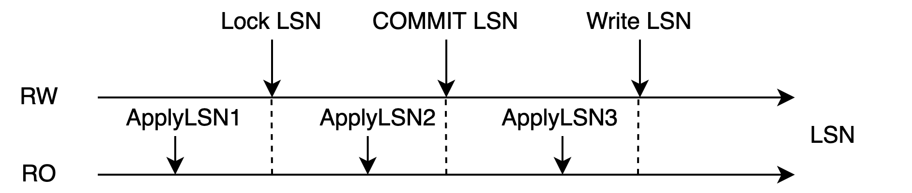
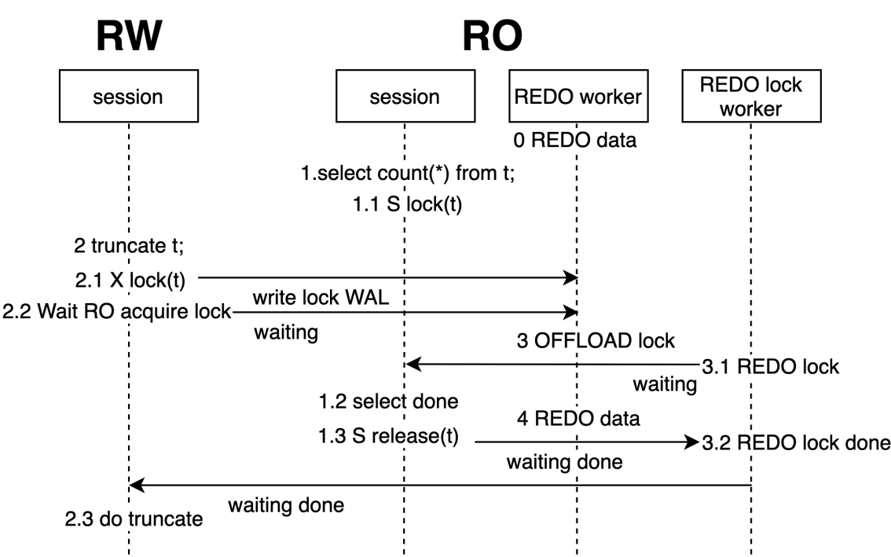

# 概述
在共享存储一写多读的架构下，数据文件实际上只有一份。得益于多版本机制，不同节点的读写实际上并不会冲突。但是有一些数据操作不具有多版本机制，其中比较有代表性的就是文件操作。  
多版本机制仅限于文件内的元组，但不包括文件本身。对文件进行创建、删除等操作实际上会对全集群立即可见，这会导致RO在读取文件时出现文件消失的情况，因此需要做一些同步操作，来防止此类情况。  
对文件进行操作通常使用DDL，因此对于DDL操作，PolarDB提供了一种同步机制，来防止并发的文件操作的出现。除了同步机制外，DDL的其他逻辑和单机执行逻辑并无区别。
# 术语
- LSN：Log Sequence Number，日志序列号。是WAL日志的唯一标识。LSN在全局是递增的。
- 回放位点：Apply LSN，表示只读节点的回放位点。
# 同步DDL机制
## DDL锁
同步DDL机制利用AccessExclusiveLock（后文简称DDL锁）来进行RW/RO的DDL操作同步。  

图1 DDL锁和WAL日志的关系  

DDL锁是数据库中最高级的表锁，对其他所有的锁级别都互斥，会伴随着WAL日志同步到RO节点上，并且可以获取到该锁在WAL日志的写入位点。当RO回放超过Lock LSN位点时，就可以认为在RO中已经获取了这把锁。DDL锁会伴随着事务的结束而释放。
如图1所示，当回放到ApplyLSN1时，表示未获取到DDL锁；当回放到ApplyLSN2时，表示获取到了该锁；当回放到ApplyLSN3时，已经释放了DDL锁。   

图2 DDL锁的获取条件  

当所有RO都回放超过了Lock LSN这个位点时（如图2所示），可以认为RW的事务在集群级别获取到了这把锁。获取到这把锁就意味着RW/RO中没有其他的会话能够访问这张表，此时RW就可以对这张表做各种文件相关的操作。   
说明：Standby有独立的文件存储，获取锁时不会出现上述情况。

图3 同步DDL流程图  

图3所示流程说明如下：

1. RO会话执行查询语句。
1. RW会话执行DDL，在本地获取DDL锁并且写到WAL日志中，等待所有RO回放到该WAL日志。
1. RO的回放进程尝试获取该锁，获取成功后将回放位点返回给RW。
1. RW获知所有RO均获取到该锁。
1. RO开始进行DDL操作。
## 如何保证数据正确性
DDL锁是PG数据库最高级别的锁，当对一个表进行DROP/ALTER/LOCK/VACUUM(FULL) table等操作时，需要先获取到DDL锁。RW是通过用户的主动操作来获取锁，获取锁成功时会写入到日志中，RO则通过回放日志获取锁。  

- 主备环境：热备存在只读查询，同时进行回放，回放到该锁时，如果该表正在被读取，回放就会被阻塞直到超时。
- PolarDB环境：RW获取锁需要等待RO全部获取锁成功才算成功，因为需要确保主备都不再访问共享存储的数据才能进行DDL操作。

当以下操作的对象都是某张表，“<”表示时间先后顺序时，同步DDL的执行逻辑如下：

1. 本地所有查询操作结束 < 本地获取DDL锁 < 本地释放DDL锁 < 本地新增查询操作
1. RW本地获取DDL锁 < 各个RO获取本地DDL锁 < RW获取全局DDL锁
1. RW获取全局DDL锁 < RW进行写数据操作 < RW释放全局DDL锁

结合以上执行逻辑可以得到以下操作的先后顺序：**各个RW/RO查询操作结束 < RW获取全局DDL锁 < RW写数据 < RW释放全局DDL锁 < RW/RO新增查询操作**。  
可以看到在写共享存储的数据时，RW/RO上都不会存在查询，因此不会造成正确性问题。在整个操作的过程中，都是遵循2PL协议的，因此对于多个表，也可以保证正确性。
# RO锁回放优化
上述机制中存在一个问题，就是锁同步发生在主备同步的主路径中，当RO的锁同步被阻塞时，会造成RO的数据同步阻塞（如图1所示，回放进程的3、4阶段在等待本地查询会话结束后才能获取锁）。PolarDB默认设置的同步超时时间为30s，如果RW压力过大，有可能造成较大的数据延迟。
RO中回放的DDL锁还会出现叠加效果，例如RW在1s内写下了10个DDL锁日志，在RO却需要300s才能回放完毕。数据延迟对于PolarDB是十分危险的，它会造成RW无法及时刷脏、及时做检查点，如果此时发生崩溃，恢复系统会需要更长的时间，这会导致极大的稳定性风险。
## 异步DDL锁回放
针对此问题，PolarDB进行了RO锁回放优化。  

图4 RO异步DDL锁回放  

优化思路：设计一个异步进程来回放这些锁，从而不阻塞主回放进程的工作。  
整体流程如图4所示，和图3不同的是，回放进程会将锁获取的操作卸载到锁回放进程中进行，并且立刻回到主回放流程中，从而不受锁回放阻塞的影响。  
锁回放冲突并不是一个常见的情况，因此主回放进程并非将所有的锁都卸载到锁回放进程中进行，它会尝试获取锁，如果获取成功了，就不需要卸载到锁回放进程中进行，这样可以有效减少进程间的同步开销。  
该功能在PolarDB中默认启用，能够有效的减少回放冲突造成的回放延迟，以及衍生出来的稳定性问题。在AWS Aurora中不具备该特性，当发生冲突时会严重增加延迟。  

## 如何保证数据正确性
在异步回放的模式下，仅仅是获取锁的操作者变了，但是执行逻辑并未发生变化，依旧能够保证RW获取到全局DDL锁、写数据、释放全局DDL锁这期间不会存在任何查询，因此不会存在正确性问题。
