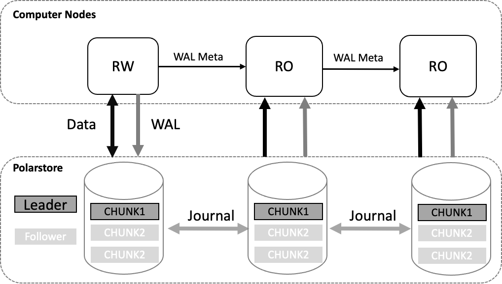
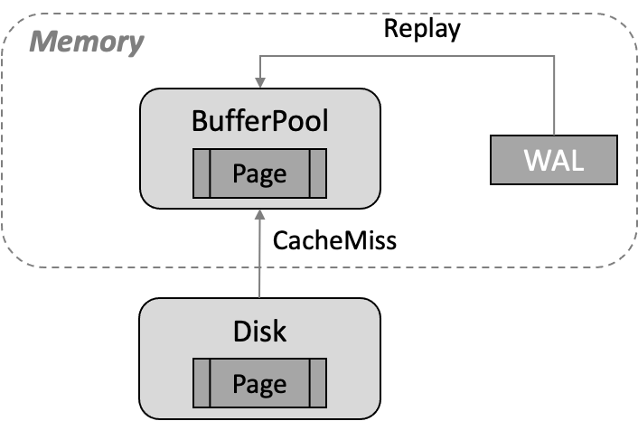
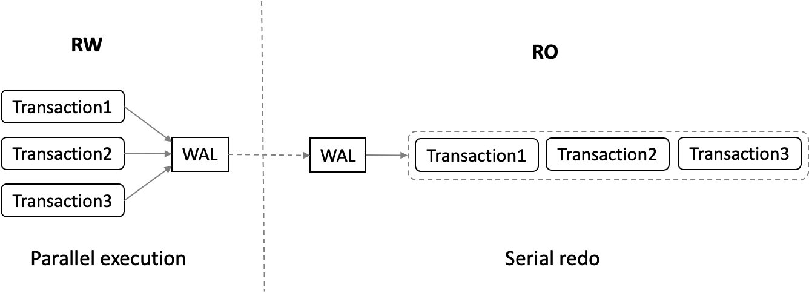
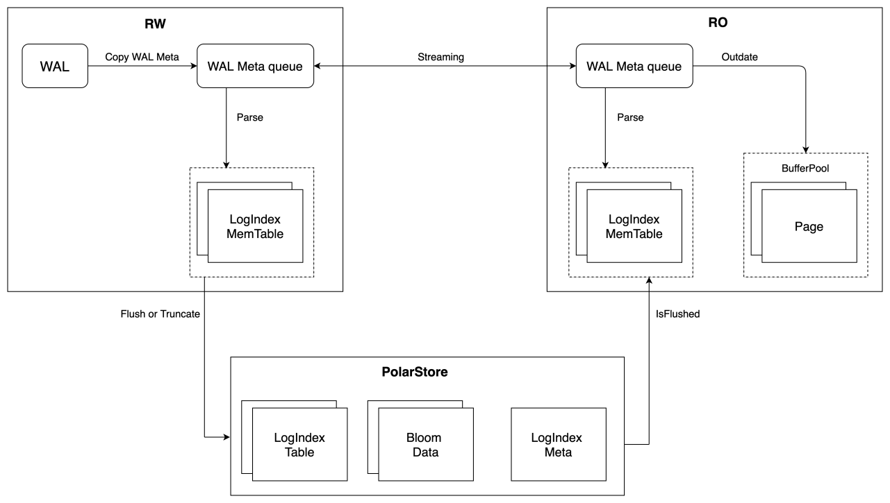
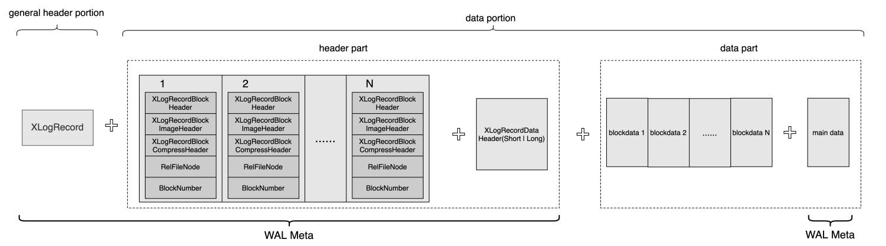
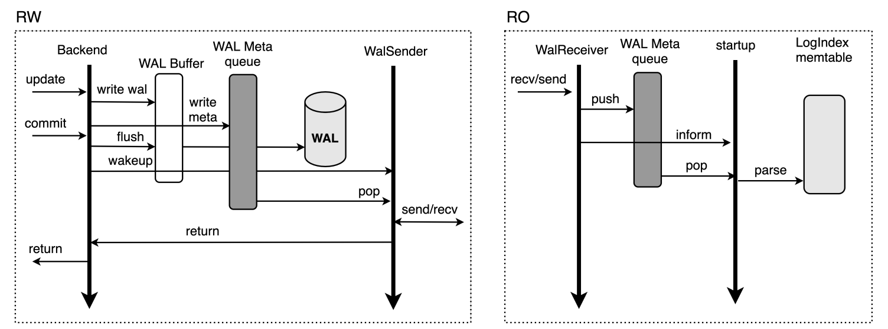
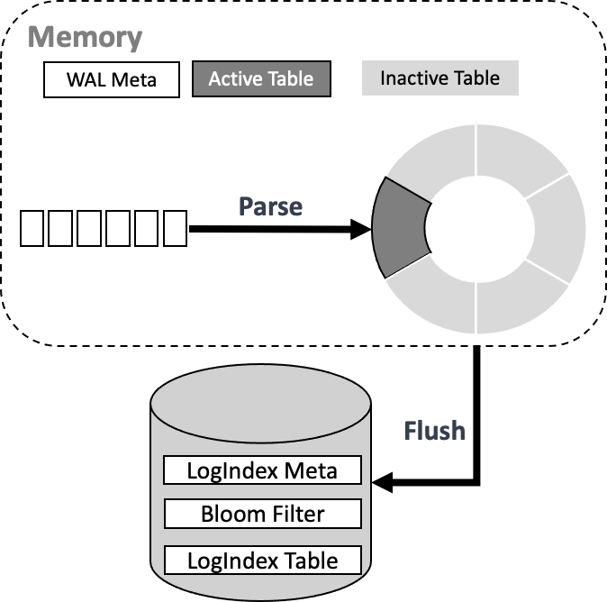
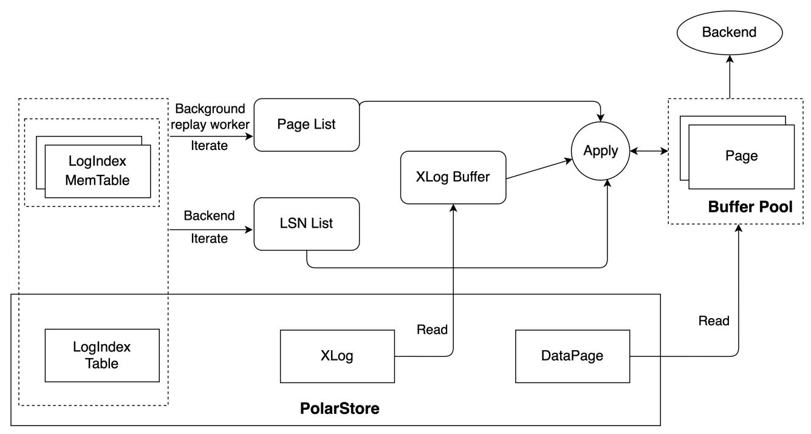

# 背景介绍
PolarDB采用了共享存储一写多读架构，读写节点RW和多个只读节点RO共享同一份存储，读写节点可以读写共享存储中的数据；只读节点仅能各自通过回放日志，从共享存储中读取数据，而不能写入，只读节点RO通过内存同步来维护数据的一致性。此外，只读节点可同时对外提供服务用于实现读写分离与负载均衡，在读写节点异常crash时，可将只读节点提升为读写节点，保证集群的高可用。基本架构图如下所示：

传统share nothing的架构下，只读节点RO有自己的内存及存储，只需要接收RW节点的WAL日志进行回放即可。如下图所示，如果需要回放的数据页不在Buffer Pool中，需将其从存储文件中读至Buffer Pool中进行回放，从而带来CacheMiss的成本，且持续性的回放会带来较频繁的Buffer Pool淘汰问题。

此外，RW节点多个事务之间可并行执行，RO节点则需依照WAL日志的顺序依次进行串行回放，导致RO回放速度较慢，与RW节点的延迟逐步增大。

与传统share nothing架构不同，共享存储一写多读架构下RO节点可直接从共享存储上获取需要回放的WAL日志。若共享存储上的数据页是最新的，那么RO可直接读取数据页而不需要再进行回放操作。基于此，PolarDB设计了LogIndex来加速RO节点的日志回放。
# RO内存同步架构
LogIndex中保存了数据页与修改该数据页的所有LSN的映射关系，基于LogIndex可快速获取到修改某个数据页的所有LSN，从而可将该数据页对应日志的回放操作延迟到真正访问该数据页的时刻进行。LogIndex机制下RO内存同步的架构如下图所示。

RW/RO的相关流程相较传统share nothing架构下有如下区别：

- 读写节点RW与只读节点RO之间不再传输完整的WAL日志，仅传输WAL Meta，减少网络数据传输量，降低了RO与RW节点的延迟；
- 读写节点RW依据WAL meta生成LogIndex写入LogIndex Memory Table中，LogIndex Memory Table写满之后落盘，保存至共享存储的LogIndex Table中，已落盘的LogIndex Memory Table可以被复用；
- 读写节点RW通过LogIndex Meta文件保证LogIndex Memory Table IO操作的原子性，LogIndex Memory Table落盘后会更新LogIndex Meta文件，落盘的同时还会生成Bloom Data，通过Bloom Data可快速检索特定Page是否存在于某LogIndex Table中，从而忽略不必扫描的LogIndex Table提升效率；
- 只读节点RO接收RW所发送的WAL Meta，并基于WAL Meta在内存中生成相应的LogIndex，同样写入其内存的LogIndex Memory Table中，同时将WAL Meta对应已存在于Buffer Pool中的页面标记为Outdate，该阶段RO节点并不进行真正的日志回放，无数据IO操作，可去除cache miss的成本；
- 只读节点RO基于WAL Meta生成LogIndex后即可推进回放位点，日志回放操作被交由背景进程及真正访问该页面的backend进程执行，由此RO节点也可实现日志的并行回放；
- 只读节点RO生成的LogIndex Memory Table不会落盘，其基于LogIndex Meta文件判断已满的LogIndex Memory Table是否在RW节点已落盘，已落盘的LogIndex Memory Table可被复用，当RW节点判断存储上的LogIndex Table不再使用时可将相应的LogIndex Table Truncate。  

PolarDB通过仅传输WAL Meta降低RW与RO之间的延迟，通过LogIndex实现WAL日志的延迟回放+并行回放以加速RO的回放速度，以下则对这两点进行详细介绍。
# WAL Meta
WAL日志又称为XLOG Record，如下图，每个XLOG Record由两部分组成：

- 通用的首部部分general header portion：该部分即为XLogRecord结构体，固定长度。主要用于存放该条XLOG Record的通用信息，如XLOG Record的长度、生成该条XLOG Record的事务ID、该条XLOG Record对应的资源管理器类型等;
- 数据部分data portion：该部分又可以划分为首部和数据两个部分，其中首部部分header part包含0～N个XLogRecordBlockHeader结构体及0～1个XLogRecordDataHeader[Short|Long]结构体。数据部分data part则包含block data及main data。每一个XLogRecordBlockHeader对应数据部分的一个Block data，XLogRecordDataHeader[Short|Long]则与数据部分的main data对应。

共享存储模式下，读写节点RW与只读节点RO之间无需传输完整的WAL日志，仅传输WAL Meta数据，WAL Meta即为上图中的general header portion + header part + main data，RO节点可基于WAL Meta从共享存储上读取完整的WAL日志内容。该机制下，RW与RO之间传输WAL Meta的流程如下：

1. 当RW节点中的事务对其数据进行修改时，会生成对应的WAL日志并将其写入WAL Buffer，同时拷贝对应的WAL meta数据至内存中的WAL Meta queue中；
1. 同步流复制模式下，事务提交时会先将WAL Buffer中对应的WAL日志flush到磁盘，此后会唤醒WalSender进程；
1. WalSender进程发现有新的日志可以发送，则从WAL Meta queue中读取对应的WAL Meta，通过已建立的流复制连接发送到对端的RO；
1. RO的WalReceiver进程接收到新的日志数据之后，将其push到内存的WAL Meta queue中，同时通知Startup进程有新的日志到达；
1. Startup从WAL Meta queue中读取对应的meta数据，解析生成对应的LogIndex memtable即可。

RW与RO节点的流复制不传输具体的payload数据，减少了网络数据传输量；此外，RW节点的WalSender进程从内存中的WAL Meta queue中获取WAL Meta信息，RO节点的WalReceiver进程接收到WAL Meta后也同样将其保存至内存的WAL Meta queue中，相较于传统主备模式减少了日志发送及接收的磁盘IO过程，从而提升传输速度，降低RW与RO之间的延迟。
# LogIndex
## 内存数据结构
LogIndex实质为一个HashTable结构，其key为PageTag，可标识一个具体数据页，其value即为修改该page的所有LSN。LogIndex的内存数据结构如下图所示，除了Memtable ID、Memtable保存的最大LSN、最小LSN等信息，LogIndex Memtable中还包含了三个数组，分别为：

- HashTable：HashTable数组记录了某个Page与修改该Page的LSN List的映射关系，HashTable数组的每一个成员指向Segment数组中一个具体的LogIndex Item；
- Segment：Segment数组中的每个成员为一个LogIndex Item，LogIndex Item有两种结构，即下图中的Item Head和Item Seg，Item Head为某个Page对应的LSN链表的头部，Item Seg则为该LSN链表的后续节点。Item Head中的Page TAG用于记录单个Page的元信息，其Next Seg和Tail Seg则分别指向后续节点和尾节点，Item Seg存储着指向上一节点Prev Seg和后续节点Next Seg的指针。Item Head和Item Seg中保存的Suffix LSN与LogIndex Memtable中保存的Prefix LSN可构成一个完整的LSN，避免了重复存储Prefix LSN带来的空间浪费。当不同Page TAG计算到HashTable的同一位置时，通过Item Head中的Next Item指向下一个具有相同hash值的Page，以此解决哈希冲突；
- Index Order：Index Order数组记录了LogIndex添加到LogIndex Memtable的顺序，该数组中的每个成员占据2个字节。每个成员的后12bit对应Segment数组的一个下标，指向一个具体的LogIndex Item，前4bit则对应LogIndex Item中Suffix LSN数组的一个下标，指向一个具体的Suffix LSN，通过Index Order可方便地获取插入到该LogIndex Memtable的所有LSN及某个LSN与其对应修改的全部Page的映射关系。

内存中保存的LogIndex Memtable又可分为Active LogIndex Memtable和Inactive LogIndex Memtable。如下图所示，基于WAL Meta数据生成的LogIndex记录会写入Active LogIndex Memtable，Active LogIndex Memtable写满后会转为Inactive LogIndex Memtable，并重新申请一个新的Active LogIndex Memtable，Inactive LogIndex Memtable可直接落盘，落盘后的Inactive LogIndex Memtable可再次转为Active LogIndex Memtable。

## 磁盘数据结构
磁盘上保存了若干个LogIndex Table，LogIndex Table与LogIndex Memtable结构类似，一个LogIndex Table可包含64个LogIndex Memtable，Inactive LogIndex Memtable落盘的同时会生成其对应的Bloom Filter。如下图所示，单个Bloom Filter的大小为4096字节，Bloom Filter记录了该Inactive LogIndex Memtable的相关信息，如保存的最小LSN、最大LSN、该Memtable中所有Page在bloom filter bit array中的映射值等。通过Bloom Filter可快速判断某个Page是否存在于对应的LogIndex Table中，从而可忽略无需扫描的LogIndex Table以加速检索。

当Inactive LogIndex MemTable成功落盘后，LogIndex Meta文件也被更新，该文件可保证LogIndex Memtable文件IO操作的原子性。如下，LogIndex Meta文件保存了当前磁盘上最小LogIndex Table及最大LogIndex Memtable的相关信息，其Start LSN记录了当前已落盘的所有LogIndex MemTable中最大的LSN。若Flush LogIndex MemTable时发生部分写，系统会从LogIndex Meta记录的Start LSN开始解析日志，如此部分写舍弃的LogIndex记录也会重新生成，保证了其IO操作的原子性。

由[Buffer管理](Buffer_Management.md)可知，一致性位点之前的所有WAL日志修改的数据页均已持久化到共享存储中，RO节点无需回放该位点之前的WAL日志，故LogIndex Table中小于一致性位点的LSN均可清除。RW据此Truncate掉存储上不再使用的LogIndex Table，在加速RO回放效率的同时还可减少LogIndex Table占用的空间。
# 日志回放
## 延迟回放
LogIndex机制下，RO节点的Startup进程基于接收到的WAL Meta生成LogIndex，同时将该WAL Meta对应的已存在于Buffer Pool中的页面标记为Outdate后即可推进回放位点，Startup进程本身并不对日志进行回放，日志的回放操作交由背景回放进程及真正访问该页面的Backend进程进行，回放过程如下图所示，其中：

- 背景回放进程按照WAL顺序依次进行日志回放操作，根据要回放的LSN检索LogIndex Memtable及LogIndex Table，获取该LSN修改的Page List，若某个Page存在于Buffer Pool中则对其进行回放，否则直接跳过。背景回放进程按照LSN的顺序逐步推进Buffer Pool中的页面位点，避免单个Page需要回放的LSN数量堆积太多；
- Backend进程则仅对其实际需要访问的Page进行回放，当Backend进程需要访问一个Page时，如果该Page在Buffer Pool中不存在，则将该Page读到Buffer Pool后进行回放；如果该Page已经在Buffer Pool中且标记为outdate，则将该Page回放到最新。Backend进程依据Page TAG对LogIndex Memtable及LogIndex Table进行检索，按序生成与该Page相关的LSN List，基于LSN List从共享存储中读取完整的WAL日志来对该Page进行回放。

为降低回放时读取磁盘WAL日志带来的性能损耗，同时添加了XLOG Buffer用于缓存读取的WAL日志。如下图所示，原始方式下直接从磁盘上的WAL Segment File中读取WAL日志，添加XLog Page Buffer后，会先从XLog Buffer中读取，若所需WAL日志不在XLog Buffer中，则从磁盘上读取对应的WAL Page到Buffer中，然后再将其拷贝至XLogReaderState的readBuf中；若已在Buffer中，则直接将其拷贝至XLogReaderState的readBuf中，以此减少回放WAL日志时的IO次数，从而进一步加速日志回放的速度。

## Mini Transaction
与传统share nothing架构下的日志回放不同，LogIndex机制下，Startup进程解析WAL Meta生成LogIndex与Backend进程基于LogIndex对Page进行回放的操作是并行的，且各个Backend进程仅对其需要访问的Page进行回放。由于一条XLog Record可能会对多个Page进行修改，以索引分裂为例，其涉及对Page_0, Page_1的修改，且其对Page_0及Page_1的修改为一个原子操作，即修改要么全部可见，要么全部不可见。针对此，设计了mini transaction锁机制以保证Backend进程回放过程中内存数据结构的一致性。  
如下图所示，无mini transaction lock时，Startup进程对WAL Meta进行解析并按序将当前LSN插入到各个Page对应的LSN List中。若Startup进程完成对Page_0 LSN List的更新，但尚未完成对Page_1 LSN List的更新时，Backend_0和Backend_1分别对Page_0及Page_1进行访问，Backend_0和Backend_1分别基于Page对应的LSN List进行回放操作，Page_0被回放至LSN_N+1处，Page_1被回放至LSN_N处，可见此时Buffer Pool中两个Page对应的版本并不一致，从而导致相应内存数据结构的不一致。

mini transaction锁机制下，对Page_0及Page_1 LSN List的更新被视为一个mini transaction。Startup进程更新Page对应的LSN List时，需先获取该Page的mini transaction lock，如下先获取Page_0对应的mtr lock，获取Page mtr lock的顺序与回放时的顺序保持一致，更新完Page_0及Page_1 LSN List后再释放Page_0对应的mtr lock。Backend进程基于LogIndex对特定Page进行回放时，若该Page对应在Startup进程仍处于一个mini transaction中，则同样需先获取该Page对应的mtr lock后再进行回放操作。故若Startup进程完成对Page_0 LSN List的更新，但尚未完成对Page_1 LSN List的更新时，Backend_0和Backend_1分别对Page_0及Page_1进行访问，此时Backend_0需等待LSN List更新完毕并释放Page_0 mtr lock之后才可进行回放操作，而释放Page_0 mtr lock时Page_1的LSN List已完成更新，从而实现了内存数据结构的原子修改。

# 总结
PolarDB基于RW节点与RO节点共享存储这一特性，设计了LogIndex机制来加速RO节点的内存同步，降低RO节点与RW节点之间的延迟，确保了RO节点的一致性与可用性。本文对LogIndex的设计背景、基于LogIndex的RO内存同步架构及具体细节进行了分析。除了实现RO节点的内存同步，基于LogIndex机制还可实现RO节点的Online Promote，可加速RW节点异常崩溃时，RO节点提升为RW节点的速度，从而构建计算节点的高可用，实现服务的快速恢复。
