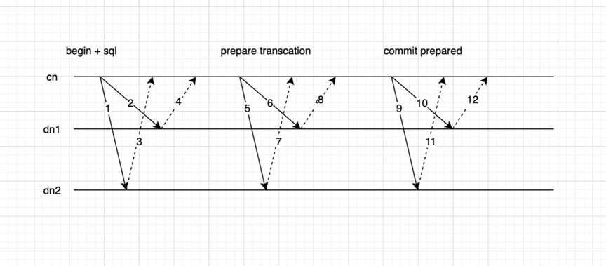

## 2PC Fault recovery

Distributed transactions use the two-phase commit (2PC) protocol. When a node quits unexpectedly, residual transactions on the node needs to be cleaned up. Alibaba Cloud provides a handy tool – pgxc_clean – to clean up residual transactions. The tool queries the status of 2PC transactions on PolarDB clusters and determines whether the transactions need to be committed or rolled back. The tool can be scheduled to run at regular intervals.

 

### Procedure：

1. Connect the cleanup tool to the coordinator you specified. Obtain the cluster topology structure by using the coordinator, view the pg_prepared_xacts views of all coordinators and datanodes, and obtain a list of all prepared transactions in the cluster. Determine whether to commit or roll back the prepared transactions.
2. Query the 2PC files of the prepared transactions under the pg_twophase folder based on the local XIDs recorded in the pg_prepared_xacts views obtained in the preceding step. The files may have been deleted from memory, so you need to traverse the pg_twophase folder. 2PC files are named after local XIDs, and the XIDs are recorded in pg_prepared_xacts views. You can easily find 2PC files by searching for their local XIDs.
3. Query the status of all participants in the 2PC transactions based on the information obtained in the preceding step. You can do this by querying the commit logs and locating the local XIDs to see whether the transactions have been committed and obtain the commit timestamps.
4. Determine the global status of the transactions based on the status of all participants in the 2PC transactions and the commit timestamps obtained in the preceding step.
5. The coordinator decides whether to commit or roll back the transactions based on the global status of the transactions. Then, the coordinator sends a commit or rollback message to all the participants of the transactions.

### Determine whether to commit or roll back the transactions：

PolarDB sends commit timestamps to all participants, and the timestamps are recorded on the 2PC files of all participants. The 2PC files are named after local XIDs. To decide whether to commit or roll back a prepared transaction, you must obtain the information about whether all participants of the transaction are available to commit. The following section describes the rules for deciding whether to commit or roll back a prepared transaction.

#### For the same 2PC transaction:

* If all participants have a pg_prepared_xacts view, then all participants should roll back the transaction. In this case, if the 2PC file of a participant records a valid commit timestamp, the transaction can be committed.
* If any of the participants of the transaction does not have a pg_prepared_xacts view, but the 2PC file records that the participant has been committed, it indicates that the entire transaction needs to be committed. In this case, the commit timestamp recorded in the 2PC file is valid. You need only to commit the prepared participant based on the commit timestamp.
* If any of the participants of the transaction does not have a pg_prepared_xacts view, but the 2PC file records that the participant has been rolled back, it indicates that the entire transaction needs to be rolled back. You need only to roll back the prepared participant.
* If a participant of the transaction does not have a pg_prepared_xacts view, but the 2PC file records that the participant is in the in progress state, the participant can perform the roll-back operation only if the preparation time exceeds a cleanup time limit and no other participant has performed the commit or roll-back operation.
* If the 2PC files of participants without a pg_prepared_xacts view do not record a valid commit timestamp, it indicates that the entire transaction needs to be rolled back.  The following situation will never occur: A participant has written the local XID in the commit log, but the commit timestamp recorded in the 2PC file is invalid. This is because the commit timestamp must be recorded in the 2PC file of the participant before the participant can prepare to commit the transaction.

#### Record 2PC information：

1. Commit timestamps should not be recorded on coordinators. If commit timestamps are recorded on the coordinator, the status of 2PC transactions cannot be determined when the coordinator crashes and cannot be recovered. When sending a commit prepared request to a datanode, the commit timestamp should be sent together with the request. When the datanode receives the request, it writes the commit timestamp in the corresponding 2PC file under pg_twophase. After the commit prepared operation is completed, the 2PC file under pg_twophase will not be deleted.
2. The following information is added to the 2PC files under pg_twophase:

* The name of the participant.
* The commit timestamp. Default value: 0.
* After the commit prepared and rollback prepared operations are completed, the 2PC files under pg_twophase are not deleted immediately. The files are deleted only after all datanodes return a commit completion message to the coordinator. After the commit prepared and rollback prepared operations are completed, the in-memory data structure of the transaction needs to be cleaned up. If you want to clean up the structure in a subsequent procedure, you can set a bit flag to indicate that the 2PC has been completed but the 2PC file has not been deleted. Otherwise, you need to traverse pg_twophase to obtain the 2PC file.

3. Datanodes receive the commit timestamps when they receive commit prepared requests. When the commit timestamps are updated in the 2PC file, the operation must also be recorded in the redo log. This allows you to restore the timestamps to the 2PC file when you execute REDO recovery if a datanode crashes.

Traverse all in-memory 2PC transactions during checkpointing

* If the 2PC information is not stored in the disk, it will be read from the redo log and then replayed to the 2PC file under pg_twophase.  The datanode receives a commit timestamp after the transaction is prepared to be committed. At this point, the 2PC information has already been written in the redo log.
* If the 2PC information has been written in the 2PC file, open the 2PC file and add the commit timestamp.
* If the 2PC information has not been written in the 2PC file, the checkpointer needs to read the commit timestamp from write-ahead logging (WAL) and writes it to the 2PC file.
* If the datanode crashes, the commit timestamp can be read from the redo log and replayed to the 2PC file during datanode recovery.
* Standby machines can also read commit timestamps from redo logs and write them to 2PC files.

4. Modify the pg_prepared_xacts view and add the participate_node field.

### Cleanup of files under pg_twophase
* If the 2PC files cannot be deleted, the cleanup tool will clean up the outdated 2PC files to avoid bloat.
* 5 minutes after all participants have prepared to commit, the system checks whether the participants have residual 2PC transactions. If the participants do not have residual 2PC transactions, the cleanup tool is triggered to delete the 2PC files. You can configure the timeout period based on your requirements, but the timeout period must be longer than 2 minutes, which is the minimum time required to clean up 2PC files.

___

Copyright © Alibaba Group, Inc.
