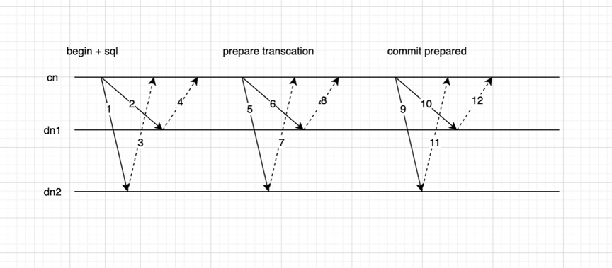

## 故障恢复

因为分布式事务采用了两阶段提交（2pc），所以在有节点异常退出时，需要能进行残留事务的清理。我们提供了工具，可以对集群的2pc情况进行查询，判断是否需要提交或回滚，而调用频次则由调用者自主决定。

 

### 具体清理流程：

1. 清理工具连接到任意一个cn上（由清理工具调用者提供cn信息）。通过这个cn获取集群拓扑结构，对所有的cn dn，都查看pg_prepared_xacts， 拿到整个集群所有的prepared的事务列表。接下来就是对这些内容来判断是进行commit prepared还是rollback prepared。
2. 对上面拿到的所有pg_prepared_xacts，根据local xid去查看对应pg_twophase下的2pc file中的内容（在内存中可能已删除，此时需要遍历pg_twophase下的文件）。因为2pc file的名字是local xid，而在pg_prepared_xacts中记录有local xid，可以比较方便地找到。
3. 补充该2pc所有参与者的状态： 根据上一步获取到的信息，通过local xid判断clog中是否提交，同时可以获取commit timestamp。
4. 判断事务的全局状态。此时已经有该2pc事务所有参与者 是否提交的信息和commit timestamp。
5. 根据全局状态，如果可以提交，则提交剩余的参与者；如果需要回滚，则回滚剩余的参与者。

### 具体判断规则：

我们将commit timestamp发送到所有参与节点上，让所有参与节点上的2pc file来持久化记录，而2pc file名字就是local xid。在清理时，判断是否该提交或回滚prepared 事务时，需要知道所有参与者的事务是否提交。

#### 对同一个2pc事务：
* 如果所有参与者上都有pg_prepared_xacts记录，此时可以简单地rollback全部参与者。（如果想进行提交，则看是否有任何一个参与者上的2pc file中有合法的commit timestamp，如果有，则整个事务可以提交）

* 如果有任何一个参与者，没有pg_prepared_xacts记录，但根据2pc file得到local xid已经提交，说明整个2pc事务需要提交，根据2pc file中记录的commit timestamp来对prepared的节点进行提交（此时commit timestamp一定是合法的）。

* 如果有任何一个参与者，没有pg_prepared_xacts记录，但根据2pc file得到local xid已经回滚，说明整个2pc事务需要回滚，对prepared的节点进行回滚即可。

* 如果有参与者，没有pg_prepared_xacts记录，但根据2pc file得到local xid是in progress，如果prepare时间超过了一定清理时限，如果不存在其他参与者已提交或回滚的情况下，可以回滚。

* 如果所有不存在pg_prepared_xacts记录的参与者2pc file中都没有合法的commit timestamp，说明整个2pc事务需要回滚。
有参与者localxid 在clog中已经提交，但2pc file中commit timestamp是非法的，这种情况不可能出现。因为每个参与者都是先记录了commit timestamp，然后进行commit prepared的。

#### 记录2pc信息：

1. 在cn节点上不记录commit timestamp（如果记录该值，在cn crash且无法恢复时同样会无法判断2pc事务的状态）。在向dn节点发送commit prepared时，带上commit timestamp。当dn收到时，将commit timestamp记录在pg_twophase的对应2pc file文件中，并且在commit prepared完成后，并不删除pg_twophase下的文件。

2. pg_twophase下的2pc file文件格式也增加了一些信息

* 增加记录participate node的名字
* 增加记录commit timestamp（默认值为0）
* 在commit prepared/rollback prepared后不马上删除2pc file，而是cn上确认所有节点都成功commit后再删除。但在commit prepared/rollback prepared后需要清理内存中的结构（避免后面清理时要遍历pg_twophase下的文件获取2pc file中的信息，可以设置标志位表示已完成2pc，但未删除2pc file)

3. dn 在收到commit prepared时，也会收到commit timestamp。此时需要更新2pc file中的对应内容，并且记录xlog（当crash时，redo时可以将commit_timestamp重新恢复到2pc file中)

Checkpoint时会遍历内存中的2pc事务列表
* 如果没有存在磁盘上，则会从xlog中读出2pc相关信息，然后写入到pg_twophase下的文件中。 这里dn收到commit timestamp是在prepare transaction完成之后，此时之前的2pc信息已经在xlog中了
* 如果已经写入了2pc file，需要打开2pc file，将commit timestamp增加进去
* 如果还没有写2pc file，需要在checkpoint时，额外读取commit timestamp信息，一起写入文件中
* 如果是crash了，恢复流程中可以从xlog中读到commit timestamp信息写入到2pc file中
* 如果是备机，同样可以从xlog中读取到commit timestamp信息，写入到2pc file中

4. 修改pg_prepared_xacts视图，增加participate_node字段。

### pg_twophase文件的清理

社区单机版本会在收到commit/rollback prepared后，就删除pg_twophase下对应的文件（以localxid的十六进制作为文件名）。但在集群环境中，如果直接删除，当出现异常情况时，会无法得到足够的信息判断2pc事务在这个节点上是已经提交还是没有收到过prepare。 所以需要保留pg_twophase下的文件，该文件会记录commit_timestamp。

当cn确认所有参与者提交成功，再下发命令，删除该2pc事务在所有节点上的2pc file。
* 如果删除失败：为避免2pc file堆积，由2pc清理程序来清理过时的2pc file
* 如果在所有参与者上都不存在2pc残留事务，且当前时间比该2pc file中的prepare时间超过5min（时间暂定，需要比2min的事务清理时限更长），则由清理程序来删除该文件。
