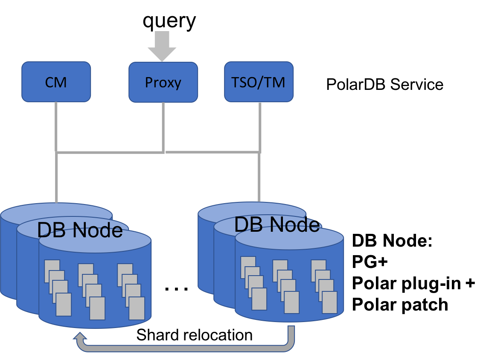

## Architecture and Main Functions

PolarDB for PostgreSQL implements a share-nothing architecture using PostgreSQL as the main component. Without specific mention, we use PolarDB to represent PolarDB for PostgreSQL. PolarDB is fully compatible to PostgreSQL and supports PostgreSQL's most SQL functions. As a distributed database system, PolarDB achieves the same data consistency and ACID as a standalone database system. PolarDB implements Paxos-based replication, which offers high availability, data redundancy, and consistency across nodes, during node failure and cluster reconfiguration. Fine-grained sharding and application-transparent shard relocation allow PolarDB to efficiently utilize the cloud-wise resources to adapt to varying computation and storage requirements. PolarDB's distributed SQL engine achieves fast processing of complex queries by combining the comprehensiveness of the PostgreSQL optimizer and the efficiency of parallel execution among or inside nodes. 

Overall, PolarDB provides scalable SQL computation and fully-ACID relational data storage on commodity hardware or standard cloud resources, such as ECS and block storage service.  

### PolarDB's Architecture

PolarDB cluster is formed of three main components: database node (DN), cluster manager (CM), and 
transaction & time service (TM). They are different processes and can be deployed in multiple servers or ECS. DNs are the main database engines, which receive SQL requests from clients or load balancer and process them. Each DN can act as a coordinator to distribute queries and coordinate transactions across many DNs. Each DN handles part of the data stored in a database. Any operations, including read and write, to those data, are processed by their corresponding DN. The data in one DN is further partitioned into shards. Those shards can be relocated to other DNs when PolarDB scales out or re-balances workload. DNs have their replicas storing the same data through Paxos-based replication. DNs and their replicas form a replication group. In such a group, a primary DN handles all write requests and propagates their results to replica DNs (or follower DNs). Our Paxos replication also supports logger DNs, which only stores log records rather than data. 

TM is a centralized service to support globally consistent and in-order status or counters. Ascending timestamp and global transaction ID are two examples. 

CM monitors each DN's status and maintains the cluster configuration. CM also supports tools and commands to manage a PolarDB cluster, such as starting or stopping DNs, upgrading, taking backup, and balancing workload.  

The above figure shows those components and their interaction.

PolarDB is in evolution. The functions of the above three components are gradually opened. The roadmap can be found [here](roadmap.md). 

### PolarDB's Main Functions

* ACID capable distributed OLTP
* Full SQL Compatibility of PostgreSQL
* Distributed SQL execution
* Fast upgrading with latest PostgreSQL versions
* [Paxos based replication for data consistency](ha_paxos.md)
* Fine-grained Sharding
* Online shard relocation
* High performance
  * [Timestamp based MVCC](cts.md)
  * [Parallel Redo](parallel_redo.md)
  * [Full-page-write avoidance](no_fpw.md)
  * Fast query shipment
  * one-phase commit
  * ...
* Scalability & Elasticity
  * Hybrid logic clock
  * Scalable coordination
  * Single-node Tx optimization
  * ...
* High Availability
  * Online cluster expansion
  * Low RTO failover
  * Zero-interruption & user-transparent switchover
  * Cross-AZ/DC zero-RPO deployment
  * On-the-fly repairment of page corruption
  * ...

___

Copyright © Alibaba Group, Inc.

