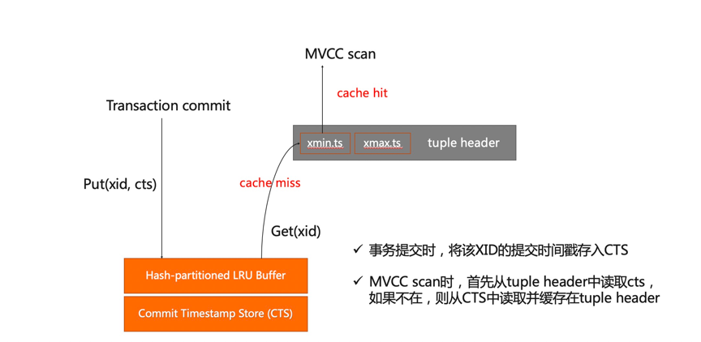

## CTS and timestamp-based MVCC

The distributed consistency feature uses timestamps to implement distributed transactions. Therefore, coordinators and datanodes must support timestamps.  When a transaction starts and is committed, an atomic variable is used to generate a monotonically increasing 64-bit timestamp. Assume there are two transactions: T1 and T2. The modification of T1 is visible to T2 as long as the commit timestamp of T1 is less than or equal to the start timestamp of T2.

This topic describes the storage, space allocation, space reclamation, persistence, and fault recovery of timestamps.

The preceding figure shows how the Commit Timestamp Store (CTS) works. The bottom layer is the storage of commit timestamps, which is a physical failure-resilient, page-based persistent store. The hash-partitioned least recently used (LRU) buffer is used to cache the accessed physical pages. The buffer is multi-partitioned, improving its scalability and reducing lock competition.

### The storage of timestamps

When a transaction is committed, the XID and timestamp are stored in CTS as a key-value pair. When performing a multiversion concurrency control (MVCC) scan to determine the visibility of a transaction, PolarDB reads the timestamp of the transaction based on the XID from CTS. To speed up the read operation, the tuple header caches transaction timestamps in the same way as caching the hint bits of commit logs to reduce access to CTS.  Storing commit timestamps is similar to storing commit logs. CTS is a contiguous storage space and uses contiguous files to store the commit timestamps of 32-bit contiguous XIDs. The timestamp of each XID occupies 8 bytes of space. The contiguous files are logically divided into a group of physical pages and loaded into the LRU buffer as needed.

If there is only one global buffer, global lock competition will occur when the buffer is replaced or written back by using the LRU algorithm. The global buffer will wait for I/O operations to complete after it acquires a lock, which will serialize I/O operations and reduce scalability. When the multi-partitioned LRU buffer is used, each XID corresponds to a fixed physical page, and each physical page is mapped to a hash-partitioned LRU partition based on specific algorithms. This eliminates global lock competition, and each partition can independently replace the LRU page, flush and read disks, and perform I/O operations in parallel.

### Fault recovery of CTS

Each transaction XID has four states in CTS: committed, aborted, running, and 2PC prepared. In the synchronous commit mode, the commit timestamp of a transaction is written into write-ahead logging (WAL) first and then to CTS. This ensures that CTS can quickly recover from faults. 2PC prepared transactions in CTS can be recovered based on 2PC records. The mechanism of the asynchronous commit mode is the same as commit logs. CTS records the maximum committed log sequence number (LSN). You must ensure that the LSN has been stored persistently in WAL before the CTS page is written to the disk.

### Quick query of transaction status in CTS

The oldest active XID mechanism helps you quickly query the status of all transactions. The mechanism does not need to acquire the CTS O(1) lock or traverse the Proc array. Similar to commit logs, CTS ensures the accuracy of transaction states. After restarting, CTS provides the oldest active XID. The oldest active XID is the minimum value between the next XID and all 2PC prepared XIDs after fault recovery.

When CTS is being recovered, XIDs in the range from the oldest active XID to the next XID whose timestamp values are 0 are set to Aborted, XIDs whose timestamp values are P are set to Prepared, and XIDs whose timestamp values are C are set to Committed. Timestamp value "0" indicates that the XID was aborted in the last crash and has not been written in CTS. Therefore, XIDs whose timestamp values are 0 will be recovered to Aborted.

At CTS runtime, XIDs that have not been committed and whose timestamp values are smaller than the oldest active XID, such as XIDs whose timestamp values are 0, are XIDs that were aborted in the last crash. XIDs whose timestamp values are greater than the oldest active XID will be returned directly by CTS. This mechanism eliminates the need for PolarDB to traverse the Proc array, avoiding high resource overheads in high concurrency scenarios. In turn, the time complexity for querying the status of a transaction can be reduced to O(1), while preventing lock competition.

### CTS storage reclamation

When querying transactions in CTS, XIDs are used as keys for indexing. XID values wrap around when they exceed 2^32. Therefore, CTS storage needs to be reclaimed as XID values wrap around. During the wrap around, the CTS storage space corresponding to the wrapped around XID values will be truncated and then reused to store commit timestamps. This allows the 32 GB of CTS storage to store XIDs up to 2^32 without overflow.

___

Copyright © Alibaba Group, Inc.