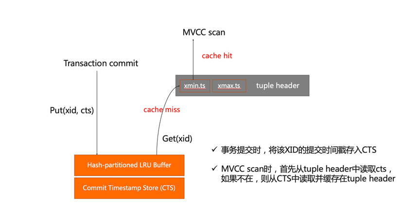

## CTS和基于时间戳的MVCC

我们的分布式一致性是使用了时间戳的机制来实现分布式事务。所以在每个cn和dn上，需要实现对应的时间戳机制。
事务开始和提交的时候，我们都会给它分配时间戳，即采用一个原子变量来生成单调递增的64位时间戳。对两个事务T1 T2，只要T1的提交时间戳小于或等于T2的开始时间戳，T1的修改对T2就是可见的。

下面介绍下时间戳的存储、空间分配、空间回收、持久化和故障恢复。

整个Commit Timestamp Store (CTS)设计如上图所示。从下而上，最底层是提交时间戳的一个存储，这是一个物理上的按页持久化存储，并且可故障恢复。上面Buffer层用来缓存访问过的物理页面。同时用了Hash-Partitioned的方法，实现多分区的LRU Buffer，来提高它的可扩展性，减少锁竞争。

### CTS的存储

事务在提交的时候就会以XID为Key，以CTS为值，写入整个存储中。在做MVCC Scan可见性判断的时候，去存储里面去读XID的Timestamp。为了加速，在Tuple Header里也会缓存这些 Timestamp ，跟缓存CLOG的提交状态（Hint Bit）类似，目的是为了减少对CTS的访问。
CTS在存储上跟CLOG类似,是连续的空间，就是存储32位连续XID的提交时间戳，每个XID占用8字节去存储它的Timestamp，物理上用连续的一些的文件来存储。同时将文件逻辑上切分成一组物理页，然后可以按需加载到LRU Buffer里面。

如果只有一个全局的Buffer的话，会在LRU发生替换、写回的时候有全局锁的竞争，在加锁后等待IO的完成，这样会序列化IO访问，并造成比较严重的可扩展性瓶颈。通过一个LRU多分区划分，每个XID对应在一个固定的物理页里，然后物理页再按照固定的算法映射到Hash-partitioned的LRU分区中，这样可以去掉中心的竞争，每个分区可以独立地进行LRU替换、刷盘、读取磁盘，消除全局锁的竞争，并行化IO处理。

### CTS故障恢复

每个事务XID在CTS中有四个状态，分别是提交，终止，运行和2PC prepared。那么在同步提交模式下，事务提交时间戳先写入WAL，再写入CTS，从而支持故障恢复。用2PC record记录来恢复CTS中prepared状态。异步提交模式下就跟CLOG一样，记录最大提交的LSN，在CTS页面在写入磁盘之前，保证WAL已经持久化到该LSN。

### CTS事务状态快速查询

我们还设计了一种oldest active xid机制实现通过CTS O(1) 免锁快速查询所有事务状态，可以去掉Proc Array的遍历。和CLOG一样，CTS中提交事务状态都是准确的，重启以后，我们可以确定一个oldest active xid。oldest active xid为故障恢复以后下一个可用的xid（next xid）与所有的2PC prepared xid的最小值。

故障恢复时，我们会把oldest active xid到next xid这一段区间里面，CTS为0的全部会设成aborted，“P”就恢复成Prepared，“C”就恢复成Commit。“0”表示未设置，我们就认为它是在上一次故障的时候就aborted掉了还没来得及写，把它主动恢复成abort。

运行时，小于oldest active xid的CTS，如果是非提交的，例如0，它 就是aborted，是在上一次crash aborted。如果大于这个的，就通过CTS直接去返回。这样的话我们就不需要去遍历Proc Array，Proc Array在高并发的时候开销就会很大。这样的话只要O(1)的时间查询就可以确定状态是提交，abort还是运行，这样性能会更好，并且会没有锁的竞争。

### CTS空间回收

因为我们是以XID为索引的Key，从2的32次方，PG会存在XID回卷，所以需要随着XID的回卷，回收CTS的空间。在XID回卷的时候会把回收的XID空间对应的CTS存储空间给Truncate掉，然后重复利用来存储提交时间戳。这样就可以保证2的32方XID对应32GB的CTS文件存储能一直用下去，不会溢出。

___

Copyright © Alibaba Group, Inc.