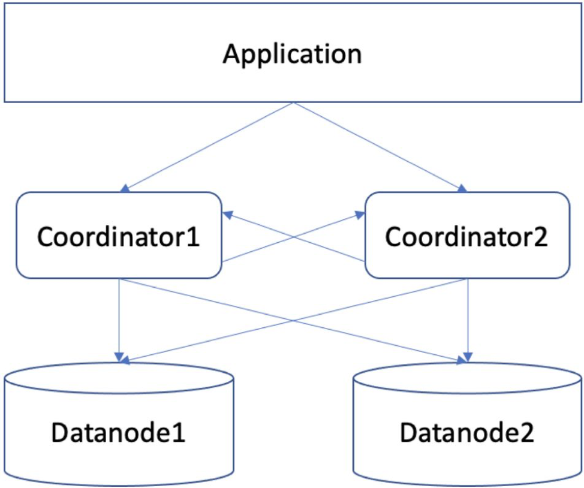
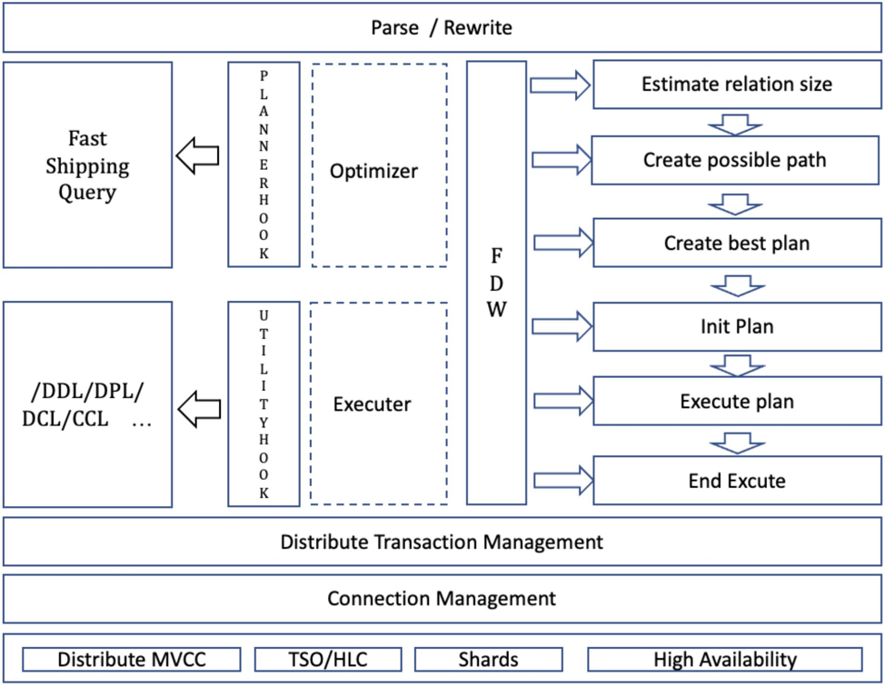

## 基于FDW的分布式插件设计

### 背景

* Postgres-XC：自研优化器以及执行器，对PG内核深入改造，脱离PG社区版本单独演进，无MPP架构，缺少对OLAP支持，分布式事务采用GTM统一管理，支持全局一致性事务，节点扩展受限于GTM。社区停止服务

* Postgres-XL: 引入新的算子，深入改造优化器，采用MPP架构，脱离PG社区版本单独演进，支持HTAP, 分布式事务也采用GTM统一管理，节点扩展受限于GTM. 社区停止服务

* Tbase: 基于XL打造，对内核代码进行大量修改优化，脱离PG社区版本单独演进，优化GTM，采用GTS服务，提高了节点扩展能力，支持HTAP. 版本演进滞后于PG社区

* Citus: 基于PG的分布式扩展，随PG版本快速演进，缺少全局一致性事务，支持MX功能，无MPP架构，不适用在Worker节点间需要交互大量数据的情况

### 总结

开发一个能够不断演进时刻保证先进性的HTAP数据库，依然是有待解决的目标。从前人的经验看，深入内核改造，独立演进，很容易和国际社区脱轨，最后导致产品失去先进性。所以如何聚焦分布式HTAP其中重点的部分，减少重复造轮子，充分利用借鉴目前开源中先进的工作。是解决问题的关键。 基于此，整合了XC, XL，Tbase, Citus等产品的优点，结合到基于FDW的架构中，试着去实现这个目标。

### 基于FDW分布式设计的优势

1.	可以充分利用Postresql原生优化器的能力，可以快速跟随Postgresql版本演进，提供更多灵活的接口可以扩展优化器能力。目前fdw接口已经扩展到了38个接口，这些接口可以对查询计划的生成以及执行等提供更细颗粒度的干预，并且可以和目前已知的hook共同使用。
2.	可以将分布式功能进行模块化，便于长期演化，利于将工作聚焦在分布式设计与开发。
3.	方便插件化，可以快速演进新版本，支持postgresql社区支持的新功能。
4.	基于SQL的分布式交互设计，易于多模计算，为后期对接各种数据源提供支撑。
5.	易于后期扩展MPP架构。

### 简要设计

#### 总体架构 

目前支持CN和DN的部署模式。

 

#### 内核架构

 

#### 特点简述

* 可以支持多种分布式计算引擎

根据不同的fdw接口实现，可以设计多种计算引擎。
目前支持一种polarx_fdw计算引擎，如果语句无法通过Fast Query Shipping 引擎处理，则执行polarx_fdw计算引擎，生成分布式执行计划。

* 支持Left/Right/Full/InnerJOIN的查询下推

* 支持简单DML直接下推

* 支持复杂DML分布式处理

* 支持插件化的Fast Query Shiping 引擎，为TP 业务提供更高效的处理。

* 支持插件化的DDL/DPL/DCL/CCL 分布式处理引擎。

* 支持插件化的uitlity 语句处理，支持在原生语法下，实施分布式建表等语句。自动在节点间建立分布式表。

* 支持基于CBO的查询优化器。

* 支持远程获取的cost计算

* 支持本地基于hash join/nest loop join 的cost 计算

* 支持Hash/replication/modulo/runroubin多种分布方式

* 全面支持Postgresql SQL语法

* 插件化的分布式结构，模块化的管理

### 简要使用说明

#### 部署工具部署集群

支持通过设置配置文件，然后通过工具pgxc_ctl 实现快速部署集群。

pgxc_ctl -c polarx.conf init all //初始化并启动集群

pgxc_ctl -c polarx.conf clean all // 关停并清理集群

pgxc_ctl -c polarx.conf start all // 启动集群

pgxc_ctl -c polarx.conf stop all //关停集群

#### 手动部署集群

这里以一个CN节点和两个DN节点的集群举例：

##### 修改postgresql.conf

CN/DN:

    shared_preload_libraries = 'polarx'

    listen_addresses = '*'

    max_pool_size = 100

    max_connections = 300

    max_prepared_transactions = 10000

CN:

    port = 20015

    pooler_port = 21015

DN1:

    port = 20018

    pooler_port = 21018   

DN2:

    port = 20019

    pooler_port = 21019

##### 修改 pg_hba.conf

host    all             all             127.0.0.1/32            trust

host    all             all             ::1/128                 trust

##### 创建集群节点信息

CN 节点：
    CREATE EXTENSION polarx;

    CREATE SERVER coord1m TYPE 'C' FOREIGN DATA WRAPPER polarx OPTIONS (host 'localhost', port '20015', nodeis_primary 'false', nodeis_preferred 'false', node_cluster_name 'cluster_server', nodeis_local 'true', node_id '1');

    CREATE SERVER datanode1m TYPE 'D' FOREIGN DATA WRAPPER polarx OPTIONS (host 'localhost', port '20018', nodeis_primary 'false', nodeis_preferred 'false', node_cluster_name 'cluster_server', nodeis_local 'false', node_id '2');

    CREATE SERVER datanode2m TYPE 'D' FOREIGN DATA WRAPPER polarx OPTIONS (host 'localhost', port '20019', nodeis_primary 'false', nodeis_preferred 'false', node_cluster_name 'cluster_server', nodeis_local 'false', node_id '3');

    CREATE SERVER cluster_server FOREIGN DATA WRAPPER polarx;

DN1 节点:

    CREATE EXTENSION polarx;

    CREATE SERVER coord1m TYPE 'C' FOREIGN DATA WRAPPER polarx OPTIONS (host 'localhost', port '20015', nodeis_primary 'false', nodeis_preferred 'false', node_cluster_name 'cluster_server', nodeis_local 'false', node_id '1');

    CREATE SERVER datanode1m TYPE 'D' FOREIGN DATA WRAPPER polarx OPTIONS (host 'localhost', port '20018', nodeis_primary 'false', nodeis_preferred 'false', node_cluster_name 'cluster_server', nodeis_local 'true', node_id '2');

    CREATE SERVER datanode2m TYPE 'D' FOREIGN DATA WRAPPER polarx OPTIONS (host 'localhost', port '20019', nodeis_primary 'false', nodeis_preferred 'false', node_cluster_name 'cluster_server', nodeis_local 'false', node_id '3');

    CREATE SERVER cluster_server FOREIGN DATA WRAPPER polarx;

DN2 节点：

    CREATE EXTENSION polarx;

    CREATE SERVER coord1m TYPE 'C' FOREIGN DATA WRAPPER polarx OPTIONS (host 'localhost', port '20015', nodeis_primary 'false', nodeis_preferred 'false', node_cluster_name 'cluster_server', nodeis_local 'false', node_id '1');

    CREATE SERVER datanode1m TYPE 'D' FOREIGN DATA WRAPPER polarx OPTIONS (host 'localhost', port '20018', nodeis_primary 'false', nodeis_preferred 'false', node_cluster_name 'cluster_server', nodeis_local 'false', node_id '2');

    CREATE SERVER datanode2m TYPE 'D' FOREIGN DATA WRAPPER polarx OPTIONS (host 'localhost', port '20019', nodeis_primary 'false', nodeis_preferred 'false', node_cluster_name 'cluster_server', nodeis_local 'true', node_id '3');

    CREATE SERVER cluster_server FOREIGN DATA WRAPPER polarx;

#### 常用命令

select * from pg_foreign_server; // 查看节点信息。

select * from pg_foreign_table; // 查看分布表信息。

create table polarx_test(id int , name text);

支持原生建表方式建立分布式表，默认从第一个列尝试建立hash 分布表，如果所有列都不可以建立，则最后建立roundrobin 分布表。

create table polarx_test(id int , name text) distribute by hash(id);

显式指定分布方式和分布键建立hash分布表，数据根据id计算hash值，然后根据hash值对节点数取余进行分布。

create table polarx_test(id int, name text) distribute by modulo(id);

显式建立modulo分布表, 根据id对节点数取余进行分布。

create table polarx_test(id int, name text) distribute by roundrobin;

显式建立roundrobin 分布表，数据按节点顺序依次分布。

create table polarx_test(id int, name text) distribute by replication;

显式建立复制表，复制表将在每个DN上有完整的数据。

execute direct on (datanode1m) "select * from polarx_text;";

通过Coordinator节点 直接在对应Datanode上执行语句。

drop table polarx_test;

删除一张表。

___

Copyright © Alibaba Group, Inc.

