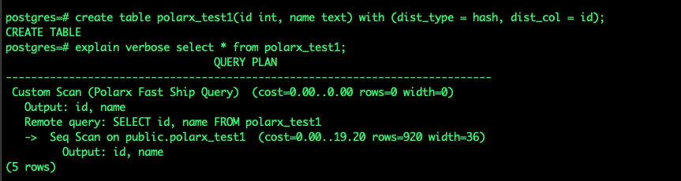

# Fast Query Shipping

## Architecture
The Fast Query Shipping engine is deployed as a plug-in. If simple SQL statements are judged that they can be pushed down, the Fast Query Shipping optimizer will quickly generate a remote query execution plan and encapsulate the plan into a custom scan. Custom scan executors can push down the statements in parallel. The Fast Query Shipping engine improves query optimization and SQL statement processing efficiency. Sample statements:

## Parameter：

polarx.enable_fast_query_shipping: specifies whether to enable Fast Query Shipping. Valid values: true indicates that the engine is enabled, while false indicates that the engine is disabled.

___

Copyright © Alibaba Group, Inc.
