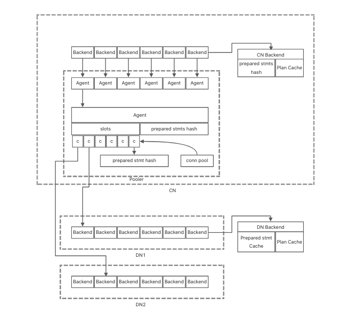
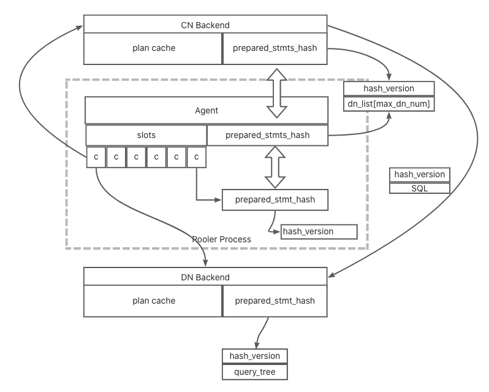
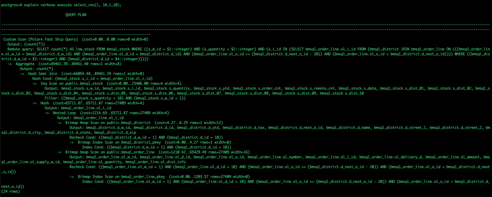
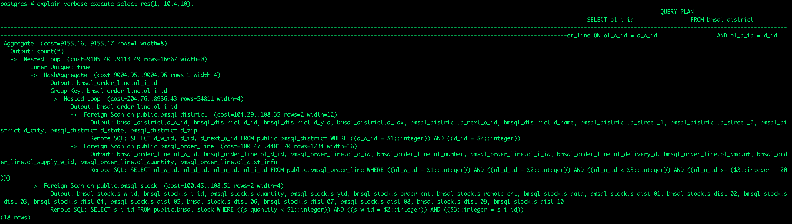
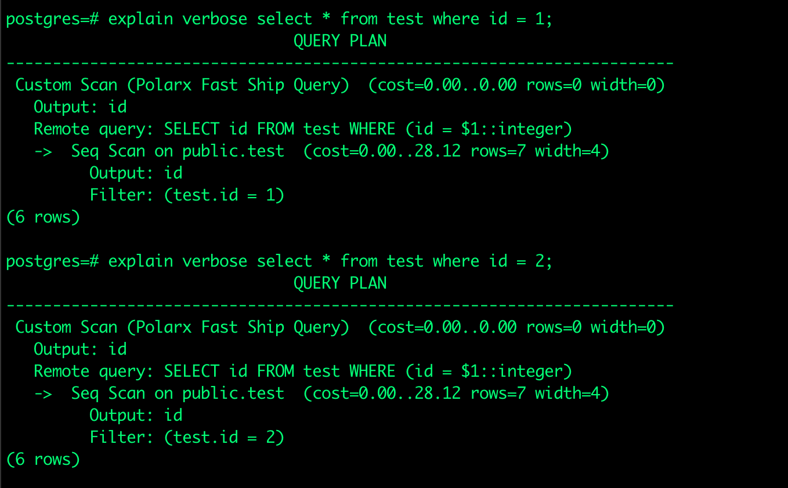

# Global Plan Cache 设计

## 架构介绍
Global Plan Cache 通过 将计算节点中查询计划信息和数据节点解耦，并在数据节点实现两层缓存，第一层缓存parse, analyze, rewrite的结果查询树，第二层缓存逻辑优化，以及物理优化结果查询执行计划， 并将每层缓存和计算服务进程解耦，实现了计算节点多服务进程间复用，提高了复用效率，减少了sql执行过程中重复的操作，提高了sql执行效率, 具体架构可参考下图：



本方案将在DN Backend 中已完成prepared sql 信息缓存在CN的连接池对应的连接中，当连接被复用时，CN Backend 通过同步对应连接缓存的prepared statements 信息，来复用查询树以及查询执行计划。具体原理可以参考下图：



## 功能介绍
1.支持CN节点全局查询执行计划缓存.
    
2.支持可根据参数值动态判定的可完全下推的参数化分布式执行计划.   
* 例如：此语句中如果$1的值与$3的值相同，则语句可以完全下推，因bmsql_stock的分布列为s_w_id, bmsql_district的分布列为d_w_id, 且为同分布，所以值相同代表数据在一个数据节点内，如果值不同且不在一个节点内则不可下推。

```bash
    prepare select_res(int,int,int,int) as SELECT count(*) As low_stock FROM bmsql_stock WHERE s_w_id = $1 AND s_quantity < $2 AND s_i_id IN ( SELECT ol_i_id FROM bmsql_district JOIN bmsql_order_line ON ol_w_id = d_w_id AND ol_d_id = d_id AND ol_o_id >= d_next_o_id - 20 AND ol_o_id < d_next_o_id WHERE d_w_id = $3 AND d_id = $4 );
```

```bash
explain verbose execute select_res(1, 10,1,10);
```


```bash
explain verbose execute select_res(1, 10,4,10);
```



3.支持自动生成参数化plan.
* 例如：如下语句，本是非参数化sql, 但可以生成参数化的执行计划。

```bash
explain verbose select * from test where id = 1;
```


## 参数开关介绍：

1. polarx.enable_plan_cache 参数
设置globa plan cache 功能开关，设置为true，表示打开，false 为关闭，默认值为true.

