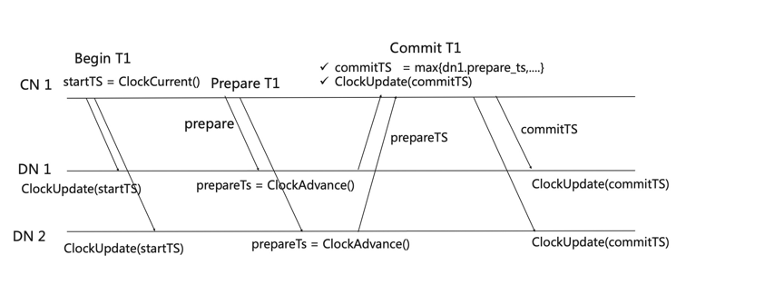

## 基于HLC的分布式事务协议

HLC的设计是物理和逻辑时钟混合，64位时钟由最低16位为逻辑时钟，中间46位物理时钟（毫秒）和最高两个保留位组成。
每个节点维护一个max_ts混合时钟，并周期性持久化，重启后REDO恢复最大值。

### 定义三种操作：

* ClockCurrent就是读取当前的Clock，相当于我们用max_ts和本地的物理时钟local-phys-ts取最大值返回。

* ClockUpdate就是用一个timestamp去更新max_ts，取最大值

* ClockAdvance是把max_ts和 local-phys-ts取最大值后再加1返回，整个过程都是加锁来保证原子性。

上述操作中，local-phys-ts是本地机器获取的物理时钟，并取毫秒时间。左移16位与max_ts 对其进行运算（max_ts最低16位是逻辑时钟）。
不同机器的物理时钟可以通过NTP或PTP协议进行同步，保证很小的时钟倾斜。

### 时钟算法

* 在事务Begin的时候，会在协调节点上为它分配ClockCurrent作为startTS，startTS到了每个DN节点以后，会用startTS去更新本地的max-ts混合逻辑时钟。

* 事务Prepare的时候会去每个参与节点调用ClockAdvance，获取prepareTS，同时返回给协调节点。协调节点会从所有的prepareTS选最大值作为commitTS，同时更新协调节点的混合逻辑时钟，并且下发给每个参与去提交事务，并且用commitTS去推动每个参与DN的混合逻辑时钟前进。

### 可见性判断规则

我们假设在任意一个节点如DN1上，有两个并发事务T1、T2。

* 如果T2在扫描T1的修改时，T1还未prepare，没有提交时间戳，判断T1对T2是不可见。

* 如果T2在扫描T1修改时，T1处于prepared状态，T2需要等待T1的提交或者abort。如果abort，则不可见；如果提交，那就有commit_ts，直接时间戳比较进行可见性判断，即如果T2.start_ts >= T1.commit_ts，则可见。

* 如果T2在扫描T1修改时，T1处于有提交时间戳，则直接通过时间戳比较进行可见性判断。

___

Copyright © Alibaba Group, Inc.