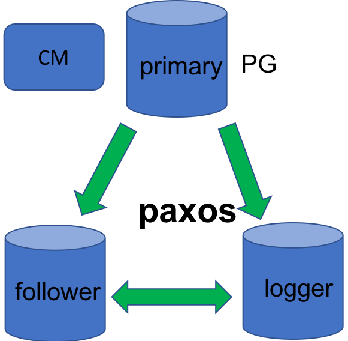
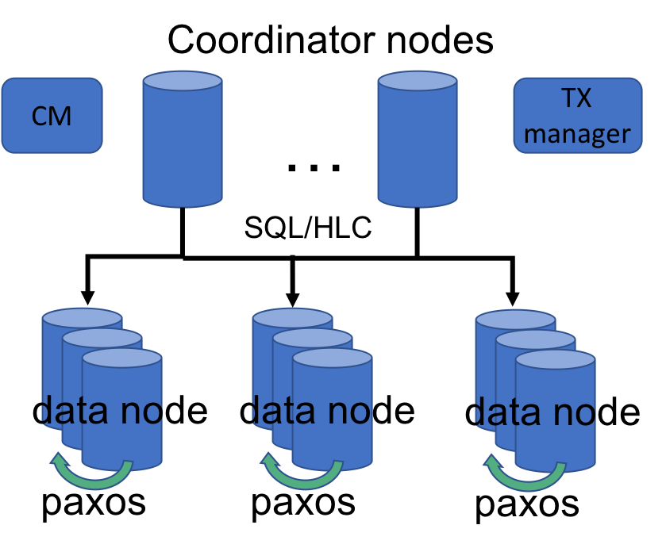

## Roadmap of PolarDB 

PolarDB project will gradually roll out features and components to form a share-nothing distributed database. Each major release offers complete functions as a RDBM system. We plan three major releases. 

In the first release we targes a cluster version based on Paxos replication, enhancing high performance and high availability for single-node PostgreSQL system. 
In the second release, we introduce technologies such as distributed transactions, distributed MVCC, and distributed SQL compution to support a share-nothing OLTP system. In this version,  PolarDB can expand to a cluster of 100+ nodes with linear scalability. At the same time, it is compatible with a single-node PostgreSQL in term of SQL functions and ACID capabilities. 
In the third release, Fine-grained sharding is implemented. The database components, such as coordinator node and data node, are unified as database node.  Most PolarDB functions adding to PostgreSQL are turned into extensions or plug-in to PG kernel. This allows PolarDB to be upgraded easily and timely with community versions. Users can adopts new community versions with minimum efforts while enjoying high availability and scalability offered by PolarDB.  

### PolarDB for PG version 1.0

As shown on the above figure, this version supports Paxos based replcation and cluster management. We turns PostgreSQL into a high-available database cluster, which survive through database node failure. The survival database nodes maintain data consistency and no data loss occurs. The Paxos replication protocol used in this version is same as the one used by Alibaba group to support hundreds of Alibaba products and platforms. The implmentation's have been fully tested for correctness and reliability under Alibaba's varying and often-intensive workload. More details can be found [here](ha_paxos.md).

In addition, a few performance enhancement features for single-node PostgreSQL are introduced, such as [using timestamp as snapshot](cts.md), [parallel redo](parallel_redo.md), and [removing full-page-write WAL](no_fpw.md). 

Here is a list of main features:
* High Availability:
  * one leader and two followers replication configuration: zero data loss and data consistency across node failure
  * automatic leader election
  * multi-role supports: leader/follower/logger, balance data redundance and storage space, trade off recovery speed with storage cost
  * cluster management: cluster status monitoring, start/stop node or cluster, switchover, and load balancing. 
  * parallel WAL redo: multiple granularities of redo parallelism, such as per file or per page
* High Performance
  * using timestamp as snapshot: remove ProcArray related bottleneck
  * CTS (timestamp control data structure) multi-core scalability
  * removing full-page-write WAL: avoid enormous WAL IO for write-intensive workload

### PolarDB for PG version 2.0

This version introdcues fundamental features for a distributed share-nothing OLTP system to support global data consistency, ACID across nodes, and distributed SQL process. The data of a database are partitioned based on chosen columns. Those partitions are distributed to data nodes in a PolarDB cluster. A new component, coordinator node, is introduced to handle SQL requests and decide how to execute them among data nodes. Data nodes are PostgreSQL based components which store partition data and process SQL queries from coordinator nodes. PolarDB allows distributed DML, DDL, and DCL. Coordinator nodes send queries to data nodes to execute according to their accessing data. Coordinator nodes also determine which operations or sub-queries can be pushed down to data nodes and conduct merging or aggregation operations of results from data nodes. For data consistency and ACID, PolarDB uses distributed transaction, hybrid logic clock (HLC), distributed MVCC, and HLC based vacuum and hot-chain pruning.  

Here is a list of features:
* HLC based ACID
  * Hybrid logic clock (HLC)
  * HLC based data consistency and distributed MVCC
  * two-phase commit for distributed transaction
  * fault tolerance of distributed transaction
  * distributed deadlock prevention and detection
  * distributed Vacuum
* Distributed SQL computing
  * SQL language 
    * SQL2003 compatible
    * support most PostgreSQL SQL syntax, data type, and internal functions
    * distributed processing of transaction-related statements
    * distributed processing of data control statements (GRANT/REVOKE)
    * support CURSOR and TRIGGER
    * RULE
    * UDF
  * distributed query execution
    * direct query shipment of simple DML and queries
    * CBO based complex query processing
    * statement push-down
  * distributed DDL 
    * create/drop table for multiple distribution types: replication, hash, modulo and round-robin
    * create index
    * alter table
* High availability
  * Paxos replication and cluster management for distributed OLTP cluster
  * Database log and Paxos log synchronization optimization
  * Parallel redo for follower
  * Global metadata management and consistency
  * load balancing after node failure
* ...

### PolarDB for PG version 3.0

This release emphasizes elasticity and easy use. For the former target, PolarDB implement fine-grained sharding and online shard relocation and cluster expansion. For the latter target, majority functions added by PolarDB in addition to PostgreSQL are integrated into an extension or plug-in. Users can easily download the extension and use it with vanila PostgreSQL. When the community rolls out a new version, PolarDB extension can be easily upgraded with the latest PostgreSQL version. 

In this release, we will deliver the following features:

* Sharding and elasticity
  * fine-grained sharding
  * high-efficient online shard relocation
  * parallel logic replication 
  * online cluster expansion and reduction
  * hot spot removal and load balancing
* Extension based enhancement
  * distributed transaction implementation in extension
  * time service plug-in
  *	patch of distributed MVCC 
  * path of distributed lock and deadlock management 
  * extension for distributed DDL/TCL/DCL/CCL statement
  * metadata unified management in extension
  * fine-grained sharding in extension
  * Paxos based high avaialability in extension or patch
* Unified database node
  * full metadata store in each database node
  *	unified coordinator node and data node
* High availability enhancement
  * Master metadata node HA based on Paxos
  * global metadata consistency at node failure
  * online node replacement
  * online upgrade
  * logic replication based Active-Active deployment
* ...

___

Copyright © Alibaba Group, Inc.