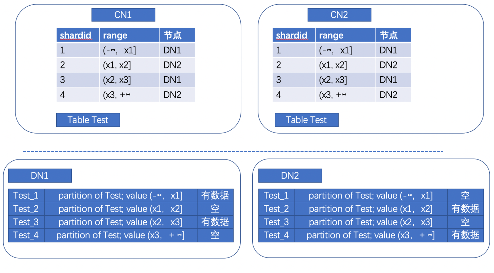

# 背景
在开源分布式PolarDB-PG中，原来只有hash的分布方式，通过在建表时选择某一列作为hash分布列，然后按分布列的值进行hash mod 节点数目，选择节点编号，然后数据分布在该节点上。
这种方式的弊端是如果动态加减节点，全部数据都需要重分布。
所以开发了sharding的分布方式，并进行了插件化的设计

# 设计
sharding分布采用插件化设计，通过polarx插件，支持shard的表分布方式。
在插件中，维护了shardmap和提升性能的shardmap缓存。
假设shard分片数量为N，将32位空间切分为N个range，每个range按照roundrobin的方式对应到某个节点上，
在有数据插入时，根据shard列的值计算出hash值，然后找到对应range所属的节点。
本特性利用PG的分区表作为基础，在DN上，使用分区表进行shard表的划分，CN上不感知DN上的子表，只感知父表。
目前shard分片数量在shardmap建立后不能更改，建议分片数量是节点数量的2倍以上。

以两个CN 两个DN节点，4个shard 分片数量为例,
根据shard key进行hash，得到 value，如果属于(x1,x2] 的范围，就是属于DN2的数据，会存储在Test_2子表中


# 使用
## 创建插件、注册对应fdw、填充shardmap表
如果使用 pgxc_ctl init 进行初始化集群，则会自动完成以下内容，不需要手动执行
```asm
如果不是使用pgxc_ctl init初始化集群，则每个CN、DN都执行以下sql（ip、port进行对应修改）

创建插件
CREATE EXTENSION polarx;

使用fdw来实现分布式表的特性  
CREATE SERVER coord1m TYPE 'C' FOREIGN DATA WRAPPER polarx OPTIONS (host '127.0.0.1',port '60007', nodeis_primary 'false', nodeis_preferred 'false', node_cluster_name 'cluster_server', nodeis_local 'false', node_id '0');
CREATE SERVER coord2m TYPE 'C' FOREIGN DATA WRAPPER polarx OPTIONS (host '127.0.0.1',port '60008', nodeis_primary 'false', nodeis_preferred 'false', node_cluster_name 'cluster_server', nodeis_local 'false', node_id '1');
CREATE SERVER datanode1m TYPE 'D' FOREIGN DATA WRAPPER polarx OPTIONS (host '127.0.0.1',port '60009', nodeis_primary 'true', nodeis_preferred 'true', node_cluster_name 'cluster_server', nodeis_local 'true', node_id '2');
CREATE SERVER datanode2m TYPE 'D' FOREIGN DATA WRAPPER polarx OPTIONS (host '127.0.0.1',port '60010', nodeis_primary 'false', nodeis_preferred 'true', node_cluster_name 'cluster_server', nodeis_local 'false', node_id '3');
CREATE SERVER cluster_server FOREIGN DATA WRAPPER polarx;

创建一个有4个shard的shardmap
polardbx_build_shard_map时需要指定shardcount的数量
select polardbx_build_shard_map(4);
```

## 查询shardmap表内容
```asm
postgres=# select * from pg_shard_map;
 shardid | nodeoid | shardminvalue | shardmaxvalue
---------+---------+---------------+---------------
       1 |   16400 |   -2147483648 |   -1073741824
       2 |   16401 |   -1073741824 |             0
       3 |   16400 |             0 |    1073741824
       4 |   16401 |    1073741824 |    2147483647
(4 rows)
```

## 创建shard分布的表
有guc参数（polarx.default_table_dist_type, 取值为hash[默认值] 或 shard） 控制默认创建的表时shard表还是hash表。
如果guc设置默认创建为shard表，则直接使用单表的建表语法即可创建shard表，如：create table test(f1 int);
否则建表时需要在选项中指定 with (dist_type='shard', dist_col='f1'); 的方式来选择shard方式以及shard 列。

```asm
postgres=# create table test(f1 int) with (dist_type='shard', dist_col='f1');
CREATE TABLE

-- locator_type 为S表示shard表，H表示hash表
postgres=# select * from pg_foreign_table ;
 ftrelid | ftserver |                         ftoptions
---------+----------+------------------------------------------------------------
   16403 |    16402 | {dist_col_name=f1,use_remote_estimate=true,locator_type=S}
(1 row)
```


# 限制
1. 临时表不支持shard分布，但支持hash分布
2. 支持有限类型的shard分布列类型，目前支持类型有：
   INT2 INT4 INT8 OID ABSTIME RELTIME  BOOL CHAR FLOAT4 FLOAT8 JSONB NAME VARCHAR TEXT OIDVECTOR BPCHAR TIME INTERVAL TIMETZ NUMERIC UUID
3. 分区表不支持shard分布，但支持hash分布
4. 不能直接对shard表进行reindex操作，建议drop index后，再create index
5. inherit时，父表不能为shard表