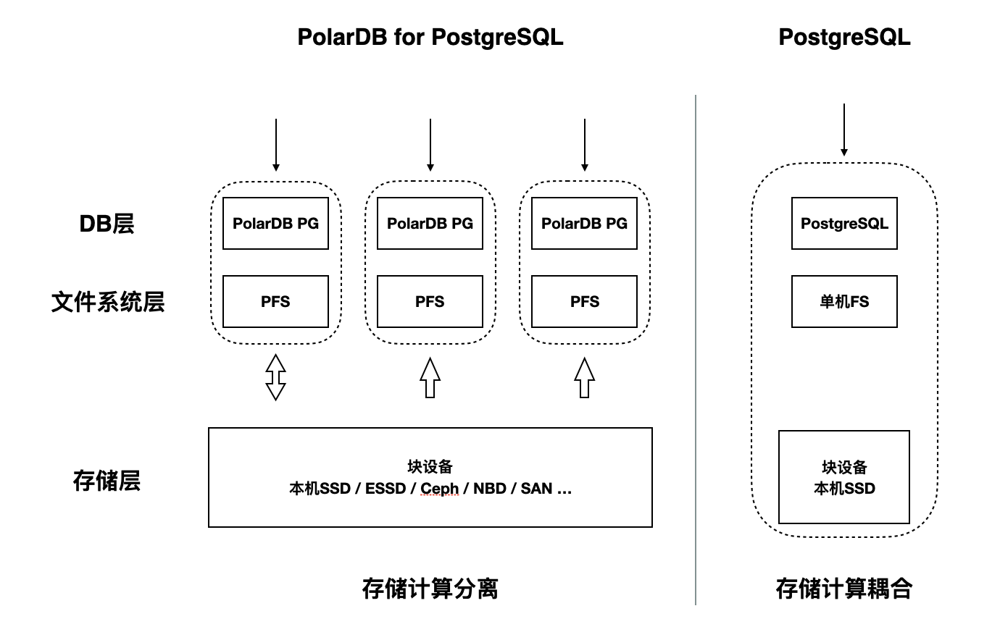

# 架构简介

<ArticleInfo :frontmatter=$frontmatter></ArticleInfo>

PolarDB for PostgreSQL 采用了基于 Shared-Storage 的存储计算分离架构。数据库由传统的 Shared-Nothing 架构，转变成了 Shared-Storage 架构——由原来的 N 份计算 + N 份存储，转变成了 N 份计算 + 1 份存储；而 PostgreSQL 使用了传统的单体数据库架构，存储和计算耦合在一起。

为保证所有计算节点能够以相同的可见性视角访问分布式块存储设备，PolarDB-PG 需要使用分布式文件系统 [PolarDB File System（PFS）](https://github.com/ApsaraDB/PolarDB-FileSystem) 来访问块设备，其实现原理可参考发表在 2018 年 VLDB 上的论文[^polarfs-paper]；如果所有计算节点都可以本地访问同一个块存储设备，那么也可以不使用 PFS，直接使用本地的单机文件系统（如 ext4）。这是与 PostgreSQL 的不同点之一。

[^polarfs-paper]: [PolarFS: an ultra-low latency and failure resilient distributed file system for shared storage cloud database](https://www.vldb.org/pvldb/vol11/p1849-cao.pdf)
