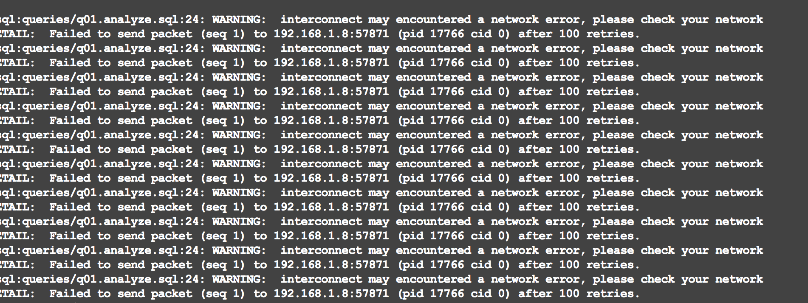

# 利用 PolarDB HTAP 加速 TPC-H

<ArticleInfo :frontmatter=$frontmatter></ArticleInfo>

在本文，我们将基于单机本地存储，利用 PolarDB for PostgreSQL 的 HTAP 能力来加速 TPC-H 的执行。

## 前期准备

### 部署 PolarDB PG

在运行前我们默认您已经通过 [前置文档](../deploying/db-localfs.md#本地多节点-htap-实例) 部署好单机多节点 HTAP 实例。也可以直接从 DockerHub 上拉取 HTAP 实例镜像：

```bash:no-line-numbers
docker pull polardb/polardb_pg_local_instance:htap
docker run -it \
    --cap-add=SYS_PTRACE \
    --privileged=true \
    --name polardb_pg_htap \
    --shm-size=512m \
    polardb/polardb_pg_local_instance:htap \
    bash
```

HTAP 实例包含一个运行在 5432 端口的读写节点和两个运行在 5433、5434 端口的只读节点：

```shell:no-line-numbers
$ ps -efww
postgres      9      1  1 06:14 pts/0    00:00:01 /home/postgres/tmp_basedir_polardb_pg_1100_bld/bin/postgres -D /home/postgres/tmp_master_dir_polardb_pg_1100_bld
postgres     10      9  0 06:14 ?        00:00:00 postgres(5432): logger  0
postgres     11      9  0 06:14 ?        00:00:00 postgres(5432): logger  1
postgres     12      9  0 06:14 ?        00:00:00 postgres(5432): logger  2
...
postgres     33      1  1 06:14 pts/0    00:00:01 /home/postgres/tmp_basedir_polardb_pg_1100_bld/bin/postgres -D /home/postgres/tmp_replica_dir_polardb_pg_1100_bld1
postgres     34     33  0 06:15 ?        00:00:00 postgres(5433): logger  0
postgres     35     33  0 06:15 ?        00:00:00 postgres(5433): logger  1
postgres     36     33  0 06:15 ?        00:00:00 postgres(5433): logger  2
...
postgres     48      1  1 06:15 pts/0    00:00:01 /home/postgres/tmp_basedir_polardb_pg_1100_bld/bin/postgres -D /home/postgres/tmp_replica_dir_polardb_pg_1100_bld2
postgres     49     48  0 06:15 ?        00:00:00 postgres(5434): logger  0
postgres     50     48  0 06:15 ?        00:00:00 postgres(5434): logger  1
postgres     51     48  0 06:15 ?        00:00:00 postgres(5434): logger  2
```

### 生成 TPC-H 测试数据集

[TPC-H](https://www.tpc.org/tpch/default5.asp) 是专门测试数据库分析型场景性能的数据集，一共有 22 条分析型场景下的 SQL。用 TPC-H 可以有效测试 PolarDB 的 HTAP 的能力。我们将通过 [tpch-dbgen](https://github.com/HBKO/tpch-dbgen) 工具来生成任意大小的数据集。

```bash:no-line-numbers
git clone https://github.com/HBKO/tpch-dbgen.git
cd tpch-dbgen
```

#### 根据默认值创建 TPC-H 数据集

通过如下命令，生成默认值下的 TPC-H 数据集。默认生成的 TPC-H 数据集共有 10GB 数据，会直接连接到正在运行的 PolarDB for PostgreSQL 数据库，并完成导入数据、创建约束、创建 TPC-H SQL 的步骤。

```shell:no-line-numbers
# 导入 10GB 数据的时间较长，一般要 20-30 分钟左右，请耐心等待
./build.sh
```

#### 定制化的创建 TPC-H 数据集

`build.sh` 脚本中各个参数的含义如下：

- `--user`：数据库用户名
- `--db`：数据库名
- `--host`：数据库主机地址，默认为 localhost
- `--port`：数据库服务端口
- `--run`：默认执行所有 TPC-H 查询，或执行某条特定的 TPC-H 查询
- `--option`：额外指定 GUC 参数
- `--scale`：代表生成 TPC-H 数据集大小，单位为 GB

```shell:no-line-numbers
$ ./build.sh --help

  1) Use default configuration to build
  ./build.sh
  2) Use limited configuration to build
  ./build.sh --user=postgres --db=postgres --host=localhost --port=5432 --scale=1
  3) Run the test case
  ./build.sh --run
  4) Run the target test case
  ./build.sh --run=3. run the 3rd case.
  5) Run the target test case with option
  ./build.sh --run --option="set polar_enable_px = on;"
  6) Clean the test data. This step will drop the database or tables, remove csv
  and tbl files
  ./build.sh --clean
  7) Quick build tpch with 100MB
  ./build.sh --scacle=0.1
```

通过设置不同的参数，可以定制化地创建不同大小的 TPC-H 数据集，并写入到指定的数据库中，这个脚本要求能够免密登录数据库。如果需要指定登录密码：

```shell:no-line-numbers
export PGPASSWORD=<your password>
source ~/.bashrc
```

连接到数据库，对刚才创建的表设置最大查询并行度，否则将不会进入 PX 查询：

```sql
alter table nation set (px_workers = 100);
alter table region set (px_workers = 100);
alter table supplier set (px_workers = 100);
alter table part set (px_workers = 100);
alter table partsupp set (px_workers = 100);
alter table customer set (px_workers = 100);
alter table orders set (px_workers = 100);
alter table lineitem set (px_workers = 100);
```

## 执行 PostgreSQL 单机并行执行

接下来以 TPC-H Q18 为例来进行演示。数据导入到 PolarDB 后，我们先执行 PostgreSQL 单机并行查询，观测一下查询速度。

1. `psql` 连入后，执行如下命令，开启计时。

   ```sql:no-line-numbers
   \timing on
   ```

2. 通过 `max_parallel_workers_per_gather` 参数设置单机并行度为 2：

   ```sql:no-line-numbers
   set max_parallel_workers_per_gather=2;
   ```

3. 执行如下命令，查看执行计划：

   ```sql:no-line-numbers
   \i finals/18.explain.sql
   ```

   可以看到如图所示的 2 个并行度的并行计划：

   ```sql
   																		QUERY PLAN
   -----------------------------------------------------------------------------------------------------------------------------------------------------------------
    Limit  (cost=9364138.51..9364141.51 rows=100 width=71)
      ->  GroupAggregate  (cost=9364138.51..9380736.94 rows=553281 width=71)
   	   	Group Key: orders.o_totalprice, orders.o_orderdate, customer.c_name, customer.c_custkey, orders.o_orderkey
   		   ->  Sort  (cost=9364138.51..9365521.71 rows=553281 width=44)
   			   Sort Key: orders.o_totalprice DESC, orders.o_orderdate, customer.c_name, customer.c_custkey, orders.o_orderkey
   			   ->  Hash Join  (cost=6752588.87..9294341.50 rows=553281 width=44)
   			   		Hash Cond: (lineitem.l_orderkey = orders.o_orderkey)
   				   	->  Seq Scan on lineitem  (cost=0.00..1724338.96 rows=59979696 width=9)
   		   			->  Hash  (cost=6749642.22..6749642.22 rows=138372 width=43)
   			   			->  Hash Join  (cost=6110531.76..6749642.22 rows=138372 width=43)
   				   				Hash Cond: (orders.o_custkey = customer.c_custkey)
   					   			->  Hash Join  (cost=6032162.96..6658785.84 rows=138372 width=24)
   						   			Hash Cond: (orders.o_orderkey = lineitem_1.l_orderkey)
   							   		->  Seq Scan on orders  (cost=0.00..410917.44 rows=15000544 width=20)
   							   		->  Hash  (cost=6029892.31..6029892.31 rows=138372 width=4)
   								   			->  Finalize GroupAggregate  (cost=5727599.96..6028508.59 rows=138372 width=4)
   						   						Group Key: lineitem_1.l_orderkey
   							   					Filter: (sum(lineitem_1.l_quantity) > '313'::numeric)
   						   						->  Gather Merge  (cost=5727599.96..6016055.08 rows=830234 width=36)
      														Workers Planned: 2
      														->  Partial GroupAggregate  (cost=5726599.94..5919225.45 rows=415117 width=36)
   	   														Group Key: lineitem_1.l_orderkey
      															->  Sort  (cost=5726599.94..5789078.79 rows=24991540 width=9)
      																	Sort Key: lineitem_1.l_orderkey
      																	->  Parallel Seq Scan on lineitem lineitem_1  (cost=0.00..1374457.40 rows=24991540 width=9)
   	   							->  Hash  (cost=50827.80..50827.80 rows=1500080 width=23)
      									->  Seq Scan on customer  (cost=0.00..50827.80 rows=1500080 width=23)
   (27 rows)
   ```

4. 执行 SQL，可以看到执行结果和运行时间，运行时间为 1 分 23 秒：

   ```sql:no-line-numbers
   \i finals/18.sql
   ```

   

## 执行 PolarDB HTAP 单机并行执行

在体验完单机并行查询后，我们开启 PolarDB HTAP 的并行执行，在单机上体验一下查询性能。

1. 在 psql 后，执行如下命令，开启计时。

   ```sql:no-line-numbers
   \timing on
   ```

2. 执行如下命令，开启跨机并行查询（PX）。

   ```sql:no-line-numbers
   set polar_enable_px=on;
   ```

3. 设置每个节点的并行度为 1。

   ```sql:no-line-numbers
   set polar_px_dop_per_node=1;
   ```

4. 执行如下命令，查看执行计划。

   ```sql:no-line-numbers
   \i finals/18.explain.sql
   ```

   当前集群带有 2 个 RO 节点，开启 PX 后默认并行度为 `2 x 1 = 2` 个：

   ```sql
                                                                                              QUERY PLAN
   -------------------------------------------------------------------------------------------------------------------------------------------------------------------------------------------------

    Limit  (cost=0.00..93628.34 rows=100 width=47)
      ->  PX Coordinator 2:1  (slice1; segments: 2)  (cost=0.00..93628.33 rows=100 width=47)
            Merge Key: orders.o_totalprice, orders.o_orderdate
            ->  Limit  (cost=0.00..93628.31 rows=50 width=47)
                  ->  GroupAggregate  (cost=0.00..93628.31 rows=11995940 width=47)
                        Group Key: orders.o_totalprice, orders.o_orderdate, customer.c_name, customer.c_custkey, orders.o_orderkey
                        ->  Sort  (cost=0.00..92784.19 rows=11995940 width=44)
                              Sort Key: orders.o_totalprice DESC, orders.o_orderdate, customer.c_name, customer.c_custkey, orders.o_orderkey
                              ->  Hash Join  (cost=0.00..22406.63 rows=11995940 width=44)
                                    Hash Cond: (lineitem.l_orderkey = orders.o_orderkey)
                                    ->  PX Hash 2:2  (slice2; segments: 2)  (cost=0.00..4301.49 rows=29989848 width=9)
                                          Hash Key: lineitem.l_orderkey
                                          ->  Partial Seq Scan on lineitem  (cost=0.00..2954.65 rows=29989848 width=9)
                                    ->  Hash  (cost=10799.35..10799.35 rows=83024 width=39)
                                          ->  PX Hash 2:2  (slice3; segments: 2)  (cost=0.00..10799.35 rows=83024 width=39)
                                                Hash Key: orders.o_orderkey
                                                ->  Hash Join  (cost=0.00..10789.21 rows=83024 width=39)
                                                      Hash Cond: (customer.c_custkey = orders.o_custkey)
                                                      ->  PX Hash 2:2  (slice4; segments: 2)  (cost=0.00..597.52 rows=750040 width=23)
                                                            Hash Key: customer.c_custkey
                                                            ->  Partial Seq Scan on customer  (cost=0.00..511.44 rows=750040 width=23)
                                                      ->  Hash  (cost=9993.50..9993.50 rows=83024 width=20)
                                                            ->  PX Hash 2:2  (slice5; segments: 2)  (cost=0.00..9993.50 rows=83024 width=20)
                                                                  Hash Key: orders.o_custkey
                                                                  ->  Hash Semi Join  (cost=0.00..9988.30 rows=83024 width=20)
                                                                        Hash Cond: (orders.o_orderkey = lineitem_1.l_orderkey)
                                                                        ->  Partial Seq Scan on orders  (cost=0.00..1020.90 rows=7500272 width=20)
                                                                        ->  Hash  (cost=7256.00..7256.00 rows=166047 width=4)
                                                                              ->  PX Broadcast 2:2  (slice6; segments: 2)  (cost=0.00..7256.00 rows=166047 width=4)
                                                                                    ->  Result  (cost=0.00..7238.62 rows=83024 width=4)
                                                                                          Filter: ((sum(lineitem_1.l_quantity)) > '313'::numeric)
                                                                                          ->  Finalize HashAggregate  (cost=0.00..7231.79 rows=207559 width=12)
                                                                                                Group Key: lineitem_1.l_orderkey
                                                                                                ->  PX Hash 2:2  (slice7; segments: 2)  (cost=0.00..7205.20 rows=207559 width=12)
                                                                                                      Hash Key: lineitem_1.l_orderkey
                                                                                                      ->  Partial HashAggregate  (cost=0.00..7197.41 rows=207559 width=12)
                                                                                                            Group Key: lineitem_1.l_orderkey
                                                                                                            ->  Partial Seq Scan on lineitem lineitem_1  (cost=0.00..2954.65 rows=29989848 width=9)
   Optimizer: PolarDB PX Optimizer
   (39 rows)
   ```

5. 执行 SQL：

   ```sql:no-line-numbers
   \i finals/18.sql
   ```

   可以看到执行结果和运行时间，运行时间为 1 分钟，比 PostgreSQL 的并行执行结果降低了 27.71\% 的运行时间。加大并行度或者数据量，性能可以得到更明显的提升。

   

   PX 并行查询会获取全局一致性视图，因此得到的数据是一致的，无需担心数据正确性。通过如下方式手动设置 PX 并行查询的并行度：

   ```sql:no-line-numbers
   set polar_px_dop_per_node = 2;
   \i finals/18.sql

   set polar_px_dop_per_node = 4;
   \i finals/18.sql
   ```

   ::: tip
   通过 `\i finals/[number].sql` 可以跑任意的 TPC-H SQL。如果想要跑完全量的 TPC-H SQL，可以通过 `./build.sh --run` 来运行。结果会输出在 result 文件中。

   如果 q17、18 出现了 out of memory 的错误，可以尝试将 hashagg 关闭：

   ```sql:no-line-numbers
   set polar_px_optimizer_enable_hashagg=0;
   ```

   :::

## 执行 PolarDB HTAP 跨机并行执行

### 启动结点

在能够访问共享存储并格式化 PFS 文件系统的三台主机上，分别启动读写节点和只读节点。验证主节点到只读结点的连通性。如果访问不通，请检查防火墙等网络配置。

::: warning
更换 `<ip_address>` 和 `<port>` 为只读结点的 IP 地址和端口。
:::

```shell:no-line-numbers
psql -h <ip_address> -p <port> -Upostgres postgres
```

### 设置主节点参数

进入主节点的 psql 命令行后，执行以下 SQL 语句配置跨机 HTAP 集群。更换 `<ip_address_1>`、`<port_1>` 和 `<ip_address_2>`、`<port_2>` 为两个只读结点的 IP 地址和端口。

```sql:no-line-numbers
alter system set polar_cluster_map='node1|<ip_address_1>|<port_1>,node2|<ip_address_2>|<port_2>';
select pg_reload_conf();
```

### 测试

以 TPC-H 为例，检查查询计划是否来自于 PolarDB 的 PX 优化器，并执行查询：

```sql:no-line-numbers
explain select count(*) from customer;
select count(*) from customer;
```

### 常见错误

如果发现下面的错误，可以尝试统一修改每台机器的 MTU 为 9000：

```shell:no-line-numbers
ifconfig <网卡名> mtu 9000
```


