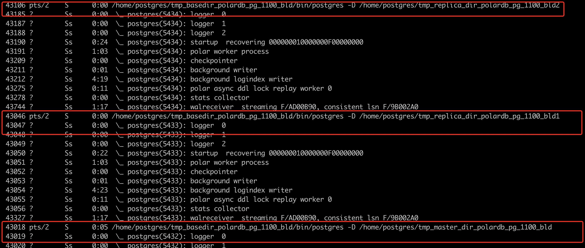
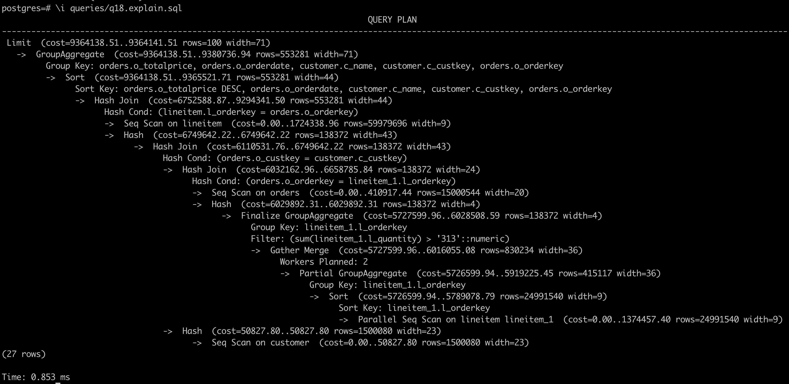
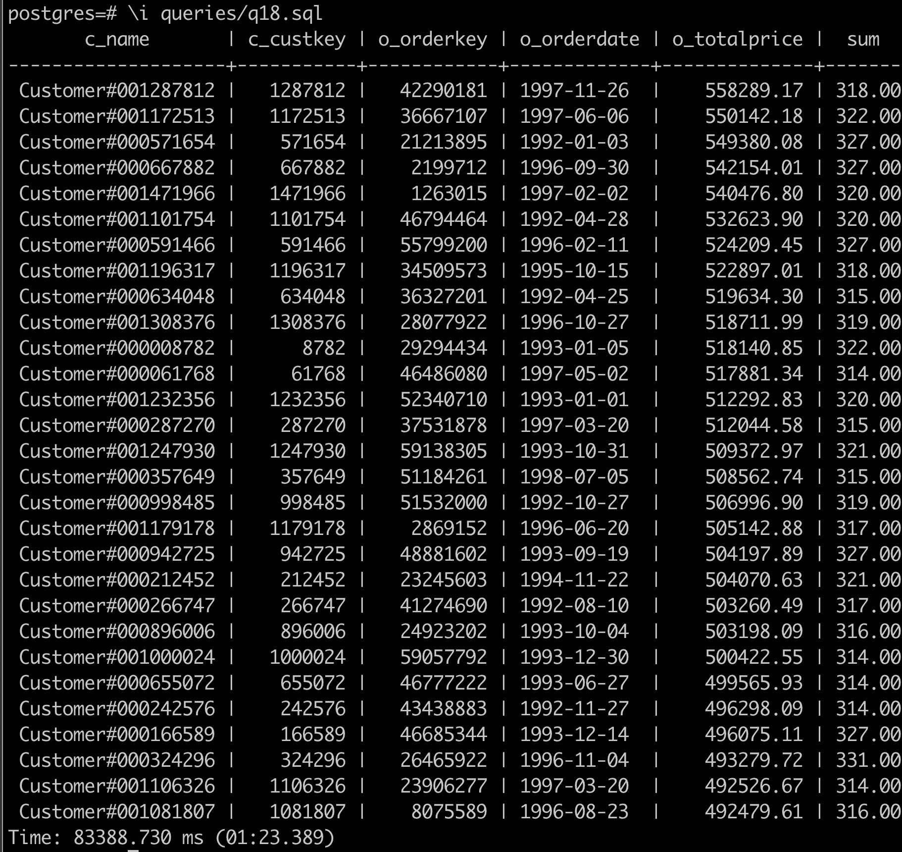
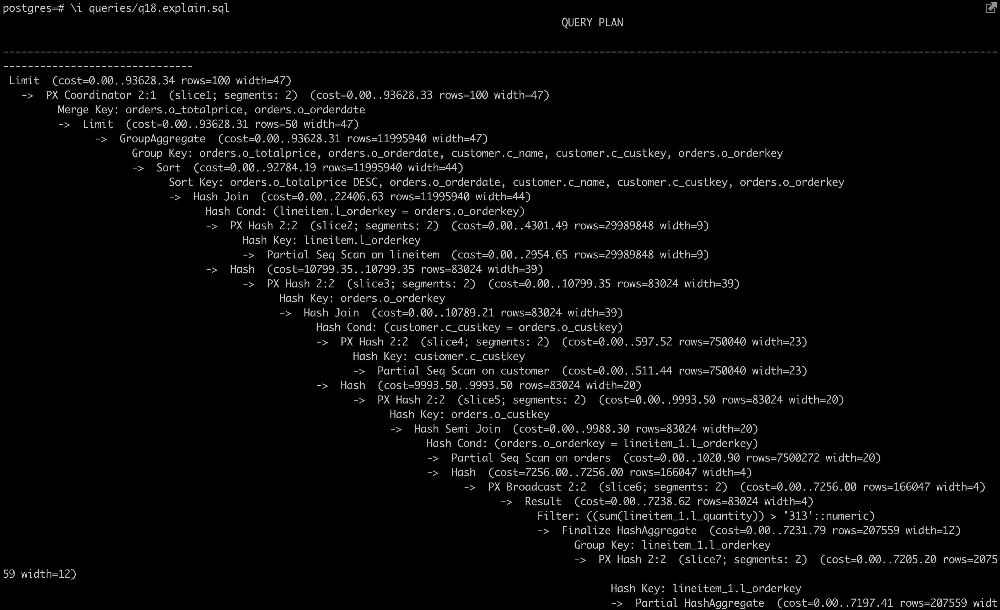
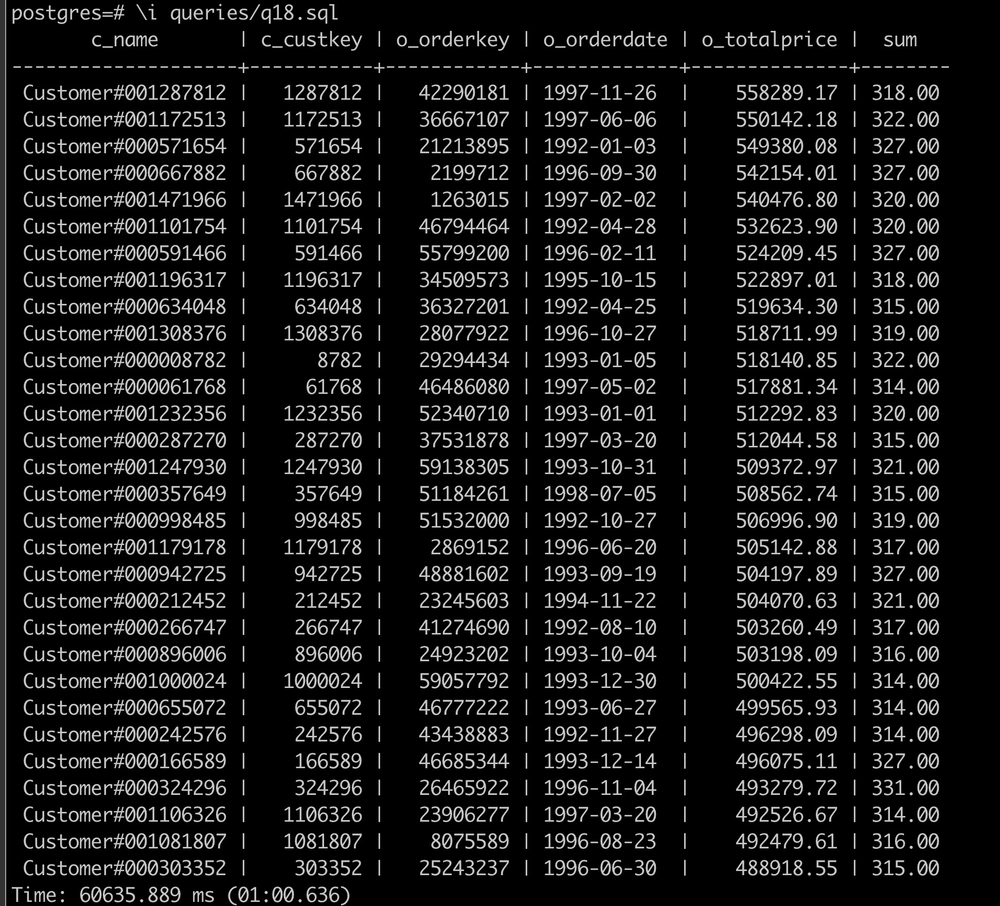

# Practice：Accelerate TPC-H through PolarDB HTAP

In this section，we will accelerate TPC-H through PolarDB HTAP. The practice will be based on local storage.

## Prepare

### Deploy PolarDB PG on local storage
Before this section, we should deploy PolarDB for PG HTAP through the documents [deploy PolarDB PG on local storage](deploy-on-local-storage.md). There are one primary node(running on port 5432) and two read-only node(running on port 5433/5434).


We can verify PolarDB HTAP through commands as follows：

```cmd_test_instance
ps xf
```
Three processes should exist. There are one primary node(running on port 5432) and two read-only node(running on port 5433/5434).



### Generate TPC-H Dataset
TPC-H is a dataset dedicated for OLAP. [TPC-H](https://www.tpc.org/tpch/default5.asp). There are 22 sqls in TPC-H. We will utilize tpch-dbgen to generate arbitrarily sized TPC-H dataset.


Download tpch-dbgen
```cmd_download_tpch-dbgen
# Clone the code
git clone https://github.com/qiuyuhang/tpch-dbgen.git

# Complier
cd tpch-dbgen
make
```

Generate simulation data
```cmd_tpch_gen
# Generate simulation data
./dbgen -s 10
```
::: tip
It is recommended to follow this command and start with 10GB data. After experiencing this case, you can also try 100GB of data by replacing 10 with 100 in this command. What's more, you should be careful not to exceed the local external storage capacity.
:::

Let me briefly explain the files inside tpch-dbgen. The .tbl files indicates the generated table data. There are 22 TPC-H sqls in queries/. The explain files only print the plan but not actually execute.


## Load Data

Load TPC-H data with psql
```cmd_load_tpch
# Create table
psql -f dss.ddl

# Use pg client mode 
psql

# Load Data
\copy nation from 'nation.tbl' DELIMITER '|';
\copy region from 'region.tbl' DELIMITER '|';
\copy supplier from 'supplier.tbl' DELIMITER '|';
\copy part from 'part.tbl' DELIMITER '|';
\copy partsupp from 'partsupp.tbl' DELIMITER '|';
\copy customer from 'customer.tbl' DELIMITER '|';
\copy orders from 'orders.tbl' DELIMITER '|';
\copy lineitem from 'lineitem.tbl' DELIMITER '|';

```

::: tip
Note that it should always be executed in the tpch-dbgen/ directory.
:::

After loading data, execute the following commands to set the maximum parallelism for the created tables.

```
# Set maximum parallelism for tables that require PX queries (if not set, no PX queries will be executed)
alter table nation set (px_workers = 100);
alter table region set (px_workers = 100);
alter table supplier set (px_workers = 100);
alter table part set (px_workers = 100);
alter table partsupp set (px_workers = 100);
alter table customer set (px_workers = 100);
alter table orders set (px_workers = 100);
alter table lineitem set (px_workers = 100);
```

## Execute parallel queries in single server
After loading the simulated data, we first execute parallel queries in single server to observe the query speed.
1. After psql, execute the following command to turn on the timer.
```
\timing
```

2. Set max workers in single server
Set max workers in single server through max_parallel_workers_per_gather:
```
set max_parallel_workers_per_gather=2; -- Set 2
```

3. Execute the following command to view the execution plan.
```
\i queries/q18.explain.sql
```

You can see the parallel plan in single machine with 2 workers as shown in the figure


4. Execute the following SQL.
```
\i queries/q18.sql
```

You can see some of the results (press q not to see all the results) and the running time, and you can see that the running time is 1 minute 23 seconds.



::: tip
Note that the following error message appears because of too many workers on a single machine：pq: could not resize shared memory segment "/PostgreSQL.2058389254" to 12615680 bytes: No space left on device.
The reason for that is the default shared memory of docker is not enough. You can refer to the following links[shared memory error](https://stackoverflow.com/questions/56751565/pq-could-not-resize-shared-memory-segment-no-space-left-on-device)
Set the parameters to restart docker to fix it.
:::

## Execute paralel queries in distributed servers(PX parallel queries), and compare the performance
After experiencing single-computer parallel query, we turn on parallel queries in distributed servers.

1. After psql, execute the following command to turn on the timing (if it is already on, you can skip it).
```
\timing
```

2. Execute the following command to enable parallel query in distributed servers(PX).
```
set polar_enable_px=on;
```

3. Set workers in every server as 1.
```
set polar_px_dop_per_node=1;
```


4. Execute the following command to view the execution plan.
```
\i queries/q18.explain.sql
```

This cluster comes with 2 ROs and the default workers is 2x1=2 when PX is turned on.




5. Execute the following SQL.
```
\i queries/q18.sql
```


You can see some of the results (press q not to see all the results) and the running time, and you can see that the running time is 1 minute. This is a 27.71\% reduction in runtime compared to the results of single-computer parallelism. 
If you are interested, you can also increase the parallelism or the amount of data to see improvement.



The PX parallel query goes to get the global consistency view, so the data obtained is consistent and there is no need to worry about data correctness.
We can manually set the workers for px：
```
set polar_px_dop_per_node = 1;
\i queries/q18.sql 

set polar_px_dop_per_node = 2;
\i queries/q18.sql 

set polar_px_dop_per_node = 4;
\i queries/q18.sql
```