# Overview

<ArticleInfo :frontmatter=$frontmatter></ArticleInfo>

PolarDB for PostgreSQL (hereafter simplified as PolarDB) is a stable, reliable, scalable, highly available, and secure enterprise-grade database service that is independently developed by Alibaba Cloud to help you increase security compliance and cost-effectiveness. PolarDB is 100% compatible with PostgreSQL. It runs in a proprietary compute-storage separation architecture of Alibaba Cloud to support the horizontal scaling of the storage and computing capabilities.

PolarDB can process a mix of online transaction processing (OLTP) workloads and online analytical processing (OLAP) workloads in parallel. PolarDB also provides a wide range of innovative multi-model database capabilities to help you process, analyze, and search for diversified data, such as spatio-temporal, GIS, image, vector, and graph data.

PolarDB supports various deployment architectures. For example, PolarDB supports compute-storage separation, three-node X-Paxos clusters, and local SSDs.

[[toc]]

## Issues in Conventional Database Systems

If you are using a conventional database system and the complexity of your workloads continues to increase, you may face the following challenges as the amount of your business data grows:

1. The storage capacity is limited by the maximum storage capacity of a single host.
2. You can increase the read capability of your database system only by creating read-only instances. Each read-only instance must be allocated a specific amount of exclusive storage space, which increases costs.
3. The time that is required to create a read-only instance increases due to the increase in the amount of data.
4. The latency of data replication between the primary instance and the secondary instance is high.

## Benefits of PolarDB

To help you resolve the issues that occur in conventional database systems, Alibaba Cloud provides PolarDB. PolarDB runs in a proprietary compute-storage separation architecture of Alibaba Cloud. This architecture has the following benefits:

1. Scalability: Computing is separated from storage. You can flexibly scale out the computing cluster or the storage cluster based on your business requirements.
2. Cost-effectiveness: All compute nodes share the same physical storage. This significantly reduces costs.
3. Easy to use: Each PolarDB cluster consists of one primary node and one or more read-only nodes to support read/write splitting.
4. Reliability: Data is stored in triplicate, and a backup can be finished in seconds.

## A Guide to This Document

PolarDB is integrated with various technologies and innovations. This document describes the following two aspects of the PolarDB architecture in sequence: compute-storage separation and hybrid transactional/analytical processing (HTAP). You can find and read the content of your interest with ease.

- Compute-storage separation is the foundation of the PolarDB architecture. Conventional database systems run in the shared-nothing architecture, in which each instance is allocated independent computing resources and storage resources. As conventional database systems evolve towards compute-storage separation, database engines developers face challenges in managing executors, transactions, and buffers. PolarDB is designed to help you address these challenges.
- HTAP is designed to support OLAP queries in OLTP scenarios and fully utilize the computing capabilities of multiple read-only nodes. HTAP is achieved by using a shared storage-based massively parallel processing (MPP) architecture. In the shared storage-based MPP architecture, each table or index tree is stored as a whole and is not divided into virtual partitions that are stored on different nodes. This way, you can retain the workflows used in OLTP scenarios. In addition, you can use the shared storage-based MPP architecture without the need to modify your application data.

This section explains the following two aspects of the PolarDB architecture: compute-storage separation and HTAP.

### Compute-Storage Separation

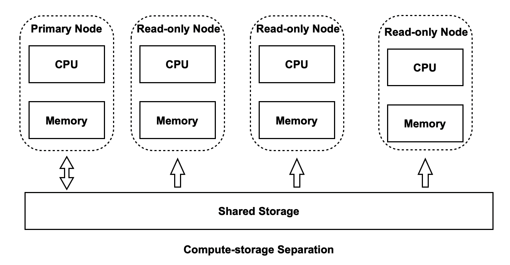

PolarDB supports compute-storage separation. Each PolarDB cluster consists of a computing cluster and a storage cluster. You can flexibly scale out the computing cluster or the storage cluster based on your business requirements.

1. If the computing power is insufficient, you can scale out only the computing cluster.
2. If the storage capacity is insufficient, you can scale out only the storage cluster.

After the shared-storage architecture is used in PolarDB, the primary node and the read-only nodes share the same physical storage. If the primary node still uses the method that is used in conventional database systems to flush write-ahead logging (WAL) records, the following issues may occur.

1. The pages that the read-only nodes read from the shared storage are outdated pages. Outdated pages are pages that are of earlier versions than the versions that are recorded on the read-only nodes.
2. The pages that the read-only nodes read from the shared storage are future pages. Future pages are pages that are of later versions than the versions that are recorded on the read-only nodes.
3. When your workloads are switched over from the primary node to a read-only node, the pages that the read-only node reads from the shared storage are outdated pages. In this case, the read-only node needs to read and apply WAL records to restore dirty pages.

To resolve the first issue, PolarDB must support multiple versions for each page. To resolve the second issue, PolarDB must control the speed at which the primary node flushes WAL records.

### HTAP

When read/write splitting is enabled, each individual compute node cannot fully utilize the high I/O throughput that is provided by the shared storage. In addition, you cannot accelerate large queries by adding computing resources. To resolve these issues, PolarDB uses the shared storage-based MPP architecture to accelerate OLAP queries in OLTP scenarios.

PolarDB supports a complete suite of data types that are used in OLTP scenarios. PolarDB also supports two computing engines, which can process these types of data:

- Standalone execution engine: processes highly concurrent OLTP queries.
- Distributed execution engine: processes large OLAP queries.

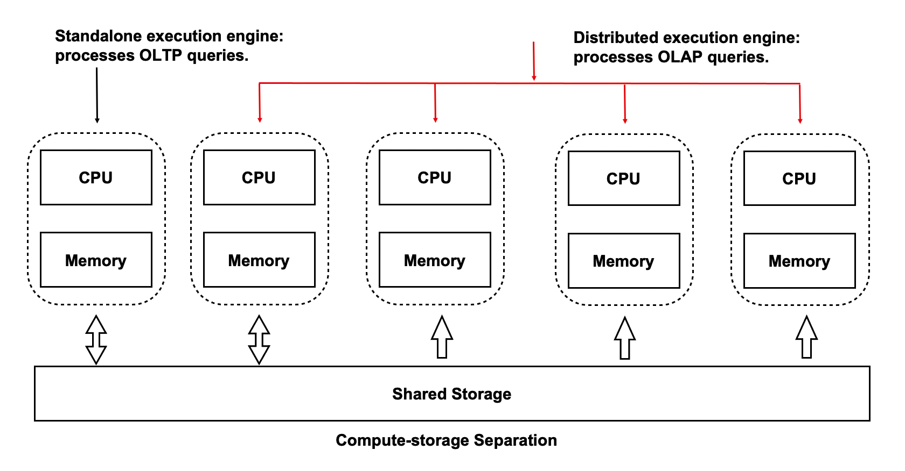

When the same hardware resources are used, PolarDB delivers performance that is 90% of the performance delivered by traditional MPP database. PolarDB also provides SQL statement-level scalability. If the computing power of your PolarDB cluster is insufficient, you can allocate more CPU resources to OLAP queries without the need to rearrange data.

The following sections provide more details about compute-storage separation and HTAP.

## PolarDB: Compute-Storage Separation

### Challenges of Shared Storage

Compute-storage separation enables the compute nodes of your PolarDB cluster to share the same physical storage. Shared storage brings the following challenges:

- Data consistency: how to ensure consistency between N copies of data in the computing cluster and 1 copy of data in the storage cluster.
- Read/write splitting: how to replicate data at a low latency.
- High availability: how to perform recovery and failover.
- I/O model: how to optimize the file system from buffered I/O to direct I/O.

### Basic Principles of Shared Storage

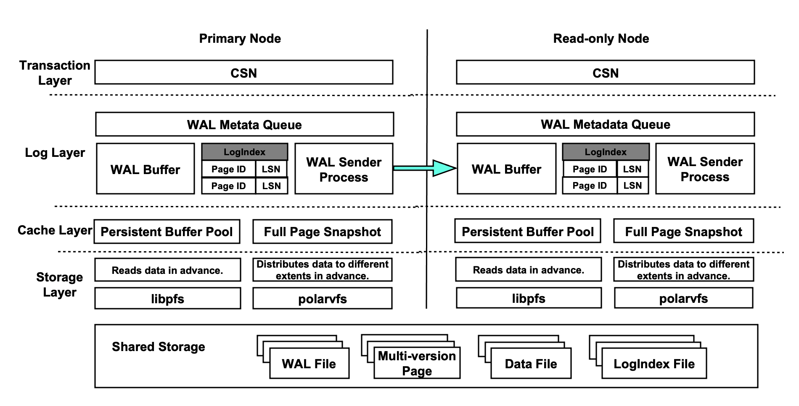

The following basic principles of shared storage apply to PolarDB:

- The primary node can process read requests and write requests. The read-only nodes can process only read requests.
- Only the primary node can write data to the shared storage. This way, the data that you query on the primary node is the same as the data that you query on the read-only nodes.
- The read-only nodes apply WAL records to ensure that the pages in the memory of the read-only nodes are synchronous with the pages in the memory of the primary node.
- The primary node writes WAL records to the shared storage, and only the metadata of the WAL records is replicated to the read-only nodes.
- The read-only nodes read WAL records from the shared storage and apply the WAL records.

### Data Consistency

#### In-memory Page Synchronization in Shared-nothing Architecture

In a conventional database system, the primary instance and read-only instances each are allocated independent memory resources and storage resources. The primary instance replicates WAL records to the read-only instances, and the read-only instances read and apply the WAL records. These basic principles also apply to replication state machines.

#### In-memory Page Synchronization in Shared-storage Architecture

In a PolarDB cluster, the primary node replicates WAL records to the shared storage. The read-only nodes read and apply the most recent WAL records from the shared storage to ensure that the pages in the memory of the read-only nodes are synchronous with the pages in the memory of the primary node.

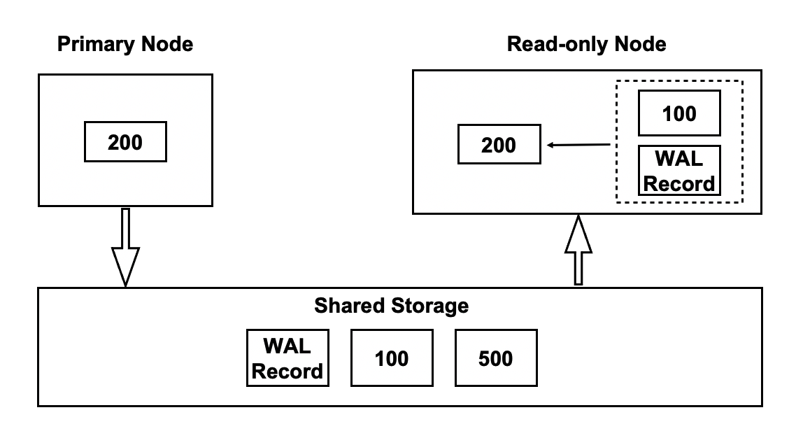

1. The primary node flushes the WAL records of a page to write version 200 of the page to the shared storage.
2. The read-only nodes read and apply the WAL records of the page to update the page from version 100 to version 200.

#### Outdated Pages in Shared-storage Architecture

In the workflow shown in the preceding figure, the new page that the read-only nodes obtain by applying WAL records is removed from the buffer pools of the read-only nodes. When you query the page on the read-only nodes, the read-only nodes read the page from the shared storage. As a result, only the previous version of the page is returned. This previous version is called an outdated page. The following figure shows more details.

1. At T1, the primary node writes a WAL record with a log sequence number (LSN) of 200 to the memory to update Page 1 from version 500 to version 600.
2. At T1, Page 1 on the read-only nodes is in version 500.
3. At T2, the primary node sends the metadata of WAL Record 200 to the read-only nodes to notify the read-only nodes of a new WAL record.
4. At T3, you query Page 1 on the read-only nodes. The read-only nodes read version 500 of Page 1 and WAL Record 200 and apply WAL Record 200 to update Page 1 from version 500 to version 600.
5. At T4, the read-only nodes remove version 600 of Page 1 because their buffer pools cannot provide sufficient space.
6. The primary node does not write version 600 of Page 1 to the shared storage. The most recent version of Page 1 in the shared storage is still version 500.
7. At T5, you query Page 1 on the read-only nodes. The read-only nodes read Page 1 from the shared storage because Page 1 has been removed from the memory of the read-only nodes. In this case, the outdated version 500 of Page 1 is returned.

#### Solution to Outdated Pages

When you query a page on the read-only nodes at a specific point in time, the read-only nodes need to read the base version of the page and the WAL records up to that point in time. Then, the read-only nodes need to apply the WAL records one by one in sequence. The following figure shows more details.

1. The metadata of the WAL records of each page is retained in the memory of the read-only nodes.
2. When you query a page on the read-only nodes, the read-only nodes need to read and apply the WAL records of the page until the read-only nodes obtain the most recent version of the page.
3. The read-only nodes read and apply WAL records from the shared storage based on the metadata of the WAL records.

PolarDB needs to maintain an inverted index that stores the mapping from each page to the WAL records of the page. However, the memory capacity of each read-only node is limited. Therefore, these inverted indexes must be persistently stored. To meet this requirement, PolarDB provides LogIndex. LogIndex is an index structure, which is used to persistently store hash data.

1. The WAL receiver processes of the read-only nodes receive the metadata of WAL records from the primary node.
2. The metadata of each WAL record contains information about which page is updated.
3. The read-only nodes insert the metadata of each WAL record into a LogIndex structure to generate a LogIndex record. The key of the LogIndex record is the ID of the page that is updated, and the value of the LogIndex record is the LSN of the WAL record.
4. One WAL record may contain information about multiple pages that are updated. This process is defined as index block split. If index blocks are split, one WAL record maps multiple LogIndex records.
5. The read-only nodes mark each updated page as outdated in their buffer pools. When you query an updated page on the read-only nodes, the read-only nodes can read and apply the WAL records of the page based on the LogIndex records that map the WAL records.
6. When the memory usage of the read-only nodes reaches a specific threshold, the hash data that is stored in LogIndex structures is asynchronously flushed from the memory to the disk.

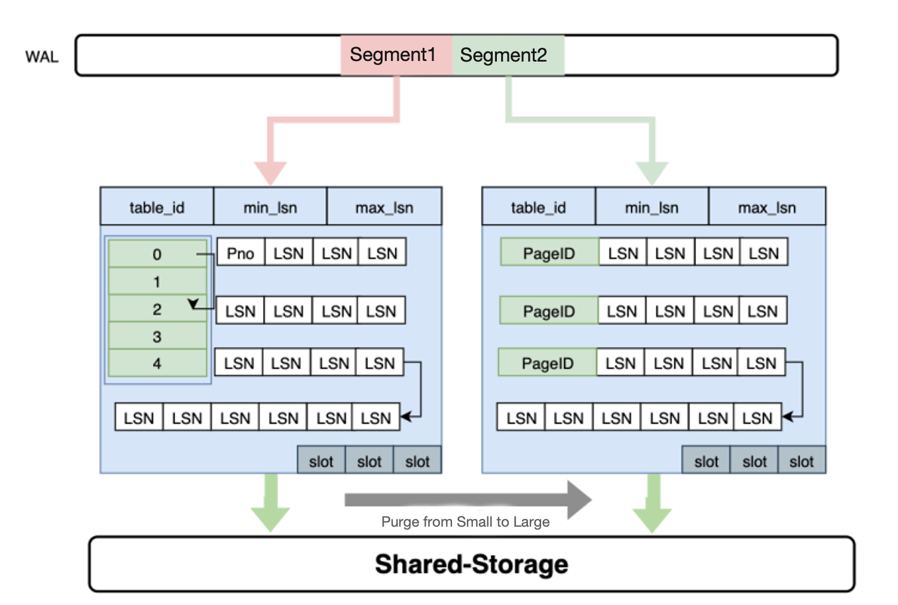

LogIndex helps prevent outdated pages and enable the read-only nodes to run in lazy log apply mode. In the lazy log apply mode, the read-only nodes apply only the metadata of the WAL records for dirty pages.

#### Future Pages in Shared-storage Architecture

The read-only nodes may return future pages, whose versions are later than the versions that are recorded on the read-only nodes. The following figure shows more details.

1. At T1, the primary node updates Page 1 twice from version 500 to version 700. Two WAL records are generated during the update process. The LSN of one WAL record is 200, and the LSN of the other WAL record is 300. At this time, Page 1 is still in version 500 on the primary node and the read-only nodes.
2. At T2, the primary node sends WAL Record 200 to the read-only nodes.
3. At T3, the read-only nodes apply WAL Record 200 to update Page 1 to version 600. At this time, the read-only nodes have not read or applied WAL Record 300.
4. At T4, the primary node writes version 700 of Page 1 to the shared storage. At the same time, Page 1 is removed from the buffer pools of the read-only nodes.
5. At T5, the read-only nodes attempt to read Page 1 again. Page 1 cannot be found in the buffer pools of the read-only nodes. Therefore, the read-only nodes obtain version 700 of Page 1 from the shared storage. Version 700 of Page 1 is a future page to the read-only nodes because the read-only nodes have not read or applied WAL Record 300.
6. If some of the pages that the read-only nodes obtain from the shared storage are future pages and some are normal pages, data inconsistencies may occur. For example, after an index block is split into two indexes that each map a page, one of the pages the read-only nodes read is a normal page and the other is a future page. In this case, the B+ tree structures of the indexes are damaged.

#### Solutions to Future Pages

The read-only nodes apply WAL records at high speeds in lazy apply mode. However, the speeds may still be lower than the speed at which the primary node flushes WAL records. If the primary node flushes WAL records faster than the read-only nodes apply WAL records, future pages are returned. To prevent future pages, PolarDB must ensure that the speed at which the primary node flushes WAL records does not exceed the speeds at which the read-only nodes apply WAL records. The following figure shows more details.

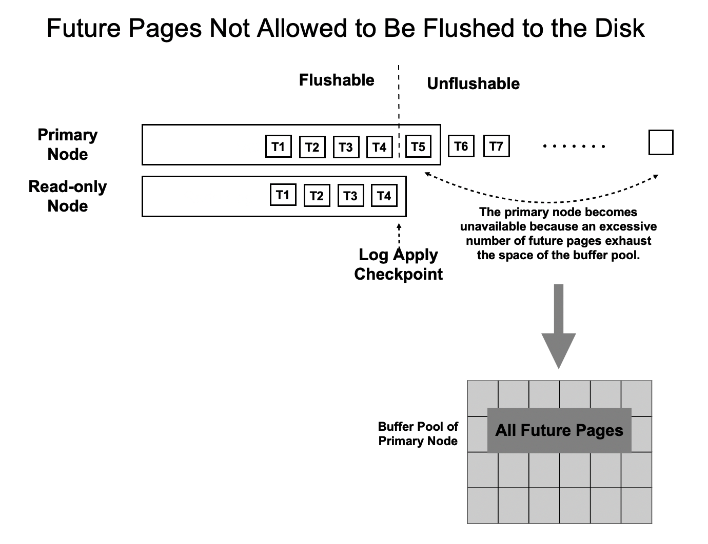

1. The read-only nodes apply the WAL record that is generated at T4.
2. When the primary node flushes WAL records to the shared storage, it sorts all WAL records by LSN and flushes only the WAL records that are updated up to T4.
3. The file position of the LSN that is generated at T4 is defined as the file position of consistency.

### Low-latency Replication

#### Issues of Conventional Streaming Replication

1. The I/O loads on the log synchronization link are heavy, and a large amount of data is transmitted over the network.
2. When the read-only nodes process I/O-bound workloads or CPU-bound workloads, they read pages and modify the pages in their buffer pools at low speeds.
3. When file- and data-related DDL operations attempt to acquire locks on specific objects, blocking exceptions may occur. As a result, the operations are run at low speeds.
4. When the read-only nodes process highly concurrent queries, transaction snapshots are taken at low speeds. The following figure shows more details.

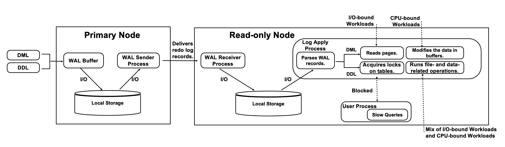

1. The primary node writes WAL records to its local file system.
2. The WAL sender process of the primary node reads and sends the WAL records to the read-only nodes.
3. The WAL receiver processes of the read-only nodes receive and write the WAL records to the local file systems of the read-only nodes.
4. The read-only nodes read the WAL records, write the updated pages to their buffer pools, and then apply the WAL records in the memory.
5. The primary node flushes the WAL records to the shared storage.

The full path is long, and the latency on the read-only nodes is high. This may cause an imbalance between the read loads and write loads over the read/write splitting link.

#### Optimization Method 1: Replicate Only the Metadata of WAL Records

The read-only nodes can read WAL records from the shared storage. Therefore, the primary node can remove the payloads of WAL records and send only the metadata of WAL records to the read-only nodes. This alleviates the pressure on network transmission and reduces the I/O loads on critical paths. The following figure shows more details.

1. Each WAL record consists of three parts: header, page ID, and payload. The header and the page ID comprise the metadata of a WAL record.
2. The primary node replicates only the metadata of WAL records to the read-only nodes.
3. The read-only nodes read WAL records from the shared storage based on the metadata of the WAL records.

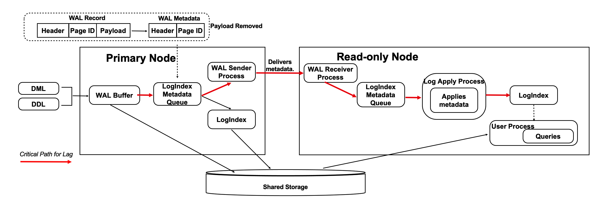

This optimization method significantly reduces the amount of data that needs to be transmitted between the primary node and the read-only nodes. The amount of data that needs to be transmitted decreases by 98%, as shown in the following figure.

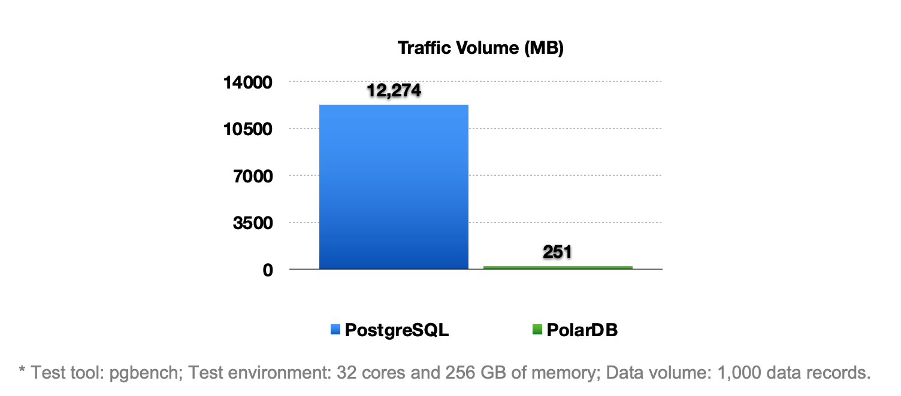

#### Optimization Method 2: Optimize the Log Apply of WAL Records

Conventional database systems need to read a large number of pages, apply WAL records to these pages one by one, and then flush the updated pages to the disk. To reduce the read I/O loads on critical paths, PolarDB supports compute-storage separation. If the page that you query on the read-only nodes cannot be hit in the buffer pools of the read-only nodes, no I/O loads are generated and only LogIndex records are recorded.

The following I/O operations that are performed by log apply processes can be offloaded to session processes:

1. Data page-related I/O operations
2. I/O operations to apply WAL records
3. I/O operations to apply multiple versions of pages based on LogIndex records

In the example shown in the following figure, when the log apply process of a read-only node applies the metadata of a WAL record of a page:

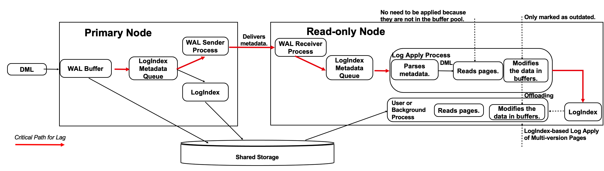

1. If the page cannot be hit in the memory, only the LogIndex record that maps the WAL record is recorded.
2. If the page can be hit in the memory, the page is marked as outdated and the LogIndex record that maps the WAL record is recorded. The log apply process is complete.
3. When you start a session process to read the page, the session process reads and writes the most recent version of the page to the buffer pool. Then, the session process applies the WAL record that maps the LogIndex record.
4. Major I/O operations are no longer run by a single log apply process. These operations are offloaded to multiple user processes.

This optimization method significantly reduces the log apply latency and increases the log apply speed by 30 times compared with Amazon Aurora.

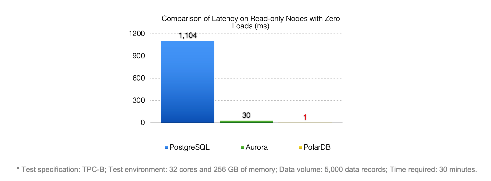

#### Optimization Method 3: Optimize the Log Apply of DDL Locks

When the primary node runs a DDL operation such as DROP TABLE to modify a table, the primary node acquires an exclusive DDL lock on the table. The exclusive DDL lock is replicated to the read-only nodes along with WAL records. The read-only nodes apply the WAL records to acquire the exclusive DDL lock on the table. This ensures that the table cannot be deleted by the primary node when a read-only node is reading the table. Only one copy of the table is stored in the shared storage.

When the applying process of a read-only node applies the exclusive DDL lock, the read-only node may require a long period of time to acquire the exclusive DDL lock on the table. You can optimize the critical path of the log apply process by offloading the task of acquiring the exclusive DDL lock to other processes.

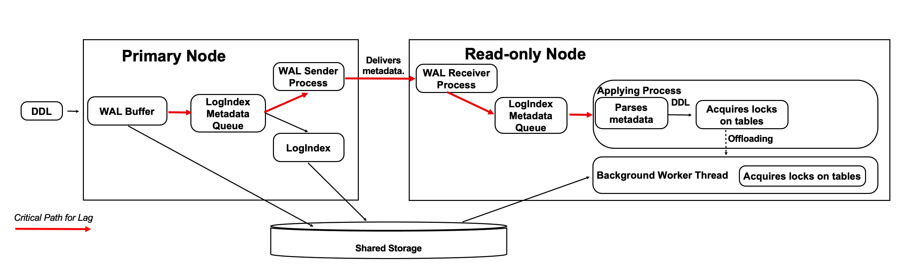

This optimization method ensures that the critical path of the log apply process of a read-only node is not blocked even if the log apply process needs to wait for the release of an exclusive DDL lock.

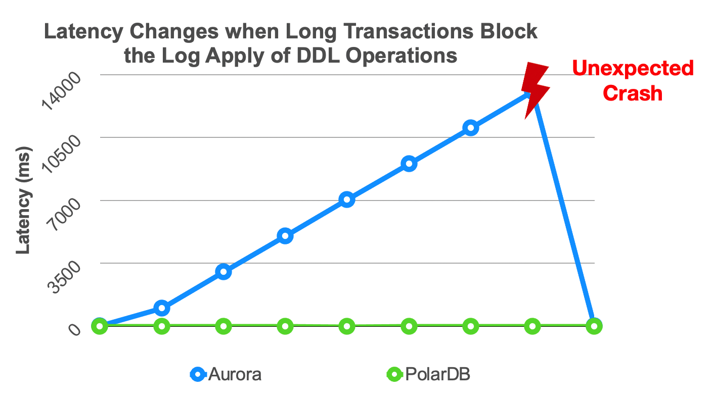

The three optimization methods in combination significantly reduce replication latency and have the following benefits:

- Read/write splitting: Loads are balanced, which allows PolarDB to deliver user experience that is comparable to Oracle Real Application Clusters (RAC).
- High availability: The time that is required for failover is reduced.
- Stability: The number of future pages is minimized, and fewer or even no page snapshots need to be taken.

### Recovery Optimization

#### Background Information

If the read-only nodes apply WAL records at low speeds, your PolarDB cluster may require a long period of time to recover from exceptions such as out of memory (OOM) errors and unexpected crashes. When the direct I/O model is used for the shared storage, the severity of this issue increases.

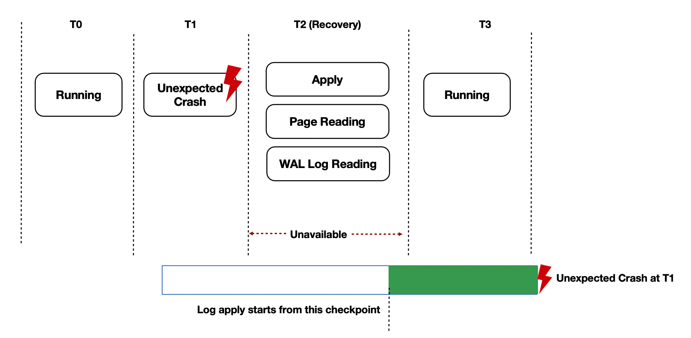

#### Lazy Recovery

The preceding sections explain how LogIndex enables the read-only nodes to apply WAL records in lazy log apply mode. In general, the recovery process of the primary node after a restart is the same as the process in which the read-only nodes apply WAL records. In this sense, the lazy log apply mode can also be used to accelerate the recovery of the primary node.

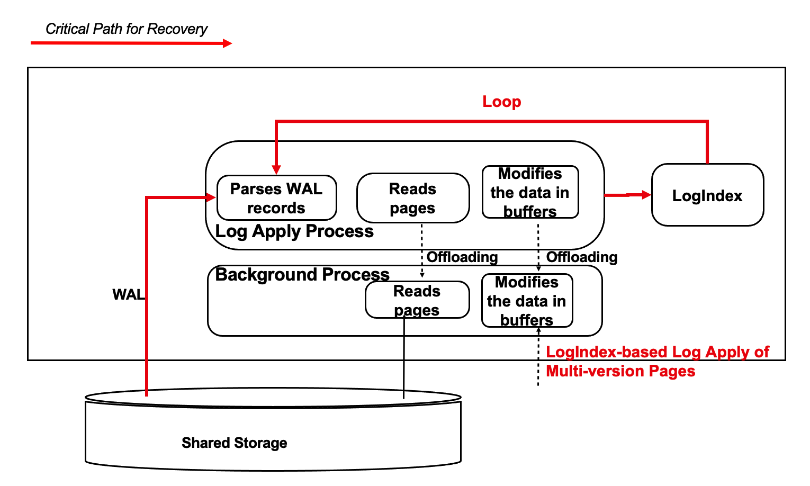

1. The primary node begins to apply WAL records in lazy log apply mode one by one starting from a specific checkpoint.
2. After the primary node applies all LogIndex records, the log apply is complete.
3. After the recovery is complete, the primary node starts to run.
4. The actual log apply workloads are offloaded to the session process that is started after the primary node restarts.

The example in the following figure shows how the optimized recovery method significantly reduces the time that is required to apply 500 MB of WAL records.

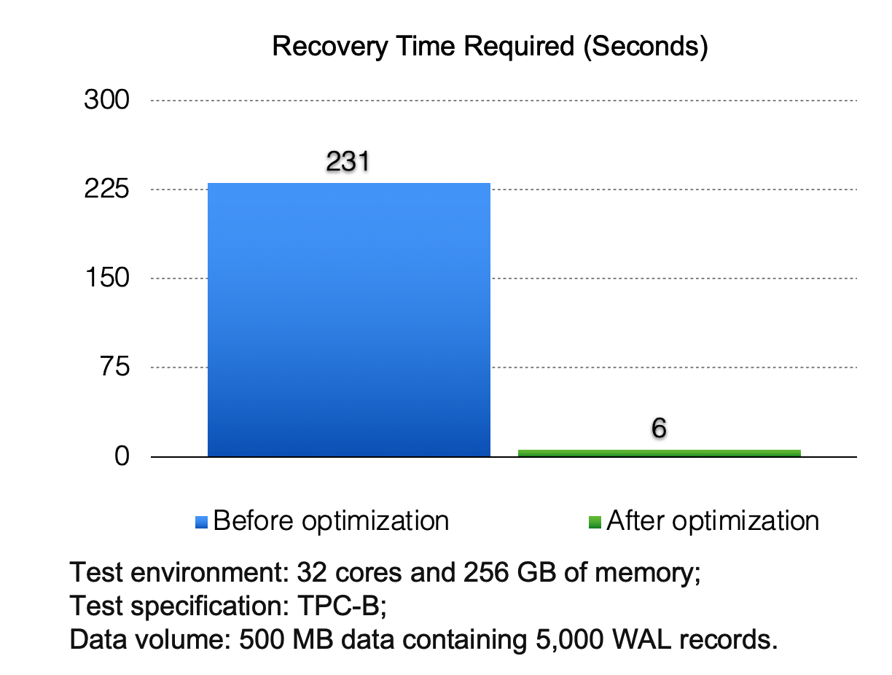

#### Persistent Buffer Pool

After the primary node recovers, a session process may need to apply the pages that the session process reads. When a session process is applying pages, the primary node responds at low speeds for a short period of time. To resolve this issue, PolarDB does not delete pages from the buffer pool of the primary node if the primary node restarts or unexpectedly crashes.

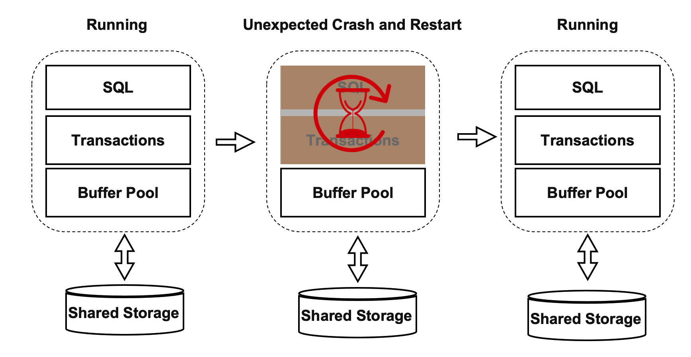

The shared memory of the database engine consists of the following two parts:

1. One part is used to store global structures and ProcArray structures.
2. The other part is used to store buffer pool structures. The buffer pool is allocated as a specific amount of named shared memory. Therefore, the buffer pool remains valid after the primary node restarts. However, global structures need to be reinitialized after the primary node restarts.

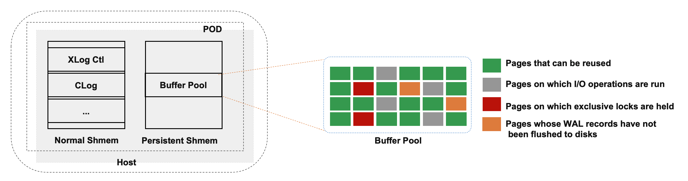

Not all pages in the buffer pool of the primary node can be reused. For example, if a process acquires an exclusive lock on a page before the primary node restarts and then unexpectedly crashes, no other processes can release the exclusive lock on the page. Therefore, after the primary node unexpectedly crashes or restarts, it needs to traverse all pages in its buffer pool to identify and remove the pages that cannot be reused. In addition, the recycling of buffer pools depends on Kubernetes.

This optimized buffer pool mechanism ensures the stable performance of your PolarDB cluster before and after a restart.

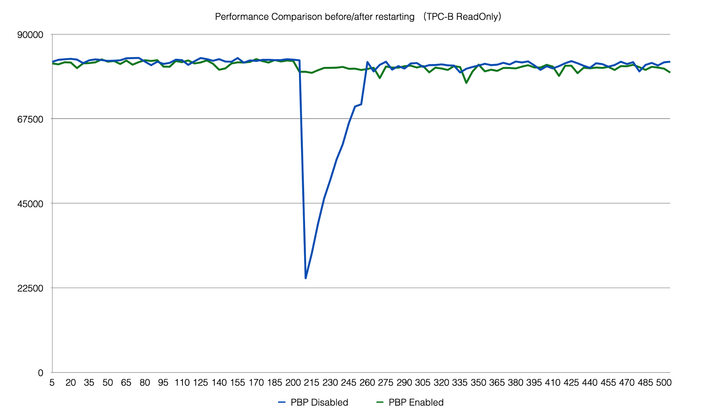

## PolarDB HTAP

The shared storage of PolarDB is organized as a storage pool. When read/write splitting is enabled, the theoretical I/O throughput that is supported by the shared storage is infinite. However, large queries can be run only on individual compute nodes, and the CPU, memory, and I/O specifications of a single compute node are limited. Therefore, a single compute node cannot fully utilize the high I/O throughput that is supported by the shared storage or accelerate large queries by acquiring more computing resources. To resolve these issues, PolarDB uses the shared storage-based MPP architecture to accelerate OLAP queries in OLTP scenarios.

### Basic Principles of HTAP

In a PolarDB cluster, the physical storage is shared among all compute nodes. Therefore, you cannot use the method of scanning tables in conventional MPP databases to scan tables in PolarDB clusters. PolarDB supports MPP on standalone execution engines and provides optimized shared storage.
This shared storage-based MPP architecture is the first architecture of its kind in the industry. We recommend that you familiarize yourself with following basic principles of this architecture before you use PolarDB:

1. The Shuffle operator masks the data distribution.
2. The ParallelScan operator masks the shared storage.

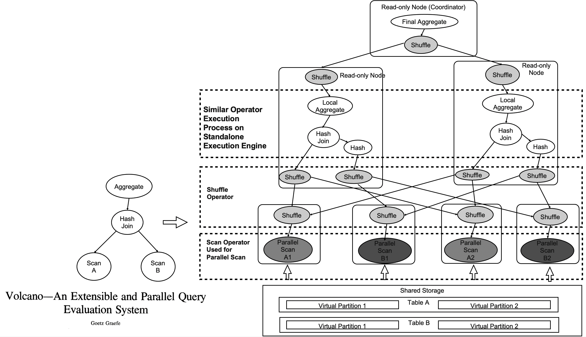

The preceding figure shows an example.

1. Table A and Table B are joined and aggregated.
2. Table A and Table B are still individual tables in the shared storage. These tables are not physically partitioned.
3. Four types of scan operators are redesigned to scan tables in the shared storage as virtual partitions.

### Distributed Optimizer

The GPORCA optmizer is extended to provide a set of transformation rules that can recognize shared storage. The GPORCA optimizer enables PolarDB to access a specific amount of planned search space. For example, PolarDB can scan a table as a whole or as different virtual partitions. This is a major difference between shared storage-based MPP and conventional MPP.

The modules in gray in the upper part of the following figure are modules of the database engine. These modules enable the database engine of PolarDB to adapt to the GPORCA optimizer.

The modules in the lower part of the following figure comprise the GPORCA optimizer. Among these modules, the modules in gray are extended modules, which enable the GPORCA optimizer to communicate with the shared storage of PolarDB.

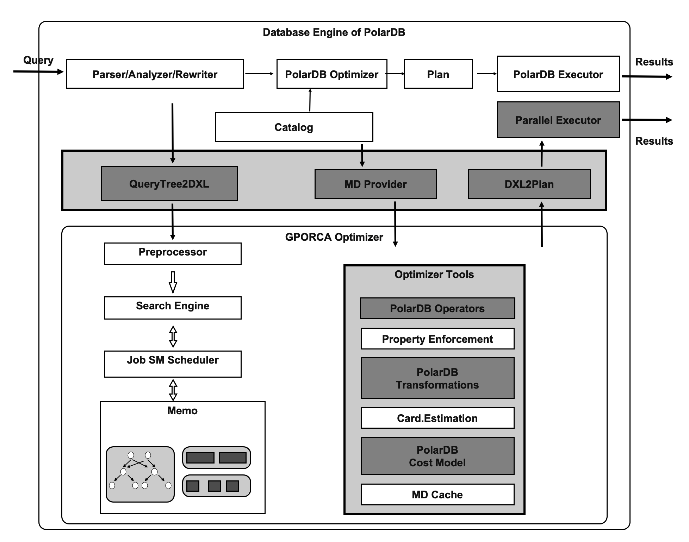

### Parallelism of Operators

Four types of operators in PolarDB require parallelism. This section describes how to enable parallelism for operators that are used to run sequential scans. To fully utilize the I/O throughput that is supported by the shared storage, PolarDB splits each table into logical units during a sequential scan. Each unit contains 4 MB of data. This way, PolarDB can distribute I/O loads to different disks, and the disks can simultaneously scan data to accelerate the sequential scan. In addition, each read-only node needs to scan only specific tables rather than all tables. The size of tables that can be cached is the total size of the buffer pools of all read-only nodes.

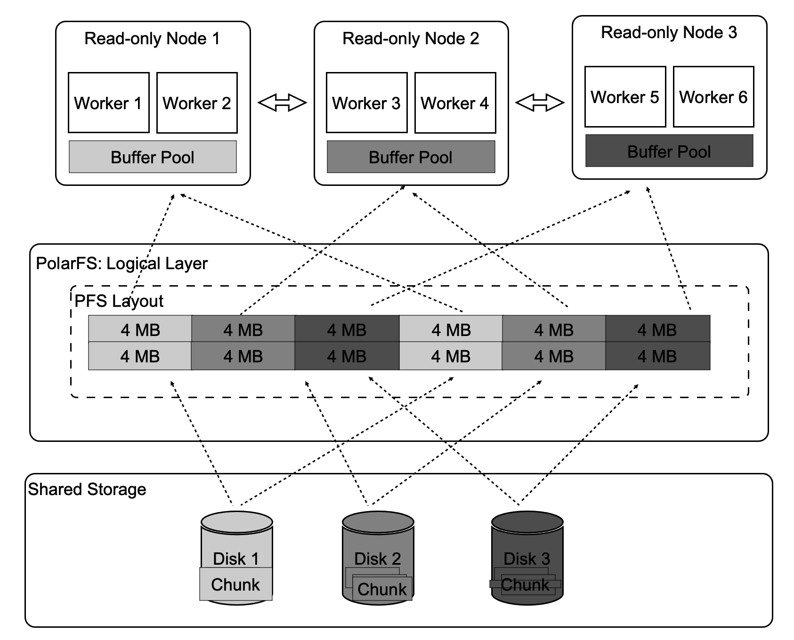

Parallelism has the following benefits, as shown in the following figure:

1. You can increase scan performance by 30 times by creating read-only nodes.
2. You can reduce the time that is required for a scan from 37 minutes to 3.75 seconds by enabling the buffering feature.

### Solve the Issue of Data Skew

Data skew is a common issue in conventional MPP:

1. In PolarDB, large objects reference TOAST tables by using heap tables. You cannot balance loads even if you shard TOAST tables or heap tables.
2. In addition, the transactions, buffer pools, network connections, and I/O loads of the read-only nodes jitter.
3. The preceding issues cause long-tail processes.

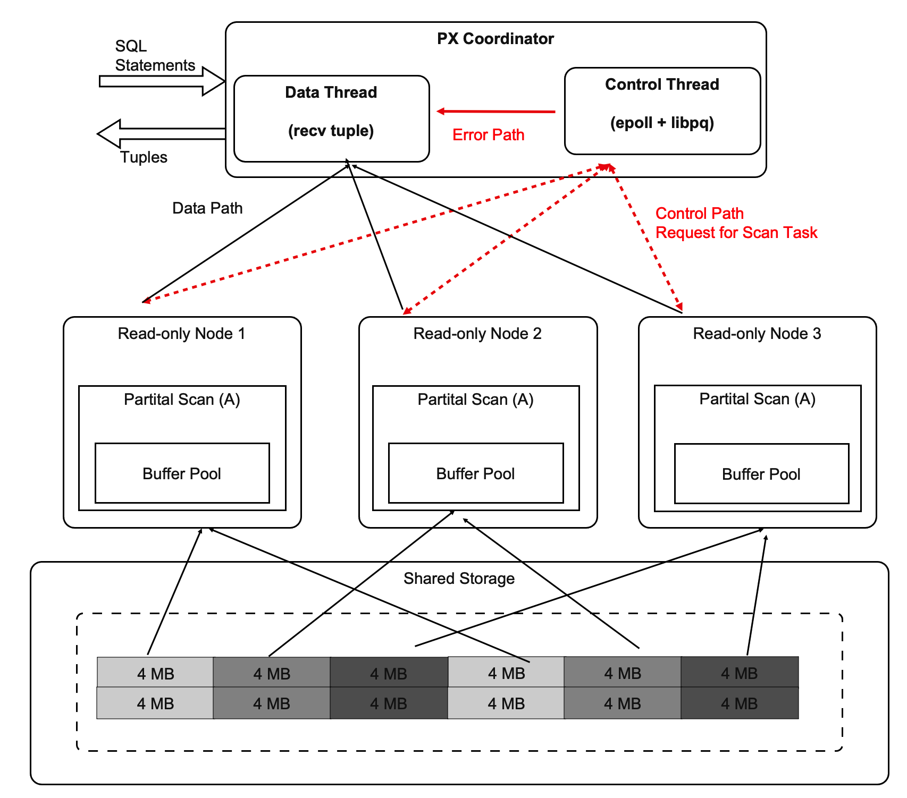

1. The coordinator node consists of two parts: DataThread and ControlThread.
2. DataThread collects and aggregates tuples.
3. ControlThread controls the scan progress of each scan operator.
4. A worker thread that scans data at a high speed can scan more logical data shards.
5. The affinity of buffers must be considered.

Although a scan task is dynamically distributed, we recommend that you maintain the affinity of buffers at your best. In addition, the context of each operator is stored in the private memory of the worker threads. The coordinator node does not store the information about specific tables.

In the example shown in the following table, PolarDB uses static sharding to shard large objects. During the static sharding process, data skew occurs, but the performance of dynamic scanning can still linearly increase.

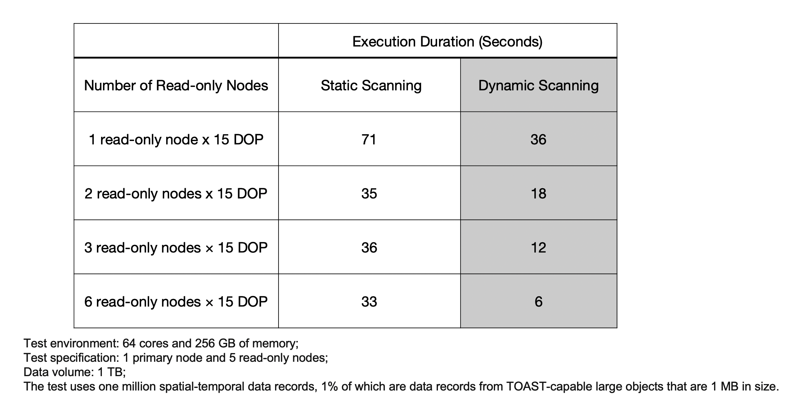

## SQL Statement-level Scalability

Data sharing helps deliver ultimate scalability in cloud-native environments. The full path of the coordinator node involves various modules, and PolarDB can store the external dependencies of these modules to the shared storage. In addition, the full path of a worker thread involves a number of operational parameters, and PolarDB can synchronize these parameters from the coordinator node over the control path. This way, the coordinator node and the worker thread are stateless.

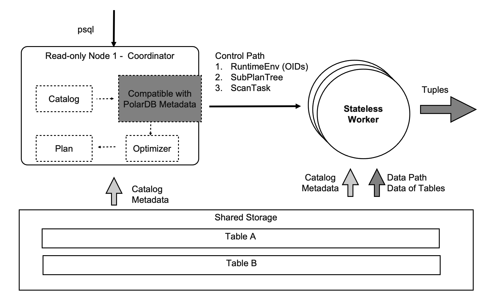

The following conclusions are made based on the preceding analysis:

1. All read-only nodes that run SQL joins can function as coordinator nodes. Therefore, the performance of PolarDB is no longer limited due to the availability of only a single coordinator node.
2. Each SQL statement can start any number of worker threads on any compute node. This increases the computing power and allows you to schedule your workloads in a more flexible manner. You can configure PolarDB to simultaneously run different kinds of workloads on different compute nodes.

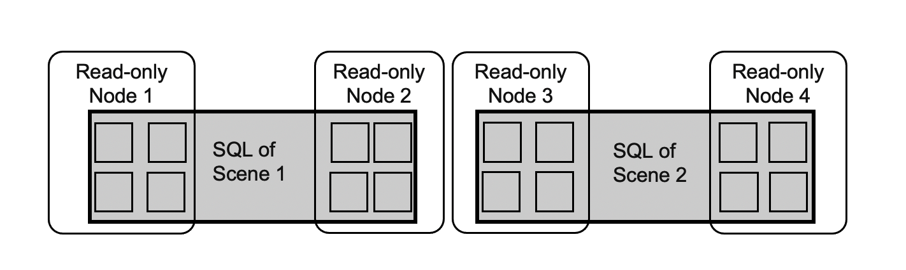

### Transactional Consistency

The log apply wait mechanism and the global snapshot mechanism are used to ensure data consistency among multiple compute nodes. The log apply wait mechanism ensures that all worker threads can obtain the most recent version of each page. The global snapshot mechanism ensures that a unified version of each page can be selected.

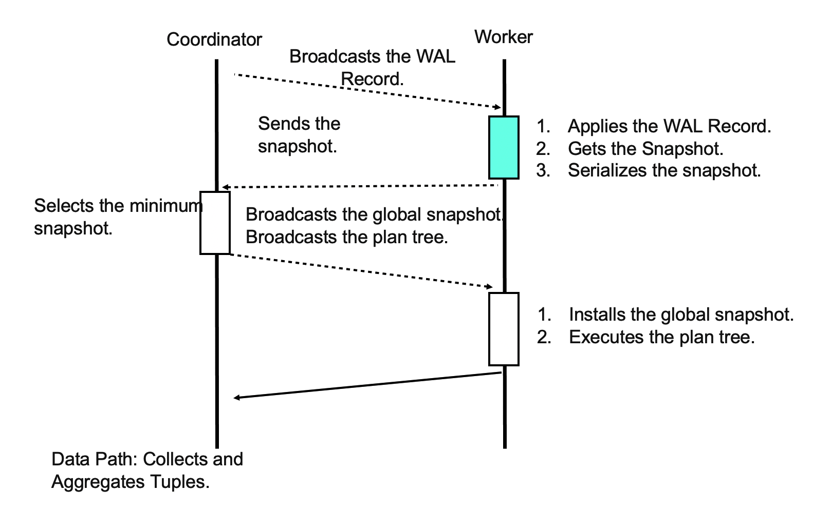

### TPC-H Performance: Speedup

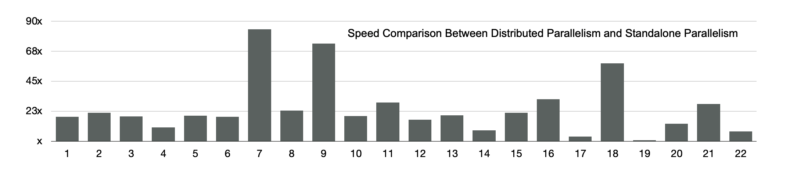

A total of 1 TB of data is used for TPC-H testing.
First, run 22 SQL statements in a PolarDB cluster and in a conventional database system. The PolarDB cluster supports distributed parallelism, and the conventional database system supports standalone parallelism. The test result shows that the PolarDB cluster executes three SQL statements at speeds that are 60 times higher and 19 statements at speeds that are 10 times higher than the conventional database system.

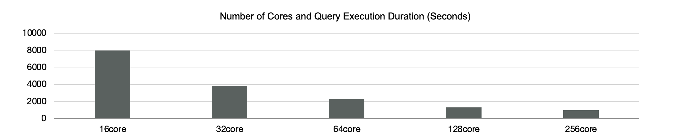

Then, run a TPC-H test by using a distributed execution engine.
The test result shows that the speed at which each of the 22 SQL statements runs linearly increases as the number of cores increases from 16 to 128.

### TPC-H Performance: Comparison with Traditional MPP Database

When 16 nodes are configured, PolarDB delivers performance that is 90% of the performance delivered by MPP-based database.

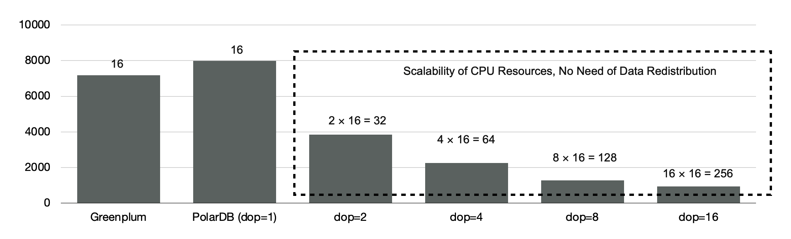

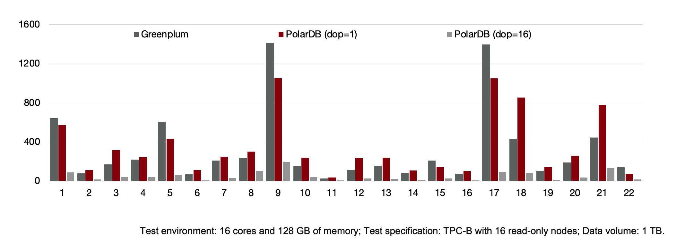

As mentioned earlier, the distributed execution engine of PolarDB supports scalability, and data in PolarDB does not need to be redistributed. When the degree of parallelism (DOP) is 8, PolarDB delivers performance that is 5.6 times the performance delivered by MPP-based database.

### Index Creation Accelerated by Distributed Execution

A large number of indexes are created in OLTP scenarios. The workloads that you run to create these indexes are divided into two parts: 80% of the workloads are run to sort and create index pages, and 20% of the workloads are run to write index pages. Distributed execution accelerates the process of sorting indexes and supports the batch writing of index pages.

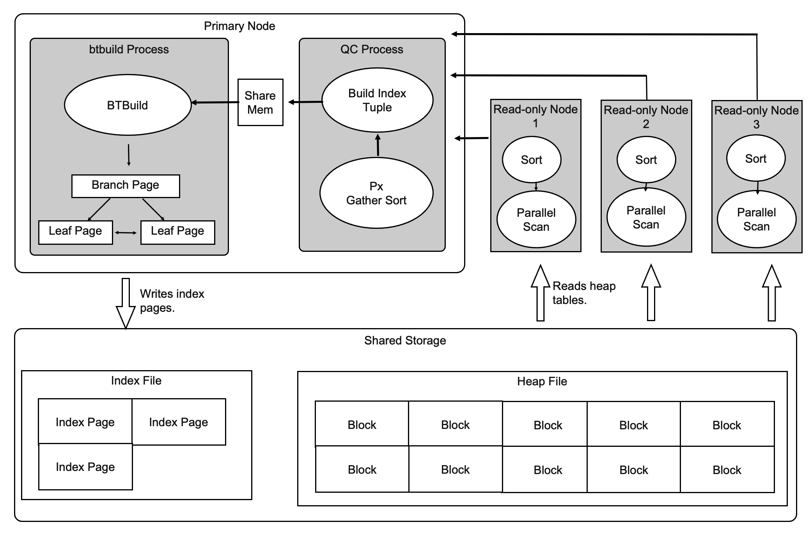
Distributed execution accelerates the creation of indexes by four to five times.

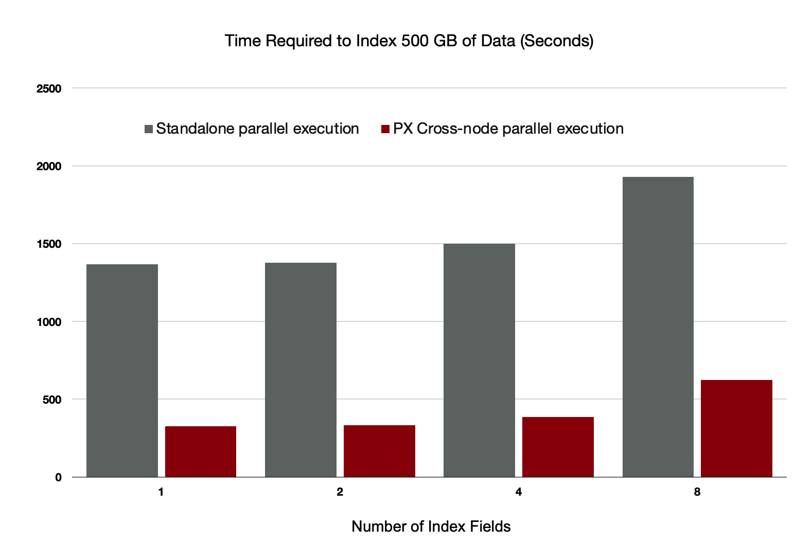

### Multi-model Spatio-temporal Database Accelerated by Distributed, Parallel Execution

PolarDB is a multi-model database service that supports spatio-temporal data. PolarDB runs CPU-bound workloads and I/O-bound workloads. These workloads can be accelerated by distributed execution. The shared storage of PolarDB supports scans on shared R-tree indexes.

- Data volume: 400 million data records, which amount to 500 GB in total
- Configuration: 5 read-only nodes, each of which provides 16 cores and 128 GB of memory
- Performance:
  - Linearly increases with the number of cores.
  - Increases by **71 times** when the number of cores increases from 16 to 80.

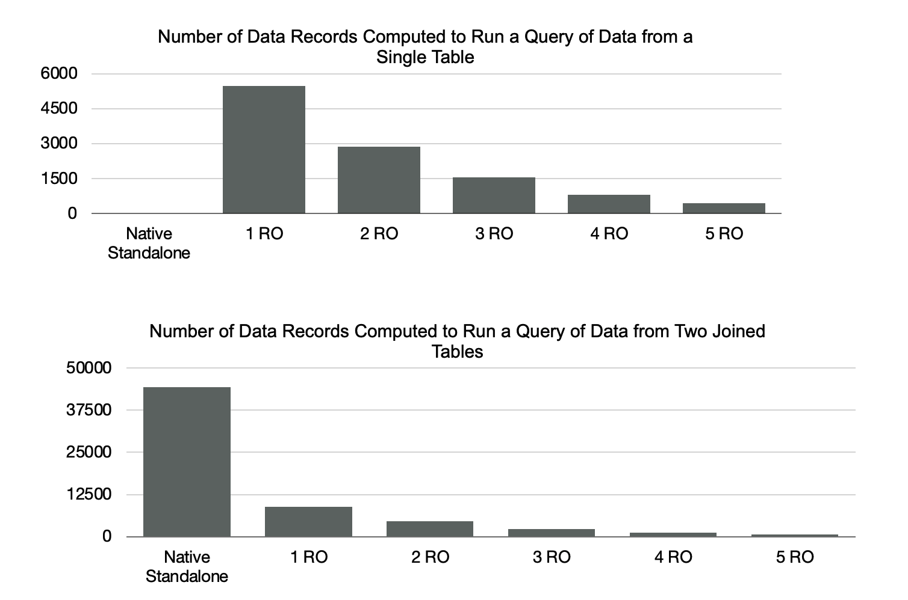

## Summary

This document describes the crucial technologies that are used in the PolarDB architecture:

- Compute-storage separation
- HTAP

More technical details about PolarDB will be discussed in other documents. For example, how the shared storage-based query optimizer runs, how LogIndex achieves high performance, how PolarDB flashes your data back to a specific point in time, how MPP can be implemented in the shared storage, and how PolarDB works with X-Paxos to ensure high availability.
