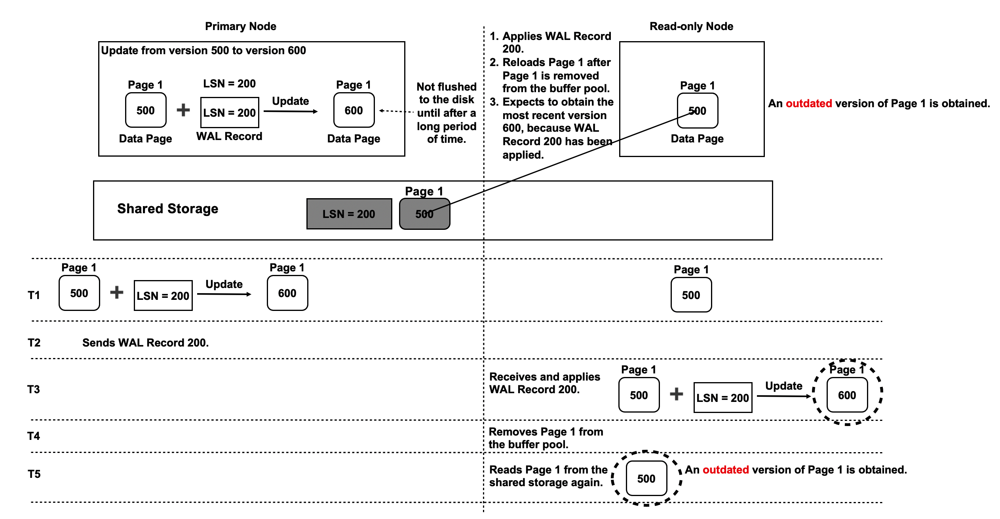
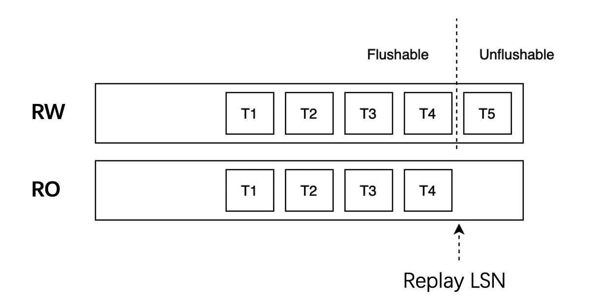
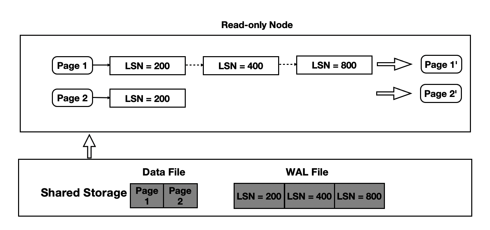
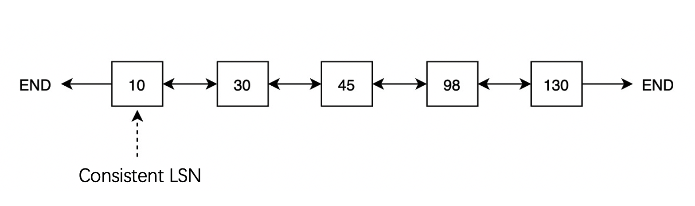

# Buffer Management

## Background Information

In a conventional database system, the primary instance and the read-only instances are each allocated a specific amount of exclusive storage space. The read-only instances can apply write-ahead logging (WAL) records and can read and write data to their own storage. A PolarDB cluster consists of a primary node and at least one read-only node. The primary node and the read-only nodes share the same physical storage. The primary node can read and write data to the shared storage. The read-only nodes can read data from the shared storage by applying WAL records but cannot write data to the shared storage. The following figure shows the architecture of a PolarDB cluster.


The read-only nodes may read two types of pages from the shared storage:

- Future pages: The pages that the read-only nodes read from the shared storage incorporate changes that are made after the apply log sequence numbers (LSNs) of the pages. For example, the read-only nodes have applied all WAL records up to the WAL record with an LSN of 200 to a page, but the change described by the most recent WAL record with an LSN of 300 has been incorporated into the same page in the shared storage. These pages are called future pages.

  

- Outdated pages: The pages that the read-only nodes read from the shared storage do not incorporate changes that are made before the apply LSNs of the pages. For example, the read-only nodes have applied all WAL records up to the most recent WAL record with an LSN of 200 to a page, but the change described by a previous WAL record with an LSN of 200 has not been incorporated into the same page in the shared storage. These pages are called outdated pages.

  

Each read-only node expects to read pages that incorporate only the changes made up to the apply LSNs of the pages on that read-only node. If the read-only nodes read outdated pages or future pages from the shared storage, you can take the following measures:

- To prevent outdated pages, configure the read-only nodes to apply all omitted WAL records up to the apply LSN of each page. A page may have different apply LSNs on different read-only nodes.
- To prevent future pages, configure the primary node to identify how many WAL records are applied on the read-only nodes at the time when the primary node writes data to the shared storage. This is the focus of buffer management.

Buffer management involves consistent LSNs. For a specific page, each read-only node needs to apply only the WAL records that are generated between the consistent LSN and the apply LSN. This reduces the time that is required to apply WAL records on the read-only nodes.

## Terms

- Buffer Pool: A buffer pool is an amount of memory that is used to store frequently accessed data. In most cases, data is cached in the buffer pool as pages. In a PolarDB cluster, each compute node has its own buffer pool.
- LSN: Each LSN is the unique identifier of a WAL record. LSNs globally increment.
- Apply LSN: The apply LSN of a page on a read-only node marks the most recent WAL record that is applied on the read-only node for the page. Also called Replay LSN.
- Oldest Apply LSN: The oldest apply LSN of a page is the smallest apply LSN among the apply LSNs of the page on all the read-only nodes.

## Flushing Control

PolarDB provides a flushing control mechanism to prevent the read-only nodes from reading future pages from the shared storage. Before the primary node writes a page to the shared storage, the primary node checks whether all the read-only nodes have applied the most recent WAL record of the page.



The pages in the buffer pool of the primary node are divided into the following two types based on whether the pages incorporate the changes that are made after the apply LSNs of the pages: pages that can be flushed to the shared storage and pages that cannot be flushed to the shared storage. This categorization is based on the following LSNs:

- Latest LSN: The latest LSN of a page on a read-only node marks the most recent WAL record that is applied on the read-only node for the page.
- Oldest apply LSN: The oldest apply LSN of a page is the smallest apply LSN among the apply LSNs of the page on all the read-only nodes.

The primary node determines whether to flush a dirty page to the shared storage based on the following rules:

```cpp
if buffer latest lsn <= oldest apply lsn
    flush buffer
else
    do not flush buffer
```

## Consistent LSNs

To apply the WAL records of a page up to a specified LSN, each read-only node manages the mapping between the page and the LSNs of all WAL records that are generated for the page. This mapping is stored as a LogIndex. A LogIndex is used as a hash table that can be persistently stored. When a read-only node requests a page, the read-only node traverses the LogIndex of the page to obtain the LSNs of all WAL records that need to be applied. Then, the read-only node applies the WAL records in sequence to generate the most recent version of the page.



For a specific page, more changes mean more LSNs and a longer period of time required to apply WAL records. To minimize the number of WAL records that need to be applied for each page, PolarDB provides consistent LSNs.

After all changes that are made up to the consistent LSN of a page are written to the shared storage, the page is persistently stored. The primary node sends the write LSN and consistent LSN of the page to each read-only node, and each read-only node sends the apply LSN of the page and the min used LSN of the page to the primary node. The read-only nodes do not need to apply the WAL records that are generated before the consistent LSN of the page while reading it from shared storage. But the read-only nodes may still need to apply the WAL records that are generated before the consistent LSN of the page while replaying outdated page in buffer pool. Therefore, all LSNs that are smaller than the consistent LSN and the min used LSN can be removed from the LogIndex of the page. This reduces the number of WAL records that the read-only nodes need to apply. This also reduces the storage space that is occupied by LogIndex records.

### Flush Lists

PolarDB holds a specific state for each buffer in the memory. The state of a buffer in the memory is represented by the LSN that marks the first change to the buffer. This LSN is called the oldest LSN. The consistent LSN of a page is the smallest oldest LSN among the oldest LSNs of all buffers for the page.

A conventional method of obtaining the consistent LSN of a page requires the primary node to traverse the LSNs of all buffers for the page in the buffer pool. This method causes significant CPU overhead and a long traversal process. To address these issues, PolarDB uses a flush list, in which all dirty pages in the buffer pool are sorted in ascending order based on their oldest LSNs. The flush list helps you reduce the time complexity of obtaining consistent LSNs to O(1).



When a buffer is updated for the first time, the buffer is labeled as dirty. PolarDB inserts the buffer into the flush list and generates an oldest LSN for the buffer. When the buffer is flushed to the shared storage, the label is removed.

To efficiently move the consistent LSN of each page towards the head of the flush list, PolarDB runs a BGWRITER process to traverse all buffers in the flush list in chronological order and flush early buffers to the shared storage one by one. After a buffer is flushed to the shared storage, the consistent LSN is moved one position forward towards the head of the flush list. In the example shown in the preceding figure, if the buffer with an oldest LSN of 10 is flushed to the shared storage, the buffer with an oldest LSN of 30 is moved one position forward towards the head of the flush list. LSN 30 becomes the consistent LSN.

### Parallel Flushing

To further improve the efficiency of moving the consistent LSN of each page to the head of the flush list, PolarDB runs multiple BGWRITER processes to flush buffers in parallel. Each BGWRITER process reads a number of buffers from the flush list and flushes the buffers to the shared storage at a time.


## Hot Buffers

After the flushing control mechanism is introduced, PolarDB flushes only the buffers that meet specific flush conditions to the shared storage. If a buffer is frequently updated, its latest LSN may remain larger than its oldest apply LSN. As a result, the buffer can never meet the flush conditions. This type of buffer is called hot buffers. If a page has hot buffers, the consistent LSN of the page cannot be moved towards the head of the flush list. To resolve this issue, PolarDB provides a copy buffering mechanism.

The copy buffering mechanism allows PolarDB to copy buffers that do not meet the flush conditions to a copy buffer pool. Buffers in the copy buffer pool and their latest LSNs are no longer updated. As the oldest apply LSN moves towards the head of the flush list, these buffers start to meet the flush conditions. When these buffers meet the flush conditions, PolarDB can flush them from the copy buffer pool to the shared storage.

The following flush rules apply:

1. If a buffer does not meet the flush conditions, PolarDB checks the number of recent changes to the buffer and the time difference between the most recent change and the latest LSN. If the number and the time difference exceed their predefined thresholds, PolarDB copies the buffer to the copy buffer pool.
1. When a buffer is updated again, PolarDB checks whether the buffer meets the flush conditions. If the buffer meets the flush conditions, PolarDB flushes the buffer to the shared storage and deletes the copy of the buffer from the copy buffer pool.
1. If a buffer does not meet the flush conditions, PolarDB checks whether a copy of the buffer can be found in the copy buffer pool. If a copy of the buffer can be found in the copy buffer pool and the copy meets the flush conditions, PolarDB flushes the copy to the shared storage.
1. After a buffer that is copied to the copy buffer pool is updated, PolarDB regenerates an oldest LSN for the buffer and moves the buffer to the tail of the flush list.

In the example shown in the following figure, the buffer with an oldest LSN of 30 and a latest LSN of 500 is considered a hot buffer. The buffer is updated after it is copied to the copy buffer pool. If the change is marked by LSN 600, PolarDB changes the oldest LSN of the buffer to 600 and moves the buffer to the tail of the flush list. At this time, the copy of the buffer is no longer updated, and the latest LSN of the copy remains 500. When the copy meets the flush conditions, PolarDB flushes the copy to the shared storage.


After the copy buffering mechanism is introduced, PolarDB uses a different method to calculate the consistent LSN of each page. For a specific page, the oldest LSN in the flush list is no longer the smallest oldest LSN because the oldest LSN in the copy buffer pool can be smaller. Therefore, PolarDB needs to compare the oldest LSN in the flush list with the oldest LSN in the copy buffer pool. The smaller oldest LSN is considered the consistent LSN.

## Lazy Checkpointing

PolarDB supports consistent LSNs, which are similar to checkpoints. All changes that are made to a page before the checkpoint LSN of the page are flushed to the shared storage. If a recovery operation is run, PolarDB starts to recover the page from the checkpoint LSN. This improves recovery efficiency. If regular checkpoint LSNs are used, PolarDB flushes all dirty pages in the buffer pool and other in-memory pages to the shared storage. This process may require a long period of time and high I/O throughput. As a result, normal queries may be affected.

Consistent LSNs empower PolarDB to implement lazy checkpointing. If the lazy checkpointing mechanism is used, PolarDB does not flush all dirty pages in the buffer pool to the shared storage. Instead, PolarDB uses consistent LSNs as checkpoint LSNs. This significantly increases checkpointing efficiency.

The underlying logic of the lazy checkpointing mechanism allows PolarDB to run BGWRITER processes that continuously flush dirty pages and maintain consistent LSNs. The lazy checkpointing mechanism cannot be used with the full page write feature. If you enable the full page write feature, the lazy checkpointing mechanism is automatically disabled.
