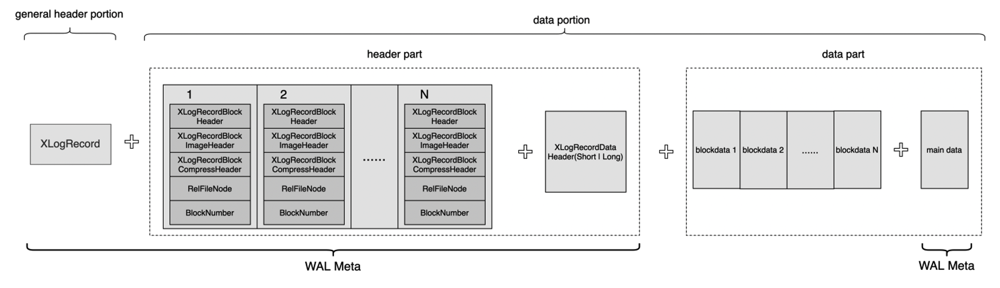
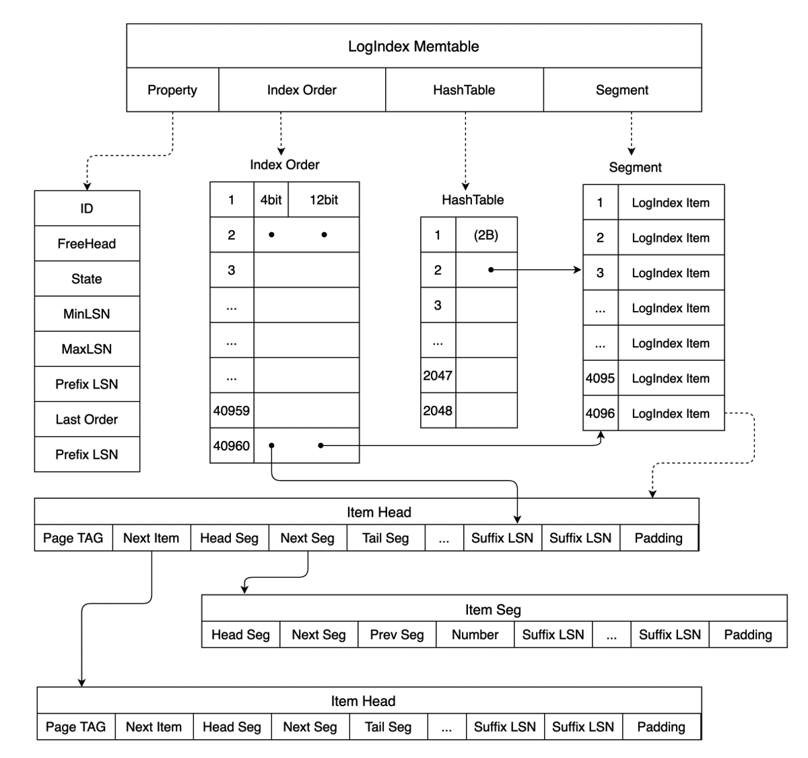
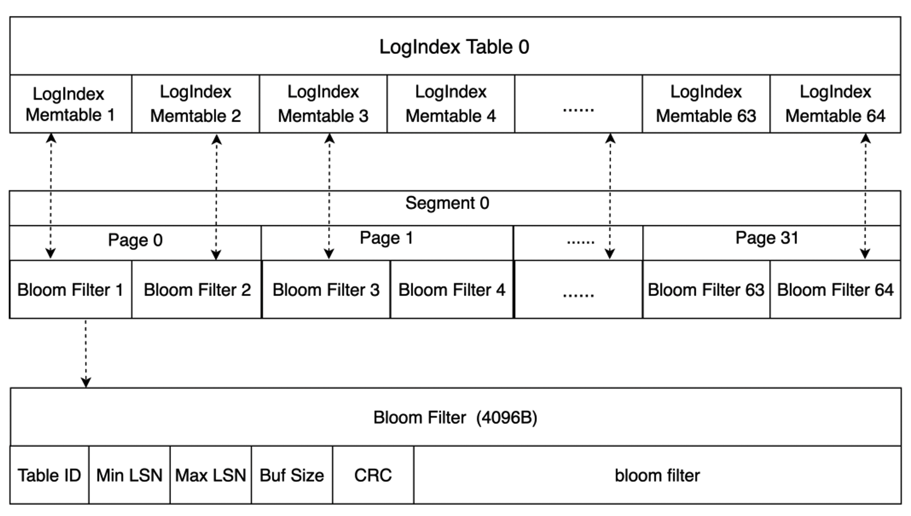
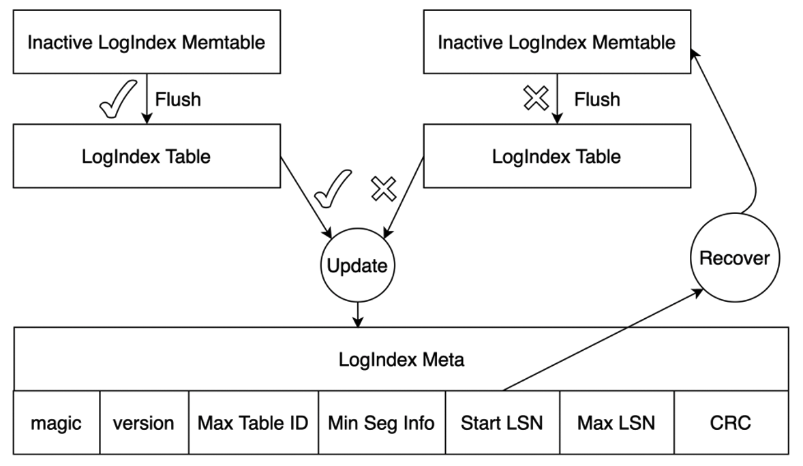
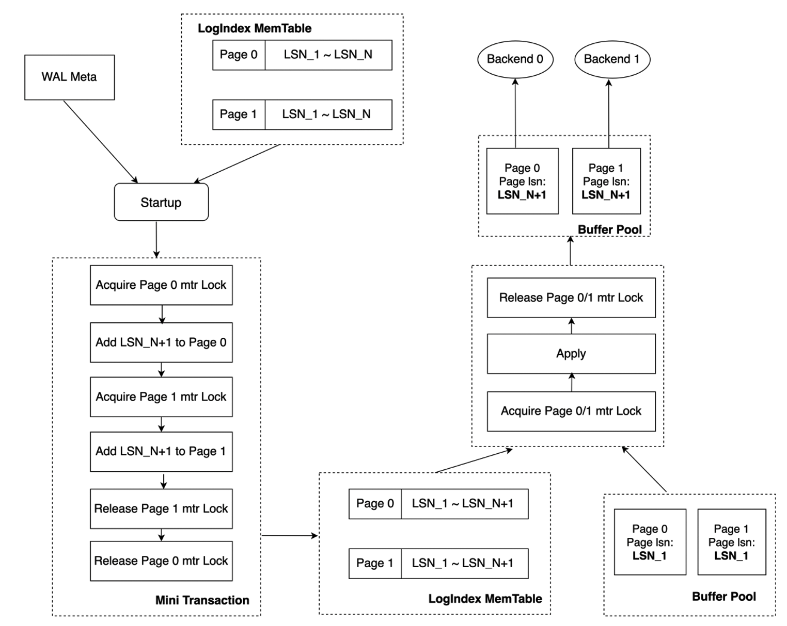

# LogIndex

## Background Information

PolarDB uses a shared storage architecture. Each PolarDB cluster consists of a primary node and multiple read-only nodes. The primary node can share data in the shared storage. The primary node can read data from the shared storage and write data to the storage. Read-only nodes can read data from the shared storage only by replaying logs. Data in the memory is synchronized from the primary node to read-only nodes. This ensures that data is consistent between the primary node and read-only nodes. Read-only nodes can also provide services to implement read/write splitting and load balancing. If the primary node becomes unavailable, a read-only node can be used as the primary node. This ensures the high availability of the cluster. The following figure shows the architecture of PolarDB.

In the shared-nothing architecture, read-only nodes have independent memory and storage. These nodes need only to receive write-ahead logging (WAL) logs from the primary node and replay the WAL logs. If the data that needs to be replayed is not in buffer pools, the data must be read from storage files and written to buffer pools for replay. This can cause cache misses. More data is evicted from buffer pools because the data is replayed in a continuous manner. The following figure shows more details.

Multiple transactions on the primary node can be executed in parallel. Read-only nodes must replay WAL logs in the sequence in which the WAL logs are generated. As a result, read-only nodes replay WAL logs at a low speed and the latency between the primary node and read-only nodes increases.

If a PolarDB cluster uses a shared storage architecture and consists of one primary node and multiple read-only nodes, the read-only nodes can obtain WAL logs that need to be replayed from the shared storage. If data pages on the shared storage are the most recent pages, read-only nodes can read the data pages without replaying the pages. PolarDB provides LogIndex that can be used on read-only nodes to replay WAL logs at a higher speed.

## Memory Synchronization Architecture for RO

LogIndex stores the mapping between a data page and all the log sequence numbers (LSNs) of updates on the page. LogIndex can be used to rapidly obtain all LSNs of updates on a data page. This way, the WAL logs generated for the data page can be replayed when the data page is read. The following figure shows the architecture that is used to synchronize data from the primary node to read-only nodes.

Compared with the shared-nothing architecture, the workflow of the primary node and read-only nodes in the shared storage architecture has the following differences:

- Complete WAL logs are not replicated from the primary node to read-only nodes. Only WAL log metadata is replicated to the read-only nodes. This reduces the amount of data transmitted on the network and the latency between the primary node and read-only nodes.
- The primary node generates LogIndex records based on WAL log metadata and writes the records to the LogIndex Memory Table. After the LogIndex Memory Table is full, data in the table is flushed to the disk and stored in the LogIndex Table of the shared storage. The LogIndex Memory Table can be reused.
- The primary node uses the LogIndex metadata file to ensure the atomicity of I/O operations on the LogIndex Memory Table. After data in the Memory Table is flushed to the disk, the LogIndex metadata file is updated. When the data is being flushed to the disk, bloom data is generated. Bloom data can be used to check whether a specific page exists in a LogIndex Table. This way, the LogIndex Tables that are skipped during scans can be skipped. This improves efficiency.
- Read-only nodes receive WAL log metadata from the primary node. Then, the read-only nodes generate LogIndex records in the memory based on WAL log metadata and write the records to the LogIndex Memory Table stored in the memory of read-only nodes. The pages that correspond to WAL log metadata in buffer pools are marked as outdated pages. In this process, the read-only nodes do not replay logs or perform I/O operations on data. No cost is required for cache misses.
- After read-only nodes generate LogIndex records based on WAL log metadata, WAL logs generated for the next LSN are replayed. On the read-only nodes, the backend processes that access a page and the background replay processes replay the logs. In this case, the read-only nodes can replay the WAL logs in parallel.
- Data in the LogIndex Memory Table generated by read-only nodes is not flushed to the disk. The read-only nodes use the LogIndex metadata file to determine whether data in the full LogIndex Memory Table is flushed to the disk on the primary node. If data in the LogIndex Memory Table is flushed to the disk, the data can be reused. When the primary node determines that the LogIndex Table in the storage is no longer used, the LogIndex Table can be truncated.

PolarDB reduces the latency between the primary node and read-only nodes by replicating only WAL log metadata. PolarDB uses LogIndex to delay the replay of WAL logs and replay WAL logs in parallel. This can increase the speed at which read-only nodes replay WAL logs.

## WAL Meta

WAL logs are also called XLogRecord. Each XLogRecord consists of two parts, as shown in the following figure.

- General header portion: This portion is the schema of the XLogRecord. The length of this portion is fixed. This portion stores the general information about the XLogRecord, such as the length, transaction ID, and the type of the resource manager of the XLogRecord.
- Data portion: This portion is divided into two parts: header and data. The header part contains 0 to N XLogRecordBlockHeader schemas and 0 to 1 XLogRecordDataHeader[Short|Long] schema. The data part contains block data and main data. Each XLogRecordBlockHeader structure corresponds to block data of the data part. The XLogRecordDataHeader[Short|Long] schema corresponds to main data of the data part.

In shared storage mode, complete WAL logs do not need to be replicated from the primary node to read-only nodes. Only WAL log metadata is replicated to the read-only nodes. WAL log metadata consists of the general header portion, header part, and main data, as shown in the preceding figure. Read-only nodes can read complete WAL log content from the shared storage based on WAL log metadata. The following figure shows the process of replicating WAL log metadata from the primary node to read-only nodes.

1. When a transaction on the primary node modifies data on this node, the WAL logs are generated for the modification and the metadata of the WAL logs is replicated to the metadata queue of WAL logs in the memory.
1. In synchronous streaming replication mode, before the transaction is committed, WAL logs in the WAL buffer are flushed to the disk and then the WalSender process is woken up.
1. If the WalSender process finds new WAL logs that can be sent, the process reads the metadata of the logs from the metadata queue of WAL logs. After the metadata is read, the process sends the metadata to read-only nodes over the streaming replication connection that is established.
1. After the WalReceiver processes on read-only nodes receive the metadata, the processes push the metadata to the metadata queue of WAL logs in the memory and notify the startup processes of the new metadata.
1. The startup processes read the metadata from the metadata queue of WAL logs and parse the metadata into a LogIndex Memtable.

In streaming replication mode, payloads are not replicated from the primary node to read-only nodes. This reduces the amount of data transmitted on the network. The WalSender process on the primary node obtains the metadata of WAL logs from the metadata queue stored in the memory. After the WalReceiver process on the read-only nodes receives the metadata, the process stores the metadata in the metadata queue of WAL logs in the memory. The disk I/O in streaming replication mode is lower than that in primary/secondary mode. This increases the speed at which logs are transmitted and reduces the latency between the primary node and read-only nodes.

## LogIndex

### Memory data structure

LogIndex is a HashTable structure. The key of this structure is PageTag. A PageTag can identify a specific data page . In this case, the values of this structure are all LSNs generated for updates on the page. The following figure shows the memory data structure of LogIndex. A LogIndex Memtable contains Memtable ID values, maximum and minimum LSNs, and the following arrays:

- HashTable: The HashTable array records the mapping between a page and the LSN list for updates on the page. Each member of the HashTable array points to a specific LogIndex Item in the Segment array.
- Segment: Each member in the Segment array is a LogIndex Item. A LogIndex Item has two structures: Item Head and Item Seg, as shown in the following figure. Item Head is the head of the LSN linked list for a page. Item Seg is the subsequent node of the LSN linked list. PageTag in Item Head is used to record the metadata of a single Page. In Item Head, Next Seg points to the subsequent node and Tail Seg points to the tail node. Item Seg stores pointers that point to the previous node Prev Seg and the subsequent node Next Seg. A complete LSN can consist of a Suffix LSN stored in Item Head and Item Seg and a Prefix LSN stored in the LogIndex Memtable. This way, each stored Prefix LSN is unique and the storage space is not wasted. When different values of PageTag specify the same item in the HashTable array based on the calculated result, Next Item in Item Head points to the next page where the hash value is the same as that of the page. This way, the hash collision is resolved.
- Index Order: The Index Order array records the order in which LogIndex records are added to a LogIndex Memtable. Each member in the array occupies 2 bytes. The last 12 bits of each member correspond to a subscript of the Segment array and point to a specific LogIndex Item. The first four bits correspond to a subscript of the Suffix LSN array in the LogIndex Item and point to a specific Suffix LSN. The Index Order array can be used to obtain all LSNs that are inserted into a LogIndex Memtable and obtain the mapping between an LSN and all modified pages for which the LSN is generated.

LogIndex Memtables stored in the memory are divided into two categories: Active LogIndex Memtables and Inactive LogIndex Memtables. The LogIndex records generated based on WAL log metadata are written to an Active LogIndex Memtable. After the Active LogIndex Memtable is full, the table is converted to an Inactive LogIndex Memtable and the system generates another Active LogIndex Memtable. The data in the Inactive LogIndex Memtable can be flushed to the disk. Then, the Inactive LogIndex Memtable can be converted to an Active LogIndex Memtable again. The following figure shows more details.

### Data Structure on Disk

The disk stores a large number of LogIndex Tables. The structure of a LogIndex Table is similar to the structure of a LogIndex Memtable. A LogIndex Table can contain a maximum of 64 LogIndex Memtables. When data in Inactive LogIndex Memtables is flushed to the disk, Bloom filters are generated for the Memtables. The size of a single Bloom filter is 4,096 bytes. A Bloom filter records the information about an Inactive LogIndex Memtable, such as the mapped values that the bit array of the Bloom filter stores for all pages in the Inactive LogIndex Memtable, the minimum LSN, and the maximum LSN. The following figure shows more details. A Bloom filter can be used to determine whether a page exists in the LogIndex Table that corresponds to the filter. This way, LogIndex Tables in which the page does not exist do not need to be scanned. This accelerates data retrieval.

After the data in an Inactive LogIndex Memtable is flushed to the disk, the LogIndex metadata file is updated. This file is used to ensure the atomicity of I/O operations on the LogIndex Memtable file. The LogIndex metadata file stores the information about the smallest LogIndex Table and the largest LogIndex Memtable on the disk. Start LSN in this file records the maximum LSN among all LogIndex Memtables whose data is flushed to the disk. If data is written to the LogIndex Memtable when the Memtable is flushed, the system parses the WAL logs from Start LSN that are recorded in the LogIndex metadata file. Then, LogIndex records that are discarded during the data write are also regenerated to ensure the atomicity of I/O operations on the Memtable.

All modified data pages recorded in WAL logs before the consistent LSN are persisted to the shared storage based on the information described in [Buffer Management](./buffer-management.md). The primary node sends the write LSN and consistent LSN to each read-only node, and each read-only node sends the apply LSN and the min used LSN to the primary node. In this case, the WAL logs whose LSNs are smaller than the consistent LSN and the min used LSN can be cleared from LogIndex Tables. This way, the primary node can truncate LogIndex Tables that are no longer used in the storage. This enables more efficient log replay for read-only nodes and reduces the space occupied by LogIndex Tables.

## Log replay

### Delayed replay

For scenarios in which LogIndex Tables are used, the startup processes of read-only nodes generate LogIndex records based on the received WAL metadata and mark the pages that correspond to the WAL metadata and exist in buffer pools as outdated pages. This way, WAL logs for the next LSN can be replayed. The startup processes do not replay WAL logs. The backend processes that access the page and the background replay processes replay the logs. The following figure shows how WAL logs are replayed.

- The background replay process replays WAL logs in the sequence of WAL logs. The process retrieves modified pages from LogIndex Memtables and LogIndex Tables based on the LSN of a page that you want to replay. If a page exists in a buffer pool, the page is replayed. Otherwise, the page is skipped. The background replay process replays WAL logs generated for the next LSN of a page in a buffer pool in the sequence of LSNs. This prevents a large number of LSNs for a single page that you want to replay from being accumulated.
- The backend process replays only the pages it must access. If the backend process must access a page that does not exist in a buffer pool, the process reads this page from the shared storage, writes the page to a buffer pool, and replays this page. If the page exists in a buffer pool and is marked as an outdated page, the process replays the most recent WAL logs of this page. The backend process retrieves the LSNs of the page from LogIndex Memtables and LogIndex Tables based on the value of PageTag. After the process retrieves the LSNs, the process generates the LSNs for the page in sequence. Then, the process reads the complete WAL logs from the shared storage based on the generated LSNs to replay the page.
- According to the above two points, we can know that both the background replay process and the backend process will use LogIndex information to apply WAL logs on some pages. Therefore, the min used LSN of current RO node is defined as the minimum LSN of WALs which being applying by the background replay process and all backend processes. The RO node sends the current min used LSN to the primary node which would use this LSN to truncate those no longer used LogIndex Tables.

The XLOG Buffer is added to cache the read WAL logs. This reduces performance overhead when WAL logs are read from the disk for replay. WAL logs are read from the WAL segment file on the disk. After the XLOG Page Buffer is added, WAL logs are preferentially read from the XLOG Buffer. If WAL logs that you want to replay are not in the XLOG Buffer, the pages of the WAL logs are read from the disk, written to the buffer, and then copied to readBuf of XLogReaderState. If the WAL logs are in the buffer, the logs are copied to readBuf of XLogReaderState. This reduces the number of I/O operations that need to be performed to replay the WAL logs to increase the speed at which the WAL logs are replayed. The following figure shows more details.

### Mini Transaction

The LogIndex mechanism is different from the shared-nothing architecture in terms of log replay. If the LogIndex mechanism is used, the startup process parses WAL metadata to generate LogIndex records and the backend process replays pages based on LogIndex records in parallel. In this case, the startup process and backend process perform the operations in parallel. The backend process replays only the pages that it must access. An XLogRecord may be used to modify multiple pages. For example, in an index block split, Page_0 and Page_1 are modified. The modification is an atomic operation. This indicates that Page_0 or Page_1 is completely modified or not modified. The service provides the mini transaction lock mechanism. This ensures that the memory data structures are consistent when the backend process replays pages.

When mini transaction locks are unavailable, the startup process parses WAL metadata and sequentially inserts the current LSN into the LSN list of each page. The following figure shows more details. The startup process completes the update of the LSN list of Page_0 but does not complete the update of the LSN list of Page_1. In this case, Backend_0 accesses Page_0 and Backend_1 accesses Page_1. Backend_0 replays Page_0 based on the LSN list of Page_0. Backend_1 replays Page_1 based on the LSN list of Page_1. The WAL log for LSN_N+1 is replayed for Page_0 and the WAL log for LSN_N is replayed for Page_1. As a result, the versions of the two pages are not consistent in the buffer pool. This causes inconsistency between the memory data structure of Page_0 and that of Page_1.

In the mini transaction lock mechanism, an update on the LSN list of Page_0 or Page_1 is a mini transaction. Before the startup process updates the LSN list of a page, the process must obtain the mini transaction lock of the page. In the following figure, the process first obtains the mini transaction lock of Page_0. The sequence of the obtained mini transaction lock is consistent with the Page_0 modification sequence in which the WAL log of this page is replayed. After the LSN lists of Page_0 and Page_1 are updated, the mini transaction lock is released. If the backend process replays a specific page based on LogIndex records and the startup process for the page is in a mini transaction, the mini transaction lock of the page must be obtained before the page is replayed. The startup process completes the update of the LSN list of Page_0 but does not complete the update of the LSN list of Page_1. Backend_0 accesses Page_0 and Backend_1 accesses Page_1. In this case, Backend_0 cannot replay Page_0 until the LSN list of this page is updated and the mini transaction lock of this page is released. Before the mini transaction lock of this page is released, the update of the LSN list of page_1 is completed. The memory data structures are modified based on the atomic operation rule.

## Summary

PolarDB provides LogIndex based on the shared storage between the primary node and read-only nodes. LogIndex accelerates the speed at which memory data is synchronized from the primary node to read-only nodes and reduces the latency between the primary node and read-only nodes. This ensures the availability of read-only nodes and makes data between the primary node and read-only nodes consistent. This topic describes LogIndex and the LogIndex-based memory synchronization architecture of read-only nodes. LogIndex can be used to synchronize memory data from the primary node to read-only nodes. LogIndex can also be used to promote a read-only node as the primary node online. If the primary node becomes unavailable, the speed at which a read-only node is promoted to the primary node can be increased. This achieves the high availability of compute nodes. In addition, services can be restored in a short period of time.
