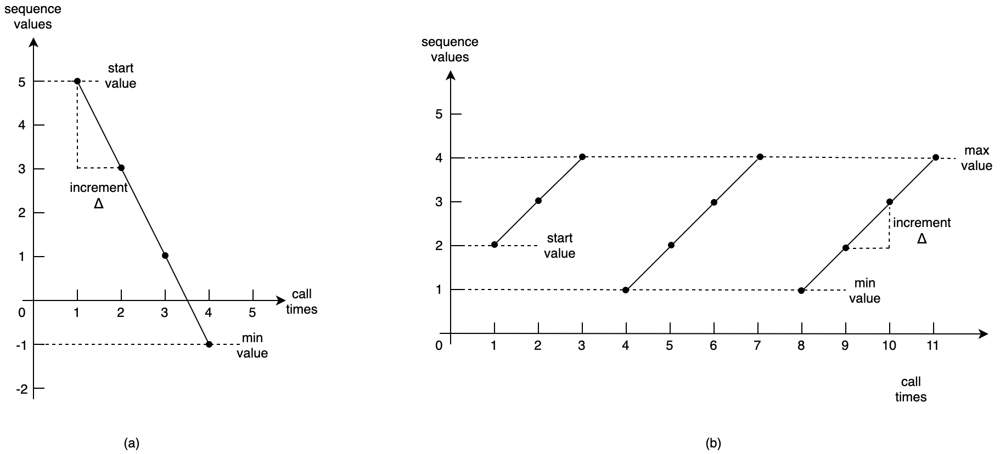
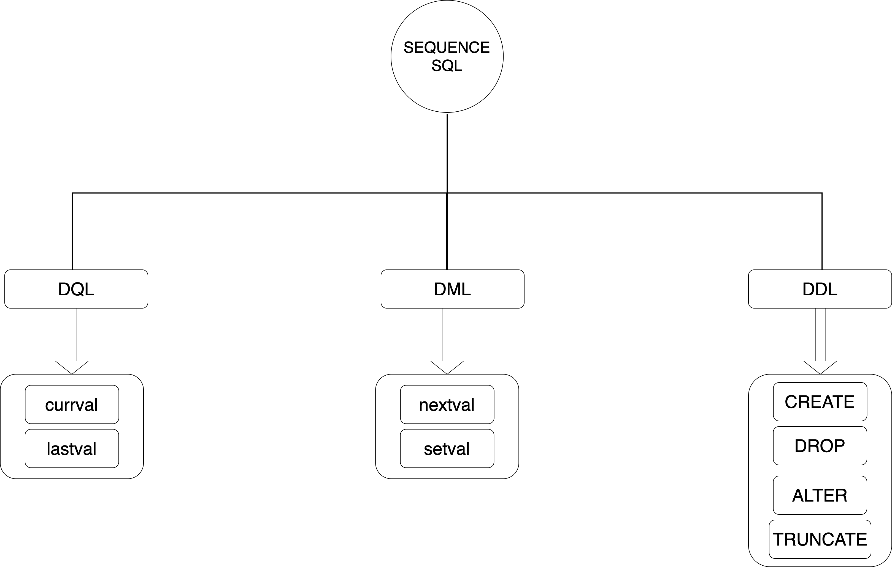
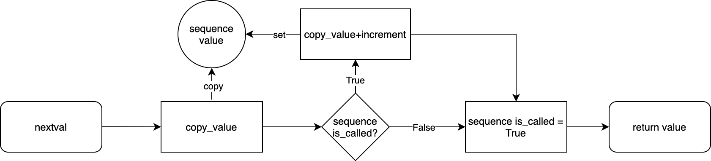
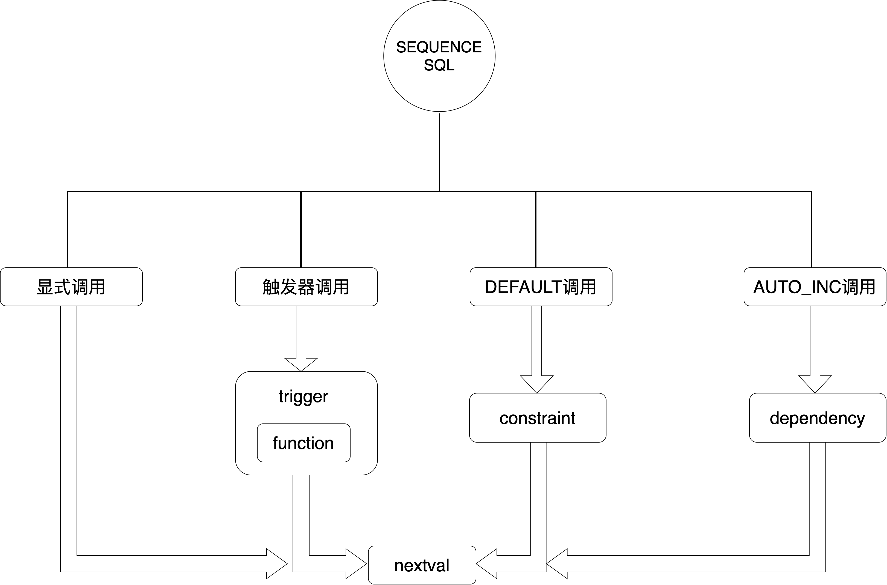
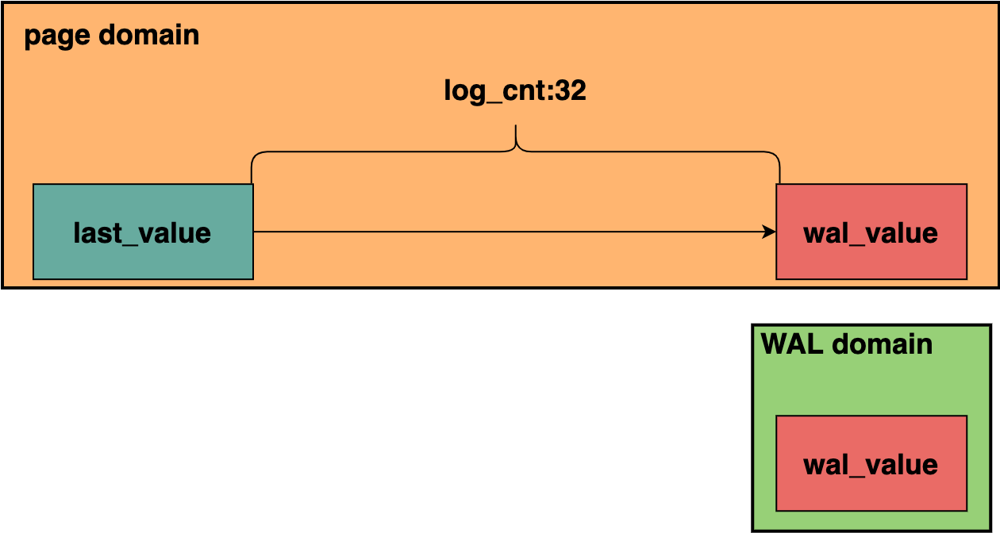
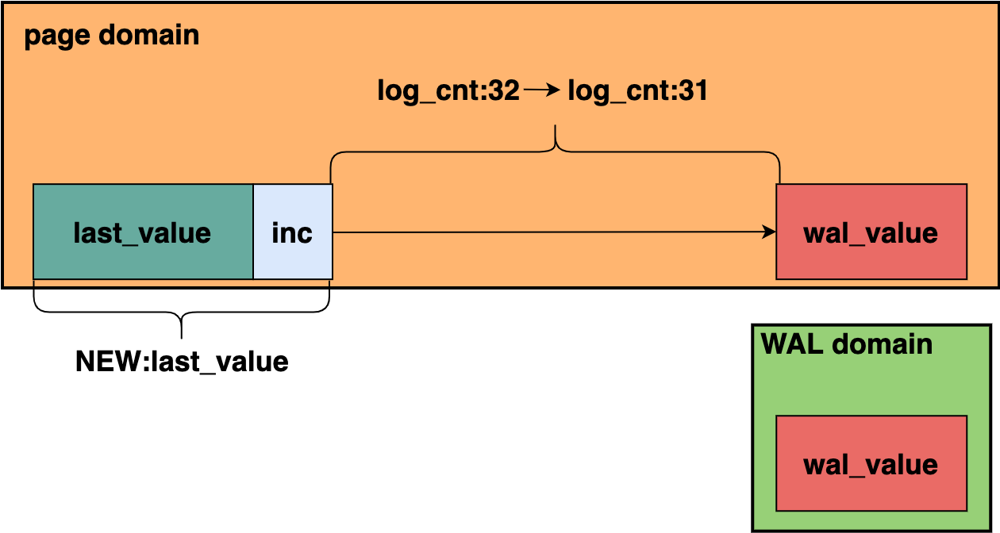
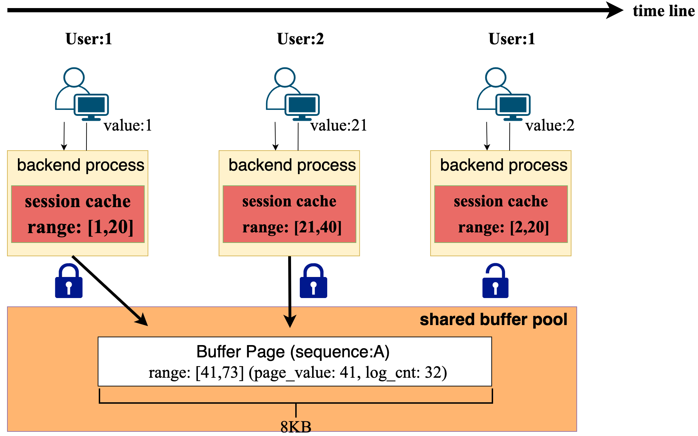
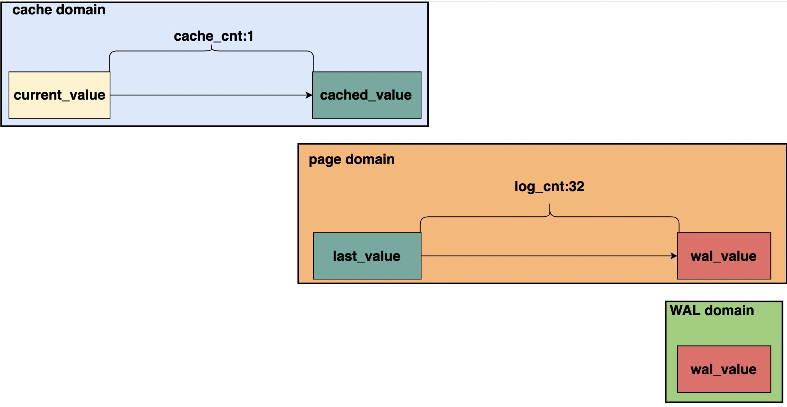
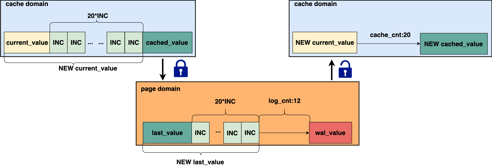
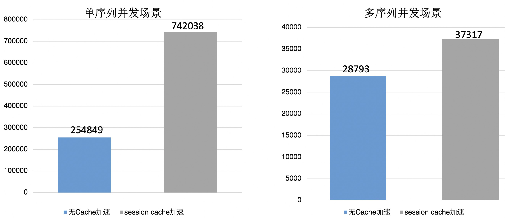

# Sequence

<ArticleInfo :frontmatter=$frontmatter></ArticleInfo>

## 介绍

Sequence 作为数据库中的一个特别的表级对象，可以根据用户设定的不同属性，产生一系列有规则的整数，从而起到发号器的作用。

在使用方面，可以设置永不重复的 Sequence 用来作为一张表的主键，也可以通过不同表共享同一个 Sequence 来记录多个表的总插入行数。根据 ANSI 标准，一个 Sequence 对象在数据库要具备以下特征：

1. 独立的数据库对象 (CREATE SEQUENCE)，和表、视图同一层级
2. 可以设置生成属性：初始值 (star value)，步长 (increment)，最大/小值 (max/min)，循环产生 (cycle)，缓存 (cache)等
3. Sequence 对象在**当前值**的基础上进行递增或者递减，当前值被初始化为初始值
4. 在设置循环后，当前值的变化具有周期性；不设置循环下，当前值的变化具有单调性，当前值到达最值后不可再变化

为了解释上述特性，我们分别定义 `a`、`b` 两种序列来举例其具体的行为。

```sql
CREATE SEQUENCE a start with 5 minvalue -1 increment -2;
CREATE SEQUENCE b start with 2 minvalue 1 maxvalue 4 cycle;
```

两个 Sequence 对象提供的序列值，随着序列申请次数的变化，如下所示：



| PostgreSQL | Oracle | SQLSERVER | MySQL          | MariaDB | DB2  | Sybase         | Hive   |
| ---------- | ------ | --------- | -------------- | ------- | ---- | -------------- | ------ |
| 支持       | 支持   | 支持      | 仅支持自增字段 | 支持    | 支持 | 仅支持自增字段 | 不支持 |

为了更进一步了解 PostgreSQL 中的 Sequence 对象，我们先来了解 Sequence 的用法，并从用法中透析 Sequence 背后的设计原理。

## 使用方法

PostgreSQL 提供了丰富的 Sequence 调用接口，以及组合使用的场景，以充分支持开发者的各种需求。

### SQL 接口

PostgreSQL 对 Sequence 对象也提供了类似于 **表** 的访问方式，即 DQL、DML 以及 DDL。我们从下图中可一览对外提供的 SQL 接口。



分别来介绍以下这几个接口：

#### currval

该接口的含义为，返回 Session 上次使用的某一 Sequence 的值。

```sql
postgres=# select nextval('seq');
 nextval
---------
       2
(1 row)

postgres=# select currval('seq');
 currval
---------
       2
(1 row)
```

需要注意的是，使用该接口必须使用过一次 `nextval` 方法，否则会提示目标 Sequence 在当前 Session 未定义。

```sql
postgres=# select currval('seq');
ERROR:  currval of sequence "seq" is not yet defined in this session
```

#### lastval

该接口的含义为，返回 Session 上次使用的 Sequence 的值。

```sql
postgres=# select nextval('seq');
 nextval
---------
       3
(1 row)

postgres=# select lastval();
 lastval
---------
       3
(1 row)
```

同样，为了知道上次用的是哪个 Sequence 对象，需要用一次 `nextval('seq')`，让 Session 以全局变量的形式记录下上次使用的 Sequence 对象。

`lastval` 与 `curval` 两个接口仅仅只是参数不同，`currval` 需要指定是哪个访问过的 Sequence 对象，而 `lastval` 无法指定，只能是最近一次使用的 Sequence 对象。

#### nextval

该接口的含义为，取 Sequence 对象的下一个序列值。

通过使用 `nextval` 方法，可以让数据库基于 Sequence 对象的当前值，返回一个递增了 `increment` 数量的一个序列值，并将递增后的值作为 Sequence 对象当前值。

```sql
postgres=# CREATE SEQUENCE seq start with 1 increment 2;
CREATE SEQUENCE
postgres=# select nextval('seq');
 nextval
---------
       1
(1 row)

postgres=# select nextval('seq');
 nextval
---------
       3
(1 row)
```

`increment` 称作 Sequence 对象的步长，Sequence 的每次以 `nextval` 的方式进行申请，都是以步长为单位进行申请的。同时，需要注意的是，Sequence 对象创建好以后，第一次申请获得的值，是 start value 所定义的值。对于 start value 的默认值，有以下 PostgreSQL 规则：

$$start\_value = 1, if:increment > 0;$$
$$start\_value = -1,if:increment < 0;$$

另外，`nextval` 是一种特殊的 DML，其不受事务所保护，即：申请出的序列值不会再回滚。

```sql
postgres=# BEGIN;
BEGIN
postgres=# select nextval('seq');
 nextval
---------
       1
(1 row)

postgres=# ROLLBACK;
ROLLBACK
postgres=# select nextval('seq');
 nextval
---------
       2
(1 row)
```

PostgreSQL 为了 Sequence 对象可以获得较好的并发性能，并没有采用多版本的方式来更新 Sequence 对象，而是采用了原地修改的方式完成 Sequence 对象的更新，这种不用事务保护的方式几乎成为所有支持 Sequence 对象的 RDMS 的通用做法，这也使得 Sequence 成为一种特殊的表级对象。

#### setval

该接口的含义是，设置 Sequence 对象的序列值。

```sql
postgres=# select nextval('seq');
 nextval
---------
       4
(1 row)

postgres=# select setval('seq', 1);
 setval
--------
      1
(1 row)

postgres=# select nextval('seq');
 nextval
---------
       2
(1 row)
```

该方法可以将 Sequence 对象的序列值设置到给定的位置，同时可以将第一个序列值申请出来。如果不想申请出来，可以采用加入 `false` 参数的做法。

```sql
postgres=# select nextval('seq');
 nextval
---------
       4
(1 row)

postgres=# select setval('seq', 1, false);
 setval
--------
      1
(1 row)

postgres=# select nextval('seq');
 nextval
---------
       1
(1 row)
```



通过在 `setval` 来设置好 Sequence 对象的值以后，同时来设置 Sequence 对象的 `is_called` 属性。`nextval` 就可以根据 Sequence 对象的 `is_called` 属性来判断要返回的是否要返回设置的序列值。即：如果 `is_called` 为 `false`，`nextval` 接口会去设置 `is_called` 为 `true`，而不是进行 increment。

#### CREATE/ALTER SEQUENCE

`CREATE` 和 `ALTER SEQUENCE` 用于创建/变更 Sequence 对象，其中 Sequence 属性也通过 `CREATE` 和 `ALTER SEQUENCE` 接口进行设置，前面已简单介绍部分属性，下面将详细描述具体的属性。

```sql
CREATE [ TEMPORARY | TEMP ] SEQUENCE [ IF NOT EXISTS ] name
    [ AS data_type ]
    [ INCREMENT [ BY ] increment ]
    [ MINVALUE minvalue | NO MINVALUE ] [ MAXVALUE maxvalue | NO MAXVALUE ]
    [ START [ WITH ] start ] [ CACHE cache ] [ [ NO ] CYCLE ]
    [ OWNED BY { table_name.column_name | NONE } ]
ALTER SEQUENCE [ IF EXISTS ] name
    [ AS data_type ]
    [ INCREMENT [ BY ] increment ]
    [ MINVALUE minvalue | NO MINVALUE ] [ MAXVALUE maxvalue | NO MAXVALUE ]
    [ START [ WITH ] start ]
    [ RESTART [ [ WITH ] restart ] ]
    [ CACHE cache ] [ [ NO ] CYCLE ]
    [ OWNED BY { table_name.column_name | NONE } ]
```

- `AS`：设置 Sequence 的数据类型，只可以设置为 `smallint`，`int`，`bigint`；与此同时也限定了 `minvalue` 和 `maxvalue` 的设置范围，默认为 `bigint` 类型（注意，只是限定，而不是设置，设置的范围不得超过数据类型的范围）。
- `INCREMENT`：步长，`nextval` 申请序列值的递增数量，默认值为 1。
- `MINVALUE` / `NOMINVALUE`：设置/不设置 Sequence 对象的最小值，如果不设置则是数据类型规定的范围，例如 `bigint` 类型，则最小值设置为 `PG_INT64_MIN`（-9223372036854775808）
- `MAXVALUE` / `NOMAXVALUE`：设置/不设置 Sequence 对象的最大值，如果不设置，则默认设置规则如上。
- `START`：Sequence 对象的初始值，必须在 `MINVALUE` 和 `MAXVALUE` 范围之间。
- `RESTART`：ALTER 后，可以重新设置 Sequence 对象的序列值，默认设置为 start value。
- `CACHE` / `NOCACHE`：设置 Sequence 对象使用的 Cache 大小，`NOCACHE` 或者不设置则默认为 1。
- `OWNED BY`：设置 Sequence 对象归属于某张表的某一列，删除列后，Sequence 对象也将删除。

#### 特殊场景下的序列回滚

下面描述了一种序列回滚的场景

```sql
CREATE SEQUENCE
postgres=# BEGIN;
BEGIN
postgres=# ALTER SEQUENCE seq maxvalue 10;
ALTER SEQUENCE
postgres=# select nextval('seq');
 nextval
---------
       1
(1 row)

postgres=# select nextval('seq');
 nextval
---------
       2
(1 row)

postgres=# ROLLBACK;
ROLLBACK
postgres=# select nextval('seq');
 nextval
---------
       1
(1 row)
```

与之前描述的不同，此处 Sequence 对象受到了事务的保护，序列值发生了发生回滚。实际上，此处事务保护的是 `ALTER SEQUENCE`（DDL），而非 `nextval`（DML），因此此处发生的回滚是将 Sequence 对象回滚到 `ALTER SEQUENCE` 之前的状态，故发生了序列回滚现象。

#### DROP/TRUNCATE

- `DROP SEQUENCE`，如字面意思，去除数据库中的 Sequence 对象。
- `TRUNCATE`，准确来讲，是通过 `TRUNCATE TABLE` 完成 `RESTART SEQUENCE`。

```sql
postgres=# CREATE TABLE tbl_iden (i INTEGER, j int GENERATED ALWAYS AS IDENTITY);
CREATE TABLE
postgres=# insert into tbl_iden values (100);
INSERT 0 1
postgres=# insert into tbl_iden values (1000);
INSERT 0 1
postgres=# select * from tbl_iden;
  i   | j
------+---
  100 | 1
 1000 | 2
(2 rows)

postgres=# TRUNCATE TABLE tbl_iden RESTART IDENTITY;
TRUNCATE TABLE
postgres=# insert into tbl_iden values (1234);
INSERT 0 1
postgres=# select * from tbl_iden;
  i   | j
------+---
 1234 | 1
(1 row)
```

此处相当于在 `TRUNCATE` 表的时候，执行 `ALTER SEQUENCE RESTART`。

### Sequence 组合使用场景

SEQUENCE 除了作为一个独立的对象时候以外，还可以组合其他 PostgreSQL 其他组件进行使用，我们总结了一下几个常用的场景。



#### 显式调用

```sql
CREATE SEQUENCE seq;
CREATE TABLE tbl (i INTEGER PRIMARY KEY);
INSERT INTO tbl (i) VALUES (nextval('seq'));
SELECT * FROM tbl ORDER BY 1 DESC;
   tbl
---------
       1
(1 row)
```

#### 触发器调用

```sql
CREATE SEQUENCE seq;
CREATE TABLE tbl (i INTEGER PRIMARY KEY, j INTEGER);
CREATE FUNCTION f()
RETURNS TRIGGER AS
$$
BEGIN
NEW.i := nextval('seq');
RETURN NEW;
END;
$$
LANGUAGE 'plpgsql';

CREATE TRIGGER tg
BEFORE INSERT ON tbl
FOR EACH ROW
EXECUTE PROCEDURE f();

INSERT INTO tbl (j) VALUES (4);

SELECT * FROM tbl;
 i | j
---+---
 1 | 4
(1 row)
```

#### DEFAULT 调用

显式 `DEFAULT` 调用：

```sql
CREATE SEQUENCE seq;
CREATE TABLE tbl(i INTEGER DEFAULT nextval('seq') PRIMARY KEY, j INTEGER);

INSERT INTO tbl (i,j) VALUES (DEFAULT,11);
INSERT INTO tbl(j) VALUES (321);
INSERT INTO tbl (i,j) VALUES (nextval('seq'),1);

SELECT * FROM tbl;
 i |  j
---+-----
 2 | 321
 1 |  11
 3 |   1
(3 rows)
```

`SERIAL` 调用：

```sql
CREATE TABLE tbl (i SERIAL PRIMARY KEY, j INTEGER);
INSERT INTO tbl (i,j) VALUES (DEFAULT,42);

INSERT INTO tbl (j) VALUES (25);

SELECT * FROM tbl;
 i | j
---+----
 1 | 42
 2 | 25
(2 rows)
```

注意，`SERIAL` 并不是一种类型，而是 `DEFAULT` 调用的另一种形式，只不过 `SERIAL` 会自动创建 `DEFAULT` 约束所要使用的 Sequence。

#### AUTO_INC 调用

```sql
CREATE TABLE tbl (i int GENERATED ALWAYS AS IDENTITY,
                  j INTEGER);
INSERT INTO tbl(i,j) VALUES (DEFAULT,32);

INSERT INTO tbl(j) VALUES (23);

SELECT * FROM tbl;
 i | j
---+----
 1 | 32
 2 | 23
(2 rows)
```

`AUTO_INC` 调用对列附加了自增约束，与 `default` 约束不同，自增约束通过查找 dependency 的方式找到该列关联的 Sequence，而 `default` 调用仅仅是将默认值设置为一个 `nextval` 表达式。

## 原理剖析

### Sequence 在系统表与数据表中的描述

在 PostgreSQL 中有一张专门记录 Sequence 信息的系统表，即 `pg_sequence`。其表结构如下：

```sql
postgres=# \d pg_sequence
             Table "pg_catalog.pg_sequence"
    Column    |  Type   | Collation | Nullable | Default
--------------+---------+-----------+----------+---------
 seqrelid     | oid     |           | not null |
 seqtypid     | oid     |           | not null |
 seqstart     | bigint  |           | not null |
 seqincrement | bigint  |           | not null |
 seqmax       | bigint  |           | not null |
 seqmin       | bigint  |           | not null |
 seqcache     | bigint  |           | not null |
 seqcycle     | boolean |           | not null |
Indexes:
    "pg_sequence_seqrelid_index" PRIMARY KEY, btree (seqrelid)
```

不难看出，`pg_sequence` 中记录了 Sequence 的全部的属性信息，该属性在 `CREATE/ALTER SEQUENCE` 中被设置，Sequence 的 `nextval` 以及 `setval` 要经常打开这张系统表，按照**规则**办事。

对于 Sequence 序列数据本身，其实现方式是基于 heap 表实现的，heap 表共计三个字段，其在表结构如下：

```c
typedef struct FormData_pg_sequence_data
{
    int64		last_value;
    int64		log_cnt;
    bool		is_called;
} FormData_pg_sequence_data;
```

- `last_value` 记录了 Sequence 的当前的序列值，我们称之为**页面值**（与后续的**缓存值**相区分）
- `log_cnt` 记录了 Sequence 在 `nextval` 申请时，预先向 WAL 中额外申请的序列次数，这一部分我们放在**序列申请机制剖析**中详细介绍。
- `is_called` 标记 Sequence 的 `last_value` 是否已经被申请过，例如 `setval` 可以设置 `is_called` 字段：

```sql
-- setval false
postgres=# select setval('seq', 10, false);
 setval
--------
     10
(1 row)

postgres=# select * from seq;
 last_value | log_cnt | is_called
------------+---------+-----------
         10 |       0 | f
(1 row)

postgres=# select nextval('seq');
 nextval
---------
      10
(1 row)

-- setval true
postgres=# select setval('seq', 10, true);
 setval
--------
     10
(1 row)

postgres=# select * from seq;
 last_value | log_cnt | is_called
------------+---------+-----------
         10 |       0 | t
(1 row)

postgres=# select nextval('seq');
 nextval
---------
      11
(1 row)
```

每当用户创建一个 Sequence 对象时，PostgreSQL 总是会创建出一张上面这种结构的 heap 表，来记录 Sequence 对象的数据信息。当 Sequence 对象因为 `nextval` 或 `setval` 导致序列值变化时，PostgreSQL 就会通过原地更新的方式更新 heap 表中的这一行的三个字段。

以 `setval` 为例，下面的逻辑解释了其具体的原地更新过程。

```c
static void
do_setval(Oid relid, int64 next, bool iscalled)
{

    /* 打开并对Sequence heap表进行加锁 */
    init_sequence(relid, &elm, &seqrel);

    ...

    /* 对buffer进行加锁，同时提取tuple */
    seq = read_seq_tuple(seqrel, &buf, &seqdatatuple);

    ...

    /* 原地更新tuple */
    seq->last_value = next;		/* last fetched number */
    seq->is_called = iscalled;
    seq->log_cnt = 0;

    ...

    /* 释放buffer锁以及表锁 */
    UnlockReleaseBuffer(buf);
    relation_close(seqrel, NoLock);
}
```

可见，`do_setval` 会直接去设置 Sequence heap 表中的这一行元组，而非普通 heap 表中的删除 + 插入的方式来完成元组更新，对于 `nextval` 而言，也是类似的过程，只不过 `last_value` 的值需要计算得出，而非用户设置。

### 序列申请机制剖析

讲清楚 Sequence 对象在内核中的存在形式之后，就需要讲清楚一个序列值是如何发出的，即 `nextval` 方法。其在内核的具体实现在 `sequence.c` 中的 `nextval_internal` 函数，其最核心的功能，就是计算 `last_value` 以及 `log_cnt`。

`last_value` 和 `log_cnt` 的具体关系如下图：



其中 `log_cnt` 是一个预留的申请次数。默认值为 32，由下面的宏定义决定：

```c
/*
 * We don't want to log each fetching of a value from a sequence,
 * so we pre-log a few fetches in advance. In the event of
 * crash we can lose (skip over) as many values as we pre-logged.
 */
#define SEQ_LOG_VALS	32
```

每当将 `last_value` 增加一个 increment 的长度时，`log_cnt` 就会递减 1。



当 `log_cnt` 为 0，或者发生 `checkpoint` 以后，就会触发一次 WAL 日志写入，按下面的公式设置 WAL 日志中的页面值，并重新将 `log_cnt` 设置为 `SEQ_LOG_VALS`。

$$wal\_value = last\_value+increment*SEQ\_LOG\_VALS$$

通过这种方式，PostgreSQL 每次通过 `nextval` 修改页面中的 `last_value` 后，不需要每次都写入 WAL 日志。这意味着：如果 `nextval` 每次都需要修改页面值的话，这种优化将会使得写 WAL 的频率降低 32 倍。其代价就是，在发生 crash 前如果没有及时进行 checkpoint，那么会丢失一段序列。如下面所示：

```sql
postgres=# create sequence seq;
CREATE SEQUENCE
postgres=# select nextval('seq');
 nextval
---------
       1
(1 row)

postgres=# select * from seq;
 last_value | log_cnt | is_called
------------+---------+-----------
          1 |      32 | t
(1 row)

-- crash and restart

postgres=# select * from seq;
 last_value | log_cnt | is_called
------------+---------+-----------
         33 |       0 | t
(1 row)

postgres=# select nextval('seq');
 nextval
---------
      34
(1 row)
```

显然，crash 以后，Sequence 对象产生了 2-33 这段空洞，但这个代价是可以被接受的，因为 Sequence 并没有违背唯一性原则。同时，在特定场景下极大地降低了写 WAL 的频率。

### Sequence 缓存机制

通过上述描述，不难发现 Sequence 每次发生序列申请，都需要通过加入 buffer 锁的方式来修改页面，这意味着 Sequence 的并发性能是比较差的。

针对这个问题，PostgreSQL 使用对 Sequence 使用了 Session Cache 来提前缓存一段序列，来提高并发性能。如下图所示：



Sequence Session Cache 的实现是一个 entry 数量固定为 16 的哈希表，以 Sequence 的 OID 为 key 去检索已经缓存好的 Sequence 序列，其缓存的 value 结构如下：

```c
typedef struct SeqTableData
{
    Oid			relid;			/* Sequence OID(hash key) */
    int64		last;			/* value last returned by nextval */
    int64		cached;			/* last value already cached for nextval */
    int64		increment;		/* copy of sequence's increment field */
} SeqTableData;
```

其中 `last` 即为 Sequence 在 Session 中的**当前值**，即 current_value，`cached` 为 Sequence 在 Session 中的**缓存值**，即 cached_value，`increment` 记录了步长，有了这三个值即可满足 Sequence 缓存的基本条件。

对于 Sequence Session Cache 与页面值之间的关系，如下图所示：



类似于 `log_cnt`，`cache_cnt` 即为用户在定义 Sequence 时，设置的 Cache 大小，最小为 1。只有当 cache domain 中的序列用完以后，才会去对 buffer 加锁，修改页中的 Sequence **页面值**。调整过程如下所示：



例如，如果 CACHE 设置的值为 20，那么当 cache 使用完以后，就会尝试对 buffer 加锁来调整**页面值**，并重新申请 20 个 increment 至 cache 中。对于上图而言，有如下关系：

$$cached\_value = NEW\ current\_value$$
$$NEW\ current\_value+20\times INC=NEW\ cached\_value$$
$$NEW\ last\_value = NEW\ cached\_value$$

在 Sequence Session Cache 的加持下，`nextval` 方法的并发性能得到了极大的提升，以下是通过 pgbench 进行压测的结果对比。



## 总结

Sequence 在 PostgreSQL 中是一类特殊的表级对象，提供了简单而又丰富的 SQL 接口，使得用户可以更加方便的创建、使用定制化的序列对象。不仅如此，Sequence 在内核中也具有丰富的组合使用场景，其使用场景也得到了极大地扩展。

本文详细介绍了 Sequence 对象在 PostgreSQL 内核中的具体设计，从对象的元数据描述、对象的数据描述出发，介绍了 Sequence 对象的组成。本文随后介绍了 Sequence 最为核心的 SQL 接口——`nextval`，从 `nextval` 的序列值计算、原地更新、降低 WAL 日志写入三个方面进行了详细阐述。最后，本文介绍了 Sequence Session Cache 的相关原理，描述了引入 Cache 以后，序列值在 Cache 中，以及页面中的计算方法以及对齐关系，并对比了引入 Cache 前后，`nextval` 方法在单序列和多序列并发场景下的对比情况。
