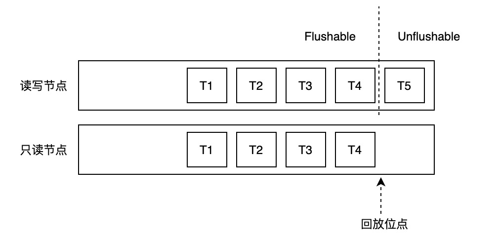

# 缓冲区管理

## 背景介绍

传统数据库的主备架构，主备有各自的存储，备节点回放 WAL 日志并读写自己的存储，主备节点在存储层没有耦合。PolarDB 的实现是基于共享存储的一写多读架构，主备使用共享存储中的一份数据。读写节点，也称为主节点或 Primary 节点，可以读写共享存储中的数据；只读节点，也称为备节点或 Replica 节点，仅能各自通过回放日志，从共享存储中读取数据，而不能写入。基本架构图如下所示：


一写多读架构下，只读节点可能从共享存储中读到两类数据页：

- 未来页：数据页中包含只读节点尚未回放到的数据，比如只读节点回放到 LSN 为 200 的 WAL 日志，但数据页中已经包含 LSN 为 300 的 WAL 日志对应的改动。此类数据页被称为“未来页”。

  

- 过去页：数据页中未包含所有回放位点之前的改动，比如只读节点将数据页回放到 LSN 为 200 的 WAL 日志，但该数据页在从 Buffer Pool 淘汰之后，再次从共享存储中读取的数据页中没有包含 LSN 为 200 的 WAL 日志的改动，此类数据页被称为“过去页”。

  

对于只读节点而言，只需要访问与其回放位点相对应的数据页。如果读取到如上所述的“未来页”和“过去页”应该如何处理呢？

- 对于“过去页”，只读节点需要回放数据页上截止回放位点之前缺失的 WAL 日志，对“过去页”的回放由每个只读节点根据自己的回放位点完成，属于只读节点回放功能，本文暂不讨论。
- 对于“未来页”，只读节点无法将“未来”的数据页转换为所需的数据页，因此需要在主节点将数据写入共享存储时考虑所有只读节点的回放情况，从而避免只读节点读取到“未来页”，这也是 Buffer 管理要解决的主要问题。

除此之外，Buffer 管理还需要维护一致性位点，对于某个数据页，只读节点仅需回放一致性位点和当前回放位点之间的 WAL 日志即可，从而加速回放效率。

## 术语解释

- Buffer Pool：缓冲池，是一种内存结构用来存储最常访问的数据，通常以页为单位来缓存数据。PolarDB 中每个节点都有自己的 Buffer Pool。
- LSN：Log Sequence Number，日志序列号，是 WAL 日志的唯一标识。LSN 在全局是递增的。
- 回放位点：Apply LSN，表示只读节点回放日志的位置，一般用 LSN 来标记。
- 最老回放位点：Oldest Apply LSN，表示所有只读节点中 LSN 最小的回放位点。

## 刷脏控制

为避免只读节点读取到“未来页”，PolarDB 引入刷脏控制功能，即在主节点要将数据页写入共享存储时，判断所有只读节点是否均已回放到该数据页最近一次修改对应的 WAL 日志。



主节点 Buffer Pool 中的数据页，根据是否包含“未来数据”（即只读节点的回放位点之后新产生的数据)，可以分为两类：可以写入存储的和不能写入存储的。该判断依赖两个位点：

- Buffer 最近一次修改对应的 LSN，我们称之为 Buffer Latest LSN。
- 最老回放位点，即所有只读节点中最小的回放位点，我们称之为 Oldest Apply LSN。

刷脏控制判断规则如下：

```cpp
if buffer latest lsn <= oldest apply lsn
    flush buffer
else
    do not flush buffer
```

## 一致性位点

为将数据页回放到指定的 LSN 位点，只读节点会维护数据页与该页上的 LSN 的映射关系，这种映射关系保存在 LogIndex 中。LogIndex 可以理解为是一种可以持久化存储的 HashTable。访问数据页时，会从该映射关系中获取数据页需要回放的所有 LSN，依次回放对应的 WAL 日志，最终生成需要使用的数据页。


可见，数据页上的修改越多，其对应的 LSN 也越多，回放所需耗时也越长。为了尽量减少数据页需要回放的 LSN 数量，PolarDB 中引入了一致性位点的概念。

一致性位点表示该位点之前的所有 WAL 日志修改的数据页均已经持久化到存储。主备之间，主节点向备节点发送当前 WAL 日志的写入位点和一致性位点，备节点向主节点发送当前回放的位点。由于一致性位点之前的 WAL 修改都已经写入共享存储，备节点无需再回放该位点之前的 WAL 日志。因此，可以将 LogIndex 中所有小于一致性位点的 LSN 清理掉，既加速回放效率，同时还能减少 LogIndex 占用的空间。

### FlushList

为维护一致性位点，PolarDB 为每个 Buffer 引入了一个内存状态，即第一次修改该 Buffer 对应的 LSN，称之为 oldest LSN，所有 Buffer 中最小的 oldest LSN 即为一致性位点。

一种获取一致性位点的方法是遍历 Buffer Pool 中所有 Buffer，找到最小值，但遍历代价较大，CPU 开销和耗时都不能接受。为高效获取一致性位点，PolarDB 引入 FlushList 机制，将 Buffer Pool 中所有脏页按照 oldest LSN 从小到大排序。借助 FlushList，获取一致性位点的时间复杂度可以达到 O(1)。


第一次修改 Buffer 并将其标记为脏时，将该 Buffer 插入到 FlushList 中，并设置其 oldest LSN。Buffer 被写入存储时，将该内存中的标记清除。

为高效推进一致性位点，PolarDB 的后台刷脏进程（bgwriter）采用“先被修改的 Buffer 先落盘”的刷脏策略，即 bgwriter 会从前往后遍历 FlushList，逐个刷脏，一旦有脏页写入存储，一致性位点就可以向前推进。以上图为例，如果 oldest LSN 为 10 的 Buffer 落盘，一致性位点就可以推进到 30。

### 并行刷脏

为进一步提升一致性位点的推进效率，PolarDB 实现了并行刷脏。每个后台刷脏进程会从 FlushList 中获取一批数据页进行刷脏。


## 热点页

引入刷脏控制之后，仅满足刷脏条件的 Buffer 才能写入存储，假如某个 Buffer 修改非常频繁，可能导致 Buffer Latest LSN 总是大于 Oldest Apply LSN，该 Buffer 始终无法满足刷脏条件，此类 Buffer 我们称之为热点页。热点页会导致一致性位点无法推进，为解决热点页的刷脏问题，PolarDB 引入了 Copy Buffer 机制。

Copy Buffer 机制会将特定的、不满足刷脏条件的 Buffer 从 Buffer Pool 中拷贝至新增的 Copy Buffer Pool 中，Copy Buffer Pool 中的 Buffer 不会再被修改，其对应的 Latest LSN 也不会更新，随着 Oldest Apply LSN 的推进，Copy Buffer 会逐步满足刷脏条件，从而可以将 Copy Buffer 落盘。

引入 Copy Buffer 机制后，刷脏的流程如下：

1. 如果 Buffer 不满足刷脏条件，判断其最近修改次数以及距离当前日志位点的距离，超过一定阈值，则将当前数据页拷贝一份至 Copy Buffer Pool 中。
1. 下次再刷该 Buffer 时，判断其是否满足刷脏条件，如果满足，则将该 Buffer 写入存储并释放其对应的 Copy Buffer。
1. 如果 Buffer 不满足刷脏条件，则判断其是否存在 Copy Buffer，若存在且 Copy Buffer 满足刷脏条件，则将 Copy Buffer 落盘。
1. Buffer 被拷贝到 Copy Buffer Pool 之后，如果有对该 Buffer 的修改，则会重新生成该 Buffer 的 Oldest LSN，并将其追加到 FlushList 末尾。

如下图中，`[oldest LSN, latest LSN]` 为 `[30, 500]` 的 Buffer 被认为是热点页，将当前 Buffer 拷贝至 Copy Buffer Pool 中，随后该数据页再次被修改，假设修改对应的 LSN 为 600，则设置其 Oldest LSN 为 600，并将其从 FlushList 中删除，然后追加至 FlushList 末尾。此时，Copy Buffer 中数据页不会再修改，其 Latest LSN 始终为 500，若满足刷脏条件，则可以将 Copy Buffer 写入存储。


需要注意的是，引入 Copy Buffer 之后，一致性位点的计算方法有所改变。FlushList 中的 Oldest LSN 不再是最小的 Oldest LSN，Copy Buffer Pool 中可能存在更小的 oldest LSN。因此，除考虑 FlushList 中的 Oldest LSN 之外，还需要遍历 Copy Buffer Pool，找到 Copy Buffer Pool 中最小的 Oldest LSN，取两者的最小值即为一致性位点。

## Lazy Checkpoint

PolarDB 引入的一致性位点概念，与 checkpoint 的概念类似。PolarDB 中 checkpoint 位点表示该位点之前的所有数据都已经落盘，数据库 Crash Recovery 时可以从 checkpoint 位点开始恢复，提升恢复效率。普通的 checkpoint 会将所有 Buffer Pool 中的脏页以及其他内存数据落盘，这个过程可能耗时较长且在此期间 I/O 吞吐较大，可能会对正常的业务请求产生影响。

借助一致性位点，PolarDB 中引入了一种特殊的 checkpoint：Lazy Checkpoint。之所以称之为 Lazy（懒惰的），是与普通的 checkpoint 相比，lazy checkpoint 不会把 Buffer Pool 中所有的脏页落盘，而是直接使用当前的一致性位点作为 checkpoint 位点，极大地提升了 checkpoint 的执行效率。

Lazy Checkpoint 的整体思路是将普通 checkpoint 一次性刷大量脏页落盘的逻辑转换为后台刷脏进程持续不断落盘并维护一致性位点的逻辑。需要注意的是，Lazy Checkpoint 与 PolarDB 中 Full Page Write 的功能有冲突，开启 Full Page Write 之后会自动关闭该功能。
