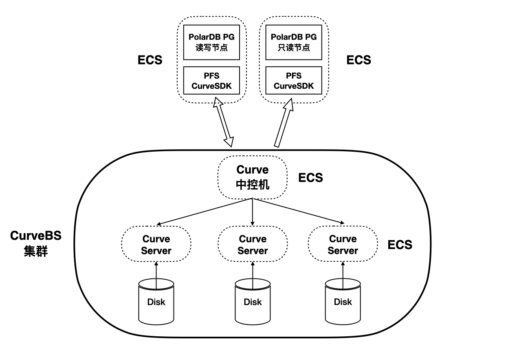

# CurveBS 共享存储 <a href="https://developer.aliyun.com/live/250218"><Badge type="tip" text="视频" vertical="top" /></a>

<ArticleInfo :frontmatter=$frontmatter></ArticleInfo>

[Curve](https://github.com/opencurve/curve) 是一款高性能、易运维、云原生的开源分布式存储系统。可应用于主流的云原生基础设施平台：

- 对接 OpenStack 平台为云主机提供高性能块存储服务；
- 对接 Kubernetes 为其提供 RWO、RWX 等类型的持久化存储卷；
- 对接 PolarFS 作为云原生数据库的高性能存储底座，完美支持云原生数据库的存算分离架构。

Curve 亦可作为云存储中间件使用 S3 兼容的对象存储作为数据存储引擎，为公有云用户提供高性价比的共享文件存储。

本示例将引导您以 CurveBS 作为块存储，部署 PolarDB for PostgreSQL。更多进阶配置和使用方法请参考 Curve 项目的 [wiki](https://github.com/opencurve/curveadm/wiki)。

## 设备准备



如图所示，本示例共使用六台服务器。其中，一台中控服务器和三台存储服务器共同组成 CurveBS 集群，对外暴露为一个共享存储服务。剩余两台服务器分别用于部署 PolarDB for PostgreSQL 数据库的读写节点和只读节点，它们共享 CurveBS 对外暴露的块存储设备。

本示例使用阿里云 ECS 模拟全部六台服务器。六台 ECS 全部运行 [Anolis OS](https://openanolis.cn/anolisos) 8.6（兼容 CentOS 8.6）系统，使用 root 用户，并处于同一局域网段内。需要完成的准备工作包含：

1. 在全部机器上安装 [Docker](https://www.docker.com/)（请参考 Docker 官方文档）
2. 在 Curve 中控机上配置 SSH 免密登陆到其它五台服务器

## 在中控机上安装 CurveAdm

```shell:no-line-numbers
bash -c "$(curl -fsSL https://curveadm.nos-eastchina1.126.net/script/install.sh)"
source /root/.bash_profile
```

## 导入主机列表

在中控机上编辑主机列表文件：

```shell:no-line-numbers
vim hosts.yaml
```

文件中包含另外五台服务器的 IP 地址和在 Curve 集群内的名称，其中：

- 三台主机为 Curve 存储节点主机
- 两台主机为 PolarDB for PostgreSQL 计算节点主机

```yaml
global:
  user: root
  ssh_port: 22
  private_key_file: /root/.ssh/id_rsa

hosts:
  # Curve worker nodes
  - host: server-host1
    hostname: 172.16.0.223
  - host: server-host2
    hostname: 172.16.0.224
  - host: server-host3
    hostname: 172.16.0.225
  # PolarDB nodes
  - host: polardb-primary
    hostname: 172.16.0.226
  - host: polardb-replica
    hostname: 172.16.0.227
```

导入主机列表：

```shell:no-line-numbers
curveadm hosts commit hosts.yaml
```

## 格式化磁盘

准备磁盘列表，并提前生成一批固定大小并预写过的 chunk 文件。磁盘列表中需要包含：

- 将要进行格式化的所有存储节点主机
- 每台主机上的统一块设备名（本例中为 `/dev/vdb`）
- 将被使用的挂载点
- 格式化百分比

```shell:no-line-numbers
vim format.yaml
```

```yaml
host:
  - server-host1
  - server-host2
  - server-host3
disk:
  - /dev/vdb:/data/chunkserver0:90 # device:mount_path:format_percent
```

开始格式化。此时，中控机将在每台存储节点主机上对每个块设备启动一个格式化进程容器。

```shell:no-line-numbers
$ curveadm format -f format.yaml
Start Format Chunkfile Pool: ⠸
  + host=server-host1  device=/dev/vdb  mountPoint=/data/chunkserver0  usage=90% [0/1] ⠸
  + host=server-host2  device=/dev/vdb  mountPoint=/data/chunkserver0  usage=90% [0/1] ⠸
  + host=server-host3  device=/dev/vdb  mountPoint=/data/chunkserver0  usage=90% [0/1] ⠸
```

当显示 `OK` 时，说明这个格式化进程容器已启动，但 **并不代表格式化已经完成**。格式化是个较久的过程，将会持续一段时间：

```shell:no-line-numbers
Start Format Chunkfile Pool: [OK]
  + host=server-host1  device=/dev/vdb  mountPoint=/data/chunkserver0  usage=90% [1/1] [OK]
  + host=server-host2  device=/dev/vdb  mountPoint=/data/chunkserver0  usage=90% [1/1] [OK]
  + host=server-host3  device=/dev/vdb  mountPoint=/data/chunkserver0  usage=90% [1/1] [OK]
```

可以通过以下命令查看格式化进度，目前仍在格式化状态中：

```shell
$ curveadm format --status
Get Format Status: [OK]

Host          Device    MountPoint          Formatted  Status
----          ------    ----------          ---------  ------
server-host1  /dev/vdb  /data/chunkserver0  19/90      Formatting
server-host2  /dev/vdb  /data/chunkserver0  22/90      Formatting
server-host3  /dev/vdb  /data/chunkserver0  22/90      Formatting
```

格式化完成后的输出：

```shell
$ curveadm format --status
Get Format Status: [OK]

Host          Device    MountPoint          Formatted  Status
----          ------    ----------          ---------  ------
server-host1  /dev/vdb  /data/chunkserver0  95/90      Done
server-host2  /dev/vdb  /data/chunkserver0  95/90      Done
server-host3  /dev/vdb  /data/chunkserver0  95/90      Done
```

## 部署 CurveBS 集群

首先，准备集群配置文件：

```shell:no-line-numbers
vim topology.yaml
```

粘贴如下配置文件：

```yaml
kind: curvebs
global:
  container_image: opencurvedocker/curvebs:v1.2
  log_dir: ${home}/logs/${service_role}${service_replicas_sequence}
  data_dir: ${home}/data/${service_role}${service_replicas_sequence}
  s3.nos_address: 127.0.0.1
  s3.snapshot_bucket_name: curve
  s3.ak: minioadmin
  s3.sk: minioadmin
  variable:
    home: /tmp
    machine1: server-host1
    machine2: server-host2
    machine3: server-host3

etcd_services:
  config:
    listen.ip: ${service_host}
    listen.port: 2380
    listen.client_port: 2379
  deploy:
    - host: ${machine1}
    - host: ${machine2}
    - host: ${machine3}

mds_services:
  config:
    listen.ip: ${service_host}
    listen.port: 6666
    listen.dummy_port: 6667
  deploy:
    - host: ${machine1}
    - host: ${machine2}
    - host: ${machine3}

chunkserver_services:
  config:
    listen.ip: ${service_host}
    listen.port: 82${format_replicas_sequence} # 8200,8201,8202
    data_dir: /data/chunkserver${service_replicas_sequence} # /data/chunkserver0, /data/chunkserver1
    copysets: 100
  deploy:
    - host: ${machine1}
      replicas: 1
    - host: ${machine2}
      replicas: 1
    - host: ${machine3}
      replicas: 1

snapshotclone_services:
  config:
    listen.ip: ${service_host}
    listen.port: 5555
    listen.dummy_port: 8081
    listen.proxy_port: 8080
  deploy:
    - host: ${machine1}
    - host: ${machine2}
    - host: ${machine3}
```

根据上述的集群拓扑文件创建集群 `my-cluster`：

```shell:no-line-numbers
curveadm cluster add my-cluster -f topology.yaml
```

切换 `my-cluster` 集群为当前管理集群：

```shell:no-line-numbers
curveadm cluster checkout my-cluster
```

部署集群。如果部署成功，将会输出类似 `Cluster 'my-cluster' successfully deployed ^_^.` 字样。

```shell
$ curveadm deploy --skip snapshotclone

...
Create Logical Pool: [OK]
  + host=server-host1  role=mds  containerId=c6fdd71ae678 [1/1] [OK]

Start Service: [OK]
  + host=server-host1  role=snapshotclone  containerId=9d3555ba72fa [1/1] [OK]
  + host=server-host2  role=snapshotclone  containerId=e6ae2b23b57e [1/1] [OK]
  + host=server-host3  role=snapshotclone  containerId=f6d3446c7684 [1/1] [OK]

Balance Leader: [OK]
  + host=server-host1  role=mds  containerId=c6fdd71ae678 [1/1] [OK]

Cluster 'my-cluster' successfully deployed ^_^.
```

查看集群状态：

```shell
$ curveadm status
Get Service Status: [OK]

cluster name      : my-cluster
cluster kind      : curvebs
cluster mds addr  : 172.16.0.223:6666,172.16.0.224:6666,172.16.0.225:6666
cluster mds leader: 172.16.0.225:6666 / d0a94a7afa14

Id            Role         Host          Replicas  Container Id  Status
--            ----         ----          --------  ------------  ------
5567a1c56ab9  etcd         server-host1  1/1       f894c5485a26  Up 17 seconds
68f9f0e6f108  etcd         server-host2  1/1       69b09cdbf503  Up 17 seconds
a678263898cc  etcd         server-host3  1/1       2ed141800731  Up 17 seconds
4dcbdd08e2cd  mds          server-host1  1/1       76d62ff0eb25  Up 17 seconds
8ef1755b0a10  mds          server-host2  1/1       d8d838258a6f  Up 17 seconds
f3599044c6b5  mds          server-host3  1/1       d63ae8502856  Up 17 seconds
9f1d43bc5b03  chunkserver  server-host1  1/1       39751a4f49d5  Up 16 seconds
3fb8fd7b37c1  chunkserver  server-host2  1/1       0f55a19ed44b  Up 16 seconds
c4da555952e3  chunkserver  server-host3  1/1       9411274d2c97  Up 16 seconds
```

## 部署 CurveBS 客户端

在 Curve 中控机上编辑客户端配置文件：

```shell:no-line-numbers
vim client.yaml
```

注意，这里的 `mds.listen.addr` 请填写上一步集群状态中输出的 `cluster mds addr`：

```yaml:no-line-numbers
kind: curvebs
container_image: opencurvedocker/curvebs:v1.2
mds.listen.addr: 172.16.0.223:6666,172.16.0.224:6666,172.16.0.225:6666
log_dir: /root/curvebs/logs/client
```

---

## 准备分布式文件系统

接下来，将在两台运行 PolarDB 计算节点的 ECS 上分别部署 PolarDB 的主节点和只读节点。作为前提，需要让这两个节点能够共享 CurveBS 块设备，并在块设备上 [格式化并挂载 PFS](./fs-pfs-curve.md)。
