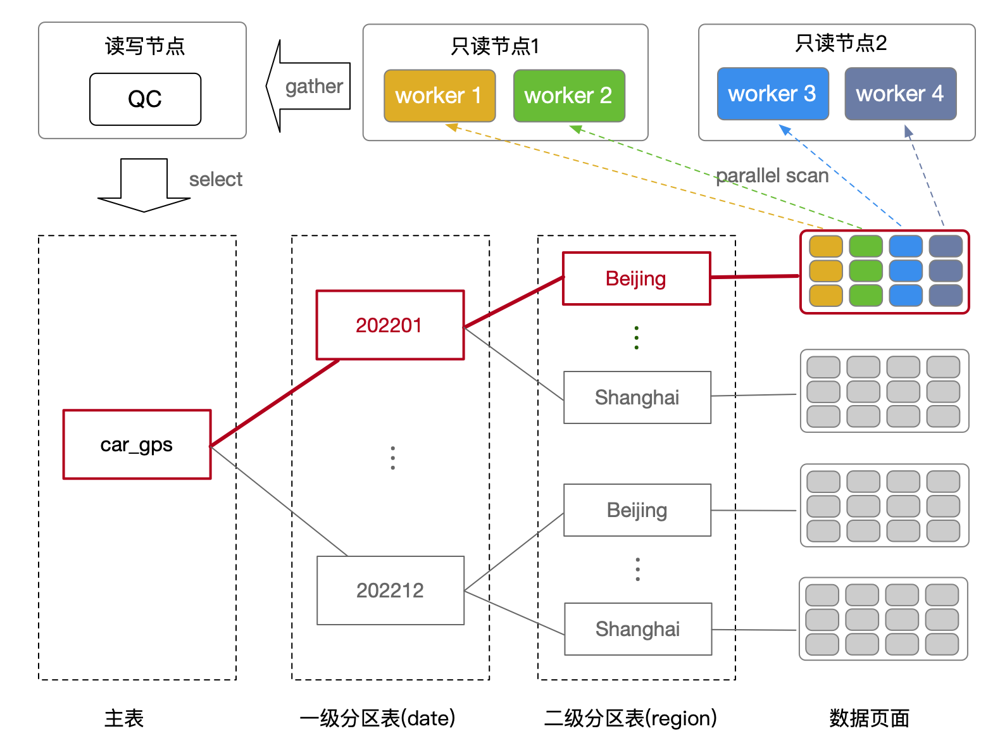

# 多级分区表静态裁剪与并行扫描

<Badge type="tip" text="V11 / v1.1.17-" vertical="top" />

<ArticleInfo :frontmatter=$frontmatter></ArticleInfo>

[[toc]]

## 背景

随着数据量的不断增长，表的规模将会越来越大。为了方便管理和提高查询性能，用户一般会使用分区表，将大表拆分成多个子分区表，每个子分区表又进一步可以拆成二级子分区表，从而形成了多级分区表。

PolarDB for PostgreSQL 支持多级分区表的静态分区裁剪，避免对无关分区进行扫描。同时，针对被裁剪后的分区表，可以进一步开启并行查询能力，从而加快分区表的查询性能。

## 术语

- QC：Query Coordinator，发起 PX 并行查询的进程角色。
- PX Worker：参与 PX 跨节点并行查询的工作进程角色。
- Worker ID：唯一标识一个 PX Worker 的编号。

## 原理

在多级分区表中，每一级分区表的分区维度可以不同，如下图所示：比如一级分区表按照时间（date）维度分区，二级分区表按照地域（region）维度分区。当 QC 发起查询时，优化器可以根据查询条件（如 `date = '202201' AND region = 'beijing'`）与每一级分区表的分区键进行匹配，从而过滤掉不需要被扫描的子分区，只保留符合条件的分区表。

如果满足条件的分区表数量较多，或者分区表中数据较多，那么可以结合 PolarDB for PostgreSQL 的并行查询（PX）能力，并行扫描对应的数据页面。在 PolarDB for PostgreSQL 共享存储的架构下，读写节点和只读节点对所有表数据都是可见的，因此可以在多个只读节点中启动 PX Worker 并行扫描，最后将结果汇总到 QC 进程。



## 使用指南

### GUC 参数

多级分区表并行查询功能依赖如下两个 GUC 参数：

| GUC 参数名                                   | 参数说明                               |
| -------------------------------------------- | -------------------------------------- |
| `polar_enable_px`                            | 开启 PolarDB PostgreSQL 的并行查询功能 |
| `polar_px_optimizer_multilevel_partitioning` | 开启多级分区表并行查询功能             |

具体开启方式如下：

```sql:no-line-numbers
SET polar_enable_px = ON;
SET polar_px_optimizer_multilevel_partitioning = ON;
```

### 创建多级分区表

```sql:no-line-numbers
-- 主表
CREATE TABLE range_list (a int,b timestamp,c varchar(10)) PARTITION BY RANGE (b);

-- 创建两个一级分区表
CREATE TABLE range_pa1 PARTITION OF range_list FOR VALUES FROM ('2000-01-01') TO ('2010-01-01')  PARTITION BY RANGE (a);
CREATE TABLE range_pa2 PARTITION OF range_list FOR VALUES FROM ('2010-01-01') TO ('2020-01-01')  PARTITION BY RANGE (a);

-- 分别为每个一级分区表创建两个二级子分区表
CREATE TABLE range_list_2000_2010_1_10  PARTITION OF range_pa1 FOR VALUES from (1) TO (1000000);
CREATE TABLE range_list_2000_2010_10_20 PARTITION OF range_pa1 FOR VALUES from (1000000) TO (2000000);
CREATE TABLE range_list_2010_2020_1_10  PARTITION OF range_pa2 FOR VALUES from (1) TO (1000000);
CREATE TABLE range_list_2010_2020_10_20 PARTITION OF range_pa2 FOR VALUES from (1000000) TO (2000000);
```

### 插入示例数据

```sql:no-line-numbers
INSERT INTO range_list SELECT round(random()*8) + 1, '2005-01-01' FROM generate_series(1,100);
INSERT INTO range_list SELECT round(random()*8) + 1000000, '2005-01-01' FROM generate_series(1,100);
INSERT INTO range_list SELECT round(random()*8) + 1, '2019-01-01' FROM generate_series(1,100);
INSERT INTO range_list SELECT round(random()*8) + 1000000, '2019-01-01' FROM generate_series(1,100);
```

### 关闭多级分区表并行功能

```sql:no-line-numbers
SET polar_enable_px = ON;
SET polar_px_optimizer_multilevel_partitioning = OFF;
```

此时，虽然可以进行多级分区表的静态裁剪（只会扫描 `range_list_2000_2010_1_10` 这张分区表），但是并不能使用并行查询功能：

```sql:no-line-numbers
EXPLAIN SELECT * FROM range_list WHERE a < 1000000 AND b < '2009-01-01 00:00:00';
                                          QUERY PLAN
----------------------------------------------------------------------------------------------
 Append  (cost=0.00..26.18 rows=116 width=50)
   ->  Seq Scan on range_list_2000_2010_1_10  (cost=0.00..25.60 rows=116 width=50)
         Filter: ((a < 1000000) AND (b < '2009-01-01 00:00:00'::timestamp without time zone))
(3 rows)
```

### 开启多级分区表并行功能

```sql:no-line-numbers
SET polar_enable_px = ON;
SET polar_px_optimizer_multilevel_partitioning = ON;
```

此时，可以进行多级分区表的静态裁剪（只会扫描 `range_list_2000_2010_1_10` 这张分区表），同时也可以使用并行查询功能（6 个并行度）：

```sql
EXPLAIN SELECT count(*) FROM range_list WHERE a < 1000000 AND b < '2009-01-01 00:00:00';
                                             QUERY PLAN
----------------------------------------------------------------------------------------------------
 PX Coordinator 6:1  (slice1; segments: 6)  (cost=0.00..431.00 rows=1 width=22)
   ->  Append  (cost=0.00..431.00 rows=1 width=22)
         ->  Partial Seq Scan on range_list_2000_2010_1_10  (cost=0.00..431.00 rows=1 width=22)
               Filter: ((a < 1000000) AND (b < '2009-01-01 00:00:00'::timestamp without time zone))
 Optimizer: PolarDB PX Optimizer
(5 rows)
```
