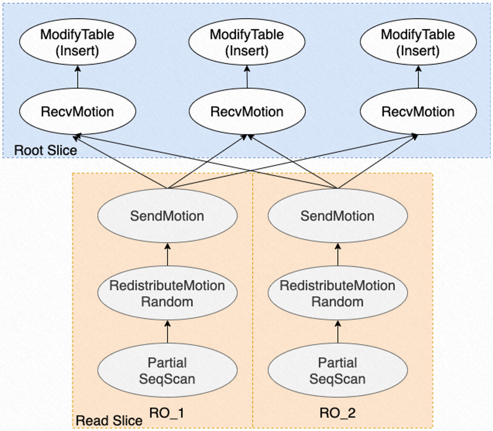

# 并行 DML

<Badge type="tip" text="V11 / v1.1.17-" vertical="top" />

<ArticleInfo :frontmatter=$frontmatter></ArticleInfo>

[[toc]]

## 背景介绍

PolarDB for PostgreSQL 提供了一款强大的分析型查询引擎——PX（Parallel eXecution），通过利用集群中多个只读节点来提升查询性能。同时，PX 针对 DML（`INSERT` / `UPDATE` / `DELETE`）也可以做到并行读并行写的加速。其中：

- **并行读** 是指借助多个只读节点上的多进程来加速 DML 中的查找操作
- **并行写** 是指在一个 PolarDB 唯一的读写节点上利用多进程实现并行写入

## 术语

- QC：Query Coordinator，发起 PX 并行查询的进程角色。
- PX Worker：参与 PX 跨节点并行查询的工作进程角色。
- DML：数据操作语句，包含 `INSERT` / `UPDATE` / `DELETE`。
- Slice：指每个 PX Worker 负责执行的计划分片。
- RW / RO：读写节点 / 只读节点。

## 功能介绍

### Parallel Insert

为了加速 `INSERT ... SELECT ...` 这种既有读取又有写入的 DML SQL，PolarDB for PG 使用 Parallel Insert 来提升性能。对于 `SELECT` 子查询，PolarDB 使用多个 PX Worker 并行加速查询；对于 `INSERT` 的写入操作，由于 PolarDB 只有一个 RW 节点，我们会在 RW 节点上启动多个执行写入的 PX Worker 进程，通过 **Motion 算子** 来接收 RO 节点上读取的数据，实现加速并行写入。

这里需要注意的是，RO 节点上的 PX Worker 只能执行只读操作，但是在 RW 节点上的 PX Worker 可以执行写入操作。Parallel Insert 在读写数据量均衡的情况下，最高能提升 3 倍的性能。Parallel Insert 已支持：

- 普通表
- 分区表
- 强制有序
- 并行度动态调整

### Parallel Update

与 Parallel Insert 类似，针对 `UPDATE ... SET ...`，PolarDB 使用多个 PX Worker 来执行并行查询，实现加速筛选需要更新的行；同时，在 RW 节点上启动多个 PX Worker 进程来执行更新操作。在读写数据量均衡的情况下，最高能提升 3 倍的性能。Parallel Update 不支持分区表，支持并行度动态调整。

### Parallel Delete

与 Parallel Update 基本相同，针对 `DELETE FROM ...`，PolarDB 通过多个 PX Worker 来执行并行查询，实现加速筛选需要删除的行；同时，在 RW 节点启动多个 PX Worker 来执行删除操作。Parallel Delete 不支持分区表，支持并行度动态调整。

## 功能设计

### Parallel Insert

Parallel Insert 的总体框架如下所示：


Parallel Insert 的处理步骤如下：

1. QC 进程接收到 `INSERT ... SEELCT`
2. QC 进程对 SQL 进行解析、重写，生成查询树，通过 PX 优化器生成计划树
3. 通过 bitmap 标志来指定每个 PX Worker 负责执行哪部分执行计划
4. 将完整的计划树分发到 RO 节点和 RW 节点，并创建 PX Worker 进程，不同的 PX Workers 根据自己的 ID 在 bitmap 中查找自己负责执行的计划
5. RO 节点上的 PX Workers 执行查询计划，从存储中并行读取各自负责的数据分片；
6. RO 节点上的 PX Workers 通过 Motion 算子将查询数据发送给 RW 节点上的 PX Workers；
7. RW 节点上的 PX Workers 并行向存储写入数据。

其中 5、6、7 三个步骤是全流水线执行的。

下面以最简单的并行 DML `INSERT INTO t1 SELECT * FROM t2` 为例。表 `t1` 和 `t2` 都是只有两列的表。

```sql
                   QUERY PLAN
-------------------------------------------------
 Insert on public.t1
   ->  Result
         Output: t2.c1, t2.c2
         ->  PX Hash 6:6  (slice1; segments: 6)
               Output: t2.c1, t2.c2, (1)
               ->  Partial Seq Scan on public.t2
                     Output: t2.c1, t2.c2, 1
 Optimizer: PolarDB PX Optimizer
(8 rows)
```

在执行计划中，`Partial Seq Scan` 代表每个 PX Workers 并行读取的数据分片，`PX Hash 6:6` 说明有 6 个负责读取的 PX Workers 和 6 个负责写入的 PX Workers。计划中的 `Hash` 代表负责读取的 PX Worker 所读取到的数据会 hash 重分布到 RW 节点上负责写入的 PX Worker 上。

Parallel Insert 也支持单个写 Worker，多个读 Worker 的执行计划：

```sql
                      QUERY PLAN
-------------------------------------------------------
 Insert on public.t1
   ->  Result
         Output: t2.c1, t2.c2
         ->  PX Coordinator 6:1  (slice1; segments: 6)
               Output: t2.c1, t2.c2
               ->  Partial Seq Scan on public.t2
                     Output: t2.c1, t2.c2
 Optimizer: PolarDB PX Optimizer
(8 rows)
```

由于只有一个写 Worker，所以计划中显示的是 `PX Coordinator 6:1`，将 RO 节点上的数据汇聚到 RW 节点上。

下图是以数据流的方式展示 Parallel Insert 的执行过程：



执行过程如下：

1. 每个负责读取的 PX Worker 执行一部分的顺序扫描操作，读取数据，进入到 `RedistributeMotionRandom`，将读取到的每条数据重分布，发送给各个负责写入的 PX Worker；
2. 通过 `SendMotion` 来向 RW 节点上的 PX Worker 发送数据，RO 节点上的每个 PX Worker 会从所有 RW 节点上的 PX Worker 中选择一个进行数据重分布，重分布的策略有哈希分布和随机分布两种；
3. RW 节点上被选中的 PX Worker 通过 `RecvMotion` 来接收数据，然后将数据通过 `ModifyTable` 算子写入存储。

### Parallel Update

由于 Parallel Update 和 Delete 在 SQL 解析、重写的过程和 Parallel Insert 相同，下面只说明 Parallel Update 的执行计划和数据流动方式。

不带子查询的并行 Update 计划：

```sql
                                               QUERY PLAN
--------------------------------------------------------------------------------------------------------
 Update (segment: 6) on public.t1
   ->  Result
         Output: t1_1.c1, t1_1.c2, (DMLAction), t1_1.ctid
         ->  PX Hash 6:6  (slice1; segments: 6)
               Output: t1_1.c1, t1_1.c2, t1_1.ctid, t1_1._px_worker_id, (DMLAction), ('16397'::oid)
               ->  Result
                     Output: t1_1.c1, t1_1.c2, t1_1.ctid, t1_1._px_worker_id, (DMLAction), '16397'::oid
                     ->  Split
                           Output: t1_1.c1, t1_1.c2, t1_1.ctid, t1_1._px_worker_id, DMLAction
                           ->  Partial Seq Scan on public.t1 t1_1
                                 Output: t1_1.c1, t1_1.c2, 3, t1_1.ctid, t1_1._px_worker_id
 Optimizer: PolarDB PX Optimizer
(12 rows)
```

从执行计划中可以看出，从 RO 节点读取数据到 RW 节点写入数据之前存在一个 Split 算子。算子中还包含了一个 `DMLAction` 的标志，用于表示当前正在进行的 DML 操作类型（`DML_INSERT` / `DML_DELETE`）。Split 算子用于把 `UPDATE` 拆分为 `DELETE` 和 `INSERT` 两个阶段，表明要删除哪些行、插入哪些行。

对于带有子查询的 `UPDATE` 计划，除写入计划分片之外加入了自查询的执行计划分片。示例如下：

```sql
                                                 QUERY PLAN
------------------------------------------------------------------------------------------------------------
 Update (segment: 6) on public.t1
   ->  Result
         Output: t1_1.c1, t1_1.c2, (DMLAction), t1_1.ctid
         ->  PX Hash 6:6  (slice1; segments: 6)
               Output: t1_1.c1, t1_1.c2, t1_1.ctid, t1_1._px_worker_id, (DMLAction), ('16397'::oid)
               ->  Result
                     Output: t1_1.c1, t1_1.c2, t1_1.ctid, t1_1._px_worker_id, (DMLAction), '16397'::oid
                     ->  Split
                           Output: t1_1.c1, t1_1.c2, t1_1.ctid, t1_1._px_worker_id, DMLAction
                           ->  Partial Seq Scan on public.t1 t1_1
                                 Output: t1_1.c1, t1_1.c2, int4((SubPlan 1)), t1_1.ctid, t1_1._px_worker_id
                                 SubPlan 1
                                   ->  Materialize
                                         Output: (count())
                                         ->  PX Broadcast 1:6  (slice2)
                                               Output: (count())
                                               ->  Aggregate
                                                     Output: count()
                                                     ->  PX Coordinator 6:1  (slice3; segments: 6)
                                                           ->  Partial Seq Scan on public.t2
 Optimizer: PolarDB PX Optimizer
(21 rows)
```

Parallel Update 处理数据流图如下图所示：


- 对于不带子查询的情况，如 `UPDATE t1 SET c1=3`
  1. 每个负责写入的 PX Worker 并行查找要更新的行
  2. 通过 Split 算子，拆分成 `DELETE` 和 `INSERT` 操作
  3. 执行 `ExecDelete` 和 `ExecInsert`
- 带子查询的情况，如 `UPDATE t1 SET c1=(SELECT COUNT(*) FROM t2)`
  1. 每个负责读取的 PX Worker 从共享存储上并行读取自己负责的数据分片，然后通过 `SendMotion` 将自己读到的数据汇聚到 QC 进程
  2. QC 进程将数据（过滤条件）广播给 RW 节点上的各个负责写入的 PX Worker
  3. 各个负责写入的 PX Worker 分别扫描各自负责的数据分片，查找待更新的数据
  4. 通过 Split 算子，拆分成 `DELETE` 和 `INSERT` 操作
  5. 执行 `ExecDelete` 和 `ExecInsert`

### Parallel Delete

不带子查询的并行 Delete 计划：

```sql
                                   QUERY PLAN
--------------------------------------------------------------------------------
 Delete (segment: 6) on public.t1
   ->  Result
         Output: t1_1.c1, t1_1.c2, t1_1.ctid
         ->  PX Hash 6:6  (slice1; segments: 6)
               Output: t1_1.c1, t1_1.c2, t1_1.ctid, t1_1._px_worker_id, (0)
               ->  Partial Seq Scan on public.t1 t1_1
                     Output: t1_1.c1, t1_1.c2, t1_1.ctid, t1_1._px_worker_id, 0
                     Filter: (t1_1.c1 < 10)
 Optimizer: PolarDB PX Optimizer
(9 rows)
```

带有子查询的并行 Delete 计划：

```sql
                                    QUERY PLAN
-----------------------------------------------------------------------------------
 Delete (segment: 6) on public.t1
   ->  Result
         Output: t1_1.c1, t1_1.c2, t1_1.ctid
         ->  PX Hash 6:6  (slice1; segments: 6)
               Output: t1_1.c1, t1_1.c2, t1_1.ctid, t1_1._px_worker_id, (0)
               ->  Hash Semi Join
                     Output: t1_1.c1, t1_1.c2, t1_1.ctid, t1_1._px_worker_id, 0
                     Hash Cond: (t1_1.c1 = t2.c1)
                     ->  Partial Seq Scan on public.t1 t1_1
                           Output: t1_1.c1, t1_1.c2, t1_1.ctid, t1_1._px_worker_id
                     ->  Hash
                           Output: t2.c1
                           ->  Full Seq Scan on public.t2
                                 Output: t2.c1
 Optimizer: PolarDB PX Optimizer
(15 rows)
```

负责读写的 PX Workers 数量：

```sql
                                    QUERY PLAN
-----------------------------------------------------------------------------------
 Delete (segment: 10) on public.t1
   ->  Result
         Output: t1_1.c1, t1_1.c2, t1_1.ctid
         ->  PX Hash 6:10  (slice1; segments: 6)
               Output: t1_1.c1, t1_1.c2, t1_1.ctid, t1_1._px_worker_id, (0)
               ->  Hash Semi Join
                     Output: t1_1.c1, t1_1.c2, t1_1.ctid, t1_1._px_worker_id, 0
                     Hash Cond: (t1_1.c1 = t2.c1)
                     ->  Partial Seq Scan on public.t1 t1_1
                           Output: t1_1.c1, t1_1.c2, t1_1.ctid, t1_1._px_worker_id
                     ->  Hash
                           Output: t2.c1
                           ->  Full Seq Scan on public.t2
                                 Output: t2.c1
 Optimizer: PolarDB PX Optimizer
(15 rows)
```

可以看到 Parallel Delete 的计划与 Parallel Update 类似，区别在于：

1. 由于 Parallel Delete 只执行删除操作，不执行插入操作，所以不需要 Split 算子
2. 顶层的 DML 算子由 Update 变为 Delete 算子

并行 Delete 的数据流图如下所示：


1. 每个负责读取的 PX Workers 扫描属于自己的数据分片，找出要删除的行
2. 将待删除的行通过 Motion 算子传输给每个负责写入的 PX Workers，并行执行 Delete 操作

## 使用说明

### Parallel Insert

Parallel Insert 默认关闭，需要打开开关来使用：

```sql:no-line-numbers
-- 使用 Parallel Insert 前，需要打开 PX
SET polar_enable_px = ON;

-- 开启 Parallel Insert 功能
SET polar_px_enable_insert_select = ON;

-- 开启 Parallel Insert 写入分区表，默认关闭
SET polar_px_enable_insert_partition_table = ON;

-- 写入并行度控制，默认为 6，表示 RW 节点上会启动 6 个 PX Workers 来执行写入
SET polar_px_insert_dop_num = 6;

-- 支持无表查询的开关，默认关闭
SET polar_px_enable_insert_from_tableless = ON;
```

由于 Parallel Insert 无法保证写入顺序，提供以下开关以强制保证写入结果有序：

```sql:no-line-numbers
-- 默认打开，关闭后则不保证并行 Insert 结果有序
SET polar_px_enable_insert_order_sensitive = ON;
```

### Parallel Update

参数 `polar_px_enable_update` 控制是否开启 Parallel Update 功能，默认关闭。

```sql:no-line-numbers
SET polar_px_enable_update = ON;
```

参数 `polar_px_update_dop_num` 控制 Parallel Update 的写入并行度。默认为 `6`，范围为 `1~128`。

```sql:no-line-numbers
-- 启动 6 个 PX Workers 进行写入
SET polar_px_update_dop_num = 6;
```

### Parallel Delete

参数 `polar_px_enable_delete` 控制是否开启 Parallel Delete，默认关闭。

```sql:no-line-numbers
SET polar_px_enable_delete = ON;
```

参数 `polar_px_delete_dop_num` 控制 Parallel Delete 的写入并行度。默认值为 `6`，取值范围为 `1~128`。

```sql:no-line-numbers
-- 启动 6 个 PX Workers 进行删除
SET polar_px_delete_dop_num = 6;
```

## 性能表现

下面将简单说明一下 PDML 的性能表现。

### Parallel Insert

在读写数据量相同的情况下，总数据量为 75GB 时，Parallel Insert 的性能表现如下图所示：


当读数据量远大于写数据量的情况下，总数据量为 75GB 时，写入数据量占读数据量的 0.25% 时，Parallel Insert 的性能表现如下图所示：


由两张图可知：

1. 在读写数据量相同的情况下，Parallel Insert 最高能提升 3 倍的性能
2. 读数据量越大，Parallel Insert 性能提升幅度越大，最高能有 4 倍左右的提升
3. 提升写入并行度对性能提升不大，主要原因是 PX Worker 必须在 RW 上执行并行写入，数据库中的表扩展锁成为性能瓶颈

### Parallel Update

在读写数据量相同的情况下，总数据量为 75GB 时，并行 Update 的性能表现：


在读数据量远大于写数据量的情况下，读写数据比例为 100:1 时，并行 Update 的性能表现：


由这两张性能表现图可知：

1. 当读写数据量相同的情况下，Parallel Update 最高能提升 3 倍的性能
2. 读数据量越大，Parallel Update 性能提升幅度越大，最高能到达 10 倍的提升
3. 提升写入并行度对性能提升不大，原因同上

### Parallel Delete

Parallel Delete 的性能表现和结论与 Parallel Update 基本一致，不再赘述。
