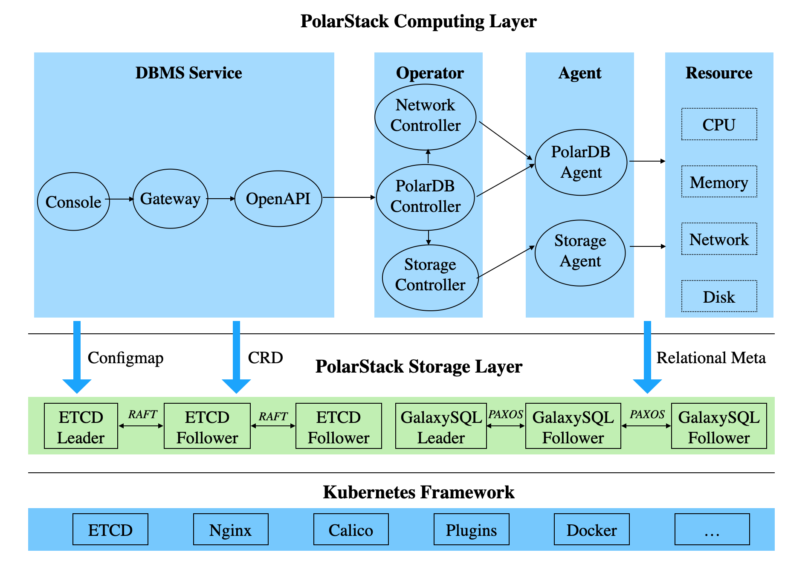

# 更多部署方式

## 基于 PolarDB Stack 共享存储

PolarDB Stack 是轻量级 PolarDB PaaS 软件。基于共享存储提供一写多读的 PolarDB 数据库服务，特别定制和深度优化了数据库生命周期管理。通过 PolarDB Stack 可以一键部署 PolarDB-for-PostgreSQL 内核和 PolarDB-FileSystem。

PolarDB Stack 架构如下图所示，进入 [PolarDB Stack 的部署文档](https://github.com/ApsaraDB/PolarDB-Stack-Operator/blob/master/README.md)

## 阿里云官网购买实例

阿里云官网直接提供了可供购买的 [云原生关系型数据库 PolarDB PostgreSQL 引擎](https://www.aliyun.com/product/polardb)。
