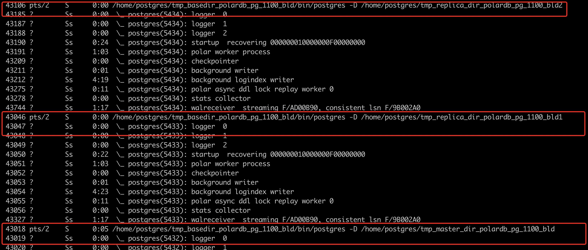
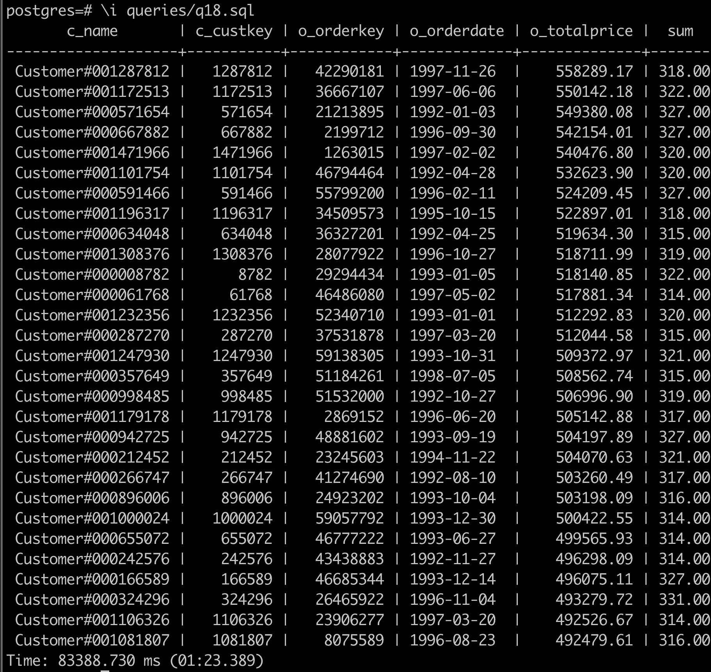
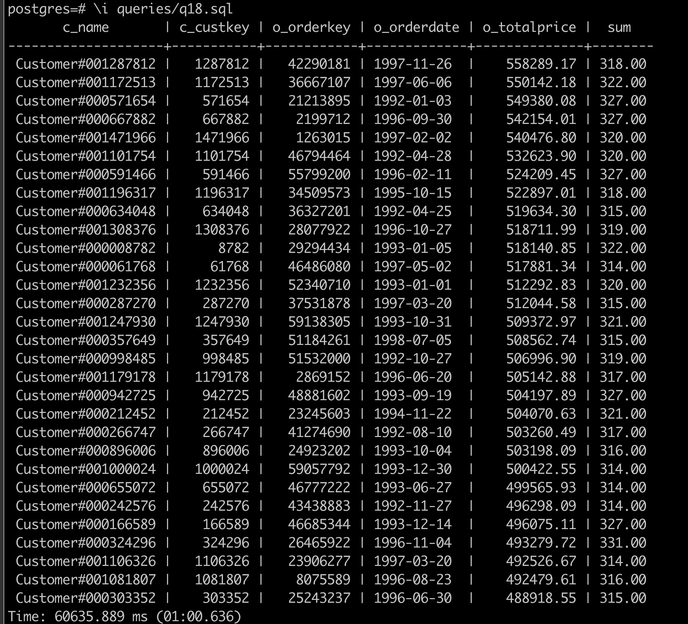

# 利用 PolarDB HTAP 加速 TPC-H

在本节，我们将利用 Polar PG 的 HTAP 能力来加速 TPC-H 的执行，实践将基于单机本地存储来运行。

## 前期准备

### 部署 PolarDB PG

在运行前默认已经通过 [前置文档](./db-localfs.md#本地多节点-htap-实例) 部署好本地多节点 HTAP 实例。总计 1 个主节点（运行于 5432 端口），2 个只读节点（运行于 5433/5434 端口）。可以通过下面的命令来验证：

```shell
ps xf
```

会看到如下的三个进程，1 个主节点（运行于 5432 端口），2 个只读节点（运行于 5433/5434 端口）：



### 生成 TPC-H 测试数据集

[TPC-H](https://www.tpc.org/tpch/default5.asp) 是专门测试数据库分析型场景性能的数据集，一共有 22 条分析型场景下的 SQL。用 TPC-H 可以有效测试 PolarDB 的 HTAP 的能力。我们将通过 [tpch-dbgen](https://github.com/qiuyuhang/tpch-dbgen.git) 工具来生成任意大小的数据集。

```shell
# 下载 tpch-dbgen
git clone https://github.com/qiuyuhang/tpch-dbgen.git

# 编译代码
cd tpch-dbgen
make
```

执行如下命令，生成模拟数据：

::: tip
建议先按照该命令，从 10GB 大小的数据开始生成。体验完本案例后还可尝试 100GB 的数据，即将该命令行中的 `10` 替换为 `100`。这里需要注意不要超过本机外存容量。
:::

```shell
# 生成 10GB 数据
./dbgen -s 10
```

简单说明一下 tpch-dbgen 里面的各种文件：

- 后缀为 `.tbl` 表示生成的表数据
- `queries/` 中存放的是 TPC-H 的 22 条 SQL
- 含有 `explain` 的 `.sql` 文件只打印计划，并不实际执行
- `answers/` 中存储了 TPC-H 中 22 条 SQL 的执行结果

## 导入数据

通过 `psql` 导入 TPC-H 数据。

::: tip
注意，一直要在 `tpch-dbgen/` 目录下执行
:::

```shell
# 创建表
psql -f dss.ddl

# 进入 psql 命令行
psql
```

```sql
# 导入数据
\copy nation from 'nation.tbl' DELIMITER '|';
\copy region from 'region.tbl' DELIMITER '|';
\copy supplier from 'supplier.tbl' DELIMITER '|';
\copy part from 'part.tbl' DELIMITER '|';
\copy partsupp from 'partsupp.tbl' DELIMITER '|';
\copy customer from 'customer.tbl' DELIMITER '|';
\copy orders from 'orders.tbl' DELIMITER '|';
\copy lineitem from 'lineitem.tbl' DELIMITER '|';
```

数据导入完成后，逐行执行如下命令，对创建的表设置最大并行度：

```sql
# 对需要 PX 查询的表设置最大并行度（若不设置则不会进入 PX 查询）
alter table nation set (px_workers = 100);
alter table region set (px_workers = 100);
alter table supplier set (px_workers = 100);
alter table part set (px_workers = 100);
alter table partsupp set (px_workers = 100);
alter table customer set (px_workers = 100);
alter table orders set (px_workers = 100);
alter table lineitem set (px_workers = 100);
```

## 执行单机并行查询

模拟数据导入到 PolarDB 后，我们先执行单机并行查询，观测一下查询速度。

1. psql 连入后，执行如下命令，开启计时。

   ```sql
   \timing
   ```

2. 通过 `max_parallel_workers_per_gather` 参数设置单机并行度：

   ```sql
   set max_parallel_workers_per_gather=2; -- 并行度设置为 2
   ```

3. 执行如下命令，查看执行计划。

   ```sql
   \i queries/q18.explain.sql
   ```

   可以看到如图所示的 2 个并行度的并行计划：

   ```sql
                                                                           QUERY PLAN
   -----------------------------------------------------------------------------------------------------------------------------------------------------------------
   Limit  (cost=9364138.51..9364141.51 rows=100 width=71)
   ->  GroupAggregate  (cost=9364138.51..9380736.94 rows=553281 width=71)
         Group Key: orders.o_totalprice, orders.o_orderdate, customer.c_name, customer.c_custkey, orders.o_orderkey
         ->  Sort  (cost=9364138.51..9365521.71 rows=553281 width=44)
               Sort Key: orders.o_totalprice DESC, orders.o_orderdate, customer.c_name, customer.c_custkey, orders.o_orderkey
               ->  Hash Join  (cost=6752588.87..9294341.50 rows=553281 width=44)
                     Hash Cond: (lineitem.l_orderkey = orders.o_orderkey)
                     ->  Seq Scan on lineitem  (cost=0.00..1724338.96 rows=59979696 width=9)
                     ->  Hash  (cost=6749642.22..6749642.22 rows=138372 width=43)
                           ->  Hash Join  (cost=6110531.76..6749642.22 rows=138372 width=43)
                                 Hash Cond: (orders.o_custkey = customer.c_custkey)
                                 ->  Hash Join  (cost=6032162.96..6658785.84 rows=138372 width=24)
                                       Hash Cond: (orders.o_orderkey = lineitem_1.l_orderkey)
                                       ->  Seq Scan on orders  (cost=0.00..410917.44 rows=15000544 width=20)
                                       ->  Hash  (cost=6029892.31..6029892.31 rows=138372 width=4)
                                             ->  Finalize GroupAggregate  (cost=5727599.96..6028508.59 rows=138372 width=4)
                                                   Group Key: lineitem_1.l_orderkey
                                                   Filter: (sum(lineitem_1.l_quantity) > '313'::numeric)
                                                   ->  Gather Merge  (cost=5727599.96..6016055.08 rows=830234 width=36)
                                                         Workers Planned: 2
                                                         ->  Partial GroupAggregate  (cost=5726599.94..5919225.45 rows=415117 width=36)
                                                               Group Key: lineitem_1.l_orderkey
                                                               ->  Sort  (cost=5726599.94..5789078.79 rows=24991540 width=9)
                                                                     Sort Key: lineitem_1.l_orderkey
                                                                     ->  Parallel Seq Scan on lineitem lineitem_1  (cost=0.00..1374457.40 rows=24991540 width=9)
                                 ->  Hash  (cost=50827.80..50827.80 rows=1500080 width=23)
                                       ->  Seq Scan on customer  (cost=0.00..50827.80 rows=1500080 width=23)
   (27 rows)
   ```

4. 执行 SQL，可以看到部分结果（按 `q` 不查看全部结果）和运行时间，运行时间为 1 分 23 秒：

   ```sql
   \i queries/q18.sql
   ```

   

::: tip
如果单机并行度太高，可能会出现如下的错误提示：`pq: could not resize shared memory segment "/PostgreSQL.2058389254" to 12615680 bytes: No space left on device`。原因是 Docker 预设的 shared memory 空间不足，可以参考 [该链接](https://stackoverflow.com/questions/56751565/pq-could-not-resize-shared-memory-segment-no-space-left-on-device) 设置参数并重启 Docker 进行解决。
:::

## 执行 PolarDB HTAP 跨机并行查询

在体验完单机并行查询后，我们开启跨机并行查询。然后使用相同的数据，重新体验一下查询性能。

1. 在 psql 后，执行如下命令，开启计时（若已开启，可跳过）。

   ```sql
   \timing
   ```

2. 执行如下命令，开启跨机并行查询（PX）。

   ```sql
   set polar_enable_px=on;
   ```

3. 设置每个节点的并行度为 1。

   ```sql
   set polar_px_dop_per_node=1;
   ```

4. 执行如下命令，查看执行计划。

   ```sql
   \i queries/q18.explain.sql
   ```

   该引擎集群带有 2 个 RO 节点，开启 PX 后默认并行度为 `2x1=2` 个：

   ```sql
                                                                                              QUERY PLAN
   -------------------------------------------------------------------------------------------------------------------------------------------------------------------------------------------------

   Limit  (cost=0.00..93628.34 rows=100 width=47)
   ->  PX Coordinator 2:1  (slice1; segments: 2)  (cost=0.00..93628.33 rows=100 width=47)
         Merge Key: orders.o_totalprice, orders.o_orderdate
         ->  Limit  (cost=0.00..93628.31 rows=50 width=47)
               ->  GroupAggregate  (cost=0.00..93628.31 rows=11995940 width=47)
                     Group Key: orders.o_totalprice, orders.o_orderdate, customer.c_name, customer.c_custkey, orders.o_orderkey
                     ->  Sort  (cost=0.00..92784.19 rows=11995940 width=44)
                           Sort Key: orders.o_totalprice DESC, orders.o_orderdate, customer.c_name, customer.c_custkey, orders.o_orderkey
                           ->  Hash Join  (cost=0.00..22406.63 rows=11995940 width=44)
                                 Hash Cond: (lineitem.l_orderkey = orders.o_orderkey)
                                 ->  PX Hash 2:2  (slice2; segments: 2)  (cost=0.00..4301.49 rows=29989848 width=9)
                                       Hash Key: lineitem.l_orderkey
                                       ->  Partial Seq Scan on lineitem  (cost=0.00..2954.65 rows=29989848 width=9)
                                 ->  Hash  (cost=10799.35..10799.35 rows=83024 width=39)
                                       ->  PX Hash 2:2  (slice3; segments: 2)  (cost=0.00..10799.35 rows=83024 width=39)
                                             Hash Key: orders.o_orderkey
                                             ->  Hash Join  (cost=0.00..10789.21 rows=83024 width=39)
                                                   Hash Cond: (customer.c_custkey = orders.o_custkey)
                                                   ->  PX Hash 2:2  (slice4; segments: 2)  (cost=0.00..597.52 rows=750040 width=23)
                                                         Hash Key: customer.c_custkey
                                                         ->  Partial Seq Scan on customer  (cost=0.00..511.44 rows=750040 width=23)
                                                   ->  Hash  (cost=9993.50..9993.50 rows=83024 width=20)
                                                         ->  PX Hash 2:2  (slice5; segments: 2)  (cost=0.00..9993.50 rows=83024 width=20)
                                                               Hash Key: orders.o_custkey
                                                               ->  Hash Semi Join  (cost=0.00..9988.30 rows=83024 width=20)
                                                                     Hash Cond: (orders.o_orderkey = lineitem_1.l_orderkey)
                                                                     ->  Partial Seq Scan on orders  (cost=0.00..1020.90 rows=7500272 width=20)
                                                                     ->  Hash  (cost=7256.00..7256.00 rows=166047 width=4)
                                                                           ->  PX Broadcast 2:2  (slice6; segments: 2)  (cost=0.00..7256.00 rows=166047 width=4)
                                                                                 ->  Result  (cost=0.00..7238.62 rows=83024 width=4)
                                                                                       Filter: ((sum(lineitem_1.l_quantity)) > '313'::numeric)
                                                                                       ->  Finalize HashAggregate  (cost=0.00..7231.79 rows=207559 width=12)
                                                                                             Group Key: lineitem_1.l_orderkey
                                                                                             ->  PX Hash 2:2  (slice7; segments: 2)  (cost=0.00..7205.20 rows=207559 width=12)
                                                                                                   Hash Key: lineitem_1.l_orderkey
                                                                                                   ->  Partial HashAggregate  (cost=0.00..7197.41 rows=207559 width=12)
                                                                                                         Group Key: lineitem_1.l_orderkey
                                                                                                         ->  Partial Seq Scan on lineitem lineitem_1  (cost=0.00..2954.65 rows=29989848 width=9)
   Optimizer: PolarDB PX Optimizer
   (39 rows)
   ```

5. 执行 SQL：

   ```sql
   \i queries/q18.sql
   ```

可以看到部分结果（按 `q` 不查看全部结果）和运行时间，运行时间为 1 分钟，比单机并行的结果降低了 27.71\% 的运行时间。感兴趣的同学也可加大并行度或者数据量查看提升程度。



跨机并行查询会去获取全局一致性视图，因此得到的数据是一致的，无需担心数据正确性。可以通过如下方式手动设置跨机并行查询的并行度：

```sql
set polar_px_dop_per_node = 1;
\i queries/q18.sql

set polar_px_dop_per_node = 2;
\i queries/q18.sql

set polar_px_dop_per_node = 4;
\i queries/q18.sql
```
