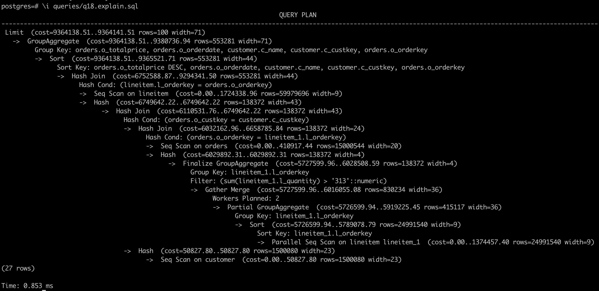
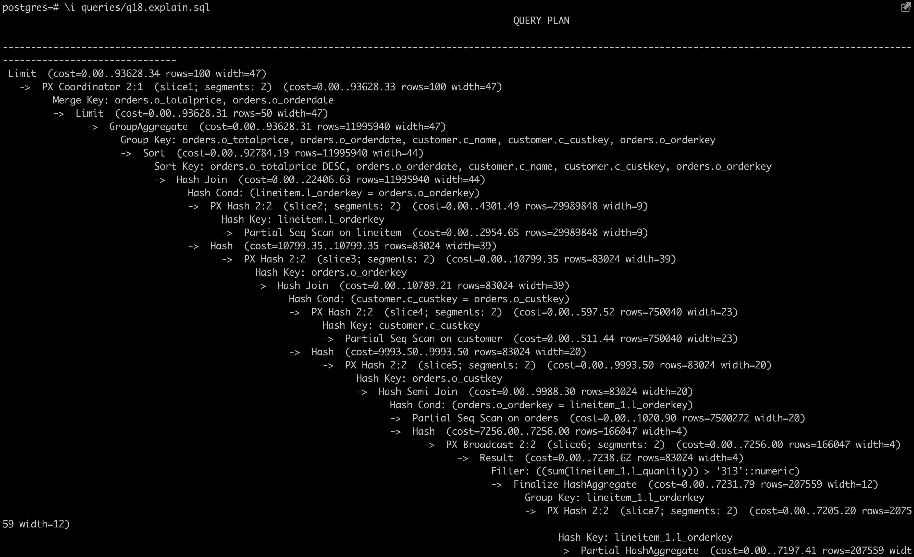
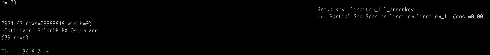

# 实例实践：利用PolarDB的HTAP能力加速TPC-H

在本节，我们将利用Polar PG的HTAP能力来加速TPC-H的执行，实践将基于单机本地存储来运行。

## 前期准备

### 部署PolarDB PG
在运行前默认已经通过文档 [实例部署：基于单机本地存储](deploy-on-local-storage.md)中部署好本地多节点HTAP实例，一共1个主节点（运行于5432端口），2个只读节点（运行于5433/5434端口）

可以通过下面的命令来验证：

```cmd_test_instance
ps xf
```
会看到如下的三个进程，1个主节点（运行于5432端口），2个只读节点（运行于5433/5434端口）


### 生成TPC-H测试数据集
TPC-H是专门测试数据库分析型场景性能的数据集 [TPC-H官方链接](https://www.tpc.org/tpch/default5.asp)，一共有22条分析型场景下的SQL，用TPC-H可以有效测试PolarDB的HTAP的能力。我们将通过tpch-dbgen工具来生成任意大小的数据集。

下载tpch-dbgen
```cmd_download_tpch-dbgen
# 克隆仓库
git clone https://github.com/qiuyuhang/tpch-dbgen.git

# 编译代码
cd tpch-dbgen
make
```

执行如下命令，生成模拟数据
```cmd_tpch_gen
# 生成数据
./dbgen -s 10
```
::: tip
建议先按照该命令，从10GB大小的数据开始。体验完本案例后还可尝试100GB的数据，即将该命令行中的10替换为100。这里需要注意不用超过本机外存容量
:::

简单说明一下tpch-dbgen里面的各种文件，后缀为.tbl表示生成的表数据；queries/中存放的是TPC-H的22条SQL，含有explain的.sql文件只打印计划，并不实际执行；answers/中存储的TPC-H中22条SQL的执行结果。


## 导入数据

通过psql进入pg-cli导入TPC-H数据
```cmd_load_tpch
# 创建表
psql -f dss.ddl

# 进入数据库Cli模式
psql

# 导入数据
\copy nation from 'nation.tbl' DELIMITER '|';
\copy region from 'region.tbl' DELIMITER '|';
\copy supplier from 'supplier.tbl' DELIMITER '|';
\copy part from 'part.tbl' DELIMITER '|';
\copy partsupp from 'partsupp.tbl' DELIMITER '|';
\copy customer from 'customer.tbl' DELIMITER '|';
\copy orders from 'orders.tbl' DELIMITER '|';
\copy lineitem from 'lineitem.tbl' DELIMITER '|';

```

::: tip
注意，一直要在tpch-dbgen/目录下执行
:::

数据导入完成后，逐行执行如下命令，对创建的表设置最大并行度。
```
# 对需要PX查询的表设置最大并行度（若不设置则不会进入PX查询）
alter table nation set (px_workers = 100);
alter table region set (px_workers = 100);
alter table supplier set (px_workers = 100);
alter table part set (px_workers = 100);
alter table partsupp set (px_workers = 100);
alter table customer set (px_workers = 100);
alter table orders set (px_workers = 100);
alter table lineitem set (px_workers = 100);
```

## 执行单机并行查询
模拟数据导入到PolarDB后，我们先执行单机并行查询，观测一下查询速度。
1. psql连入后，执行如下命令，开启计时。
```
\timing
```

2. 设置单机并行度
可通过max_parallel_workers_per_gather参数设置单机并行度：
```
set max_parallel_workers_per_gather=2; -- 设置为2
```

3. 执行如下命令，查看执行计划。
```
\i queries/q18.explain.sql
```

可以看到如图所示的2个并行度的单机并行计划


4. 执行如下SQL。
```
\i queries/q18.sql
```

可以看到部分结果（按q不查看全部结果）和运行时间，可以看到运行时间为1分23秒。


::: tip
注意，如果因为单机并行度太高，出现如下的错误提示：
pq: could not resize shared memory segment "/PostgreSQL.2058389254" to 12615680 bytes: No space left on device
是因为docker预设的shared memory空间不足，可以参考如下的链接[shared memory error](https://stackoverflow.com/questions/56751565/pq-could-not-resize-shared-memory-segment-no-space-left-on-device)来设置参数重启docker来进行解决。
:::

## 执行跨机并行查询，并进行耗时对比
在体验完单机并行查询后，我们开启跨机并行查询，然后使用相同的数据，重新体验一下查询性能。

1. 在psql后，执行如下命令，开启计时（若已开启，可跳过）。
```
\timing
```

2. 执行如下命令，开启跨机并行查询（PX）。
```
set polar_enable_px=on;
```

3. 设置每个节点的并行度为1。
```
set polar_px_dop_per_node=1;
```


4. 执行如下命令，查看执行计划。
```
\i queries/q18.explain.sql
```

该引擎集群带有2个RO，开启PX后，默认并行度为2x1=2个。





5. 执行如下的SQL。
```
\i queries/q18.sql
```


可以看到部分结果（按q不查看全部结果）和运行时间，可以看到运行时间为1分钟。比单机并行的结果降低了27.71\%的运行时间。感兴趣的同学也可加大并行度或者数据量查看提升程度。


跨机并行查询会去获取全局一致性视图，因此得到的数据是一致的，无需担心数据正确性。
可以手动设置跨机并行查询的并行度：
```
set polar_px_dop_per_node = 1;
\i queries/q18.sql 

set polar_px_dop_per_node = 2;
\i queries/q18.sql 

set polar_px_dop_per_node = 4;
\i queries/q18.sql
```