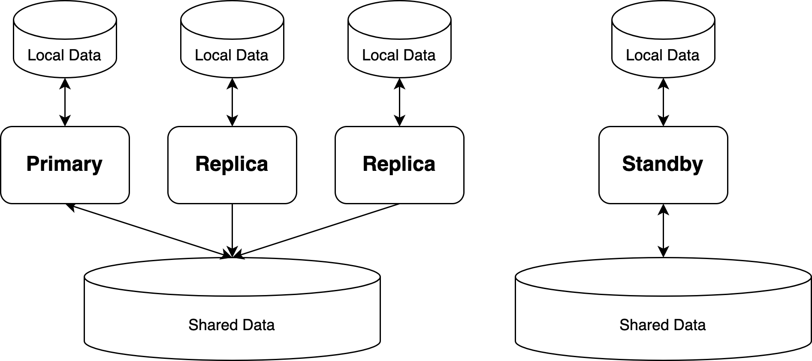

# 备份恢复

<ArticleInfo :frontmatter=$frontmatter></ArticleInfo>

PolarDB for PostgreSQL 采用基于共享存储的存算分离架构，其备份恢复和 PostgreSQL 存在部分差异。本文将指导您如何对 PolarDB for PostgreSQL 进行备份，并通过备份来搭建 Replica 节点或 Standby 节点。

[[toc]]

## 备份恢复原理

PostgreSQL 的备份流程可以总结为以下几步：

1. 进入备份模式
   - 强制进入 Full Page Write 模式，并切换当前的 WAL segment 文件
   - 在数据目录下创建 `backup_label` 文件，其中包含基础备份的起始点位置
   - 备份的恢复必须从一个内存数据与磁盘数据一致的检查点开始，所以将等待下一次检查点的到来，或立刻强制进行一次 `CHECKPOINT`
2. 备份数据库：使用文件系统级别的工具进行备份
3. 退出备份模式
   - 重置 Full Page Write 模式，并切换到下一个 WAL segment 文件
   - 创建备份历史文件，包含当前基础备份的起止 WAL 位置，并删除 `backup_label` 文件

备份 PostgreSQL 数据库最简便方法是使用 `pg_basebackup` 工具。

## 数据目录结构

PolarDB for PostgreSQL 采用基于共享存储的存算分离架构，其数据目录分为以下两类：

- 本地数据目录：位于每个计算节点的本地存储上，为每个计算节点私有
- 共享数据目录：位于共享存储上，被所有计算节点共享



由于本地数据目录中的目录和文件不涉及数据库的核心数据，因此在备份数据库时，备份本地数据目录是可选的。可以仅备份共享存储上的数据目录，然后使用 `initdb` 重新生成新的本地存储目录。但是计算节点的本地配置文件需要被手动备份，如 `postgresql.conf`、`pg_hba.conf` 等文件。

### 本地数据目录

通过以下 SQL 命令可以查看节点的本地数据目录：

```sql:no-line-numbers
postgres=# SHOW data_directory;
     data_directory
------------------------
 /home/postgres/primary
(1 row)
```

本地数据目录类似于 PostgreSQL 的数据目录，大多数目录和文件都是通过 `initdb` 生成的。随着数据库服务的运行，本地数据目录中会产生更多的本地文件，如临时文件、缓存文件、配置文件、日志文件等。其结构如下：

```shell:no-line-numbers
$ tree ./ -L 1
./
├── base
├── current_logfiles
├── global
├── pg_commit_ts
├── pg_csnlog
├── pg_dynshmem
├── pg_hba.conf
├── pg_ident.conf
├── pg_log
├── pg_logical
├── pg_logindex
├── pg_multixact
├── pg_notify
├── pg_replslot
├── pg_serial
├── pg_snapshots
├── pg_stat
├── pg_stat_tmp
├── pg_subtrans
├── pg_tblspc
├── PG_VERSION
├── pg_xact
├── polar_cache_trash
├── polar_dma.conf
├── polar_fullpage
├── polar_node_static.conf
├── polar_rel_size_cache
├── polar_shmem
├── polar_shmem_stat_file
├── postgresql.auto.conf
├── postgresql.conf
├── postmaster.opts
└── postmaster.pid

21 directories, 12 files
```

### 共享数据目录

通过以下 SQL 命令可以查看所有计算节点在共享存储上的共享数据目录：

```sql:no-line-numbers
postgres=# SHOW polar_datadir;
     polar_datadir
-----------------------
 /nvme1n1/shared_data/
(1 row)
```

共享数据目录中存放 PolarDB for PostgreSQL 的核心数据文件，如表文件、索引文件、WAL 日志、DMA、LogIndex、Flashback Log 等。这些文件被所有节点共享，因此必须被备份。其结构如下：

```shell:no-line-numbers
$ sudo pfs -C disk ls /nvme1n1/shared_data/
   Dir  1     512               Wed Jan 11 09:34:01 2023  base
   Dir  1     7424              Wed Jan 11 09:34:02 2023  global
   Dir  1     0                 Wed Jan 11 09:34:02 2023  pg_tblspc
   Dir  1     512               Wed Jan 11 09:35:05 2023  pg_wal
   Dir  1     384               Wed Jan 11 09:35:01 2023  pg_logindex
   Dir  1     0                 Wed Jan 11 09:34:02 2023  pg_twophase
   Dir  1     128               Wed Jan 11 09:34:02 2023  pg_xact
   Dir  1     0                 Wed Jan 11 09:34:02 2023  pg_commit_ts
   Dir  1     256               Wed Jan 11 09:34:03 2023  pg_multixact
   Dir  1     0                 Wed Jan 11 09:34:03 2023  pg_csnlog
   Dir  1     256               Wed Jan 11 09:34:03 2023  polar_dma
   Dir  1     512               Wed Jan 11 09:35:09 2023  polar_fullpage
  File  1     32                Wed Jan 11 09:35:00 2023  RWID
   Dir  1     256               Wed Jan 11 10:25:42 2023  pg_replslot
  File  1     224               Wed Jan 11 10:19:37 2023  polar_non_exclusive_backup_label
total 16384 (unit: 512Bytes)
```

## polar_basebackup 备份工具

PolarDB for PostgreSQL 的备份工具 `polar_basebackup`，由 PostgreSQL 的 [`pg_basebackup`](https://www.postgresql.org/docs/11/app-pgbasebackup.html) 改造而来，完全兼容 `pg_basebackup`，因此同样可以用于对 PostgreSQL 做备份恢复。`polar_basebackup` 的可执行文件位于 PolarDB for PostgreSQL 安装目录下的 `bin/` 目录中。

该工具的主要功能是将一个运行中的 PolarDB for PostgreSQL 数据库的数据目录（包括本地数据目录和共享数据目录）备份到目标目录中。

```shell
polar_basebackup takes a base backup of a running PostgreSQL server.

Usage:
  polar_basebackup [OPTION]...

Options controlling the output:
  -D, --pgdata=DIRECTORY receive base backup into directory
  -F, --format=p|t       output format (plain (default), tar)
  -r, --max-rate=RATE    maximum transfer rate to transfer data directory
                         (in kB/s, or use suffix "k" or "M")
  -R, --write-recovery-conf
                         write recovery.conf for replication
  -T, --tablespace-mapping=OLDDIR=NEWDIR
                         relocate tablespace in OLDDIR to NEWDIR
      --waldir=WALDIR    location for the write-ahead log directory
  -X, --wal-method=none|fetch|stream
                         include required WAL files with specified method
  -z, --gzip             compress tar output
  -Z, --compress=0-9     compress tar output with given compression level

General options:
  -c, --checkpoint=fast|spread
                         set fast or spread checkpointing
  -C, --create-slot      create replication slot
  -l, --label=LABEL      set backup label
  -n, --no-clean         do not clean up after errors
  -N, --no-sync          do not wait for changes to be written safely to disk
  -P, --progress         show progress information
  -S, --slot=SLOTNAME    replication slot to use
  -v, --verbose          output verbose messages
  -V, --version          output version information, then exit
      --no-slot          prevent creation of temporary replication slot
      --no-verify-checksums
                         do not verify checksums
  -?, --help             show this help, then exit

Connection options:
  -d, --dbname=CONNSTR   connection string
  -h, --host=HOSTNAME    database server host or socket directory
  -p, --port=PORT        database server port number
  -s, --status-interval=INTERVAL
                         time between status packets sent to server (in seconds)
  -U, --username=NAME    connect as specified database user
  -w, --no-password      never prompt for password
  -W, --password         force password prompt (should happen automatically)
      --polardata=datadir  receive polar data backup into directory
      --polar_disk_home=disk_home  polar_disk_home for polar data backup
      --polar_host_id=host_id  polar_host_id for polar data backup
      --polar_storage_cluster_name=cluster_name  polar_storage_cluster_name for polar data backup
```

`polar_basebackup` 的参数及用法几乎和 `pg_basebackup` 一致，新增了以下与共享存储相关的参数：

- `--polar_disk_home` / `--polar_host_id` / `--polar_storage_cluster_name`：这三个参数指定了用于存放备份共享数据的共享存储节点
- `--polardata`：该参数指定了备份共享存储节点上存放共享数据的路径；如不指定，则默认将共享数据备份到本地数据备份目录的 `polar_shared_data/` 路径下

## 备份并恢复一个 Replica 节点

基础备份可用于搭建一个新的 Replica（RO）节点。如前文所述，一个正在运行中的 PolarDB for PostgreSQL 实例的数据文件分布在各计算节点的本地存储和存储节点的共享存储中。下面将说明如何使用 `polar_basebackup` 将实例的数据文件备份到一个本地磁盘上，并从这个备份上启动一个 Replica 节点。

### PFS 文件系统挂载

首先，在将要部署 Replica 节点的机器上启动 PFSD 守护进程，挂载到正在运行中的共享存储的 PFS 文件系统上。后续启动的 Replica 节点将使用这个守护进程来访问共享存储。

```shell:no-line-numbers
sudo /usr/local/polarstore/pfsd/bin/start_pfsd.sh -p nvme1n1 -w 2
```

### 备份数据到本地存储

运行如下命令，将实例 Primary 节点的本地数据和共享数据备份到用于部署 Replica 节点的本地存储路径 `/home/postgres/replica1` 下：

```shell:no-line-numbers
polar_basebackup \
    --host=[Primary节点所在IP] \
    --port=[Primary节点所在端口号] \
    -D /home/postgres/replica1 \
    -X stream --progress --write-recovery-conf -v
```

将看到如下输出：

```shell:no-line-numbers
polar_basebackup: initiating base backup, waiting for checkpoint to complete
polar_basebackup: checkpoint completed
polar_basebackup: write-ahead log start point: 0/16ADD60 on timeline 1
polar_basebackup: starting background WAL receiver
polar_basebackup: created temporary replication slot "pg_basebackup_359"
851371/851371 kB (100%), 2/2 tablespaces
polar_basebackup: write-ahead log end point: 0/16ADE30
polar_basebackup: waiting for background process to finish streaming ...
polar_basebackup: base backup completed
```

备份完成后，可以以这个备份目录作为本地数据目录，启动一个新的 Replica 节点。由于本地数据目录中不需要共享存储上已有的共享数据文件，所以删除掉本地数据目录中的 `polar_shared_data/` 目录：

```shell:no-line-numbers
rm -rf ~/replica1/polar_shared_data
```

### 重新配置 Replica 节点

重新编辑 Replica 节点的配置文件 `~/replica1/postgresql.conf`：

```diff:no-line-numbers
-polar_hostid=1
+polar_hostid=2
-synchronous_standby_names='replica1'
```

重新编辑 Replica 节点的复制配置文件 `~/replica1/recovery.conf`：

```ini:no-line-numbers
polar_replica='on'
recovery_target_timeline='latest'
primary_slot_name='replica1'
primary_conninfo='host=[Primary节点所在IP] port=5432 user=postgres dbname=postgres application_name=replica1'
```

### Replica 节点启动

启动 Replica 节点：

```shell:no-line-numbers
pg_ctl -D $HOME/replica1 start
```

### Replica 节点验证

在 Primary 节点上执行建表并插入数据，在 Replica 节点上可以查到 Primary 节点插入的数据：

```shell:no-line-numbers
$ psql -q \
    -h [Primary节点所在IP] \
    -p 5432 \
    -d postgres \
    -c "CREATE TABLE t (t1 INT PRIMARY KEY, t2 INT); INSERT INTO t VALUES (1, 1),(2, 3),(3, 3);"

$ psql -q \
    -h [Replica节点所在IP] \
    -p 5432 \
    -d postgres \
    -c "SELECT * FROM t;"
 t1 | t2
----+----
  1 |  1
  2 |  3
  3 |  3
(3 rows)
```

## 备份并恢复一个 Standby 节点

基础备份也可以用于搭建一个新的 Standby 节点。如下图所示，Standby 节点与 Primary / Replica 节点各自使用独立的共享存储，与 Primary 节点使用物理复制保持同步。Standby 节点可用于作为主共享存储的灾备。


### PFS 文件系统格式化和挂载

假设此时用于部署 Standby 计算节点的机器已经准备好用于后备的共享存储 `nvme2n1`：

```shell:no-line-numbers
$ lsblk
NAME        MAJ:MIN RM SIZE RO TYPE MOUNTPOINT
nvme0n1     259:1    0  40G  0 disk
└─nvme0n1p1 259:2    0  40G  0 part /etc/hosts
nvme2n1     259:3    0  70G  0 disk
nvme1n1     259:0    0  60G  0 disk
```

将这个共享存储格式化为 PFS 格式，并启动 PFSD 守护进程挂载到 PFS 文件系统：

```shell:no-line-numbers
sudo pfs -C disk mkfs nvme2n1
sudo /usr/local/polarstore/pfsd/bin/start_pfsd.sh -p nvme2n1 -w 2
```

### 备份数据到本地存储和共享存储

在用于部署 Standby 节点的机器上执行备份，以 `~/standby` 作为本地数据目录，以 `/nvme2n1/shared_data` 作为共享存储目录：

```shell:no-line-numbers
polar_basebackup \
    --host=[Primary节点所在IP] \
    --port=[Primary节点所在端口号] \
    -D /home/postgres/standby \
    --polardata=/nvme2n1/shared_data/ \
    --polar_storage_cluster_name=disk \
    --polar_disk_name=nvme2n1 \
    --polar_host_id=3 \
    -X stream --progress --write-recovery-conf -v
```

将会看到如下输出。其中，除了 `polar_basebackup` 的输出以外，还有 PFS 的输出日志：

```shell:no-line-numbers
[PFSD_SDK INF Jan 11 10:11:27.247112][99]pfs_mount_prepare 103: begin prepare mount cluster(disk), PBD(nvme2n1), hostid(3),flags(0x13)
[PFSD_SDK INF Jan 11 10:11:27.247161][99]pfs_mount_prepare 165: pfs_mount_prepare success for nvme2n1 hostid 3
[PFSD_SDK INF Jan 11 10:11:27.293900][99]chnl_connection_poll_shm 1238: ack data update s_mount_epoch 1
[PFSD_SDK INF Jan 11 10:11:27.293912][99]chnl_connection_poll_shm 1266: connect and got ack data from svr, err = 0, mntid 0
[PFSD_SDK INF Jan 11 10:11:27.293979][99]pfsd_sdk_init 191: pfsd_chnl_connect success
[PFSD_SDK INF Jan 11 10:11:27.293987][99]pfs_mount_post 208: pfs_mount_post err : 0
[PFSD_SDK ERR Jan 11 10:11:27.297257][99]pfsd_opendir 1437: opendir /nvme2n1/shared_data/ error: No such file or directory
[PFSD_SDK INF Jan 11 10:11:27.297396][99]pfsd_mkdir 1320: mkdir /nvme2n1/shared_data
polar_basebackup: initiating base backup, waiting for checkpoint to complete
WARNING:  a labelfile "/nvme1n1/shared_data//polar_non_exclusive_backup_label" is already on disk
HINT:  POLAR: we overwrite it
polar_basebackup: checkpoint completed
polar_basebackup: write-ahead log start point: 0/16C91F8 on timeline 1
polar_basebackup: starting background WAL receiver
polar_basebackup: created temporary replication slot "pg_basebackup_373"
...
[PFSD_SDK INF Jan 11 10:11:32.992005][99]pfsd_open 539: open /nvme2n1/shared_data/polar_non_exclusive_backup_label with inode 6325, fd 0
[PFSD_SDK INF Jan 11 10:11:32.993074][99]pfsd_open 539: open /nvme2n1/shared_data/global/pg_control with inode 8373, fd 0
851396/851396 kB (100%), 2/2 tablespaces
polar_basebackup: write-ahead log end point: 0/16C9300
polar_basebackup: waiting for background process to finish streaming ...
polar_basebackup: base backup completed
[PFSD_SDK INF Jan 11 10:11:52.378220][99]pfsd_umount_force 247: pbdname nvme2n1
[PFSD_SDK INF Jan 11 10:11:52.378229][99]pfs_umount_prepare 269: pfs_umount_prepare. pbdname:nvme2n1
[PFSD_SDK INF Jan 11 10:11:52.404010][99]chnl_connection_release_shm 1164: client umount return : deleted /var/run/pfsd//nvme2n1/99.pid
[PFSD_SDK INF Jan 11 10:11:52.404171][99]pfs_umount_post 281: pfs_umount_post. pbdname:nvme2n1
[PFSD_SDK INF Jan 11 10:11:52.404174][99]pfsd_umount_force 261: umount success for nvme2n1
```

上述命令会在当前机器的本地存储上备份 Primary 节点的本地数据目录，在参数指定的共享存储目录上备份共享数据目录。

### 重新配置 Standby 节点

重新编辑 Standby 节点的配置文件 `~/standby/postgresql.conf`：

```diff:no-line-numbers
-polar_hostid=1
+polar_hostid=3
-polar_disk_name='nvme1n1'
-polar_datadir='/nvme1n1/shared_data/'
+polar_disk_name='nvme2n1'
+polar_datadir='/nvme2n1/shared_data/'
-synchronous_standby_names='replica1'
```

在 Standby 节点的复制配置文件 `~/standby/recovery.conf` 中添加：

```diff:no-line-numbers
+recovery_target_timeline = 'latest'
+primary_slot_name = 'standby1'
```

### Standby 节点启动

在 Primary 节点上创建用于与 Standby 进行物理复制的复制槽：

```shell:no-line-numbers
$ psql \
    --host=[Primary节点所在IP] --port=5432 \
    -d postgres \
    -c "SELECT * FROM pg_create_physical_replication_slot('standby1');"
 slot_name | lsn
-----------+-----
 standby1  |
(1 row)
```

启动 Standby 节点：

```shell:no-line-numbers
pg_ctl -D $HOME/standby start
```

### Standby 节点验证

在 Primary 节点上创建表并插入数据，在 Standby 节点上可以查询到数据：

```shell:no-line-numbers
$ psql -q \
    -h [Primary节点所在IP] \
    -p 5432 \
    -d postgres \
    -c "CREATE TABLE t (t1 INT PRIMARY KEY, t2 INT); INSERT INTO t VALUES (1, 1),(2, 3),(3, 3);"

$ psql -q \
    -h [Standby节点所在IP] \
    -p 5432 \
    -d postgres \
    -c "SELECT * FROM t;"
 t1 | t2
----+----
  1 |  1
  2 |  3
  3 |  3
(3 rows)
```
