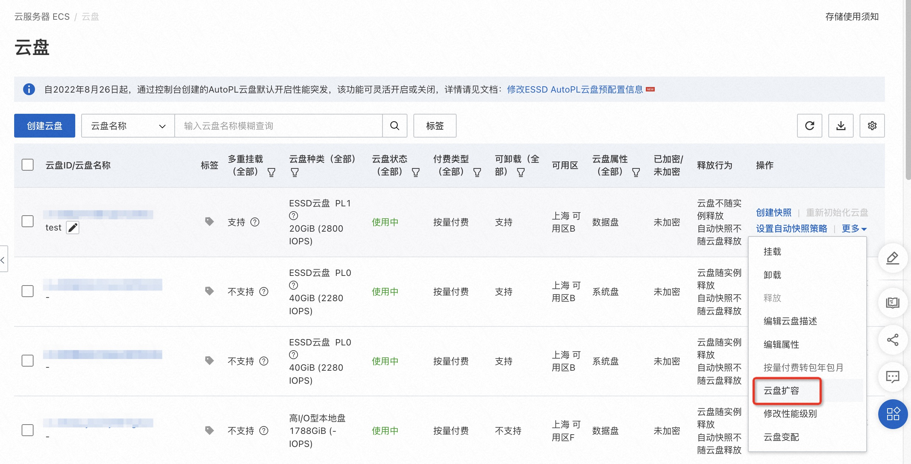
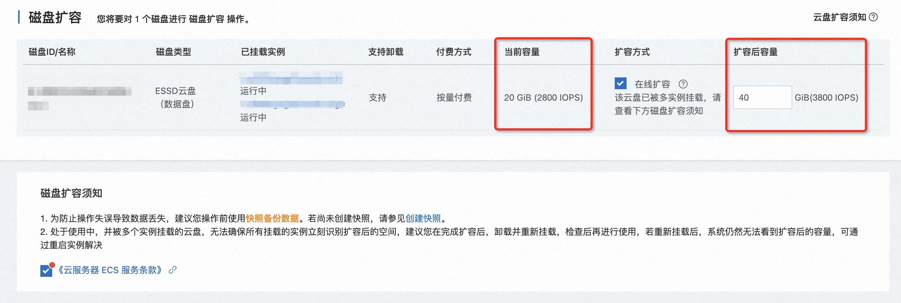
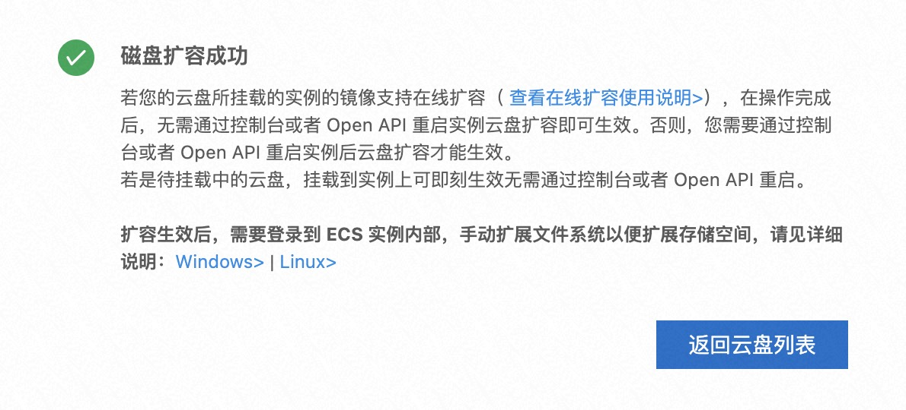

# 共享存储在线扩容 <a href="https://developer.aliyun.com/live/250669"><Badge type="tip" text="视频" vertical="top" /></a>

<ArticleInfo :frontmatter=$frontmatter></ArticleInfo>

在使用数据库时，随着数据量的逐渐增大，不可避免需要对数据库所使用的存储空间进行扩容。由于 PolarDB for PostgreSQL 基于共享存储与分布式文件系统 PFS 的架构设计，与安装部署时类似，在扩容时，需要在以下三个层面分别进行操作：

[[toc]]

本文将指导您分别在以上三个层面上分别完成扩容操作，以实现不停止数据库实例的动态扩容。

## 块存储层扩容

首先需要进行的是块存储层面上的扩容。不管使用哪种类型的共享存储，存储层面扩容最终需要达成的目的是：在能够访问共享存储的主机上运行 `lsblk` 命令，显示存储块设备的物理空间变大。由于不同类型的共享存储有不同的扩容方式，本文以 [阿里云 ECS + ESSD 云盘共享存储](../deploying/storage-aliyun-essd.md) 为例演示如何进行存储层面的扩容。

另外，为保证后续扩容步骤的成功，请以 10GB 为单位进行扩容。

本示例中，在扩容之前，已有一个 20GB 的 ESSD 云盘多重挂载在两台 ECS 上。在这两台 ECS 上运行 `lsblk`，可以看到 ESSD 云盘共享存储对应的块设备 `nvme1n1` 目前的物理空间为 20GB。

```shell:no-line-numbers
$ lsblk
NAME        MAJ:MIN RM SIZE RO TYPE MOUNTPOINT
nvme0n1     259:0    0  40G  0 disk
└─nvme0n1p1 259:1    0  40G  0 part /etc/hosts
nvme1n1     259:2    0  20G  0 disk
```

接下来对这块 ESSD 云盘进行扩容。在阿里云 ESSD 云盘的管理页面上，点击 **云盘扩容**：



进入到云盘扩容界面以后，可以看到该云盘已被两台 ECS 实例多重挂载。填写扩容后的容量，然后点击确认扩容，把 20GB 的云盘扩容为 40GB：



扩容成功后，将会看到如下提示：



此时，两台 ECS 上运行 `lsblk`，可以看到 ESSD 对应块设备 `nvme1n1` 的物理空间已经变为 40GB：

```shell:no-line-numbers
$ lsblk
NAME        MAJ:MIN RM SIZE RO TYPE MOUNTPOINT
nvme0n1     259:0    0  40G  0 disk
└─nvme0n1p1 259:1    0  40G  0 part /etc/hosts
nvme1n1     259:2    0  40G  0 disk
```

至此，块存储层面的扩容就完成了。

## 文件系统层扩容

在物理块设备完成扩容以后，接下来需要使用 PFS 文件系统提供的工具，对块设备上扩大后的物理空间进行格式化，以完成文件系统层面的扩容。

在能够访问共享存储的 **任意一台主机上** 运行 PFS 的 `growfs` 命令，其中：

- `-o` 表示共享存储扩容前的空间（以 10GB 为单位）
- `-n` 表示共享存储扩容后的空间（以 10GB 为单位）

本例将共享存储从 20GB 扩容至 40GB，所以参数分别填写 `2` 和 `4`：

```shell:no-line-numbers
$ sudo pfs -C disk growfs -o 2 -n 4 nvme1n1

...

Init chunk 2
                metaset        2/1: sectbda      0x500001000, npage       80, objsize  128, nobj 2560, oid range [    2000,     2a00)
                metaset        2/2: sectbda      0x500051000, npage       64, objsize  128, nobj 2048, oid range [    1000,     1800)
                metaset        2/3: sectbda      0x500091000, npage       64, objsize  128, nobj 2048, oid range [    1000,     1800)

Init chunk 3
                metaset        3/1: sectbda      0x780001000, npage       80, objsize  128, nobj 2560, oid range [    3000,     3a00)
                metaset        3/2: sectbda      0x780051000, npage       64, objsize  128, nobj 2048, oid range [    1800,     2000)
                metaset        3/3: sectbda      0x780091000, npage       64, objsize  128, nobj 2048, oid range [    1800,     2000)

pfs growfs succeeds!
```

如果看到上述输出，说明文件系统层面的扩容已经完成。

## 数据库实例层扩容

最后，在数据库实例层，扩容需要做的工作是执行 SQL 函数来通知每个实例上已经挂载到共享存储的 PFSD（PFS Daemon）守护进程，告知共享存储上的新空间已经可以被使用了。需要注意的是，数据库实例集群中的 **所有** PFSD 都需要被通知到，并且需要 **先通知所有 RO 节点上的 PFSD，最后通知 RW 节点上的 PFSD**。这意味着我们需要在 **每一个** PolarDB for PostgreSQL 节点上执行一次通知 PFSD 的 SQL 函数，并且 **RO 节点在先，RW 节点在后**。

数据库实例层通知 PFSD 的扩容函数实现在 PolarDB for PostgreSQL 的 `polar_vfs` 插件中，所以首先需要在 **RW 节点** 上加载 `polar_vfs` 插件。在加载插件的过程中，会在 RW 节点和所有 RO 节点上注册好 `polar_vfs_disk_expansion` 这个 SQL 函数。

```sql:no-line-numbers
CREATE EXTENSION IF NOT EXISTS polar_vfs;
```

接下来，**依次** 在所有的 RO 节点上，再到 RW 节点上 **分别** 执行这个 SQL 函数。其中函数的参数名为块设备名：

```sql:no-line-numbers
SELECT polar_vfs_disk_expansion('nvme1n1');
```

执行完毕后，数据库实例层面的扩容也就完成了。此时，新的存储空间已经能够被数据库使用了。
