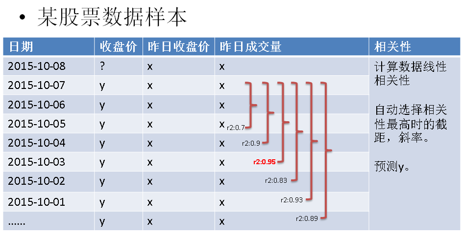

# PolarDB 机器学习功能的使用

<ArticleInfo :frontmatter=$frontmatter></ArticleInfo>

## 背景

PolarDB 的云原生存算分离架构, 具备低廉的数据存储、高效扩展弹性、高速多机并行计算能力、高速数据搜索和处理; PolarDB 与计算算法结合, 将实现双剑合璧, 推动业务数据的价值产出, 将数据变成生产力.

本文将介绍 PolarDB 结合 madlib, 让 PolarDB 具备机器学习功能.

madlib 库无疑是大而全的数据库机器学习库,

- Deep Learning
- Graph
- Model Selection
- Sampling
- Statistics
- Supervised Learning
- Time Series Analysis
- Unsupervised Learning

## 将 madlib 安装到 PolarDB, 让 PolarDB 具备机器学习功能

这个例子直接在 PolarDB 容器中部署 pgcat.

PolarDB 部署请参考:

- [《如何用 PolarDB 证明巴菲特的投资理念 - 包括 PolarDB 简单部署》](https://github.com/digoal/blog/blob/master/202209/20220908_02.md)

进入 PolarDB 环境

```
docker exec -it 67e1eed1b4b6 bash
```

下载 madlib rpm

https://cwiki.apache.org/confluence/display/MADLIB/Installation+Guide

```
wget https://dist.apache.org/repos/dist/release/madlib/1.20.0/apache-madlib-1.20.0-CentOS7.rpm
```

安装 madlib

```
sudo rpm -ivh apache-madlib-1.20.0-CentOS7.rpm
```

加载 madlib 到 PolarDB 数据库对应 DB 中(非 extension 管理)

```
/usr/local/madlib/bin/madpack -s madlib -p postgres -c [user[/password]@][host][:port][/database] install

or

/usr/local/madlib/bin/madpack -s madlib -p postgres install
```

测试 madlib 安装正确性

```
/usr/local/madlib/bin/madpack -s madlib -p postgres install-check
```

使用 madlib

```
[postgres@67e1eed1b4b6 ~]$ psql -h 127.0.0.1
psql (11.9)
Type "help" for help.

postgres=# set search_path =madlib, "$user", public;
SET


postgres=# \dT+
                                                               List of data types
 Schema |               Name                |           Internal name           | Size  | Elements |  Owner   | Access privileges | Description
--------+-----------------------------------+-----------------------------------+-------+----------+----------+-------------------+-------------
 madlib | args_and_value_double             | args_and_value_double             | tuple |          | postgres |                   |
 madlib | __arima_lm_result                 | __arima_lm_result                 | tuple |          | postgres |                   |
 madlib | __arima_lm_stat_result            | __arima_lm_stat_result            | tuple |          | postgres |                   |
 madlib | __arima_lm_sum_result             | __arima_lm_sum_result             | tuple |          | postgres |                   |
 madlib | assoc_rules_results               | assoc_rules_results               | tuple |          | postgres |                   |
 madlib | bytea8                            | bytea8                            | var   |          | postgres |                   |
 madlib | _cat_levels_type                  | _cat_levels_type                  | tuple |          | postgres |                   |
 madlib | chi2_test_result                  | chi2_test_result                  | tuple |          | postgres |                   |
 madlib | closest_column_result             | closest_column_result             | tuple |          | postgres |                   |
 madlib | closest_columns_result            | closest_columns_result            | tuple |          | postgres |                   |
 madlib | __clustered_agg_result            | __clustered_agg_result            | tuple |          | postgres |                   |
 madlib | __clustered_lin_result            | __clustered_lin_result            | tuple |          | postgres |                   |
 madlib | __clustered_log_result            | __clustered_log_result            | tuple |          | postgres |                   |
 madlib | __clustered_mlog_result           | __clustered_mlog_result           | tuple |          | postgres |                   |
 madlib | complex                           | complex                           | tuple |          | postgres |                   |
 madlib | __coxph_a_b_result                | __coxph_a_b_result                | tuple |          | postgres |                   |
 madlib | __coxph_cl_var_result             | __coxph_cl_var_result             | tuple |          | postgres |                   |
 madlib | coxph_result                      | coxph_result                      | tuple |          | postgres |                   |
 madlib | coxph_step_result                 | coxph_step_result                 | tuple |          | postgres |                   |
 madlib | cox_prop_hazards_result           | cox_prop_hazards_result           | tuple |          | postgres |                   |
 madlib | __cox_resid_stat_result           | __cox_resid_stat_result           | tuple |          | postgres |                   |
 madlib | __dbscan_edge                     | __dbscan_edge                     | tuple |          | postgres |                   |
 madlib | __dbscan_losses                   | __dbscan_losses                   | tuple |          | postgres |                   |
 madlib | __dbscan_record                   | __dbscan_record                   | tuple |          | postgres |                   |
 madlib | dense_linear_solver_result        | dense_linear_solver_result        | tuple |          | postgres |                   |
 madlib | __elastic_net_result              | __elastic_net_result              | tuple |          | postgres |                   |
 madlib | _flattened_tree                   | _flattened_tree                   | tuple |          | postgres |                   |
 madlib | f_test_result                     | f_test_result                     | tuple |          | postgres |                   |
 madlib | __glm_result_type                 | __glm_result_type                 | tuple |          | postgres |                   |
 madlib | _grp_state_type                   | _grp_state_type                   | tuple |          | postgres |                   |
 madlib | heteroskedasticity_test_result    | heteroskedasticity_test_result    | tuple |          | postgres |                   |
 madlib | kmeans_result                     | kmeans_result                     | tuple |          | postgres |                   |
 madlib | kmeans_state                      | kmeans_state                      | tuple |          | postgres |                   |
 madlib | ks_test_result                    | ks_test_result                    | tuple |          | postgres |                   |
 madlib | lda_result                        | lda_result                        | tuple |          | postgres |                   |
 madlib | lincrf_result                     | lincrf_result                     | tuple |          | postgres |                   |
 madlib | linear_svm_result                 | linear_svm_result                 | tuple |          | postgres |                   |
 madlib | linregr_result                    | linregr_result                    | tuple |          | postgres |                   |
 madlib | lmf_result                        | lmf_result                        | tuple |          | postgres |                   |
 madlib | __logregr_result                  | __logregr_result                  | tuple |          | postgres |                   |
 madlib | marginal_logregr_result           | marginal_logregr_result           | tuple |          | postgres |                   |
 madlib | marginal_mlogregr_result          | marginal_mlogregr_result          | tuple |          | postgres |                   |
 madlib | margins_result                    | margins_result                    | tuple |          | postgres |                   |
 madlib | matrix_result                     | matrix_result                     | tuple |          | postgres |                   |
 madlib | __mlogregr_cat_coef               | __mlogregr_cat_coef               | tuple |          | postgres |                   |
 madlib | mlogregr_result                   | mlogregr_result                   | tuple |          | postgres |                   |
 madlib | mlogregr_summary_result           | mlogregr_summary_result           | tuple |          | postgres |                   |
 madlib | mlp_result                        | mlp_result                        | tuple |          | postgres |                   |
 madlib | __multinom_result_type            | __multinom_result_type            | tuple |          | postgres |                   |
 madlib | mw_test_result                    | mw_test_result                    | tuple |          | postgres |                   |
 madlib | one_way_anova_result              | one_way_anova_result              | tuple |          | postgres |                   |
 madlib | __ordinal_result_type             | __ordinal_result_type             | tuple |          | postgres |                   |
 madlib | path_match_result                 | path_match_result                 | tuple |          | postgres |                   |
 madlib | _pivotalr_lda_model               | _pivotalr_lda_model               | tuple |          | postgres |                   |
 madlib | _prune_result_type                | _prune_result_type                | tuple |          | postgres |                   |
 madlib | __rb_coxph_hs_result              | __rb_coxph_hs_result              | tuple |          | postgres |                   |
 madlib | __rb_coxph_result                 | __rb_coxph_result                 | tuple |          | postgres |                   |
 madlib | residual_norm_result              | residual_norm_result              | tuple |          | postgres |                   |
 madlib | robust_linregr_result             | robust_linregr_result             | tuple |          | postgres |                   |
 madlib | robust_logregr_result             | robust_logregr_result             | tuple |          | postgres |                   |
 madlib | robust_mlogregr_result            | robust_mlogregr_result            | tuple |          | postgres |                   |
 madlib | sparse_linear_solver_result       | sparse_linear_solver_result       | tuple |          | postgres |                   |
 madlib | summary_result                    | summary_result                    | tuple |          | postgres |                   |
 madlib | __svd_bidiagonal_matrix_result    | __svd_bidiagonal_matrix_result    | tuple |          | postgres |                   |
 madlib | __svd_lanczos_result              | __svd_lanczos_result              | tuple |          | postgres |                   |
 madlib | __svd_vec_mat_mult_result         | __svd_vec_mat_mult_result         | tuple |          | postgres |                   |
 madlib | svec                              | svec                              | var   |          | postgres |                   |
 madlib | _tree_result_type                 | _tree_result_type                 | tuple |          | postgres |                   |
 madlib | t_test_result                     | t_test_result                     | tuple |          | postgres |                   |
 madlib | __utils_scales                    | __utils_scales                    | tuple |          | postgres |                   |
 madlib | wsr_test_result                   | wsr_test_result                   | tuple |          | postgres |                   |
 madlib | xgb_gridsearch_train_results_type | xgb_gridsearch_train_results_type | tuple |          | postgres |                   |
 public | vector                            | vector                            | var   |          | postgres |                   |
(73 rows)

postgres=#   \do+
                                                    List of operators
 Schema | Name |   Left arg type    |   Right arg type   |   Result type    |           Function            | Description
--------+------+--------------------+--------------------+------------------+-------------------------------+-------------
 madlib | %*%  | double precision[] | double precision[] | double precision | madlib.svec_dot               |
 madlib | %*%  | double precision[] | svec               | double precision | madlib.svec_dot               |
 madlib | %*%  | svec               | double precision[] | double precision | madlib.svec_dot               |
 madlib | %*%  | svec               | svec               | double precision | madlib.svec_dot               |
 madlib | *    | double precision[] | double precision[] | svec             | float8arr_mult_float8arr      |
 madlib | *    | double precision[] | svec               | svec             | float8arr_mult_svec           |
 madlib | *    | svec               | double precision[] | svec             | svec_mult_float8arr           |
 madlib | *    | svec               | svec               | svec             | svec_mult                     |
 madlib | *||  | integer            | svec               | svec             | svec_concat_replicate         |
 madlib | +    | double precision[] | double precision[] | svec             | float8arr_plus_float8arr      |
 madlib | +    | double precision[] | svec               | svec             | float8arr_plus_svec           |
 madlib | +    | svec               | double precision[] | svec             | svec_plus_float8arr           |
 madlib | +    | svec               | svec               | svec             | svec_plus                     |
 madlib | -    | double precision[] | double precision[] | svec             | float8arr_minus_float8arr     |
 madlib | -    | double precision[] | svec               | svec             | float8arr_minus_svec          |
 madlib | -    | svec               | double precision[] | svec             | svec_minus_float8arr          |
 madlib | -    | svec               | svec               | svec             | svec_minus                    |
 madlib | /    | double precision[] | double precision[] | svec             | float8arr_div_float8arr       |
 madlib | /    | double precision[] | svec               | svec             | float8arr_div_svec            |
 madlib | /    | svec               | double precision[] | svec             | svec_div_float8arr            |
 madlib | /    | svec               | svec               | svec             | svec_div                      |
 madlib | <    | svec               | svec               | boolean          | svec_lt                       |
 madlib | <=   | svec               | svec               | boolean          | svec_le                       |
 madlib | <>   | svec               | svec               | boolean          | svec_ne                       |
 madlib | =    | svec               | svec               | boolean          | svec_eq                       |
 madlib | ==   | svec               | svec               | boolean          | svec_eq                       |
 madlib | >    | svec               | svec               | boolean          | svec_gt                       |
 madlib | >=   | svec               | svec               | boolean          | svec_ge                       |
 madlib | ^    | svec               | svec               | svec             | svec_pow                      |
 madlib | ||   | svec               | svec               | svec             | svec_concat                   |
 public | +    | vector             | vector             | vector           | vector_add                    |
 public | -    | vector             | vector             | vector           | vector_sub                    |
 public | <    | vector             | vector             | boolean          | vector_lt                     |
 public | <#>  | vector             | vector             | double precision | vector_negative_inner_product |
 public | <->  | vector             | vector             | double precision | l2_distance                   |
 public | <=   | vector             | vector             | boolean          | vector_le                     |
 public | <=>  | vector             | vector             | double precision | cosine_distance               |
 public | <>   | vector             | vector             | boolean          | vector_ne                     |
 public | =    | vector             | vector             | boolean          | vector_eq                     |
 public | >    | vector             | vector             | boolean          | vector_gt                     |
 public | >=   | vector             | vector             | boolean          | vector_ge                     |
(41 rows)
```

## madlib 例子: 通过多元回归预测股价

内置的回归函数仅仅支持一元回归，也就是说只用了 1 个自变量。例如用昨天的收盘价预测今天的收盘价，但是元素太单一的话，除非自变量的影响因素非常大，否则容易不准。

多元回归考虑的因素更多，例如，昨天的成交量+收盘价+开盘价三组数据预测下一天的收盘价。

PolarDB for PostgreSQL 可以通过 MADlib 库来实现多元回归。

举例：

p 元线性回归公式

```
y1=b0+b1x11+b2x12+…+bpx1p+ε1
y2=b0+b1x21+b2x22+…+bpx2p+ε2
………………
```

1\. 求截距，斜率。

2\. 预测 yn

```
yn=b0+b1xn1+b2xn2+…+bpxnp+εn
```

R 公式

```
lm(y: 收盘价 ~ x1: 昨日收盘价 + x2: 昨日成交量, $DATA)
```



用法举例：

http://doc.madlib.net/latest/group__grp__linreg.html

```
Create an input data set.
CREATE TABLE houses (id INT, tax INT, bedroom INT, bath FLOAT, price INT,
            size INT, lot INT);
COPY houses FROM STDIN WITH DELIMITER '|';
  1 |  590 |       2 |    1 |  50000 |  770 | 22100
  2 | 1050 |       3 |    2 |  85000 | 1410 | 12000
  3 |   20 |       3 |    1 |  22500 | 1060 |  3500
  4 |  870 |       2 |    2 |  90000 | 1300 | 17500
  5 | 1320 |       3 |    2 | 133000 | 1500 | 30000
  6 | 1350 |       2 |    1 |  90500 |  820 | 25700
  7 | 2790 |       3 |  2.5 | 260000 | 2130 | 25000
  8 |  680 |       2 |    1 | 142500 | 1170 | 22000
  9 | 1840 |       3 |    2 | 160000 | 1500 | 19000
 10 | 3680 |       4 |    2 | 240000 | 2790 | 20000
 11 | 1660 |       3 |    1 |  87000 | 1030 | 17500
 12 | 1620 |       3 |    2 | 118600 | 1250 | 20000
 13 | 3100 |       3 |    2 | 140000 | 1760 | 38000
 14 | 2070 |       2 |    3 | 148000 | 1550 | 14000
 15 |  650 |       3 |  1.5 |  65000 | 1450 | 12000
\.
```

预测模型

```
linregr_train( source_table,
               out_table,
               dependent_varname,
               independent_varname,
               grouping_cols,  -- 可选
               heteroskedasticity_option  -- 可选
             )

Train a regression model. First, a single regression for all the data.
```

houses 中包含了历史数据，有自变量，有因变量。

其中 price 是因变量，tax, bath, size 是自变量。即三元回归。

houses_linregr 存放线性回归的统计值。包括相关性，R2，标准差，P 值等。

```
SELECT madlib.linregr_train( 'houses',
                             'houses_linregr',
                             'price',
                             'ARRAY[1, tax, bath, size]'
                           );
```

当需要根据来源数据分组预测时，你可以加入分组字段。

```
Generate three output models, one for each value of "bedroom".

SELECT madlib.linregr_train( 'houses',
                             'houses_linregr_bedroom',
                             'price',
                             'ARRAY[1, tax, bath, size]',
                             'bedroom'
                           );

Examine the resulting models.

-- Set extended display on for easier reading of output

\x ON

SELECT * FROM houses_linregr;
Result:
-[ RECORD 1 ]+---------------------------------------------------------------------------
coef         | {-12849.4168959872,28.9613922651765,10181.6290712648,50.516894915354}
r2           | 0.768577580597443
std_err      | {33453.0344331391,15.8992104963997,19437.7710925923,32.928023174087}
t_stats      | {-0.38410317968819,1.82156166004184,0.523806408809133,1.53416118083605}
p_values     | {0.708223134615422,0.0958005827189772,0.610804093526536,0.153235085548186}
condition_no | 9002.50457085737
```

这个 r2 只有 0.76，相关性不太好，所以依旧需要用我之前提到的方法来获得好的相关性，即动态数据段计算。

```
View the results grouped by bedroom.
SELECT * FROM houses_linregr_bedroom;
Result:
-[ RECORD 1 ]+--------------------------------------------------------------------------
bedroom      | 2
coef         | {-84242.0345406597,55.4430144648696,-78966.9753675319,225.611910021192}
r2           | 0.968809546465313
std_err      | {35018.9991665742,19.5731125320686,23036.8071292552,49.0448678148784}
t_stats      | {-2.40560942761235,2.83261103077151,-3.42786111480046,4.60011251070697}
p_values     | {0.250804617665239,0.21605133377602,0.180704400437373,0.136272031474122}
condition_no | 10086.1048721726
-[ RECORD 2 ]+--------------------------------------------------------------------------
bedroom      | 4
coef         | {0.0112536020318378,41.4132554771633,0.0225072040636757,31.3975496688276}
r2           | 1
std_err      | {0,0,0,0}
t_stats      | {Infinity,Infinity,Infinity,Infinity}
p_values     |
condition_no | Infinity
-[ RECORD 3 ]+--------------------------------------------------------------------------
bedroom      | 3
coef         | {-88155.8292501601,27.1966436294429,41404.0293363612,62.637521075324}
r2           | 0.841699901311252
std_err      | {57867.9999702625,17.8272309154689,43643.1321511114,70.8506824863954}
t_stats      | {-1.52339512849005,1.52556747362508,0.948695185143966,0.884077878676067}
p_values     | {0.188161432894871,0.187636685729869,0.386340032374927,0.417132778705789}
condition_no | 11722.6225642147

Alternatively you can unnest the results for easier reading of output.
\x OFF
SELECT unnest(ARRAY['intercept','tax','bath','size']) as attribute,
       unnest(coef) as coefficient,
       unnest(std_err) as standard_error,
       unnest(t_stats) as t_stat,
       unnest(p_values) as pvalue
FROM houses_linregr;
Use the prediction function to evaluate residuals.
SELECT houses.*,
       madlib.linregr_predict( ARRAY[1,tax,bath,size],
                               m.coef
                             ) as predict,
        price -
          madlib.linregr_predict( ARRAY[1,tax,bath,size],
                                  m.coef
                                ) as residual
FROM houses, houses_linregr m;
```

在获得了好的 R2 之后，就可以拿这组数据预测下一组数据了。

## 参考

https://madlib.apache.org/docs/latest/index.html

https://cwiki.apache.org/confluence/display/MADLIB/Installation+Guide
