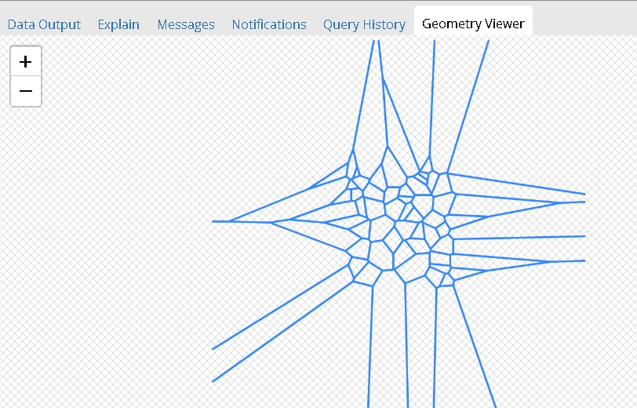
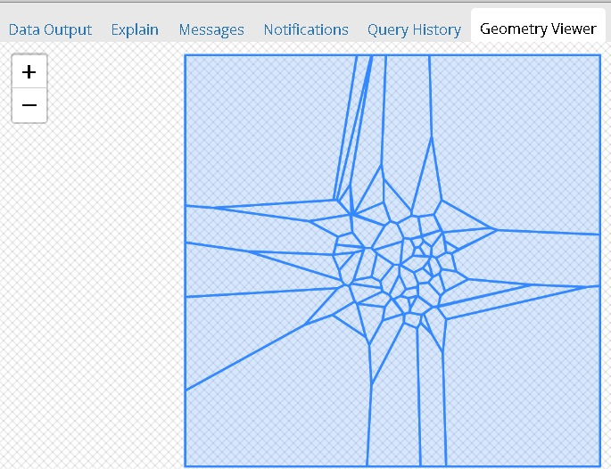
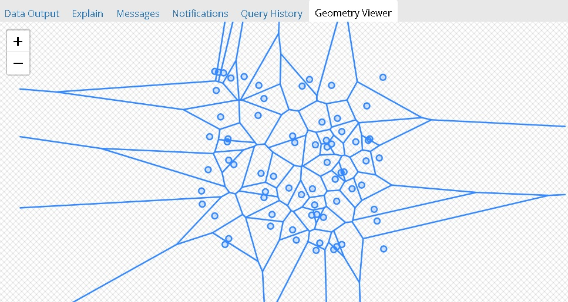
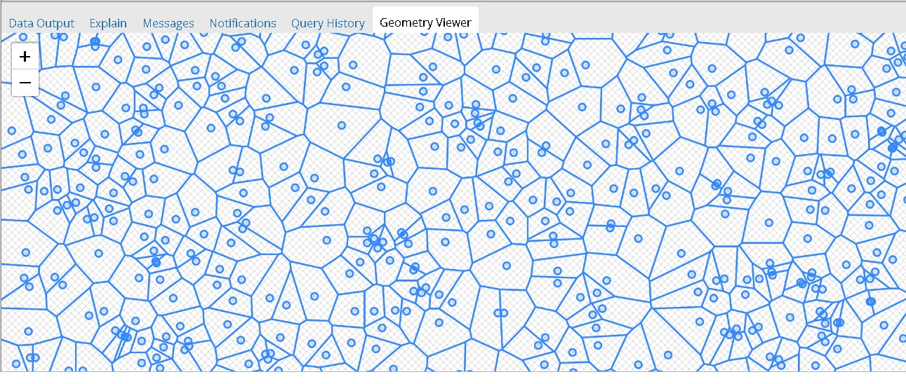
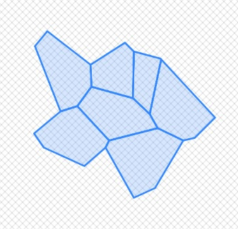

# 地理空间最优解问题实践

<ArticleInfo :frontmatter=$frontmatter></ArticleInfo>

## 背景

PolarDB 的云原生存算分离架构, 具备低廉的数据存储、高效扩展弹性、高速多机并行计算能力、高速数据搜索和处理; PolarDB 与计算算法结合, 将实现双剑合璧, 推动业务数据的价值产出, 将数据变成生产力.

本文将介绍 PolarDB 开源版 使用 PostGIS 以及泰森多边形 解决 "零售、配送、综合体、教培、连锁店等经营"|"通信行业基站建设功率和指向" 的地理最优解问题

测试环境为 macOS+docker, PolarDB 部署请参考下文:

- [《如何用 PolarDB 证明巴菲特的投资理念 - 包括 PolarDB 简单部署》](https://github.com/digoal/blog/blob/master/202209/20220908_02.md)

## 业务介绍

与地理位置、距离相关的业务:

- 配送
- 零售业务 O2O
- 线下教培
- 综合体
- 基站
- 连锁店

1、以 KFC 为例, 全国有很多家 KFC 连锁店, 每个店应该辐射哪些小区商圈?  
开了新店之后, 与之相邻的老店辐射商圈应该怎么调整?  
KFC 需要根据辐射小区商圈来预定销量、配置食材、配置多大的门店、多少营业员?

2、配送业务, 根据网点分布, 如何合理化每个网点负责的片区, 使得配送效率最高, 成本最低?  
每一个写字楼有且只有一种选择到某个网点的距离最近.

3、基站建设, 每个基站应该对每个方向的功率调多大, 才能整体最优的解决网络质量和覆盖率问题.

以上其实都在回答一个问题:

- 在有限的资源情况下, 如何整体最优的解决地理位置上的业务覆盖问题.

简化为数学问题, 就是:

- 以基站、零售店、配送站、连锁店等为离散点, 划分泰森多边形, 每个离散点负责一个多边形, 在这个多边形内的点距离多边形内的离散点最近. 因此离散点只需要负责好这个多边形即可, 这样获得的就是地理位置上的最优解.

## 例子

[《在 PostgreSQL 中生成和查看泰森多边形 - Voronoi diagram - 最强大脑题目》](https://github.com/digoal/blog/blob/master/201904/20190421_01.md)

[《使用 PolarDB 开源版 部署 PostGIS 支撑时空轨迹|地理信息|路由等业务》](https://github.com/digoal/blog/blob/master/202212/20221223_02.md)

接下来的内容将以上面这篇文章为例进行讲解:

以 PolarDB 和 postgis 为例

```
create extension postgis;
```

创建生成随机离散点的函数

```
参数1,2：经度取值范围
参数3,4：维度取值范围
参数5：生成多少个离散点

create or replace function gen_rand_multipoint(numeric, numeric, numeric, numeric, int) returns geometry as $$
declare
  res text;
begin
  res := 'MULTIPOINT (';
  for i in 1..$5 loop
    res := res||$1+random()*($2-$1)||' '||$3+random()*($4-$3)||',';
  end loop;
  res := rtrim(res,',');
  res := res||')';
  return res::geometry;
end;
$$ language plpgsql strict;
```

举例

```
digoal=# select st_astext(gen_rand_multipoint(120,121,70,71,10));
-[ RECORD 1 ]---------------------------------------------------------------------------------------------------------------------------------------------------------------------------------------------------------------------------------------------------------------------------------------------------------------------------------------------------------------------------------------------------------------------------------------------------------------------------------------------------------------------------------------------------------------------------------------------------------------------------------------------------------------------------------------------------------------------------------------------------------------------------------------------------------------------------------------------------------------------------------------------------------------------------------------------------------------------------------------------------------------------------------------------------------------------------------------------------------------------------------------------------------------------------------------------------------------------------------------------------------------------------------------------------------------------------------------------------------------------------------------------------------------------------------------------------------------------------------------------------------------------------------------------------------------------------------------------------------------------------------------------------------------------------------------------------------------------------------------------------------------------------------------------------------------------------------------------------------------------------------------------------------------------------------------------------------------------------------------------------------------------------------------------------------------------------------------------------------------------------------------------------------------------------------------------------------------------------------------------------------------------------------------------------------------------------------------------------------------------------------------------------------------------------------------------------------------------------
st_astext | MULTIPOINT(120.942558704875 70.0857633580454,120.821791284718 70.5374327567406,120.60653472133 70.7641549357213,120.966732177418 70.1589297447354,120.494935501367 70.5906278314069,120.999914915301 70.6718445569277,120.941853619181 70.6390802050009,120.022797878832 70.7509728162549,120.612626708578 70.7740727034397,120.310972961597 70.0668104588985,120.741411157884 70.2521727122366,120.031697474886 70.8502694196068,120.77547144331 70.7255614278838,120.18382552173 70.0531326876953,120.045804018155 70.279703093227,120.709843394347 70.9883627230301,120.365466451272 70.5316346790642,120.525795479771 70.9720011726022,120.295789614785 70.4925276571885,120.130930917338 70.7907251161523,120.083155489061 70.1308458326384,120.462569673546 70.0250091082416,120.769926037639 70.4853675523773,120.775981924497 70.3825527466834,120.259440256283 70.0869548860937,120.449363205582 70.0008514141664,120.33912759833 70.4810606804676,120.851120833773 70.1145990416408,120.206622108817 70.0349463559687,120.167731729802 70.2524261269718,120.314649449196 70.8775751241483,120.240788850002 70.6801159004681,120.409209803678 70.7665843297727,120.65211707307 70.7049994184636,120.259111986961 70.7830479904078,120.495724535082 70.3422674760222,120.913893823046 70.9582942086272,120.367276584264 70.6838198606856,120.443661761004 70.1432585087605,120.066372607369 70.7031020172872,120.230213394854 70.5157358134165,120.703953431919 70.5693409931846,120.996796493884 70.5550742656924,120.683940035291 70.2034186027013,120.590020621661 70.8516717650928,120.455844729673 70.9046700708568,120.729246889241 70.6966335796751,120.584785971325 70.1384566929191,120.463217909448 70.2369030443951,120.843456111848 70.7223298968747,120.019951034803 70.3391806469299,120.064597372897 70.9338448578492,120.297474855557 70.4318739576265,120.617664719 70.7411366165616,120.575132466387 70.6840373263694,120.444238634314 70.8053458617069,120.199773139786 70.1481920662336,120.374686854891 70.1965696341358,120.703266331926 70.0586268901825,120.399988236837 70.2932869540527,120.910298655275 70.8558329669759,120.19795702491 70.639545544982,120.552466546651 70.7827429967001,120.778002237901 70.0156844565645,120.019646041095 70.6214583497494,120.738014353439 70.0395970763639,120.960638996679 70.8026117263362,120.973441934213 70.2581138522364,120.234485683963 70.5911066532135,120.999250469264 70.8096181508154)
```

## 使用 PostGIS 生成随机离散点的泰森多边形

```
Synopsis
geometry ST_VoronoiPolygons( g1 geometry , tolerance float8 , extend_to geometry );
```

用法如下

```
select st_astext(ST_VoronoiPolygons(x)) from gen_rand_multipoint(120,121,70,71,10) x;
```

## 使用 PostGIS 生成随机离散点的泰森多边形的边

```
Synopsis
geometry ST_VoronoiLines( g1 geometry , tolerance float8 , extend_to geometry );
```

用法如下

```
select st_astext(ST_VoronoiLines(x)) from gen_rand_multipoint(120,121,70,71,10) x;
```

## 使用 pgadmin，观察泰森多边形，离散点

1、建表，存储泰森多边形

```
create table tb (id serial, mp geometry, vp geometry, vl geometry, mp_vl geometry);
```

2、写入一些泰森多边形数据

```
insert into tb (mp,vp,vl,mp_vl)
select x, ST_VoronoiPolygons(x), ST_VoronoiLines(x), st_union(x,ST_VoronoiLines(x)) from gen_rand_multipoint(120,121,70,71,10) x;

insert into tb (mp,vp,vl,mp_vl)
select x, ST_VoronoiPolygons(x), ST_VoronoiLines(x), st_union(x,ST_VoronoiLines(x)) from gen_rand_multipoint(120,121,70,71,100) x;

insert into tb (mp,vp,vl,mp_vl)
select x, ST_VoronoiPolygons(x), ST_VoronoiLines(x), st_union(x,ST_VoronoiLines(x)) from gen_rand_multipoint(120,121,70,71,1000) x;

insert into tb (mp,vp,vl,mp_vl)
select x, ST_VoronoiPolygons(x), ST_VoronoiLines(x), st_union(x,ST_VoronoiLines(x)) from gen_rand_multipoint(120,125,70,75,100) x;
```

3、使用 pgadmin 显示泰森多边形

几何数据


离散点对应的泰森多边形的边（multiline 对象）



离散点对应的泰森多边形(multipolygon 对象)（bound 默认为一个 BOX，包住所有离散点）



离散点以及对应的泰森多边形的边



放大后的离散点以及对应的泰森多边形的边



4、将得到的泰森多边形 multigeometry 解析出来，每个多边形一条记录存储，为下一篇文档四色猜想做准备。

[《PostgreSQL 中的四色猜想(Four color theorem) - 最强大脑题目》](https://github.com/digoal/blog/blob/master/201904/20190421_02.md)

创建测试表，并写入 1000 个泰森多边形。

```
create table tc (id serial, poy geometry);

insert into tc (poy) select ST_GeometryN(x,i) from
  (select generate_series(1,ST_NumGeometries(x)) i, x
    from ST_VoronoiPolygons(gen_rand_multipoint(120,121,70,71,1000)) x
  ) t;
```

例子

```
digoal=# select st_astext(poy) from tc;
-[ RECORD 1 ]--------------------------------------------------------------------------------------------------------------------------------------------------------------------------------------------------------------------------------
-------------------------------------------------------------------------------------------------------------------------------------------------------------------------------------------
st_astext | POLYGON((120.0068907121 70.0827667811785,120.017136860027 70.1185103197699,120.024032512908 70.1163465285133,120.032180593165 70.1011610062082,120.033703815237 70.0870002751683,120.012202949892 70.0813630370411,120.0068907121
 70.0827667811785))
-[ RECORD 2 ]--------------------------------------------------------------------------------------------------------------------------------------------------------------------------------------------------------------------------------
-------------------------------------------------------------------------------------------------------------------------------------------------------------------------------------------
st_astext | POLYGON((119.001530315262 70.1396284378468,119.001530315262 70.2071267817079,119.757509890494 70.2155274483723,119.788978615847 70.2125452904718,119.9209381714 70.1687296375826,120.017136860027 70.1185103197699,120.0068907121
 70.0827667811785,119.952343492619 70.0692099186264,119.001530315262 70.1396284378468))
-[ RECORD 3 ]--------------------------------------------------------------------------------------------------------------------------------------------------------------------------------------------------------------------------------
-------------------------------------------------------------------------------------------------------------------------------------------------------------------------------------------
st_astext | POLYGON((119.781778114247 69.0017473017801,119.001530315262 69.0017473017801,119.001530315262 70.1396284378468,119.952343492619 70.0692099186264,120.008027433811 70.0545962635351,120.013949018811 70.0504765592871,120.03048513
9271 70.0273653734516,120.039308399546 69.9936444173583,119.781778114247 69.0017473017801))
-[ RECORD 4 ]--------------------------------------------------------------------------------------------------------------------------------------------------------------------------------------------------------------------------------
-------------------------------------------------------------------------------------------------------------------------------------------------------------------------------------------
st_astext | POLYGON((120.080290328964 69.0017473017801,119.781778114247 69.0017473017801,120.039308399546 69.9936444173583,120.057510105642 70.0145600250777,120.122918984211 70.0308393983058,120.127907151293 70.0314308457492,120.13710363
4016 70.0261242124239,120.153895004164 69.9966006333282,120.080290328964 69.0017473017801))
..............
```

5、输入任意一个泰森多边形 ID 搜索与之相邻的泰森多边形。

```
select st_collect(tc.poy)
from tc,
  (select * from tc where id=80) t
where st_intersects(tc.poy, t.poy)
and GeometryType(ST_Intersection(tc.poy, t.poy)) <> 'POINT'
;
```



只有一个点相邻也会认为相邻，所以需要使用 GeometryType 过滤.

```
digoal=# select st_intersects(poyx, poyy), GeometryType(ST_Intersection(poyx, poyy)) from
(values(
  ST_MakePolygon(ST_GeomFromText('LINESTRING(1 2, 2 2, 2 3, 1 2)'))
,
  ST_MakePolygon(ST_GeomFromText('LINESTRING(2 2, 3 2, 3 3, 2 2)'))
)) as t (poyx, poyy)
;
 st_intersects | geometrytype
---------------+--------------
 t             | POINT
(1 row)
```

## 参考

https://en.wikipedia.org/wiki/Voronoi_diagram

https://baike.baidu.com/item/%E6%B3%B0%E6%A3%AE%E5%A4%9A%E8%BE%B9%E5%BD%A2

https://gis.stackexchange.com/questions/114764/how-to-use-st-delaunaytriangles-to-construct-a-voronoi-diagram

https://gis.stackexchange.com/questions/172198/constructing-voronoi-diagram-in-postgis

http://postgis.net/docs/manual-2.5/ST_VoronoiLines.html

http://postgis.net/docs/manual-2.5/ST_VoronoiPolygons.html

http://postgis.net/docs/manual-2.5/reference.html

https://stackoverflow.com/questions/21719941/postgis-convert-multipolygon-to-single-polygon

https://baike.baidu.com/tashuo/browse/content?id=d967b9032e228a4e4a39827e&fr=qingtian&lemmaId=3428661

[《PostgreSQL 中的四色猜想(Four color theorem) - 最强大脑题目》](https://github.com/digoal/blog/blob/master/201904/20190421_02.md)

[《在 PostgreSQL 中生成和查看泰森多边形 - Voronoi diagram - 最强大脑题目》](https://github.com/digoal/blog/blob/master/201904/20190421_01.md)

[《使用 PolarDB 开源版 部署 PostGIS 支撑时空轨迹|地理信息|路由等业务》](https://github.com/digoal/blog/blob/master/202212/20221223_02.md)
