# HTAP 架构详解

<ArticleInfo :frontmatter=$frontmatter></ArticleInfo>

[[toc]]

## 背景

很多 PolarDB PG 的用户都有 TP (Transactional Processing) 和 AP (Analytical Processing) 共用的需求。他们期望数据库在白天处理高并发的 TP 请求，在夜间 TP 流量下降、机器负载空闲时进行 AP 的报表分析。但是即使这样，依然没有最大化利用空闲机器的资源。原先的 PolarDB PG 数据库在处理复杂的 AP 查询时会遇到两大挑战:

- 单条 SQL 在原生 PostgreSQL 执行引擎下只能在单个节点上执行，无论是单机串行还是单机并行，都无法利用其他节点的 CPU、内存等计算资源，只能纵向 Scale Up，不能横向 Scale Out；
- PolarDB 底层是存储池，理论上 I/O 吞吐是无限大的。而单条 SQL 在原生 PostgreSQL 执行引擎下只能在单个节点上执行，受限于单节点 CPU 和内存的瓶颈，无法充分发挥存储侧大 I/O 带宽的优势。

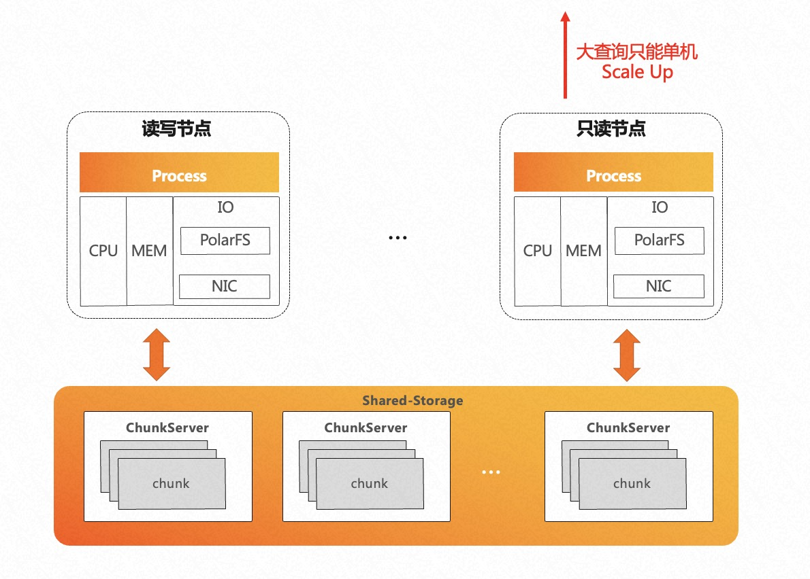

为了解决用户实际使用中的痛点，PolarDB 实现了 HTAP 特性。当前业界 HTAP 的解决方案主要有以下三种：

1. TP 和 AP 在存储和计算上完全分离
   - 优势：两种业务负载互不影响
   - 劣势：
     - 时效性：TP 的数据需要导入到 AP 系统中，存在一定的延迟
     - 成本 / 运维难度：增加了一套冗余的 AP 系统
2. TP 和 AP 在存储和计算上完全共享
   - 优势：成本最小化、资源利用最大化
   - 劣势：
     - 计算共享会导致 AP 查询和 TP 查询同时运行时或多或少会存在相互影响
     - 扩展计算节点存储时，数据需要重分布，无法快速弹性 Scale Out
3. **TP 和 AP 在存储上共享，在计算上分离**：
   - PolarDB 的存储计算分离架构天然支持此方案

## 原理

### 架构特性

基于 PolarDB 的存储计算分离架构，我们研发了分布式 MPP 执行引擎，提供了跨机并行执行、弹性计算弹性扩展的保证，使得 PolarDB 初步具备了 HTAP 的能力:

1. 一体化存储：毫秒级数据新鲜度
   - TP / AP 共享一套存储数据，减少存储成本，提高查询时效
2. TP / AP 物理隔离：杜绝 CPU / 内存的相互影响
   - 单机执行引擎：在 RW / RO 节点上，处理高并发的 TP 查询
   - 分布式 MPP 执行引擎: 在 RO 节点，处理高复杂度的 AP 查询
3. Serverless 弹性扩展：任何一个 RO 节点均可发起 MPP 查询
   - Scale Out：弹性调整 MPP 的执行节点范围
   - Scale Up：弹性调整 MPP 的单机并行度
4. 消除数据倾斜、计算倾斜，充分考虑 PostgreSQL 的 Buffer Pool 亲和性

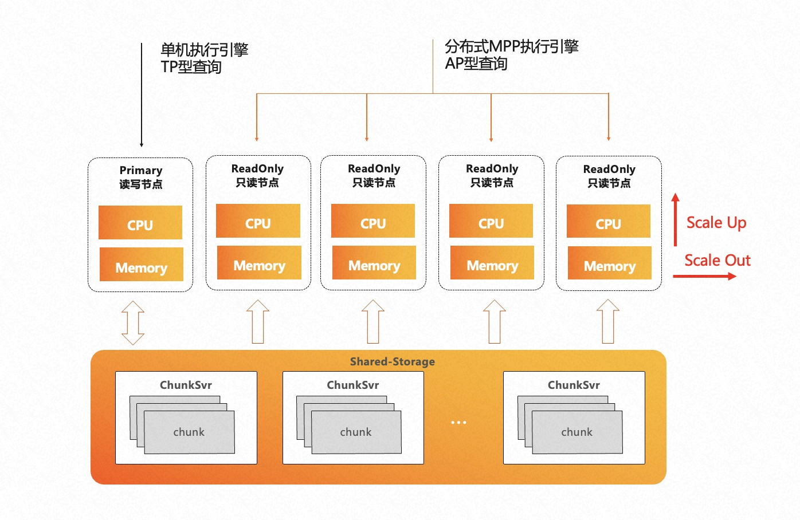

### 分布式 MPP 执行引擎

PolarDB HTAP 的核心是分布式 MPP 执行引擎，是典型的火山模型引擎。A、B 两张表先做 join 再做聚合输出，这也是 PostgreSQL 单机执行引擎的执行流程。

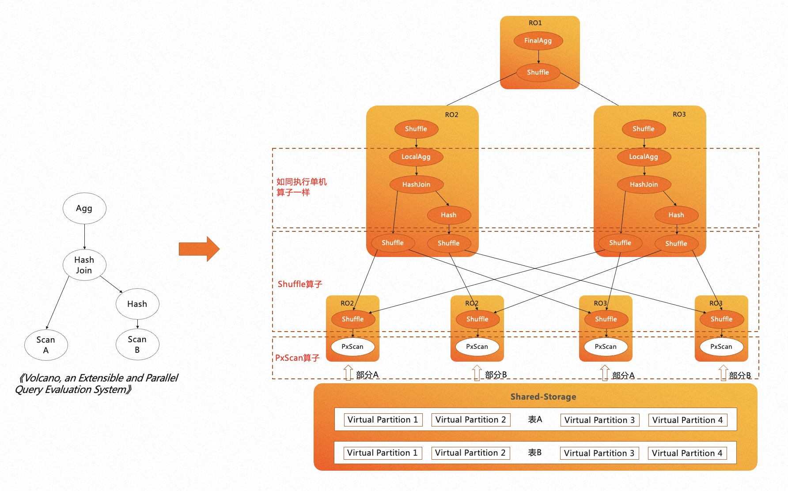

在传统的 MPP 执行引擎中，数据被打散到不同的节点上，不同节点上的数据可能具有不同的分布属性，比如哈希分布、随机分布、复制分布等。传统的 MPP 执行引擎会针对不同表的数据分布特点，在执行计划中插入算子来保证上层算子对数据的分布属性无感知。

不同的是，PolarDB 是共享存储架构，存储上的数据可以被所有计算节点全量访问。如果使用传统的 MPP 执行引擎，每个计算节点 Worker 都会扫描全量数据，从而得到重复的数据；同时，也没有起到扫描时分治加速的效果，并不能称得上是真正意义上的 MPP 引擎。

因此，在 PolarDB 分布式 MPP 执行引擎中，我们借鉴了火山模型论文中的思想，对所有扫描算子进行并发处理，引入了 PxScan 算子来屏蔽共享存储。PxScan 算子将 shared-storage 的数据映射为 shared-nothing 的数据，通过 Worker 之间的协调，将目标表划分为多个虚拟分区数据块，每个 Worker 扫描各自的虚拟分区数据块，从而实现了跨机分布式并行扫描。

PxScan 算子扫描出来的数据会通过 Shuffle 算子来重分布。重分布后的数据在每个 Worker 上如同单机执行一样，按照火山模型来执行。

### Serverless 弹性扩展

传统 MPP 只能在指定节点发起 MPP 查询，因此每个节点上都只能有单个 Worker 扫描一张表。为了支持云原生下 serverless 弹性扩展的需求，我们引入了分布式事务一致性保证。

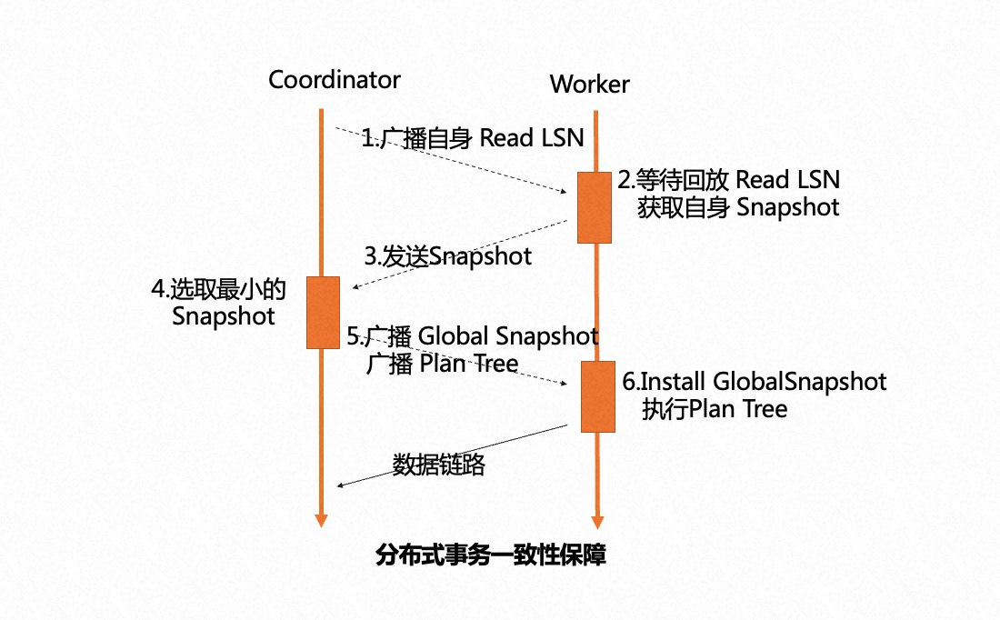

任意选择一个节点作为 Coordinator 节点，它的 ReadLSN 会作为约定的 LSN，从所有 MPP 节点的快照版本号中选择最小的版本号作为全局约定的快照版本号。通过 LSN 的回放等待和 Global Snaphot 同步机制，确保在任何一个节点发起 MPP 查询时，数据和快照均能达到一致可用的状态。

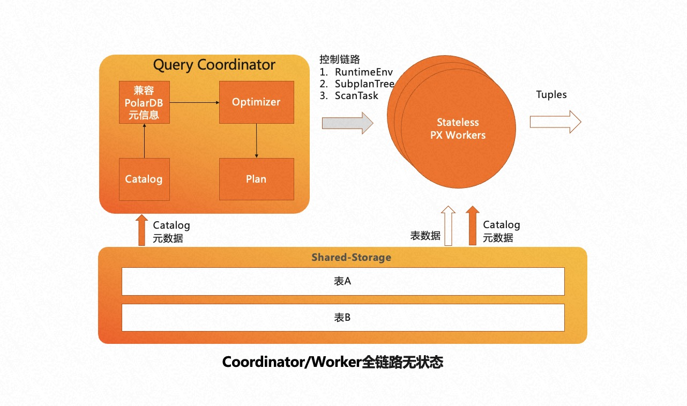

为了实现 serverless 的弹性扩展，我们从共享存储的特点出发，将 Coordinator 节点全链路上各个模块需要的外部依赖全部放至共享存储上。各个 Worker 节点运行时需要的参数也会通过控制链路从 Coordinator 节点同步过来，从而使 Coordinator 节点和 Worker 节点全链路 **无状态化 (Stateless)**。

基于以上两点设计，PolarDB 的弹性扩展具备了以下几大优势：

- 任何节点都可以成为 Coordinator 节点，解决了传统 MPP 数据库 Coordinator 节点的单点问题。
- PolarDB 可以横向 Scale Out（计算节点数量），也可以纵向 Scale Up（单节点并行度），且弹性扩展即时生效，不需要重新分布数据。
- 允许业务有更多的弹性调度策略，不同的业务域可以运行在不同的节点集合上。如下图右侧所示，业务域 1 的 SQL 可以选择 RO1 和 RO2 节点来执行 AP 查询，业务域 2 的 SQL 可以选择使用 RO3 和 RO4 节点来执行 AP 查询。两个业务域使用的计算节点可以实现弹性调度。

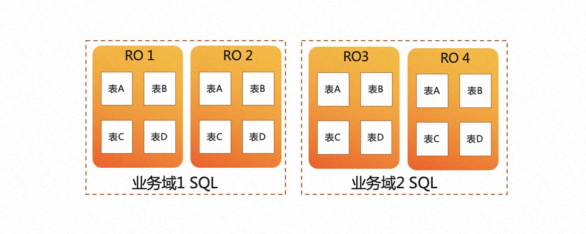

### 消除倾斜

倾斜是传统 MPP 固有的问题，其根本原因主要是数据分布倾斜和数据计算倾斜：

- 数据分布倾斜通常由数据打散不均衡导致，在 PostgreSQL 中还会由于大对象 Toast 表存储引入一些不可避免的数据分布不均衡问题；
- 计算倾斜通常由于不同节点上并发的事务、Buffer Pool、网络、I/O 抖动导致。

倾斜会导致传统 MPP 在执行时出现木桶效应，执行完成时间受制于执行最慢的子任务。

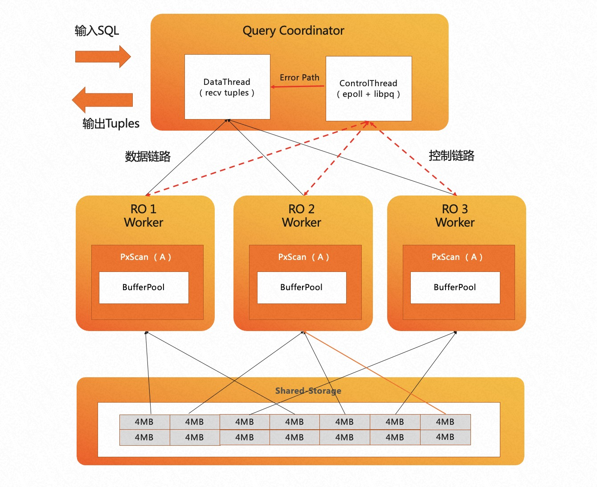

PolarDB 设计并实现了 **自适应扫描机制**。如上图所示，采用 Coordinator 节点来协调 Worker 节点的工作模式。在扫描数据时，Coordinator 节点会在内存中创建一个任务管理器，根据扫描任务对 Worker 节点进行调度。Coordinator 节点内部分为两个线程：

- Data 线程主要负责服务数据链路、收集汇总元组
- Control 线程负责服务控制链路、控制每一个扫描算子的扫描进度

扫描进度较快的 Worker 能够扫描多个数据块，实现能者多劳。比如上图中 RO1 与 RO3 的 Worker 各自扫描了 4 个数据块， RO2 由于计算倾斜可以扫描更多数据块，因此它最终扫描了 6 个数据块。

PolarDB HTAP 的自适应扫描机制还充分考虑了 PostgreSQL 的 Buffer Pool 亲和性，保证每个 Worker 尽可能扫描固定的数据块，从而最大化命中 Buffer Pool 的概率，降低 I/O 开销。

## TPC-H 性能对比

### 单机并行 vs 分布式 MPP

我们使用 256 GB 内存的 16 个 PolarDB PG 实例作为 RO 节点，搭建了 1 TB 的 TPC-H 环境进行对比测试。相较于单机并行，分布式 MPP 并行充分利用了所有 RO 节点的计算资源和底层共享存储的 I/O 带宽，从根本上解决了前文提及的 HTAP 诸多挑战。在 TPC-H 的 22 条 SQL 中，有 3 条 SQL 加速了 60 多倍，19 条 SQL 加速了 10 多倍，平均加速 23 倍。

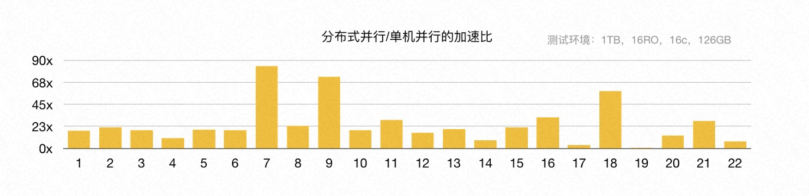

此外，我们也测试了弹性扩展计算资源带来的性能变化。通过增加 CPU 的总核心数，从 16 核增加到 128 核，TPC-H 的总运行时间线性提升，每条 SQL 的执行速度也呈线性提升，这也验证了 PolarDB HTAP serverless 弹性扩展的特点。

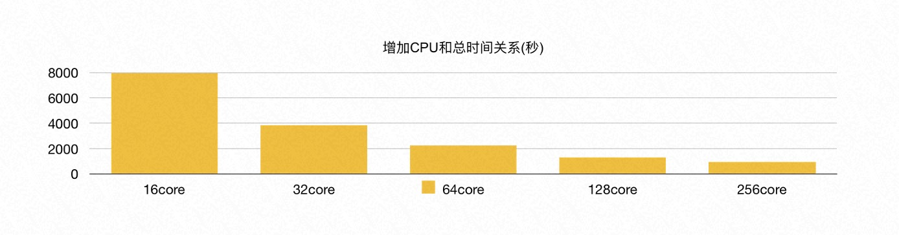


在测试中发现，当 CPU 的总核数增加到 256 核时，性能提升不再明显。原因是此时 PolarDB 共享存储的 I/O 带宽已经打满，成为了瓶颈。

### PolarDB vs 传统 MPP 数据库

我们将 PolarDB 的分布式 MPP 执行引擎与传统数据库的 MPP 执行引擎进行了对比，同样使用了 256 GB 内存的 16 个节点。

在 1 TB 的 TPC-H 数据上，当保持与传统 MPP 数据库相同单机并行度的情况下（多机单进程），PolarDB 的性能是传统 MPP 数据库的 90%。其中最本质的原因是传统 MPP 数据库的数据默认是哈希分布的，当两张表的 join key 是各自的分布键时，可以不用 shuffle 直接进行本地的 Wise Join。而 PolarDB 的底层是共享存储池，PxScan 算子并行扫描出来的数据等价于随机分布，必须进行 shuffle 重分布以后才能像传统 MPP 数据库一样进行后续的处理。因此，TPC-H 涉及到表连接时，PolarDB 相比传统 MPP 数据库多了一次网络 shuffle 的开销。

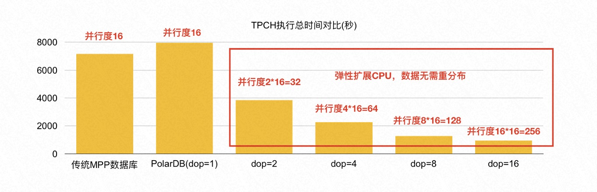

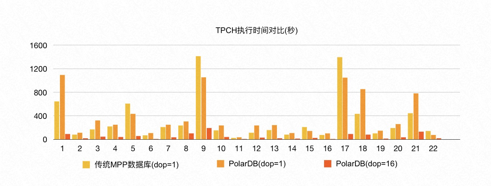

PolarDB 分布式 MPP 执行引擎能够进行弹性扩展，数据无需重分布。因此，在有限的 16 台机器上执行 MPP 时，PolarDB 还可以继续扩展单机并行度，充分利用每台机器的资源：当 PolarDB 的单机并行度为 8 时，它的性能是传统 MPP 数据库的 5-6 倍；当 PolarDB 的单机并行度呈线性增加时，PolarDB 的总体性能也呈线性增加。只需要修改配置参数，就可以即时生效。

## 功能特性

### Parallel Query 并行查询

经过持续迭代的研发，目前 PolarDB HTAP 在 Parallel Query 上支持的功能特性主要有五大部分：

- 基础算子全支持：扫描 / 连接 / 聚合 / 子查询等算子。
- 共享存储算子优化：包括 Shuffle 算子共享、SharedSeqScan 共享、SharedIndexScan 算子等。其中 SharedSeqScan 共享、SharedIndexScan 共享是指，在大表 join 小表时，小表采用类似于复制表的机制来减少广播开销，进而提升性能。
- 分区表支持：不仅包括对 Hash / Range / List 三种分区方式的完整支持，还包括对多级分区静态裁剪、分区动态裁剪的支持。除此之外，PolarDB 分布式 MPP 执行引擎还支持分区表的 Partition Wise Join。
- 并行度弹性控制：包括全局级别、表级别、会话级别、查询级别的并行度控制。
- Serverless 弹性扩展：不仅包括任意节点发起 MPP、MPP 节点范围内的任意组合，还包括集群拓扑信息的自动维护，以及支持共享存储模式、主备库模式、三节点模式。

### Parallel DML

基于 PolarDB 读写分离架构和 HTAP serverless 弹性扩展的设计， PolarDB Parallel DML 支持一写多读、多写多读两种特性。

- 一写多读：在 RO 节点上有多个读 Worker，在 RW 节点上只有一个写 Worker；
- 多写多读：在 RO 节点上有多个读 Worker，在 RW 节点上也有多个写 Worker。多写多读场景下，读写的并发度完全解耦。

不同的特性适用不同的场景，用户可以根据自己的业务特点来选择不同的 PDML 功能特性。

### 索引构建加速

PolarDB 分布式 MPP 执行引擎，不仅可以用于只读查询和 DML，还可以用于 **索引构建加速**。OLTP 业务中有大量的索引，而 B-Tree 索引创建的过程大约有 80% 的时间消耗在排序和构建索引页上，20% 消耗在写入索引页上。如下图所示，PolarDB 利用 RO 节点对数据进行分布式 MPP 加速排序，采用流水化的技术来构建索引页，同时使用批量写入技术来提升索引页的写入速度。

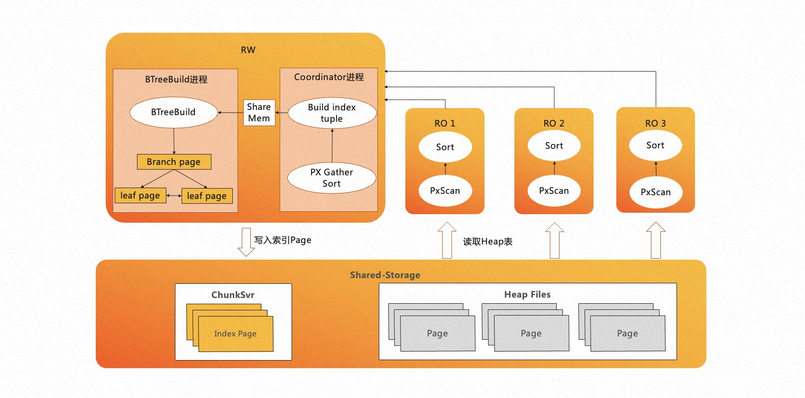

在目前索引构建加速这一特性中，PolarDB 已经对 B-Tree 索引的普通创建以及 B-Tree 索引的在线创建 (Concurrently) 两种功能进行了支持。

## 使用说明

PolarDB HTAP 适用于日常业务中的 **轻分析类业务**，例如：对账业务，报表业务。

### 使用 MPP 进行分析型查询

PolarDB PG 引擎默认不开启 MPP 功能。若您需要使用此功能，请使用如下参数：

- `polar_enable_px`：指定是否开启 MPP 功能。默认为 `OFF`，即不开启。
- `polar_px_max_workers_number`：设置单个节点上的最大 MPP Worker 进程数，默认为 `30`。该参数限制了单个节点上的最大并行度，节点上所有会话的 MPP workers 进程数不能超过该参数大小。
- `polar_px_dop_per_node`：设置当前会话并行查询的并行度，默认为 `1`，推荐值为当前 CPU 总核数。若设置该参数为 `N`，则一个会话在每个节点上将会启用 `N` 个 MPP Worker 进程，用于处理当前的 MPP 逻辑
- `polar_px_nodes`：指定参与 MPP 的只读节点。默认为空，表示所有只读节点都参与。可配置为指定节点参与 MPP，以逗号分隔
- `px_worker`：指定 MPP 是否对特定表生效。默认不生效。MPP 功能比较消耗集群计算节点的资源，因此只有对设置了 `px_workers` 的表才使用该功能。例如：
  - `ALTER TABLE t1 SET(px_workers=1)` 表示 t1 表允许 MPP
  - `ALTER TABLE t1 SET(px_workers=-1)` 表示 t1 表禁止 MPP
  - `ALTER TABLE t1 SET(px_workers=0)` 表示 t1 表忽略 MPP（默认状态）

本示例以简单的单表查询操作，来描述 MPP 的功能是否有效。

```sql
-- 创建 test 表并插入基础数据。
CREATE TABLE test(id int);
INSERT INTO test SELECT generate_series(1,1000000);

-- 默认情况下 MPP 功能不开启，单表查询执行计划为 PG 原生的 Seq Scan
EXPLAIN SELECT * FROM test;
                       QUERY PLAN
--------------------------------------------------------
 Seq Scan on test  (cost=0.00..35.50 rows=2550 width=4)
(1 row)
```

开启并使用 MPP 功能：

```sql
-- 对 test 表启用 MPP 功能
ALTER TABLE test SET (px_workers=1);

-- 开启 MPP 功能
SET polar_enable_px = on;

EXPLAIN SELECT * FROM test;

                                  QUERY PLAN
-------------------------------------------------------------------------------
 PX Coordinator 2:1  (slice1; segments: 2)  (cost=0.00..431.00 rows=1 width=4)
   ->  Seq Scan on test (scan partial)  (cost=0.00..431.00 rows=1 width=4)
 Optimizer: PolarDB PX Optimizer
(3 rows)
```

配置参与 MPP 的计算节点范围：

```sql
-- 查询当前所有只读节点的名称
CREATE EXTENSION polar_monitor;

SELECT name,host,port FROM polar_cluster_info WHERE px_node='t';
 name  |   host    | port
-------+-----------+------
 node1 | 127.0.0.1 | 5433
 node2 | 127.0.0.1 | 5434
(2 rows)

-- 当前集群有 2 个只读节点，名称分别为：node1，node2

-- 指定 node1 只读节点参与 MPP
SET polar_px_nodes = 'node1';

-- 查询参与并行查询的节点
SHOW polar_px_nodes;
 polar_px_nodes
----------------
 node1
(1 row)

EXPLAIN SELECT * FROM test;
                                  QUERY PLAN
-------------------------------------------------------------------------------
 PX Coordinator 1:1  (slice1; segments: 1)  (cost=0.00..431.00 rows=1 width=4)
   ->  Partial Seq Scan on test  (cost=0.00..431.00 rows=1 width=4)
 Optimizer: PolarDB PX Optimizer
(3 rows)
```

### 使用 MPP 进行分区表查询

当前 MPP 对分区表支持的功能如下所示：

- 支持 Range 分区的并行查询
- 支持 List 分区的并行查询
- 支持单列 Hash 分区的并行查询
- 支持分区裁剪
- 支持带有索引的分区表并行查询
- 支持分区表连接查询
- 支持多级分区的并行查询

```sql
--分区表 MPP 功能默认关闭，需要先开启 MPP 功能
SET polar_enable_px = ON;

-- 执行以下语句，开启分区表 MPP 功能
SET polar_px_enable_partition = true;

-- 执行以下语句，开启多级分区表 MPP 功能
SET polar_px_optimizer_multilevel_partitioning = true;
```

### 使用 MPP 加速索引创建

当前仅支持对 B-Tree 索引的构建，且暂不支持 `INCLUDE` 等索引构建语法，暂不支持表达式等索引列类型。

如果需要使用 MPP 功能加速创建索引，请使用如下参数：

- `polar_px_dop_per_node`：指定通过 MPP 加速构建索引的并行度。默认为 `1`。
- `polar_px_enable_replay_wait`：当使用 MPP 加速索引构建时，当前会话内无需手动开启该参数，该参数将自动生效，以保证最近更新的数据表项可以被创建到索引中，保证索引表的完整性。索引创建完成后，该参数将会被重置为数据库默认值。
- `polar_px_enable_btbuild`：是否开启使用 MPP 加速创建索引。取值为 `OFF` 时不开启（默认），取值为 `ON` 时开启。
- `polar_bt_write_page_buffer_size`：指定索引构建过程中的写 I/O 策略。该参数默认值为 `0`（不开启），单位为块，最大值可设置为 `8192`。推荐设置为 `4096`。
  - 当该参数设置为不开启时，在索引创建的过程中，对于索引页写满后的写盘方式是 block-by-block 的单个块写盘。
  - 当该参数设置为开启时，内核中将缓存一个 `polar_bt_write_page_buffer_size` 大小的 buffer，对于需要写盘的索引页，会通过该 buffer 进行 I/O 合并再统一写盘，避免了频繁调度 I/O 带来的性能开销。该参数会额外提升 20% 的索引创建性能。

```sql
-- 开启使用 MPP 加速创建索引功能。
SET polar_px_enable_btbuild = on;

-- 使用如下语法创建索引
CREATE INDEX t ON test(id) WITH(px_build = ON);

-- 查询表结构
\d test
               Table "public.test"
 Column |  Type   | Collation | Nullable | Default
--------+---------+-----------+----------+---------
 id     | integer |           |          |
 id2    | integer |           |          |
Indexes:
    "t" btree (id) WITH (px_build=finish)
```
