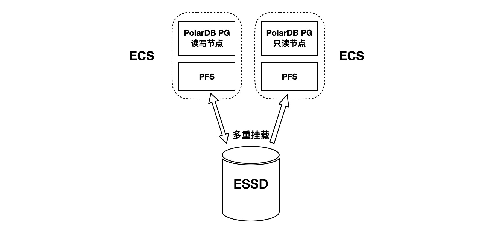
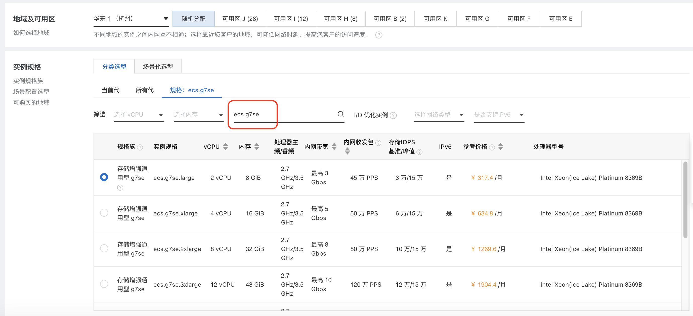
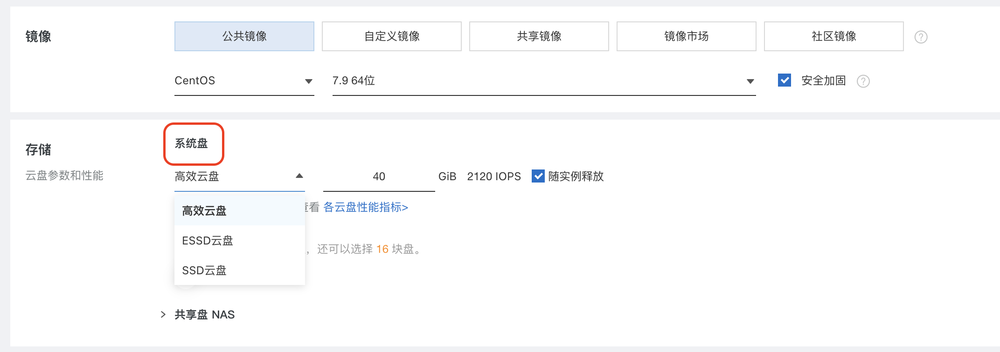
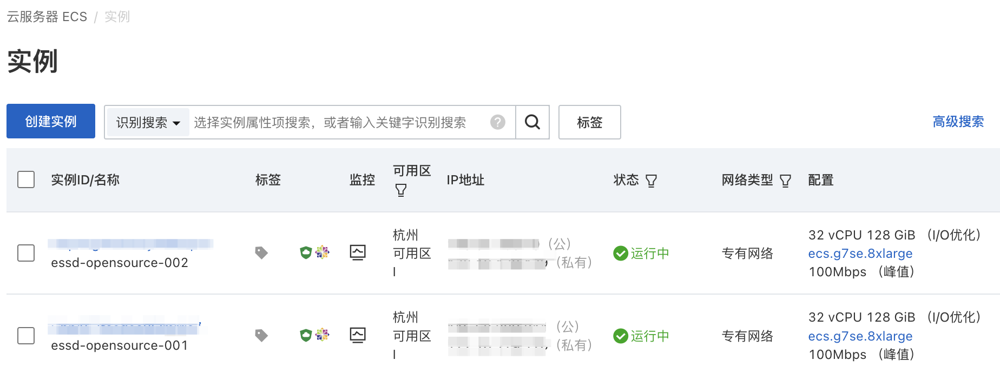
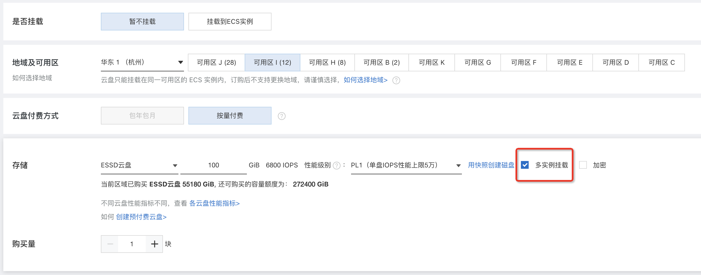
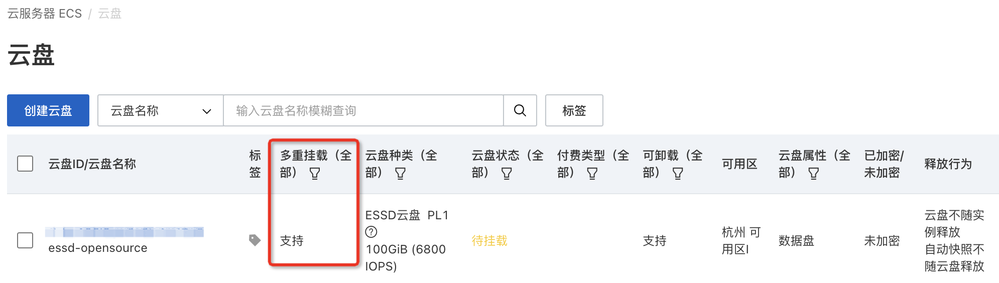
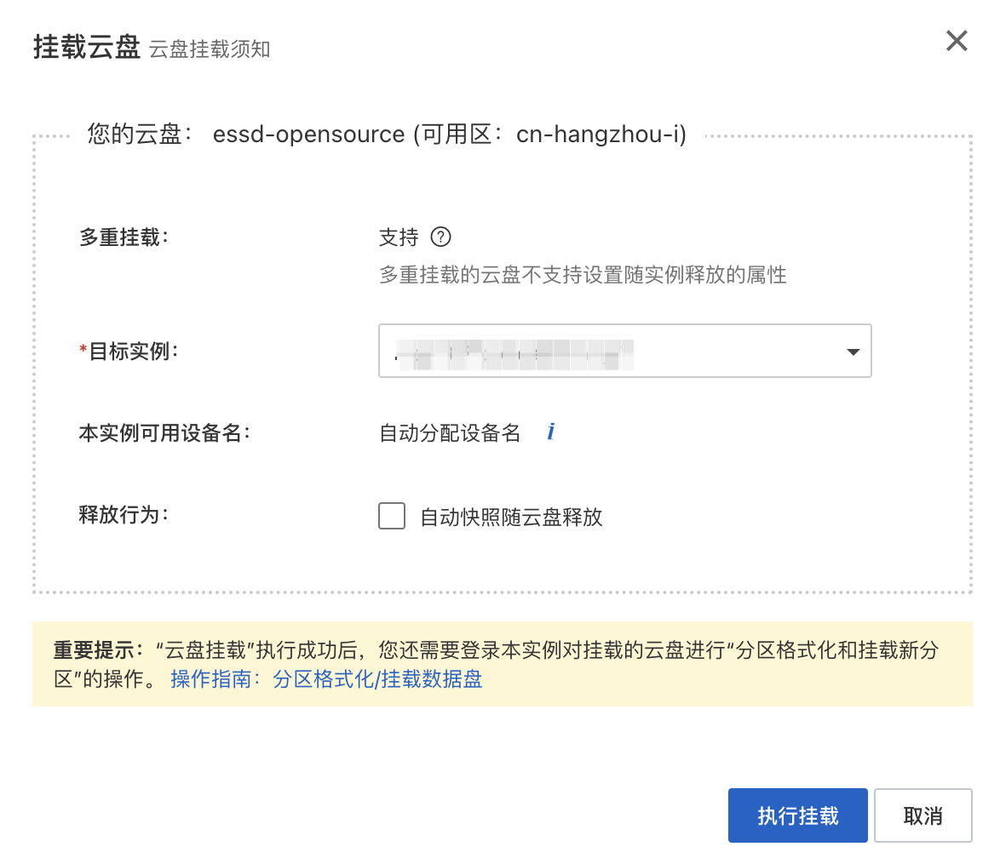
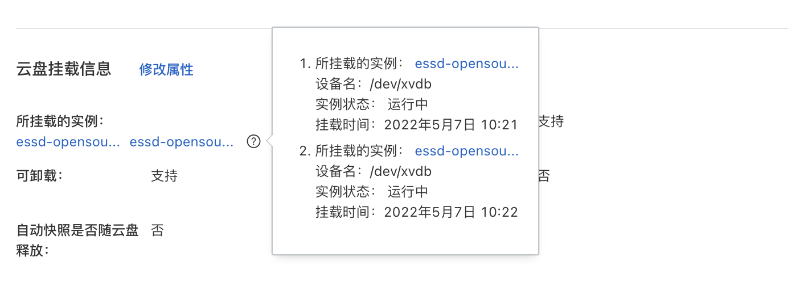

# 阿里云 ECS + ESSD 云盘存储 <a href="https://developer.aliyun.com/live/249628"><Badge type="tip" text="视频" vertical="top" /></a>

<ArticleInfo :frontmatter=$frontmatter></ArticleInfo>

[阿里云 ESSD（Enterprise SSD）云盘](https://help.aliyun.com/document_detail/122389.html) 结合 25 GE 网络和 RDMA 技术，能够提供单盘高达 100 万的随机读写能力和单路低时延性能。阿里云 ESSD 云盘支持 NVMe 协议，且可以同时挂载到多台支持 NVMe 协议的 ECS（Elastic Compute Service）实例上，从而实现多个 ECS 实例并发读写访问，具备高可靠、高并发、高性能等特点。更新信息请参考阿里云 ECS 文档：

- [支持 NVMe 协议的云盘概述](https://help.aliyun.com/document_detail/256487.html)
- [开启多重挂载功能](https://help.aliyun.com/document_detail/262105.html)

本文将指导您完成以下过程：

1. 部署两台阿里云 ECS 作为计算节点
2. 将一块 ESSD 云盘多重挂载到两台 ECS 上，作为共享存储
3. 在 ESSD 共享存储上格式化分布式文件系统 PFS
4. 基于 PFS，在两台 ECS 上共同搭建一个存算分离、读写分离的 PolarDB 集群



## 部署阿里云 ECS

首先需要准备两台或以上的 [阿里云 ECS](https://www.aliyun.com/product/ecs)。目前，ECS 中支持 ESSD 多重挂载的规格存在部分限制，详情请参考 [使用限制](https://help.aliyun.com/zh/ecs/user-guide/support-for-the-nvme-protocol-and-multi-attach-feature/)。



对 ECS 存储配置的选择，系统盘可以选用任意的存储类型，数据盘和共享盘暂不选择。后续再单独创建一个 ESSD 云盘作为共享盘：



如图所示，在 **同一可用区** 中建好两台 ECS：



## 准备 ESSD 云盘

在阿里云 ECS 的管理控制台中，选择 _存储与快照_ 下的 _块存储_，点击 _创建云盘_。在与已经建好的 ECS 所在的相同可用区内，选择建立一个 ESSD 云盘，并勾选 **多实例挂载**。如果您的 ECS 不符合多实例挂载的限制条件，则该选框不会出现。



ESSD 云盘创建完毕后，控制台显示云盘支持多重挂载，状态为 _待挂载_：



接下来，把这个云盘分别挂载到两台 ECS 上：



挂载完毕后，查看该云盘，将会显示该云盘已经挂载的两台 ECS 实例：



## 检查云盘

通过 ssh 分别连接到两台 ECS 上，运行 `lsblk` 命令可以看到：

- `nvme0n1` 是 40GB 的 ECS 系统盘，为 ECS 私有
- `nvme1n1` 是 100GB 的 ESSD 云盘，两台 ECS 同时可见

```bash:no-line-numbers
$ lsblk
NAME        MAJ:MIN RM  SIZE RO TYPE MOUNTPOINT
nvme0n1     259:0    0   40G  0 disk
└─nvme0n1p1 259:1    0   40G  0 part /etc/hosts
nvme1n1     259:2    0  100G  0 disk
```

---

## 准备分布式文件系统

接下来，将在两台 ECS 上分别部署 PolarDB 的主节点和只读节点。作为前提，需要在 ECS 共享的 ESSD 块设备上 [格式化并挂载 PFS](./fs-pfs.md)。
