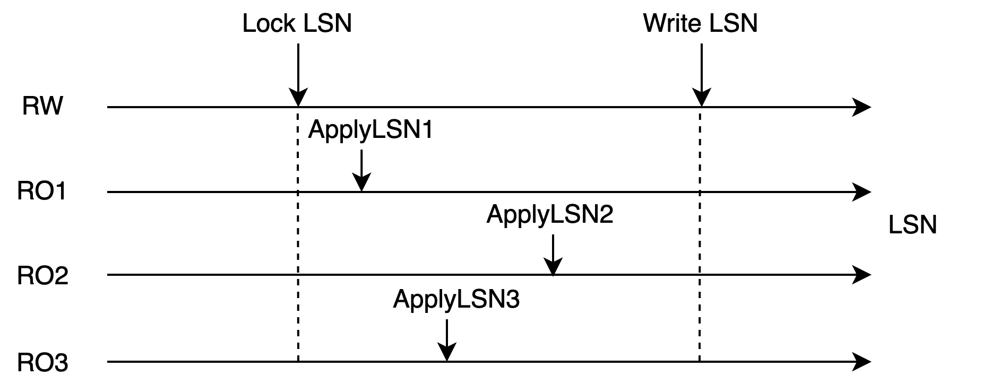
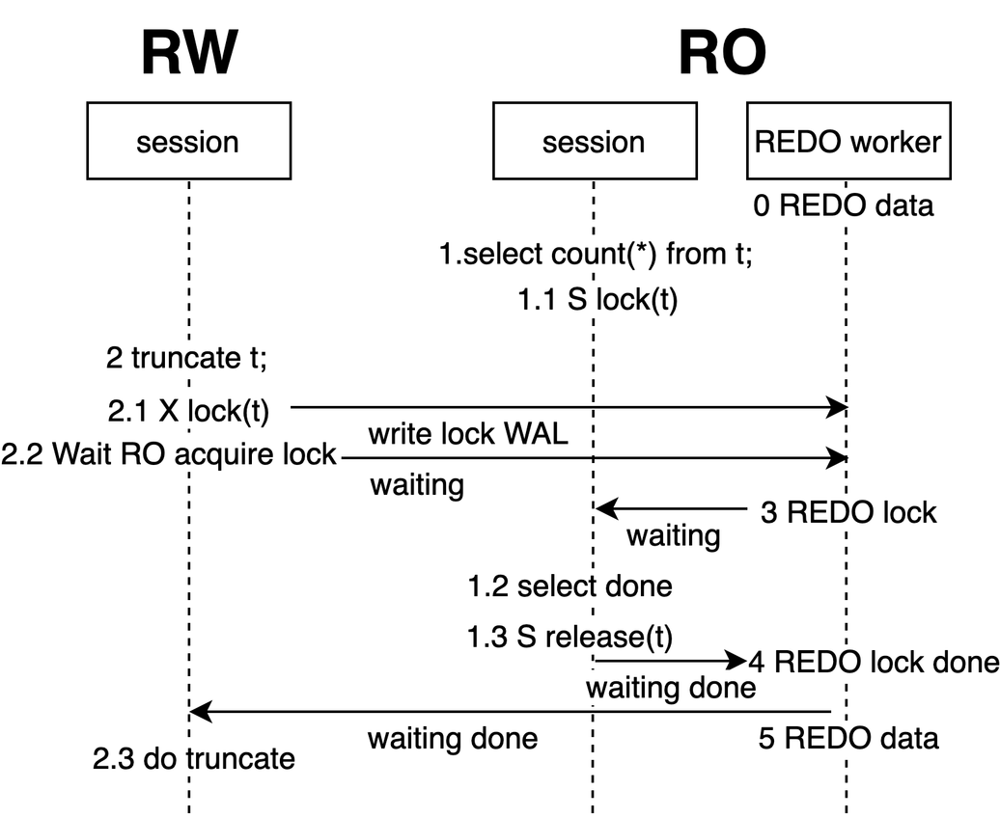
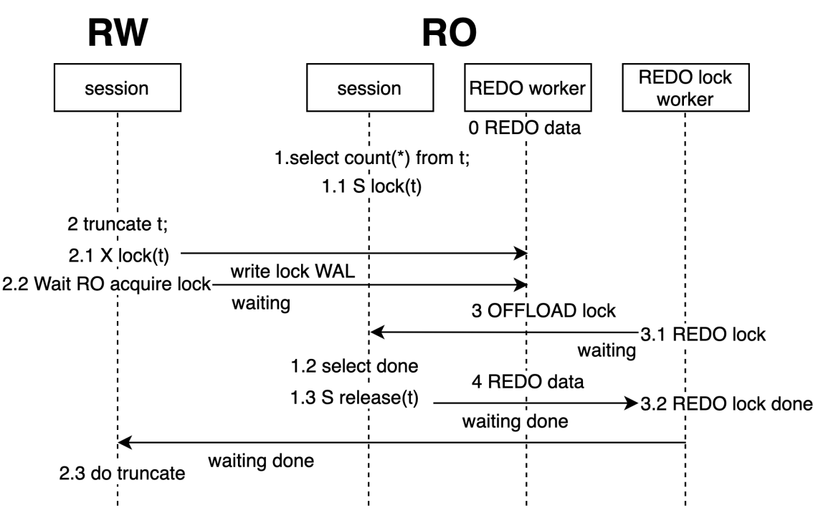

# DDL Synchronization

## Overview

In a shared storage architecture that consists of one primary node and multiple read-only nodes, a data file has only one copy. Due to multi-version concurrency control (MVCC), the read and write operations performed on different nodes do not conflict. However, MVCC cannot be used to ensure consistency for some specific data operations, such as file operations.

MVCC applies to tuples within a file but does not apply to the file itself. File operations such as creating and deleting files are visible to the entire cluster immediately after they are performed. This causes an issue that files disappear while read-only nodes are reading the files. To prevent the issue from occurring, file operations need to be synchronized.

In most cases, DDL is used to perform operations on files. For DDL operations, PolarDB provides a synchronization mechanism to prevent concurrent file operations. The logic of DDL operations in PolarDB is the same as the logic of single-node execution. However, the synchronization mechanism is different.

## Terms

- LSN: short for log sequence number. Each LSN is the unique identifier of an entry in a write-ahead logging (WAL) log file. LSNs are incremented at a global level.
- Apply LSN: refers to the position at which a WAL log file is applied on a read-only node.

## DDL Synchronization Mechanism

### DDL Locks

The DDL synchronization mechanism uses AccessExclusiveLocks (DDL locks) to synchronize DDL operations between primary and read-only nodes.

|                   |
| :-------------------------------------------------: |
| Figure 1: Relationship Between DDL Lock and WAL Log |

DDL locks are table locks at the highest level in databases. DDL locks and locks at other levels are mutually exclusive. When the primary node synchronizes a WAL log file of a table to the read-only nodes, the primary node acquires the LSN of the lock in the WAL log file. When a read-only node applies the WAL log file beyond the LSN of the lock, the lock is considered to have been acquired on the read-only node. The DDL lock is released after the transaction ends. Figure 1 shows the entire process from the acquisition to the release of a DDL lock. When the WAL log file is applied at Apply LSN 1, the DDL lock is not acquired. When the WAL log file is applied at Apply LSN 2, the DDL lock is acquired. When the WAL log file is applied at Apply LSN 3, the DDL lock is released.

|           |
| :-----------------------------------------: |
| Figure 2: Conditions for Acquiring DDL Lock |

When the WAL log file is applied beyond the LSN of the lock on all read-only nodes, the DDL lock is considered to have been acquired by the transaction of the primary node at the cluster level. Then, this table cannot be accessed over other sessions on the primary node or read-only nodes. During this time period, the primary node can perform various file operations on the table.

> Note: A standby node in an active/standby environment has independent file storage. When a standby node acquires a lock, the preceding situation never occurs.

|      |
| :------------------------------------: |
| Figure 3: DDL Synchronization Workflow |

Figure 3 shows the workflow of how DDL operations are synchronized.

1. Each read-only node executes query statements in a session.
1. The primary node executes DDL statements in a session, acquires a local DDL lock, writes the DDL lock to the WAL log file, and then waits for all read-only nodes to apply the WAL log file.
1. The apply process of each read-only node attempts to acquire the DDL lock. When the apply process acquires the DDL lock, it returns the Apply LSN to the primary node.
1. The primary node is notified that the DDL lock is acquired on all read-only nodes.
1. Each read-only node starts to perform DDL operations.

### How to Ensure Data Correctness

DDL locks are locks at the highest level in PostgreSQL databases. Before a database performs operations such as DROP, ALTER, LOCK, and VACUUM (FULL) on a table, a DDL lock must be acquired. The primary node acquires the DDL lock by responding to user requests. When the lock is acquired, the primary node writes the DDL lock to the log file. Read-only nodes acquire the DDL lock by applying the log file.

- In an active/standby environment, a hot standby node runs read-only queries and applies the log file at the same time. When the log file is applied to the LSN of the lock, the apply is blocked if the table is being read until the apply process times out.
- In a PolarDB environment, the DDL lock is acquired by the primary node only after the DDL lock is acquired by all read-only nodes. This can ensure that primary and read-only nodes cannot access the data in shared storage. This is a prerequisite for performing DDL operations in PolarDB.

DDL operations on a table are synchronized based on the following logic. The `<` indicator shows that the operations are performed from left to right.

1. Completes all local queries < Acquires a local DDL lock < Releases the local DDL lock < Runs new local queries
1. The primary node acquires a local DDL lock < Each read-only node acquires a local DDL lock < The primary node acquires a global DDL lock
1. The primary node acquires a global DDL lock < The primary node writes data < The primary node releases the global DDL lock

The sequence of the following operations is inferred based on the preceding execution logic: **Queries on the primary node and each read-only node end < The primary node acquires a global DDL lock < The primary node writes data < The primary node releases the global DDL lock < The primary node and read-only nodes run new queries**.

When the primary node writes data to the shared storage, no queries are run on the primary node or read-only nodes. This way, data correctness is ensured. The entire operation process follows the two-phase locking (2PL) protocol. This way, data correctness is ensured among multiple tables.

## Apply Optimization for DDL Locks on RO

In the preceding synchronization mechanism, DDL locks are synchronized in the main process that is used for primary/secondary synchronization. When the synchronization of a DDL lock to a read-only node is blocked, the synchronization of data to the read-only node is also blocked. In the third and fourth phases of the apply process shown in Figure 1, the DDL lock can be acquired only after the session in which local queries are run is closed. The default timeout period for synchronization in PolarDB is 30s. If the primary node runs in heavy load, a large data latency may occur.

In specific cases, for a read-only node to apply a DDL lock, the data latency is the sum of the time used to apply each log entry. For example, if the primary node writes 10 log entries for a DDL lock within 1s, the read-only node requires 300s to apply all log entries. Data latency can affect the system stability of PolarDB in a negative manner. The primary node may be unable to clean dirty data and perform checkpoints at the earliest opportunity due to data latency. If the system stops responding when a large data latency occurs, the system requires an extended period of time to recover. This can lead to great stability risks.

### Asynchronous Apply of DDL Locks

To resolve this issue, PolarDB optimizes DDL lock apply on read-only nodes.

|                            |
| :----------------------------------------------------------: |
| Figure 4: Asynchronous Apply of DDL Locks on Read-Only Nodes |

PolarDB uses an asynchronous process to apply DDL locks so that the main apply process is not blocked.

Figure 4 shows the overall workflow in which PolarDB offloads the acquisition of DDL locks from the main apply process to the lock apply process and immediately returns to the main apply process. This way, the main apply process is not affected even if lock apply are blocked.

Lock apply conflicts rarely occur. PolarDB does not offload the acquisition of all locks to the lock apply process. PolarDB first attempts to acquire a lock in the main apply process. Then, if the attempt is a success, PolarDB does not offload the lock acquisition to the lock apply process. This can reduce the synchronization overheads between processes.

By default, the asynchronous lock apply feature is enabled in PolarDB. This feature can reduce the apply latency caused by apply conflicts to ensure service stability. AWS Aurora does not provide similar features. Apply conflicts in AWS Aurora can severely increase data latency.

### How to Ensure Data Correctness

In asynchronous apply mode, only the executor who acquires locks changes, but the execution logic does not change. During the process in which the primary node acquires a global DDL lock, writes data, and then releases the global DDL lock, no queries are run. This way, data correctness is not affected.
