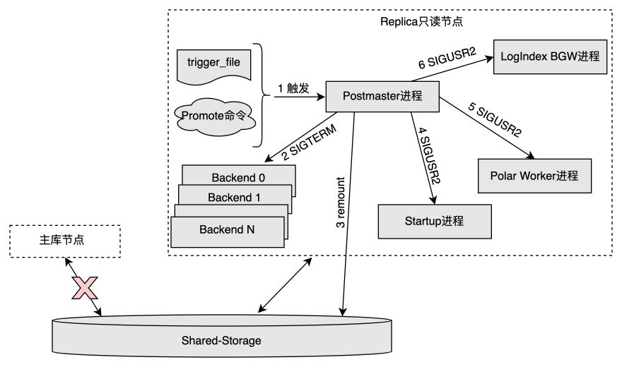
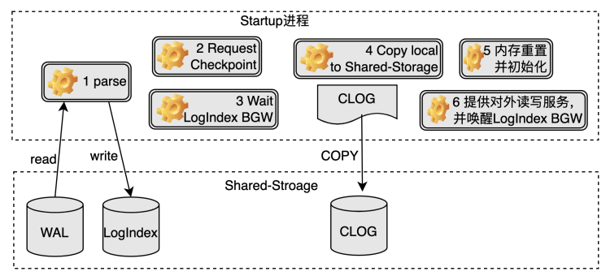
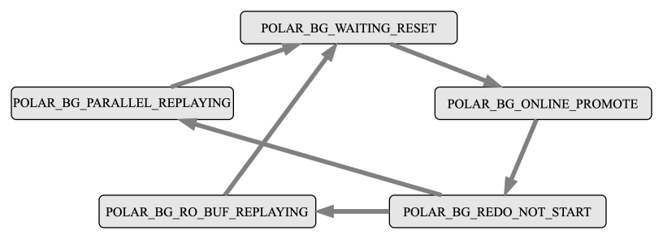

# 只读节点 Online Promote

<Badge type="tip" text="V11 / v1.1.1-" vertical="top" />

<ArticleInfo :frontmatter=$frontmatter></ArticleInfo>

[[toc]]

## 背景

PolarDB 是基于共享存储的一写多读架构，与传统数据库的主备架构有所不同：

- **Standby 节点**，是传统数据库的备库节点，有独立的存储，与主库节点之间通过传输完整的 WAL 日志来同步数据；
- **只读节点**，也称为 **Replica 节点**，是 PolarDB 数据库的只读备库节点，与主节点共享同一份存储，与主库节点之间通过传输 WAL Meta 日志信息来同步数据。

传统数据库支持 Standby 节点升级为主库节点的 Promote 操作，在不重启的情况下，提升备库节点为主库节点，继续提供读写服务，保证集群高可用的同时，也有效降低了实例的恢复时间 RTO。

PolarDB 同样需要只读备库节点提升为主库节点的 Promote 能力，鉴于只读节点与传统数据库 Standby 节点的不同，PolarDB 提出了一种一写多读架构下只读节点的 OnlinePromote 机制。

## 使用

使用 `pg_ctl` 工具对 Replica 节点执行 Promote 操作：

```bash:no-line-numbers
pg_ctl promote -D [datadir]
```

## OnlinePromote 原理

### 触发机制

PolarDB 使用和传统数据库一致的备库节点 Promote 方法，触发条件如下：

- 调用 `pg_ctl` 工具的 Promote 命令，`pg_ctl` 工具会向 Postmaster 进程发送信号，接收到信号的 Postmaster 进程再通知其他进程执行相应的操作，完成整个 Promote 操作。
- 在 `recovery.conf` 中定义 trigger file 的路径，其他组件通过生成 trigger file 来触发。

相比于传统数据库 Standby 节点的 Promote 操作，PolarDB Replica 节点的 OnlinePromote 操作需要多考虑以下几个问题：

- Replica 节点 OnlinePromote 为主库节点后，需要以读写模式重新挂载共享存储；
- Replica 节点会在内存中维护一些重要的控制信息，这些控制信息在主库节点上会被持久化到共享存储中。Promote 过程中，这部分信息也需要持久化到共享存储；
- Replica 节点在内存中通过日志回放得到的数据信息，在 OnlinePromote 的过程中需要确认哪些数据可以写入共享存储；
- Replica 节点在内存中回放 WAL 日志时，缓冲区淘汰方法和不刷脏的特性与主库节点截然不同，OnlinePromote 过程中应该如何处理；
- Replica 节点 OnlinePromote 过程中，各个子进程的处理过程。

### Postmaster 进程处理过程

1. Postmaster 进程发现 trigger file 文件或者接收到 OnlinePromote 命令后，进入 OnlinePromote 的处理流程；
2. 发送 `SIGTERM` 信号给当前所有 Backend 进程。
   - 只读节点在 OnlinePromote 过程中可以继续提供只读服务，但是只读的数据不能保证是最新的。为了避免切换过程中从新的主库节点读到旧的数据，这里先将所有的 Backend 会话断开，等 Startup 进程退出后再开始对外提供读写服务。
3. 重新以 **读写模式** 挂载共享存储，需要底层存储提供相应的功能支持；
4. 发送 `SIGUSR2` 信号给 **Startup 进程**，通知其结束回放并处理 OnlinePromote 操作；
5. 发送 `SIGUSR2` 信号给 **Polar Worker 辅助进程**，通知其停止对于部分 LogIndex 数据的解析，因为这部分 LogIndex 数据只对于正常运行期间的 Replica 节点有用处。
6. 发送 `SIGUSR2` 信号给 **LogIndex BGW (Background Ground Worker) 后台回放进程**，通知其处理 OnlinePromote 操作。



### Startup 进程处理过程

1. Startup 进程回放完所有旧主库节点产生的 WAL 日志，生成相应的 LogIndex 数据；
2. 确认旧主库节点最后一次的 checkpoint 在 Replica 节点也完成，目的是确保对应的 checkpoint 应该在 Replica 节点本地写入的数据落盘完毕；
3. 等待确认 LogIndex BGW 进程进入 `POLAR_BG_WAITING_RESET` 状态；
4. 将 Replica 节点本地的数据（如 clog 等）拷贝到共享存储中；
5. 重置 WAL Meta Queue 内存空间，从共享存储中重新加载 slot 信息，并重新设置 LogIndex BGW 进程的回放位点为其与当前一致性位点两者的最小值，表示接下来 LogIndex BGW 进程从该位点开始新的回放；
6. 将节点角色设置为主库节点，并设置 LogIndex BGW 进程的状态为 `POLAR_BG_ONLINE_PROMOTE`，至此实例可以对外提供读写服务。



### LogIndex BGW 进程处理过程

LogIndex BGW 进程有自己的状态机，在其生命周期内，一直按照该状态机运行，具体每个状态机的操作内容如下：

- `POLAR_BG_WAITING_RESET`：LogIndex BGW 进程状态重置，通知其他进程状态机发生变化；
- `POLAR_BG_ONLINE_PROMOTE`：读取 LogIndex 数据，组织并分发回放任务，利用并行回放进程组回放 WAL 日志，该状态的进程需要回放完所有的 LogIndex 数据才会进行状态切换，最后推进后台回放进程的回放位点；
- `POLAR_BG_REDO_NOT_START`：表示回放任务结束；
- `POLAR_BG_RO_BUF_REPLAYING`：Replica 节点正常运行时，进程处于该状态，读取 LogIndex 数据，按照 WAL 日志的顺序回放一定量的 WAL 日志，每回放一轮，便会推进后台回放进程的回放位点；
- `POLAR_BG_PARALLEL_REPLAYING`：LogIndex BGW 进程每次读取一定量的 LogIndex 数据，组织并分发回放任务，利用并行回放进程组回放 WAL 日志，每回放一轮，便会推进后台回放进程的回放位点。



LogIndex BGW 进程接收到 Postmaster 的 `SIGUSR2` 信号后，执行 OnlinePromote 操作的流程如下：

1. 将所有的 LogIndex 数据落盘，并切换状态为 `POLAR_BG_WAITING_RESET`；
2. 等待 Startup 进程将其切换为 `POLAR_BG_ONLINE_PROMOTE` 状态；
   - Replica 节点在执行 OnlinePromote 操作前，后台回放进程只回放在 buffer pool 中的页面；
   - Replica 节点处于 OnlinePromote 过程中时，鉴于之前主库节点可能有部分页面在内存中，未来得及落盘，所以后台回放进程按照日志顺序回放所有的 WAL 日志，并在回放后调用 `MarkBufferDirty` 标记该页面为脏页，等待刷脏；
   - 回放结束后，推进后台回放进程的回放位点，然后切换状态为 `POLAR_BG_REDO_NOT_START`。

### 刷脏控制

每个脏页都带有一个 Oldest LSN，该 LSN 在 FlushList 里是有序的，目的是通过这个 LSN 来确定一致性位点。

Replica 节点在 OnlinePromote 过程后，由于同时存在着回放和新的页面写入，如果像主库节点一样，直接将当前的 WAL 日志插入位点设为 Buffer 的 Oldest LSN，可能会导致：比它小的 Buffer 还未落盘，但新的一致性位点已经被设置。

所以 Replica 节点在 OnlinePromote 过程中需要面对两个问题：

- 旧主库节点的 WAL 日志回放时，如何给脏页设置 Oldest LSN；
- 新主库节点产生的脏页如何设置 Oldest LSN；

PolarDB 在 Replica 节点 OnlinePromote 的过程中，将上述两类情况产生的脏页的 Oldest LSN 都设置为 LogIndex BGW 进程推进的回放位点。只有当标记为相同 Oldest LSN 的 Buffer 都落盘了，才将一致性位点向前推进。
