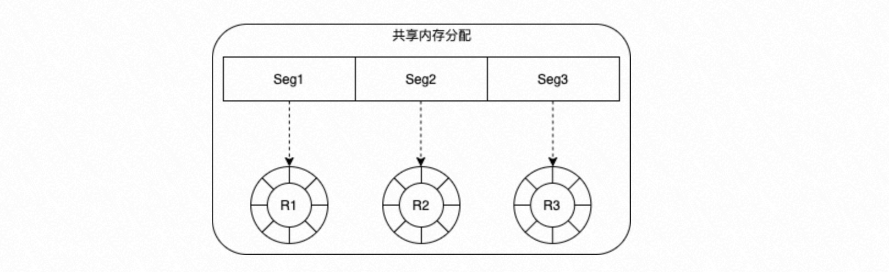
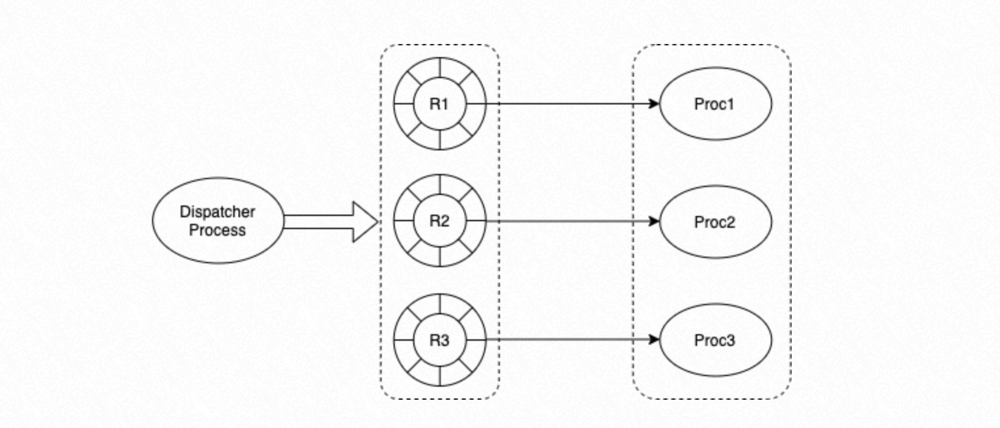
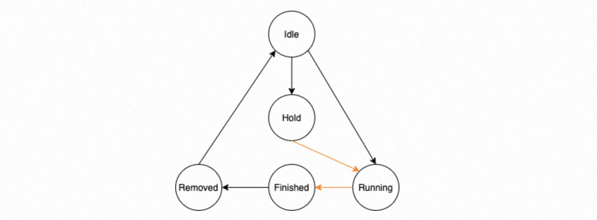
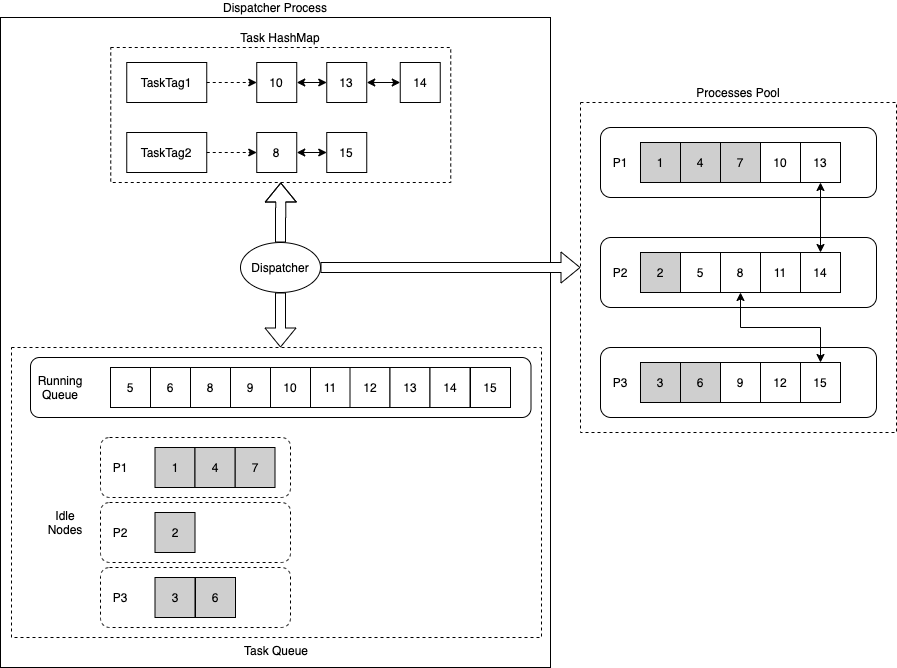
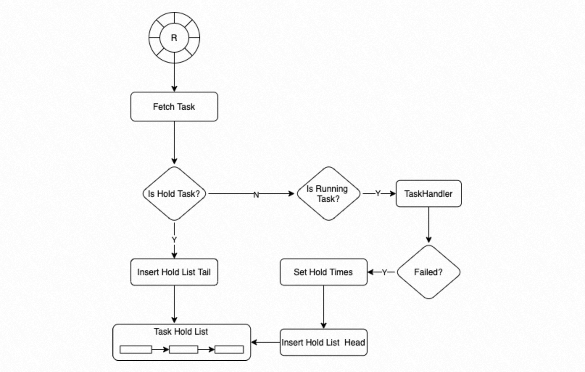
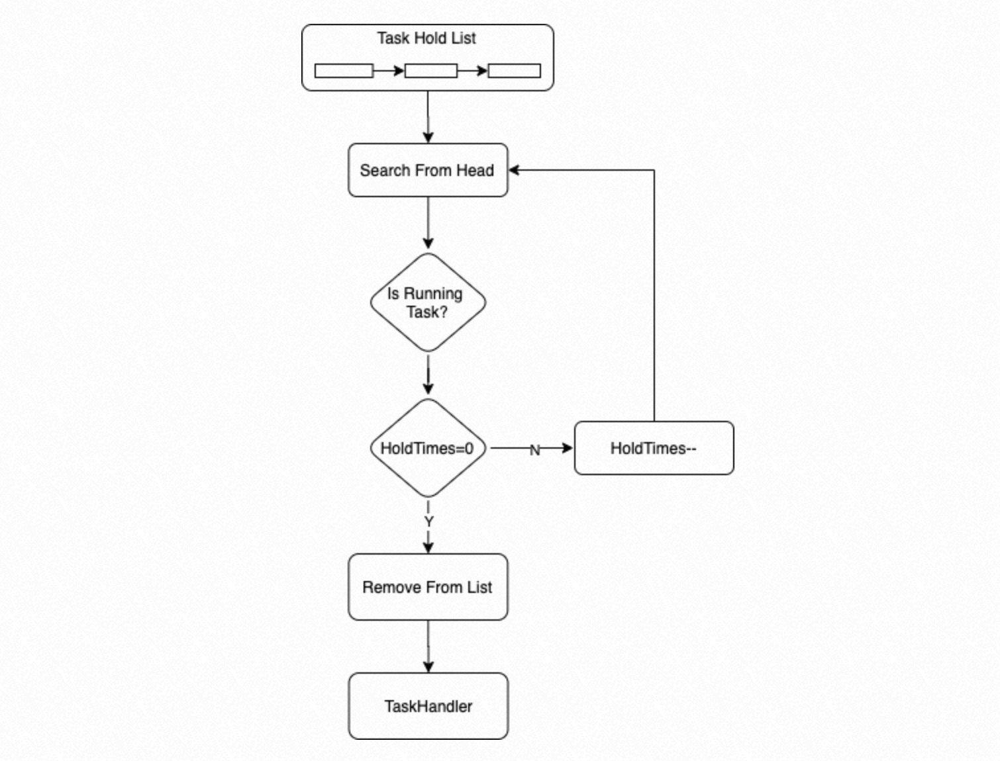
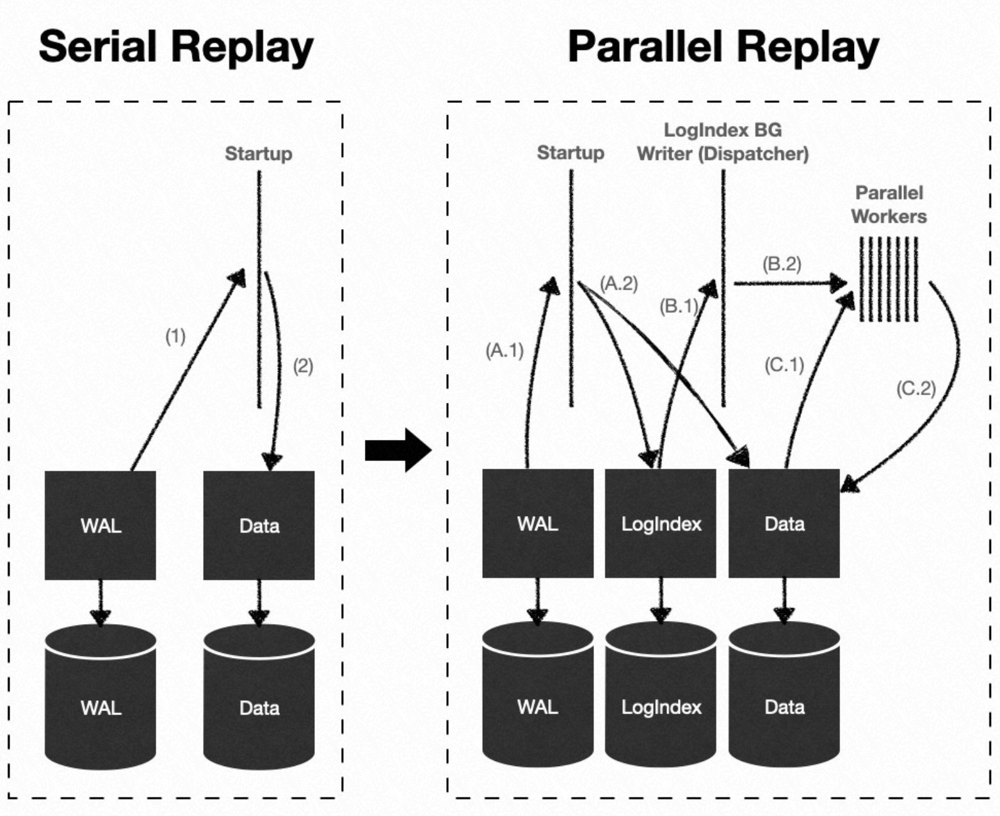
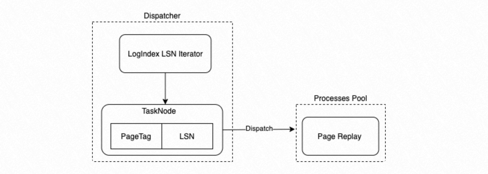

# WAL 日志并行回放

<Badge type="tip" text="V11 / v1.1.17-" vertical="top" />

<ArticleInfo :frontmatter=$frontmatter></ArticleInfo>

[[toc]]

## 背景

在 PolarDB for PostgreSQL 的一写多读架构下，只读节点（Replica 节点）运行过程中，LogIndex 后台回放进程（LogIndex Background Worker）和会话进程（Backend）分别使用 LogIndex 数据在不同的 Buffer 上回放 WAL 日志，本质上达到了一种并行回放 WAL 日志的效果。

鉴于 WAL 日志回放在 PolarDB 集群的高可用中起到至关重要的作用，将并行回放 WAL 日志的思想用到常规的日志回放路径上，是一种很好的优化思路。

并行回放 WAL 日志至少可以在以下三个场景下发挥优势:

1. 主库节点、只读节点以及备库节点崩溃恢复（Crash Recovery）的过程;
2. 只读节点 LogIndex BGW 进程持续回放 WAL 日志的过程;
3. 备库节点 Startup 进程持续回放 WAL 日志的过程。

## 术语

- Block：数据块
- WAL：Write-Ahead Logging，预写日志
- Task Node：并行执行框架中的子任务执行节点，可以接收并执行一个子任务
- Task Tag：子任务的分类标识，同一类的子任务执行顺序有先后关系
- Hold List：并行执行框架中，每个子进程调度执行回放子任务所使用的链表

## 原理

### 概述

一条 WAL 日志可能修改多个数据块 Block，因此可以使用如下定义来表示 WAL 日志的回放过程：

- 假设第 `i` 条 WAL 日志 LSN 为 $LSN_i$，其修改了 `m` 个数据块，则定义第 `i` 条 WAL 日志修改的数据块列表 $Block_i = [Block_{i,0}, Block_{i,1}, ..., Block_{i,m}]$；
- 定义最小的回放子任务为 $Task_{i,j}={LSN_i -> Block_{i,j}}$，表示在数据块 $Block_{i,j}$ 上回放第 `i` 条 WAL 日志；
- 因此，一条修改了 `k` 个 Block 的 WAL 日志就可以表示成 `k` 个回放子任务的集合：$TASK_{i,*} = [Task_{i,0}, Task_{i,1}, ..., Task_{i,k}]$；
- 进而，多条 WAL 日志就可以表示成一系列回放子任务的集合：$TASK_{*,*} = [Task_{0,*}, Task_{1,*}, ..., Task_{N,*}]$；

在日志回放子任务集合 $Task_{*,*}$ 中，每个子任务的执行，有时并不依赖于前序子任务的执行结果。假设回放子任务集合如下：$TASK_{*,*} = [Task_{0,*}, Task_{1,*}, Task_{2,*}]$，其中：

- $Task_{0,*}=[Task_{0,0}, Task_{0,1}, Task_{0,2}]$
- $Task_{1,*}=[Task_{1,0}, Task_{1,1}]$，
- $Task_{2,*}=[Task_{2,0}]$

并且 $Block_{0,0} = Block_{1,0}$，$Block_{0,1} = Block_{1,1}$，$Block_{0,2} = Block_{2,0}$

则可以并行回放的子任务集合有三个：$[Task_{0,0},Task_{1,0}]$、$[Task_{0,1},Task_{1,1}]$、$[Task_{0,2},Task_{2,0}]$

综上所述，在整个 WAL 日志所表示的回放子任务集合中，存在很多子任务序列可以并行执行，而且不会影响最终回放结果的一致性。PolarDB 借助这种思想，提出了一种并行任务执行框架，并成功运用到了 WAL 日志回放的过程中。

### 并行任务执行框架

将一段共享内存根据并发进程数目进行等分，每一段作为一个环形队列，分配给一个进程。通过配置参数设定每个环形队列的深度：



- Dispatcher 进程
  - 通过将任务分发给指定的进程来控制并发调度；
  - 负责将进程执行完的任务从队列中删除；
- 进程组
  - 组内每一个进程从相应的环形队列中获取需要执行的任务，根据任务的状态决定是否执行。



#### 任务

环形队列的内容由 Task Node 组成，每个 Task Node 包含五个状态：Idle、Running、Hold、Finished、Removed。

- `Idle`：表示该 Task Node 未分配任务；
- `Running`：表示该 Task Node 已经分配任务，正在等待进程执行，或已经在执行；
- `Hold`：表示该 Task Node 有前向依赖的任务，需要等待依赖的任务执行完再执行；
- `Finished`：表示进程组中的进程已经执行完该任务；
- `Removed`：当 Dispatcher 进程发现一个任务的状态已经为 `Finished`，那么该任务所有的前置依赖任务也都应该为 `Finished` 状态，`Removed` 状态表示 Dispatcher 进程已经将该任务以及该任务所有前置任务都从管理结构体中删除；可以通过该机制保证 Dispatcher 进程按顺序处理有依赖关系的任务执行结果。



上述状态机的状态转移过程中，黑色线标识的状态转移过程在 Dispatcher 进程中完成，橙色线标识的状态转移过程在并行回放进程组中完成。

#### Dispatcher 进程

Dispatcher 进程有三个关键数据结构：Task HashMap、Task Running Queue 以及 Task Idle Nodes。

- **Task HashMap** 负责记录 Task Tag 和相应的执行任务列表的 hash 映射关系：
  - 每个任务有一个指定的 Task Tag，如果两个任务间存在依赖关系，则它们的 Task Tag 相同；
  - 在分发任务时，如果一个 Task Node 存在前置依赖任务，则状态标识为 `Hold`，需等待前置任务先执行。
- **Task Running Queue** 负责记录当前正在执行的任务；
- **Task Idel Nodes** 负责记录进程组中不同进程，当前处于 `Idle` 状态的 Task Node；

Dispatcher 调度策略如下：

- 如果要执行的 Task Node 有相同 Task Tag 的任务在执行，则优先将该 Task Node 分配到该 Task Tag 链表最后一个 Task Node 所在的执行进程；目的是让有依赖关系的任务尽量被同一个进程执行，减少进程间同步的开销；
- 如果期望优先分配的进程队列已满，或者没有相同的 Task Tag 在执行，则在进程组中按顺序选择一个进程，从中获取状态为 `Idle` 的 Task Node 来调度任务执行；目的是让任务尽量平均分配到不同的进程进行执行。



#### 进程组

该并行执行针对的是相同类型的任务，它们具有相同的 Task Node 数据结构；在进程组初始化时配置 `SchedContext`，指定负责执行具体任务的函数指针：

- `TaskStartup` 表示进程执行任务前需要进行的初始化动作
- `TaskHandler` 根据传入的 Task Node，负责执行具体的任务
- `TaskCleanup` 表示执行进程退出前需要执行的回收动作


进程组中的进程从环形队列中获取一个 Task Node，如果 Task Node 当前的状态是 `Hold`，则将该 Task Node 插入到 Hold List 的尾部；如果 Task Node 的状态为 Running，则调用 TaskHandler 执行；如果 TaskHandler 执行失败，则设置该 Task Node 重新执行需要等待调用的次数，默认为 3，将该 Task Node 插入到 Hold List 的头部。



进程优先从 Hold List 头部搜索，获取可执行的 Task；如果 Task 状态为 Running，且等待调用次数为 0，则执行该 Task；如果 Task 状态为 Running，但等待调用次数大于 0，则将等待调用次数减去 1。



### WAL 日志并行回放

根据 LogIndex 章节介绍，LogIndex 数据中记录了 WAL 日志和其修改的数据块之间的对应关系，而且 LogIndex 数据支持使用 LSN 进行检索，鉴于此，PolarDB 数据库在 Standby 节点持续回放 WAL 日志过程中，引入了上述并行任务执行框架，并结合 LogIndex 数据将 WAL 日志的回放任务并行化，提高了 Standby 节点数据同步的速度。

#### 工作流程

- Startup 进程：解析 WAL 日志后，仅构建 LogIndex 数据而不真正回放 WAL 日志；
- LogIndex BGW 后台回放进程：成为上述并行任务执行框架的 Dispatcher 进程，利用 LSN 来检索 LogIndex 数据，构建日志回放的子任务，并分配给并行回放进程组；
- 并行回放进程组内的进程：执行日志回放子任务，对数据块执行单个日志的回放操作；
- Backend 进程：主动读取数据块时，根据 PageTag 来检索 LogIndex 数据，获得修改该数据块的 LSN 日志链表，对数据块执行完整日志链的回放操作。



- Dispatcher 进程利用 LSN 来检索 LogIndex 数据，按 LogIndex 插入顺序枚举 PageTag 和对应 LSN，构建{LSN -> PageTag}，组成相应的 Task Node；
- PageTag 作为 Task Node 的 Task Tag；
- 将枚举组成的 Task Node 分发给并行执行框架中进程组的子进程进行回放；



## 使用方法

在 Standby 节点的 `postgresql.conf` 中添加以下参数开启功能：

```ini:no-line-numbers
polar_enable_parallel_replay_standby_mode = ON
```
