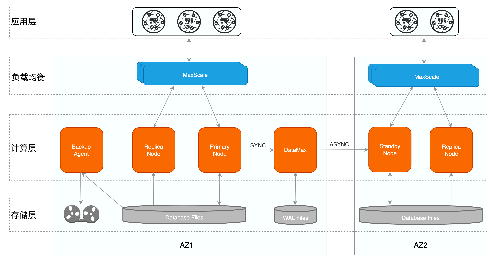
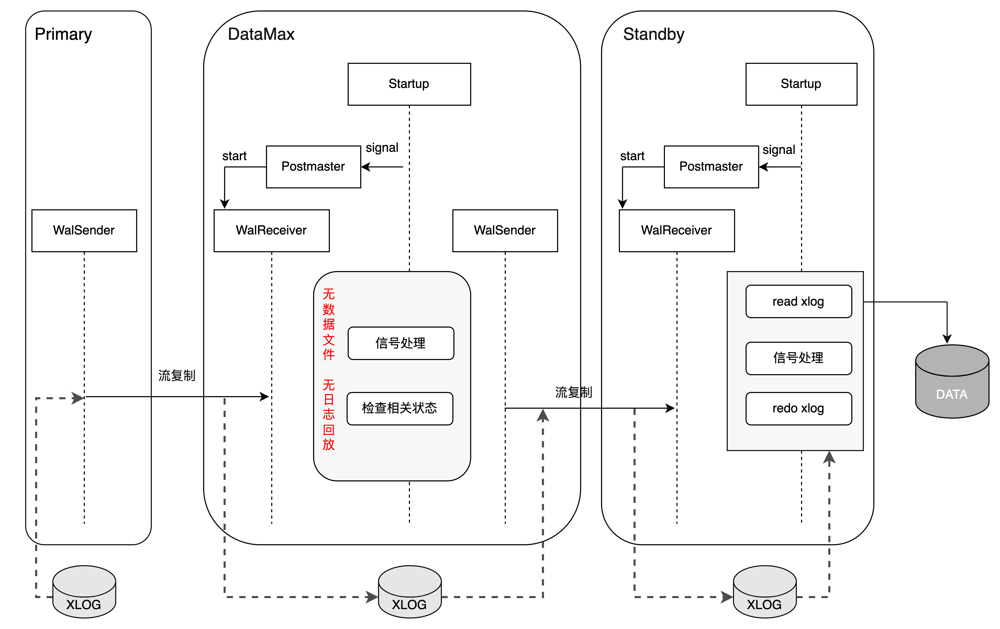
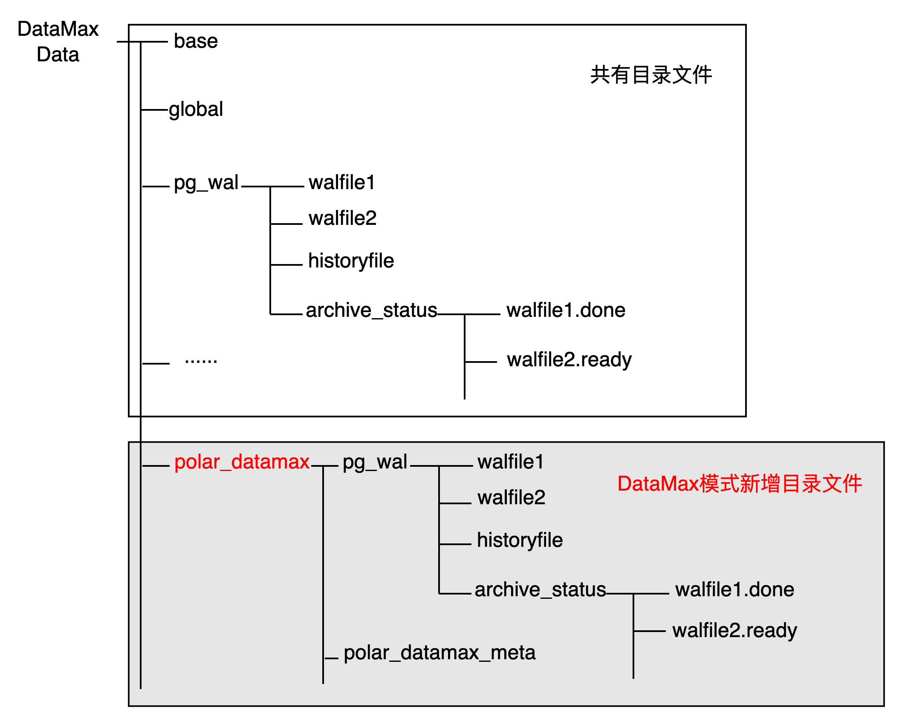
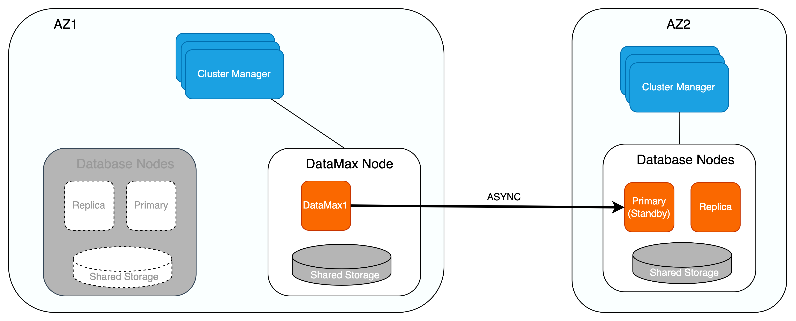
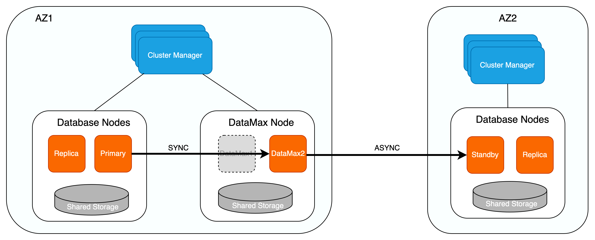

# DataMax 日志节点

<Badge type="tip" text="V11 / v1.1.6-" vertical="top" />

<ArticleInfo :frontmatter=$frontmatter></ArticleInfo>

[[toc]]

## 术语

- RPO (Recovery Point Objective)：数据恢复点目标，指业务系统所能容忍的数据丢失量。
- AZ (Availability Zone)：可用区，指同一个地域内电力和网络相互独立的区域，可用区之间可以做到故障隔离。

## 背景

在高可用的场景中，为保证 RPO = 0，主库和备库之间需配置为同步复制模式。但当主备库距离较远时，同步复制的方式会存在较大延迟，从而对主库性能带来较大影响。异步复制对主库的性能影响较小，但会带来一定程度的数据丢失。PolarDB for PostgreSQL 采用基于共享存储的一写多读架构，可同时提供 AZ 内 / 跨 AZ / 跨域级别的高可用。为了减少日志同步对主库的影响，PolarDB for PostgreSQL 引入了 DataMax 节点。在进行跨 AZ 甚至跨域同步时，DataMax 节点可以作为主库日志的中转节点，能够以较低成本实现零数据丢失的同时，降低日志同步对主库性能的影响。

## 原理

### DataMax 高可用架构

PolarDB for PostgreSQL 基于物理流复制实现主备库之间的数据同步，主库与备库的流复制模式分为 **同步模式** 及 **异步模式** 两种：

- **异步模式**：主库事务提交仅需等待对应 WAL 日志写入本地磁盘文件后，即可进行事务提交的后续操作，备库状态对主库性能无影响；但异步模式下无法保证 RPO = 0，备库相较于主库存在一定的延迟，若主库所在集群出现故障，切换至备库可能存在数据丢失的问题；
- **同步模式**：主库及备库之间的同步模式包含不同的级别，当设置 `synchronous_standby_names` 参数开启备库同步后，可以通过 `synchronous_commit` 参数设置主库及备库之间的同步级别，包括：
  - `remote_write`：主库的事务提交需等待对应 WAL 日志写入主库磁盘文件及备库的系统缓存中后，才能进行事务提交的后续操作；
  - `on`：主库的事务提交需等待对应 WAL 日志已写入主库及备库的磁盘文件中后，才能进行事务提交的后续操作；
  - `remote_apply`：主库的事务提交需等待对应 WAL 日志写入主库及备库的磁盘文件中，并且备库已经回放完相应 WAL 日志使备库上的查询对该事务可见后，才能进行事务提交的后续操作。

同步模式保证了主库的事务提交操作需等待备库接收到对应的 WAL 日志数据之后才可执行，实现了主库与备库之间的零数据丢失，可保证 RPO = 0。然而，该模式下主库的事务提交操作能否继续进行依赖于备库的 WAL 日志接收结果，当主备之间距离较远导致传输延迟较大时，同步模式会对主库的性能带来影响。极端情况下，若备库异常崩溃，则主库会一直阻塞等待备库，导致无法正常提供服务。

针对传统主备模式下同步复制对主库性能影响较大的问题，PolarDB for PostgreSQL 新增了 DataMax 节点用于实现远程同步，该模式下的高可用架构如下所示：



其中：

1. 一个数据库集群部署在一个可用区内，不同的集群之间互为灾备，以主备模式保证跨 AZ / 跨域级别的高可用；
2. 单个数据库集群内为一写多读架构， Primary 节点和 Replica 节点共享同一份存储，有效降低存储成本；同时 Replica 节点还可以实现单个 AZ 内计算节点的高可用；
3. DataMax 节点与集群内的 Primary 节点部署在同一个可用区内：
   - DataMax 节点只接收并保存 Primary 节点的 WAL 日志文件，但不对日志进行回放操作，也不保存 Primary 节点的数据文件，降低存储成本；
   - DataMax 节点与 Primary 节点的数据不共享，两者的存储设备彼此隔离，防止计算集群存储异常导致 Primary 节点与 DataMax 节点保存的日志同时丢失；
   - DataMax 节点与 Primary 节点之间为 **同步复制** 模式，确保 RPO = 0；DataMax 节点部署在距离 Primary 节点较近的区域，通常与 Primary 节点位于同一可用区，最小化日志同步对 Primary 节点带来的性能影响；
   - DataMax 节点将其接收的 WAL 日志发送至其他可用区的 Standby 节点，Standby 节点接收并回放 DataMax 节点的日志，实现与 Primary 节点（主库）的数据同步；Standby 节点与 DataMax 节点之间可设置为异步流复制模式，通过 DataMax 节点可分流 Primary 节点向多个备份数据库传输 WAL 日志的开销。

### DataMax 实现

DataMax 是一种新的节点角色，用户需要通过配置文件来标识当前节点是否为 DataMax 节点。DataMax 模式下，Startup 进程在回放完 DataMax 节点自身日志之后，从 `PM_HOT_STANDBY` 进入到 `PM_DATAMAX` 模式。`PM_DATAMAX` 模式下，Startup 进程仅进行相关信号及状态的处理，并通知 Postmaster 进程启动流复制，Startup 进程不再进行日志回放的操作。因此 DataMax 节点不会保存 Primary 节点的数据文件，从而降低了存储成本。



如上图所示，DataMax 节点通过 WalReceiver 进程向 Primary 节点发起流复制请求，接收并保存 Primary 节点发送的 WAL 日志信息；同时通过 WalSender 进程将所接收的主库 WAL 日志发送给异地的备库节点；备库节点接收到 WAL 日志后，通知其 Startup 进程进行日志回放，从而实现备库节点与 Primary 节点的数据同步。

DataMax 节点在数据目录中新增了 `polar_datamax/` 目录，用于保存所接收的主库 WAL 日志。DataMax 节点自身的 WAL 日志仍保存在原始目录下，两者的 WAL 日志不会相互覆盖，DataMax 节点也可以有自身的独有数据。

由于 DataMax 节点不会回放 Primary 节点的日志数据，在 DataMax 节点因为异常原因需要重启恢复时，就有了日志起始位点的问题。DataMax 节点通过 `polar_datamax_meta` 元数据文件存储相关的位点信息，以此来确认运行的起始位点：

- 初始化部署：在全新部署或者 DataMax 节点重搭的场景下，没有存量的位点信息；在向主库请求流复制时，需要表明自己是 DataMax 节点，同时还需要额外传递 `InvalidXLogRecPtr` 位点，表明其需要从 Primary 节点当前最旧的位点开始复制； Primary 节点接收到 `InvalidXLogRecPtr` 的流复制请求之后，会开始从当前最旧且完整的 WAL segment 文件开始发送 WAL 日志，并将相应复制槽的 `restart_lsn` 设置为该位点；
- 异常恢复：从存储上读取元数据文件，确认位点信息；以该位点为起点请求流复制。



### DataMax 集群高可用

如下图所示，增加 DataMax 节点后，若 Primary 节点与 Replica 节点同时异常，或存储无法提供服务时，则可将位于不同可用区的 Standby 节点提升为 Primary 节点，保证服务的可用性。在将 Standby 节点提升为 Primary 节点并向外提供服务之前，会确认 Standby 节点是否已从 DataMax 节点拉取完所有日志，待 Standby 节点获取完所有日志后才会将其提升为 Primary 节点。由于 DataMax 节点与 Primary 节点为同步复制，因此该场景下可保证 RPO = 0。

此外，DataMax 节点在进行日志清理时，除了保留下游 Standby 节点尚未接收的 WAL 日志文件以外，还会保留上游 Primary 节点尚未删除的 WAL 日志文件，避免 Primary 节点异常后，备份系统无法获取到 Primary 节点相较于 DataMax 节点多出的日志信息，保证集群数据的完整性。



若 DataMax 节点异常，则优先尝试通过重启进行恢复；若重启失败则会对其进行重建。因 DataMax 节点与 Primary 节点的存储彼此隔离，因此两者的数据不会互相影响。此外，DataMax 节点同样可以使用计算存储分离架构，确保 DataMax 节点的异常不会导致其存储的 WAL 日志数据丢失。



类似地，DataMax 节点实现了如下几种日志同步模式，用户可以根据具体业务需求进行相应配置：

- **最大保护模式**：DataMax 节点与 Primary 节点进行同步复制，确保 RPO = 0；若 DataMax 节点因网络或硬件故障无法提供服务，则 Primary 节点也会因此阻塞而无法对外提供服务；
- **最大性能模式**：DataMax 节点与 Primary 节点进行异步复制，DataMax 节点不对 Primary 节点性能带来影响，DataMax 节点异常也不会影响 Primary 节点的服务；若 Primary 节点的存储或对应的集群发生故障，可能导致丢失数据，无法确保 RPO = 0；
- **最大高可用模式**：
  - 当 DataMax 节点正常工作时，DataMax 节点与 Primary 节点进行同步复制，即为最大保护模式；
  - 若 DataMax 节点异常，Primary 节点自动将同步模式降级为最大性能模式，保证 Primary 节点服务的持续可用性；
  - 当 DataMax 节点恢复正常后，Primary 节点将最大性能模式提升为最大保护模式，避免 WAL 日志数据丢失的可能性。

综上，通过 DataMax 日志中转节点降低日志同步延迟、分流 Primary 节点的日志传输压力，在性能稳定的情况下，可以保障跨 AZ / 跨域 RPO = 0 的高可用。

## 使用指南

### DataMax 节点目录初始化

初始化 DataMax 节点时需要指定 Primary 节点的 system identifier:

```shell:no-line-numbers
# 获取 Primary 节点的 system identifier
~/tmp_basedir_polardb_pg_1100_bld/bin/pg_controldata -D ~/primary | grep 'system identifier'

# 创建 DataMax 节点
# -i 参数指定的 [primary_system_identifier] 为上一步得到的 Primary 节点 system identifier
~/tmp_basedir_polardb_pg_1100_bld/bin/initdb -D datamax -i [primary_system_identifier]

# 如有需要，参考 Primary 节点，对 DataMax 节点的共享存储进行初始化
sudo pfs -C disk mkdir /nvme0n1/dm_shared_data
sudo ~/tmp_basedir_polardb_pg_1100_bld/bin/polar-initdb.sh ~/datamax/ /nvme0n1/dm_shared_data/
```

### 加载运维插件

以可写节点的形式拉起 DataMax 节点，创建用户和插件以方便后续运维。DataMax 节点默认为只读模式，无法创建用户和插件。

```shell:no-line-numbers
~/tmp_basedir_polardb_pg_1100_bld/bin/pg_ctl start -D ~/datamax
```

创建管理账号及插件：

```sql:no-line-numbers
postgres=# create user test superuser;
CREATE ROLE
postgres=# create extension polar_monitor;
CREATE EXTENSION
```

关闭 DataMax 节点：

```shell:no-line-numbers
~/tmp_basedir_polardb_pg_1100_bld/bin/pg_ctl stop -D ~/datamax;
```

### DataMax 节点配置及启动

在 DataMax 节点的 `recovery.conf` 中添加 `polar_datamax_mode` 参数，表示当前节点为 DataMax 节点：

```ini:no-line-numbers
polar_datamax_mode = standalone
recovery_target_timeline='latest'
primary_slot_name='datamax'
primary_conninfo='host=[主节点的IP] port=[主节点的端口] user=[$USER] dbname=postgres application_name=datamax'
```

启动 DataMax 节点：

```shell:no-line-numbers
~/tmp_basedir_polardb_pg_1100_bld/bin/pg_ctl start -D ~/datamax
```

### DataMax 节点检查

DataMax 节点自身可通过 `polar_get_datamax_info()` 接口来判断其运行是否正常：

```sql:no-line-numbers
postgres=# SELECT * FROM polar_get_datamax_info();
 min_received_timeline | min_received_lsn | last_received_timeline | last_received_lsn | last_valid_received_lsn | clean_reserved_lsn | force_clean
-----------------------+------------------+------------------------+-------------------+-------------------------+--------------------+-------------
                     1 | 0/40000000       |                      1 | 0/4079DFE0        | 0/4079DFE0              | 0/0                | f
(1 row)
```

在 Primary 节点可以通过 `pg_replication_slots` 查看对应复制槽的状态：

```sql:no-line-numbers
postgres=# SELECT * FROM pg_replication_slots;
 slot_name | plugin | slot_type | datoid | database | temporary | active | active_pid | xmin | catalog_xmin | restart_lsn | confirmed_flush_lsn
-----------+--------+-----------+--------+----------+-----------+--------+------------+------+--------------+-------------+---------------------
 datamax   |        | physical  |        |          | f         | t      |     124551 |  570 |              | 0/4079DFE0  |
(1 row)
```

### 日志同步模式配置

通过配置 Primary 节点的 `postgresql.conf`，可以设置下游 DataMax 节点的日志同步模式：

最大保护模式。其中 `datamax` 为 Primary 节点创建的复制槽名称：

```ini:no-line-numbers
polar_enable_transaction_sync_mode = on
synchronous_commit = on
synchronous_standby_names = 'datamax'
```

最大性能模式：

```ini:no-line-numbers
polar_enable_transaction_sync_mode = on
synchronous_commit = on
```

最大高可用模式：

- 参数 `polar_sync_replication_timeout` 用于设置同步超时时间阈值，单位为毫秒；等待同步复制锁超过此阈值时，同步复制将降级为异步复制；
- 参数 `polar_sync_rep_timeout_break_lsn_lag` 用于设置同步恢复延迟阈值，单位为字节；当异步复制延迟阈值小于此阈值时，异步复制将重新恢复为同步复制。

```ini:no-line-numbers
polar_enable_transaction_sync_mode = on
synchronous_commit = on
synchronous_standby_names = 'datamax'
polar_sync_replication_timeout = 10s
polar_sync_rep_timeout_break_lsn_lag = 8kB
```
