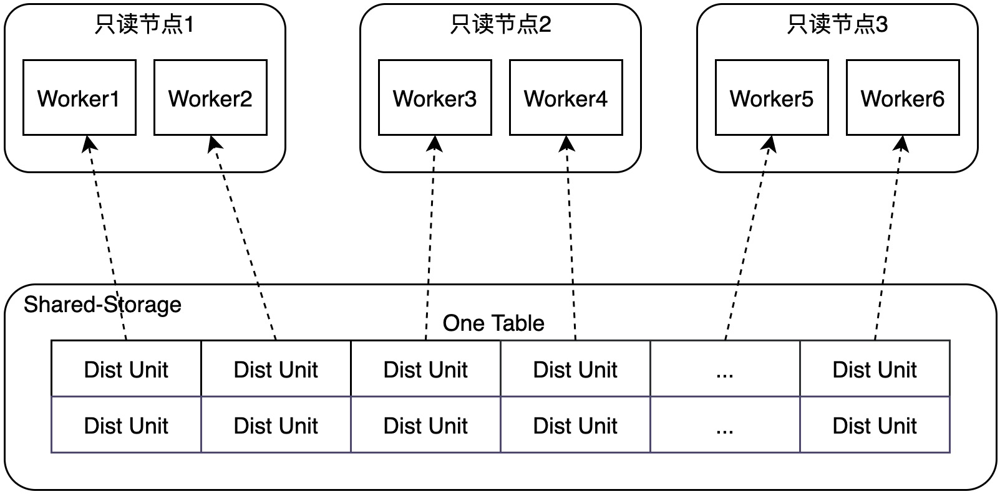
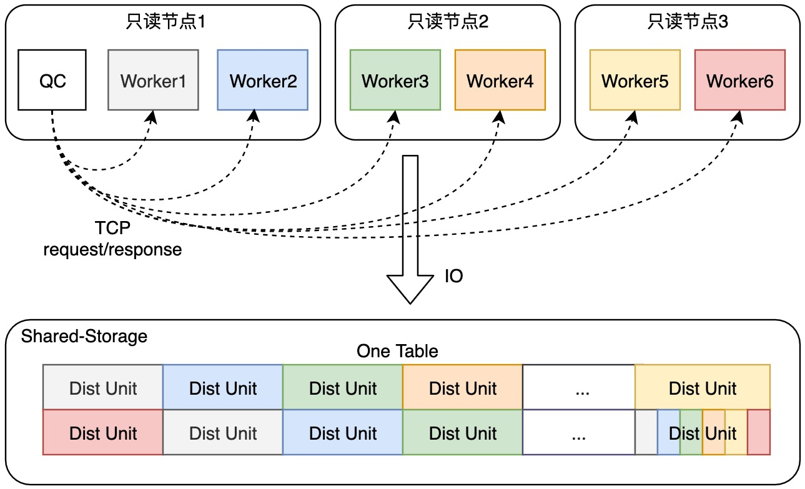

# 自适应扫描

<Badge type="tip" text="V11 / v1.1.17-" vertical="top" />

<ArticleInfo :frontmatter=$frontmatter></ArticleInfo>

[[toc]]

## 背景介绍

PolarDB for PostgreSQL 支持 ePQ 弹性跨机并行查询特性，通过利用集群中多个节点的计算能力，来实现跨节点的并行查询功能。ePQ 可以支持顺序扫描、索引扫描等多种物理算子的跨节点并行化。其中，对顺序扫描算子，ePQ 提供了两种扫描模式，分别为 **自适应扫描模式** 与 **非自适应扫描模式**。

## 术语

- QC：Query Coordinator，发起 ePQ 并行查询的进程角色。
- PX Worker：参与 ePQ 跨节点并行查询的工作进程角色。
- Worker ID：唯一标识一个 PX Worker 的编号。
- Disk Unit ID：ePQ 跨节点并行扫描的最小存储单元，默认为 4MB 大小。

## 功能介绍

### 非自适应扫描

非自适应扫描模式是 ePQ 顺序扫描算子（Sequential Scan）的默认扫描方式。每一个参与并行查询的 PX Worker 在执行过程中都会被分配一个唯一的 Worker ID。非自适应扫描模式将会依据 Worker ID 划分数据表在物理存储上的 Disk Unit ID，从而实现每个 PX Worker 可以均匀扫描数据表在共享存储上的存储单元，所有 PX Worker 的扫描结果最终汇总形成全量的数据。

### 自适应扫描

在非自适应扫描模式下，扫描单元会均匀划分给每个 PX Worker。当存在个别只读节点计算资源不足的情况下，可能会导致扫描过程发生计算倾斜：用户发起的单次并行查询迟迟不能完成，查询受限于计算资源不足的节点长时间不能完成扫描任务。

ePQ 提供的自适应扫描模式可以解决这个问题。自适应扫描模式不再限定每个 PX Worker 扫描特定的 Disk Unit ID，而是采用 **请求-响应（Request-Response）模式**，通过 QC 进程与 PX Worker 进程之间的特定 RPC 通信机制，由 QC 进程负责告知每个 PX Worker 进程可以执行的扫描任务，从而消除计算倾斜的问题。

## 功能设计

### 非自适应扫描

QC 进程在发起并行查询任务时，会为每个 PX Worker 进程分配固定的 Worker ID，每个 PX Worker 进程根据 Worker ID 对存储单元 **取模**，只扫描其所属的特定的 Dist Unit。



### 自适应扫描

QC 进程在发起并行查询任务时，会启动 **自适应扫描线程**，用于接收并处理来自 PX Worker 进程的请求消息。自适应扫描线程维护了当前查询扫描任务的进度，并根据每个 PX Worker 进程的工作进度，向 PX Worker 进程分派需要扫描的 Disk Unit ID。对于需要扫描的最后一个 Disk Unit，自适应扫描线程会唤醒处于空闲状态的 PX Worker，加速最后一块 Disk Unit 的扫描过程。



#### 消息通信机制

由于自适应扫描线程与各个 PX worker 进程之间的通信数据很少，频率不高，所以重用了已有的 QC 进程与 PX worker 进程之间的 libpq 连接进行报文通信。自适应扫描线程通过 **poll** 的方式在需要时同步轮询 PX Worker 进程的请求和响应。

#### 扫描任务协调

PX Worker 进程在执行顺序扫描算子时，会首先向 QC 进程发起询问请求，将以下信息发送给 QC 端的自适应扫描线程：

- 扫描任务的编号
- 扫描动作（正向 / 反向扫描）
- 扫描物理块数

自适应扫描线程在收到询问请求后，会创建扫描任务或更新扫描任务的进度。

#### 可变颗粒度

为了减少请求带来的网络交互次数，ePQ 实现了可变的任务颗粒度。当扫描任务量剩余较多时，PX Worker 进程单次领取的扫描物理块数较多；当扫描任务量剩余较少时，PX Worker 进程单次领取的扫描物理块数相应减少。通过这种方法，可以平衡 **网络开销** 与 **负载均衡** 两者之间的关系。

#### 缓存友好

自适应扫描模式将尽量保证每个节点在多次执行并行查询任务时，能够重用 Shared Buffer 缓存，避免缓存频繁更新 / 淘汰。在实现上，自适应扫描功能会根据 [集群拓扑视图](./cluster-info.md) 配置的节点 IP 地址信息，采用缓存绑定策略，尽量让同一个物理 Page 被同一个节点复用。

#### 报文设计

- PX Worker 请求报文：采用 libpq 的 `'S'` 协议进行通信，按照 key-value 的方式编码为字符串。

  | 内容         | 描述               |
  | ------------ | ------------------ |
  | task_id      | 扫描任务编号       |
  | direction    | 扫描方向           |
  | page_count   | 需扫描的总物理块数 |
  | scan_start   | 扫描起始物理块号   |
  | current_page | 当前扫描的物理块号 |
  | scan_round   | 扫描的次数         |

- 自适应扫描线程回复报文

  | 内容       | 描述               |
  | ---------- | ------------------ |
  | success    | 是否成功           |
  | page_start | 响应的起始物理块号 |
  | page_end   | 响应的结束物理块号 |

## 使用指南

创建测试表：

```sql:no-line-numbers
postgres=# CREATE TABLE t(id INT);
CREATE TABLE
postgres=# INSERT INTO t VALUES(generate_series(1,100));
INSERT 0 100
```

### 非自适应扫描

开启 ePQ 并行查询功能，并设置单节点并发度为 3。通过 `EXPLAIN` 可以看到执行计划来自 PX 优化器。由于参与测试的只读节点有两个，所以从执行计划中可以看到整体并发度为 6。

```sql
postgres=# SET polar_enable_px = 1;
SET
postgres=# SET polar_px_dop_per_node = 3;
SET
postgres=# SHOW polar_px_enable_adps;
 polar_px_enable_adps
----------------------
 off
(1 row)

postgres=# EXPLAIN SELECT * FROM t;
                                  QUERY PLAN
-------------------------------------------------------------------------------
 PX Coordinator 6:1  (slice1; segments: 6)  (cost=0.00..431.00 rows=1 width=4)
   ->  Partial Seq Scan on t  (cost=0.00..431.00 rows=1 width=4)
 Optimizer: PolarDB PX Optimizer
(3 rows)

postgres=# SELECT COUNT(*) FROM t;
 count
-------
   100
(1 row)
```

### 自适应扫描

开启自适应扫描功能的开关后，通过 `EXPLAIN ANALYZE` 可以看到每个 PX Worker 进程扫描的物理块号。

```sql
postgres=# SET polar_enable_px = 1;
SET
postgres=# SET polar_px_dop_per_node = 3;
SET
postgres=# SET polar_px_enable_adps = 1;
SET
postgres=# SHOW polar_px_enable_adps;
 polar_px_enable_adps
----------------------
 on
(1 row)

postgres=# SET polar_px_enable_adps_explain_analyze = 1;
SET
postgres=# SHOW polar_px_enable_adps_explain_analyze;
 polar_px_enable_adps_explain_analyze
--------------------------------------
 on
(1 row)

postgres=# EXPLAIN ANALYZE SELECT * FROM t;
                                                        QUERY PLAN
---------------------------------------------------------------------------------------------------------------------------
 PX Coordinator 6:1  (slice1; segments: 6)  (cost=0.00..431.00 rows=1 width=4) (actual time=0.968..0.982 rows=100 loops=1)
   ->  Partial Seq Scan on t  (cost=0.00..431.00 rows=1 width=4) (actual time=0.380..0.435 rows=100 loops=1)
         Dynamic Pages Per Worker: [1]
 Planning Time: 5.571 ms
 Optimizer: PolarDB PX Optimizer
   (slice0)    Executor memory: 23K bytes.
   (slice1)    Executor memory: 14K bytes avg x 6 workers, 14K bytes max (seg0).
 Execution Time: 9.047 ms
(8 rows)

postgres=# SELECT COUNT(*) FROM t;
 count
-------
   100
(1 row)
```
