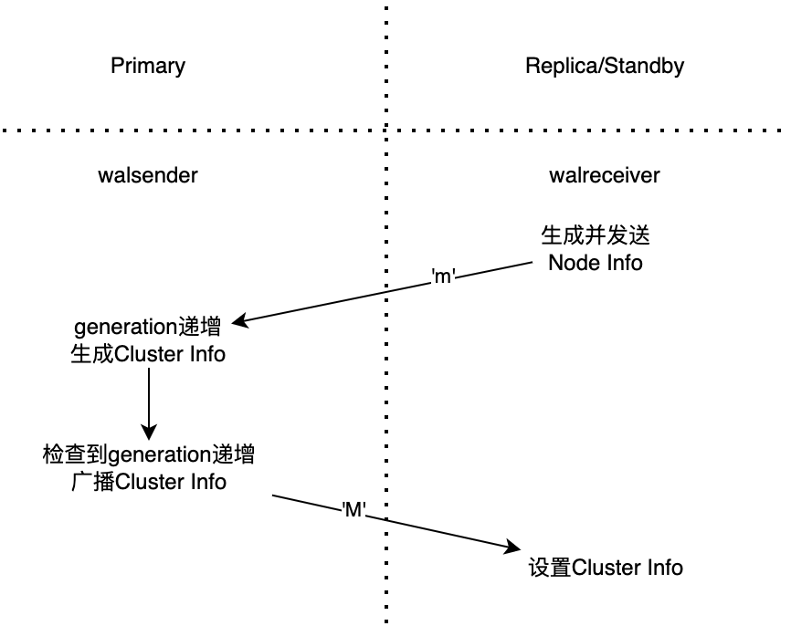

# 集群拓扑视图

<Badge type="tip" text="V11 / v1.1.20-" vertical="top" />

<ArticleInfo :frontmatter=$frontmatter></ArticleInfo>

[[toc]]

## 功能介绍

PolarDB for PostgreSQL 的 ePQ 弹性跨机并行查询功能可以将一个大查询分散到多个节点上执行，从而加快查询速度。该功能会涉及到各个节点之间的通信，包括执行计划的分发、执行的控制、结果的获取等等。因此设计了 **集群拓扑视图** 功能，用于为 ePQ 组件收集并展示集群的拓扑信息，实现跨节点查询。

## 术语

- RW / Primary：读写节点，后统称为 Primary
- RO / Replica：只读节点，后统称为 Replica
- Standby：灾备节点
- Replication Slot：流复制槽，PostgreSQL 中用于持久化流复制关系的机制

## 功能使用

集群拓扑视图的维护是完全透明的，用户只需要按照部署文档搭建一写多读的集群，集群拓扑视图即可正确维护起来。关键在于需要搭建带有流复制槽的 Replica / Standby 节点。

使用以下接口可以获取集群拓扑视图（执行结果来自于 PolarDB for PostgreSQL 11）：

```sql:no-line-numbers
postgres=# SELECT * FROM polar_cluster_info;
 name  |   host    | port | release_date | version | slot_name |  type   | state | cpu | cpu_quota | memory | memory_quota | iops | iops_quota | connection | connection_quota | px_connection | px_connection_quota | px_node
-------+-----------+------+--------------+---------+-----------+---------+-------+-----+-----------+--------+--------------+------+------------+------------+------------------+---------------+---------------------+---------
 node0 | 127.0.0.1 | 5432 | 20220930     | 1.1.27  |           | RW      | Ready |   0 |         0 |      0 |            0 |    0 |          0 |          0 |                0 |             0 |                   0 | f
 node1 | 127.0.0.1 | 5433 | 20220930     | 1.1.27  | replica1  | RO      | Ready |   0 |         0 |      0 |            0 |    0 |          0 |          0 |                0 |             0 |                   0 | t
 node2 | 127.0.0.1 | 5434 | 20220930     | 1.1.27  | replica2  | RO      | Ready |   0 |         0 |      0 |            0 |    0 |          0 |          0 |                0 |             0 |                   0 | t
 node3 | 127.0.0.1 | 5431 | 20220930     | 1.1.27  | standby1  | Standby | Ready |   0 |         0 |      0 |            0 |    0 |          0 |          0 |                0 |             0 |                   0 | f
(4 rows)
```

- `name` 是节点的名称，是自动生成的。
- `host` / `port` 表示了节点的连接信息。在这里，都是本地地址。
- `release_date` 和 `version` 标识了 PolarDB 的版本信息。
- `slot_name` 是节点连接所使用的流复制槽，只有使用流复制槽连接上来的节点才会被统计在该视图中（除 Primary 节点外）。
- `type` 表示节点的类型，有三类：
  - PolarDB for PostgreSQL 11：RW / RO / Standby
  - PolarDB for PostgreSQL 14：Primary / Replica / Standby
- `state` 表示节点的状态。有 Offline / Going Offline / Disabled / Initialized / Pending / Ready / Unknown 这些状态，其中只有 Ready 才有可能参与 PX 计算，其他的都无法参与 PX 计算。
- `px_node` 表示是否参与 PX 计算。
- 后续字段都是性能采集相关的字段，目前都是留空的。

对于 ePQ 查询来说，默认只有 Replica 节点参与。可以通过参数控制使用 Primary 节点或者 Standby 节点参与计算：

```sql:no-line-numbers
-- 使 Primary 节点参与计算
SET polar_px_use_master = ON;

-- 使 Standby 节点参与计算
SET polar_px_use_standby = ON;
```

::: tip
从 PolarDB for PostgreSQL 14 起，`polar_px_use_master` 参数改名为 `polar_px_use_primary`。
:::

还可以使用 `polar_px_nodes` 指定哪些节点参与 PX 计算。例如使用上述集群拓扑视图，可以执行如下命令，让 PX 查询只在 replica1 上执行。

```sql:no-line-numbers
SET polar_px_nodes = 'node1';
```

## 设计实现

### 信息采集

集群拓扑视图信息的采集是通过流复制来传递信息的。该功能对流复制协议增加了新的消息类型用于集群拓扑视图的传递。分为以下两个步骤：

- Replica / Standby 将状态传递给 Primary
- Primary 汇总集群拓扑视图，返回给 Replica / Standby

### 更新频率

集群拓扑视图并非定时更新与发送，因为视图并非一直变化。只有当节点刚启动时，或发生关键状态变化时再进行更新发送。

在具体实现上，Primary 节点收集的全局状态带有版本 generation，只有在接收到节点拓扑变化才会递增；当全局状态版本更新后，才会发送到其他节点，其他节点接收到后，设置到自己的节点上。



### 采集维度

状态指标：

- 节点 name
- 节点 host / port
- 节点 slot_name
- 节点负载（CPU / MEM / 连接 / IOPS）
- 节点状态
  - Offline
  - Going Offline
  - Disabled
  - Initialized
  - Pending
  - Ready
  - Unknown

### 消息格式

同 WAL Sender / WAL Reciver 的其他消息的做法，新增 `'m'` 和 `'M'` 消息类型，用于收集节点信息和广播集群拓扑视图。

### 内部使用

提供接口获取 Replica 列表，提供 IP / port 等信息，用于 PX 查询。

预留了较多的负载接口，可以根据负载来实现动态调整并行度。（尚未接入）

同时增加了参数 `polar_px_use_master` / `polar_px_use_standby`，将 Primary / Standby 加入到 PX 计算中，默认不打开（可能会有正确性问题，因为快照格式、Vacuum 等原因，快照有可能不可用）。

ePQ 会使用上述信息生成节点的连接信息并缓存下来，并在 ePQ 查询中使用该视图。当 generation 更新或者设置了 `polar_px_nodes` / `polar_px_use_master` / `polar_px_use_standby` 时，该缓存会被重置，并在下次使用时重新生成缓存。

### 结果展示

通过 `polar_monitor` 插件提供视图，将上述集群拓扑视图提供出去，在任意节点均可获取。
