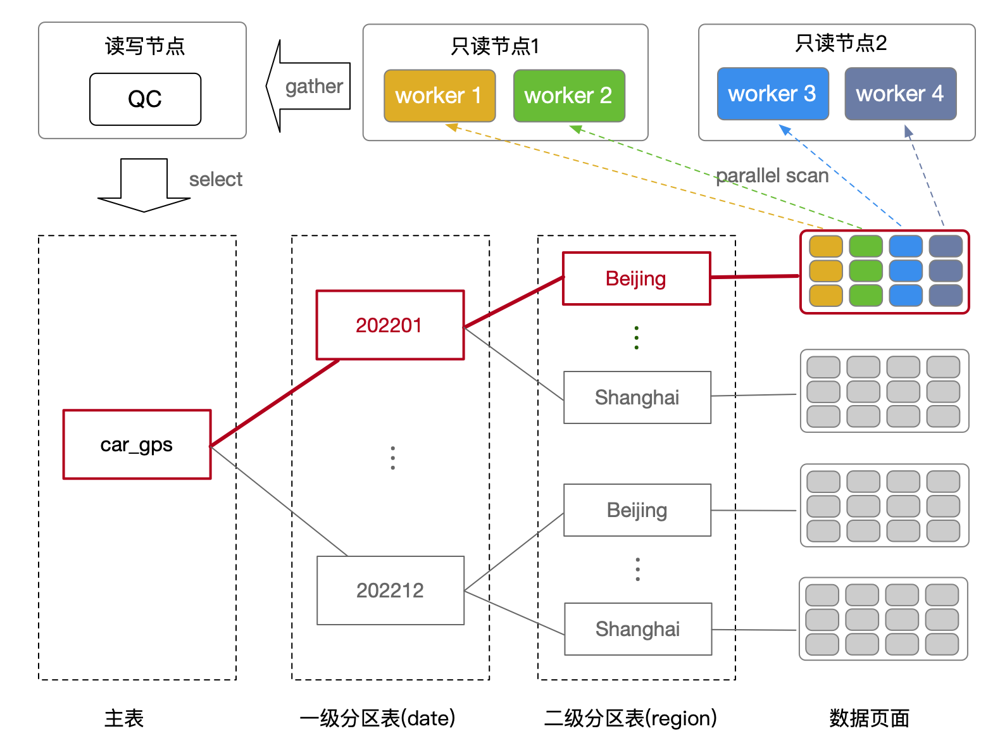

# ePQ 支持分区表查询

<Badge type="tip" text="V11 / v1.1.17-" vertical="top" />

<ArticleInfo :frontmatter=$frontmatter></ArticleInfo>

[[toc]]

## 背景

随着数据量的不断增长，表的规模将会越来越大。为了方便管理和提高查询性能，比较好的实践是使用分区表，将大表拆分成多个子分区表。甚至每个子分区表还可以进一步拆成二级子分区表，从而形成了多级分区表。

PolarDB-PG 支持 ePQ 弹性跨机并行查询，能够利用集群中多个计算节点提升只读查询的性能。ePQ 不仅能够对普通表进行高效的跨机并行查询，对分区表也实现了跨机并行查询。

ePQ 对分区表的基础功能支持包含：

- 对分区策略为 Range / List / Hash 的分区表进行并行扫描
- 对分区表进行索引扫描
- 对分区表进行连接查询

此外，ePQ 还支持了部分与分区表相关的高级功能：

- 分区裁剪
- 智能分区连接（Partition Wise Join）
- 对多级分区表进行并行查询

ePQ 暂不支持对具有多列分区键的分区表进行并行查询。

## 使用指南

### 分区表并行查询

创建一张分区策略为 Range 的分区表，并创建三个子分区：

```sql:no-line-numbers
CREATE TABLE t1 (id INT) PARTITION BY RANGE(id);
CREATE TABLE t1_p1 PARTITION OF t1 FOR VALUES FROM (0) TO (200);
CREATE TABLE t1_p2 PARTITION OF t1 FOR VALUES FROM (200) TO (400);
CREATE TABLE t1_p3 PARTITION OF t1 FOR VALUES FROM (400) TO (600);
```

设置参数打开 ePQ 开关和 ePQ 分区表扫描功能的开关：

```sql:no-line-numbers
SET polar_enable_px TO ON;
SET polar_px_enable_partition TO ON;
```

查看对分区表进行全表扫描的执行计划：

```sql:no-line-numbers
=> EXPLAIN (COSTS OFF) SELECT * FROM t1;
                QUERY PLAN
-------------------------------------------
 PX Coordinator 6:1  (slice1; segments: 6)
   ->  Append
         ->  Partial Seq Scan on t1_p1
         ->  Partial Seq Scan on t1_p2
         ->  Partial Seq Scan on t1_p3
 Optimizer: PolarDB PX Optimizer
(6 rows)
```

ePQ 将会启动一组进程并行扫描分区表的每一个子表。每一个扫描进程都会通过 `Append` 算子依次扫描每一个子表的一部分数据（`Partial Seq Scan`），并通过 Motion 算子（`PX Coordinator`）将所有进程的扫描结果汇聚到发起查询的进程并返回。

### 分区静态裁剪

当查询的过滤条件中包含分区键时，ePQ 优化器可以根据过滤条件对将要扫描的分区表进行裁剪，避免扫描不需要的子分区，节省系统资源，提升查询性能。以上述 `t1` 表为例，查看以下查询的执行计划：

```sql:no-line-numbers
=> EXPLAIN (COSTS OFF) SELECT * FROM t1 WHERE id < 100;
                QUERY PLAN
-------------------------------------------
 PX Coordinator 6:1  (slice1; segments: 6)
   ->  Append
         ->  Partial Seq Scan on t1_p1
               Filter: (id < 100)
 Optimizer: PolarDB PX Optimizer
(5 rows)
```

由于查询的过滤条件 `id < 100` 包含分区键，因此 ePQ 优化器可以根据分区表的分区边界，在产生执行计划时去除不符合过滤条件的子分区（`t1_p2`、`t1_p3`），只保留符合过滤条件的子分区（`t1_p1`）。

### 智能分区连接

在进行分区表之间的连接操作时，如果分区策略和边界相同，并且连接条件为分区键时，ePQ 优化器可以产生以子分区为单位进行连接的执行计划，避免两张分区表的进行笛卡尔积式的连接，节省系统资源，提升查询性能。

以两张 Range 分区表的连接为例。使用以下 SQL 创建两张分区策略和边界都相同的分区表 `t2` 和 `t3`：

```sql:no-line-numbers
CREATE TABLE t2 (id INT) PARTITION BY RANGE(id);
CREATE TABLE t2_p1 PARTITION OF t2 FOR VALUES FROM (0) TO (200);
CREATE TABLE t2_p2 PARTITION OF t2 FOR VALUES FROM (200) TO (400);
CREATE TABLE t2_p3 PARTITION OF t2 FOR VALUES FROM (400) TO (600);

CREATE TABLE t3 (id INT) PARTITION BY RANGE(id);
CREATE TABLE t3_p1 PARTITION OF t3 FOR VALUES FROM (0) TO (200);
CREATE TABLE t3_p2 PARTITION OF t3 FOR VALUES FROM (200) TO (400);
CREATE TABLE t3_p3 PARTITION OF t3 FOR VALUES FROM (400) TO (600);
```

打开以下参数启用 ePQ 对分区表的支持：

```sql:no-line-numbers
SET polar_enable_px TO ON;
SET polar_px_enable_partition TO ON;
```

当 Partition Wise join 关闭时，两表在分区键上等值连接的执行计划如下：

```sql:no-line-numbers
=> SET polar_px_enable_partitionwise_join TO OFF;
=> EXPLAIN (COSTS OFF) SELECT * FROM t2 JOIN t3 ON t2.id = t3.id;
                        QUERY PLAN
-----------------------------------------------------------
 PX Coordinator 6:1  (slice1; segments: 6)
   ->  Hash Join
         Hash Cond: (t2_p1.id = t3_p1.id)
         ->  Append
               ->  Partial Seq Scan on t2_p1
               ->  Partial Seq Scan on t2_p2
               ->  Partial Seq Scan on t2_p3
         ->  Hash
               ->  PX Broadcast 6:6  (slice2; segments: 6)
                     ->  Append
                           ->  Partial Seq Scan on t3_p1
                           ->  Partial Seq Scan on t3_p2
                           ->  Partial Seq Scan on t3_p3
 Optimizer: PolarDB PX Optimizer
(14 rows)
```

从执行计划中可以看出，执行 `slice1` 计划分片的六个进程会分别通过 `Append` 算子依次扫描分区表 `t2` 每一个子分区的一部分数据，并通过 Motion 算子（`PX Broadcast`）接收来自执行 `slice2` 的六个进程广播的 `t3` 全表数据，在本地完成哈希连接（`Hash Join`）后，通过 Motion 算子（`PX Coordinator`）汇聚结果并返回。本质上，分区表 `t2` 的每一行数据都与 `t3` 的每一行数据做了一次连接。

打开参数 `polar_px_enable_partitionwise_join` 启用 Partition Wise join 后，再次查看执行计划：

```sql:no-line-numbers
=> SET polar_px_enable_partitionwise_join TO ON;
=> EXPLAIN (COSTS OFF) SELECT * FROM t2 JOIN t3 ON t2.id = t3.id;
                   QUERY PLAN
------------------------------------------------
 PX Coordinator 6:1  (slice1; segments: 6)
   ->  Append
         ->  Hash Join
               Hash Cond: (t2_p1.id = t3_p1.id)
               ->  Partial Seq Scan on t2_p1
               ->  Hash
                     ->  Full Seq Scan on t3_p1
         ->  Hash Join
               Hash Cond: (t2_p2.id = t3_p2.id)
               ->  Partial Seq Scan on t2_p2
               ->  Hash
                     ->  Full Seq Scan on t3_p2
         ->  Hash Join
               Hash Cond: (t2_p3.id = t3_p3.id)
               ->  Partial Seq Scan on t2_p3
               ->  Hash
                     ->  Full Seq Scan on t3_p3
 Optimizer: PolarDB PX Optimizer
(18 rows)
```

在上述执行计划中，执行 `slice1` 计划分片的六个进程将通过 `Append` 算子依次扫描分区表 `t2` 每个子分区中的一部分数据，以及分区表 `t3` **相对应子分区** 的全部数据，将两份数据进行哈希连接（`Hash Join`），最终通过 Motion 算子（`PX Coordinator`）汇聚结果并返回。在上述执行过程中，分区表 `t2` 的每一个子分区 `t2_p1`、`t2_p2`、`t2_p3` 分别只与分区表 `t3` 对应的 `t3_p1`、`t3_p2`、`t3_p3` 做了连接，并没有与其它不相关的分区连接，节省了不必要的工作。

### 多级分区表并行查询

在多级分区表中，每级分区表的分区维度（分区键）可以不同：比如一级分区表按照时间维度分区，二级分区表按照地域维度分区。当查询 SQL 的过滤条件中包含每一级分区表中的分区键时，ePQ 优化器支持对多级分区表进行静态分区裁剪，从而过滤掉不需要被扫描的子分区。

以下图为例：当查询过滤条件 `WHERE date = '202201' AND region = 'beijing'` 中包含一级分区键 `date` 和二级分区键 `region` 时，ePQ 优化器能够裁剪掉所有不相关的分区，产生的执行计划中只包含符合条件的子分区。由此，执行器只对需要扫描的子分区进行扫描即可。



使用以下 SQL 为例，创建一张多级分区表：

```sql:no-line-numbers
CREATE TABLE r1 (a INT, b TIMESTAMP) PARTITION BY RANGE (b);

CREATE TABLE r1_p1 PARTITION OF r1 FOR VALUES FROM ('2000-01-01') TO ('2010-01-01')  PARTITION BY RANGE (a);
CREATE TABLE r1_p1_p1 PARTITION OF r1_p1 FOR VALUES FROM (1) TO (1000000);
CREATE TABLE r1_p1_p2 PARTITION OF r1_p1 FOR VALUES FROM (1000000) TO (2000000);

CREATE TABLE r1_p2 PARTITION OF r1 FOR VALUES FROM ('2010-01-01') TO ('2020-01-01')  PARTITION BY RANGE (a);
CREATE TABLE r1_p2_p1 PARTITION OF r1_p2 FOR VALUES FROM (1) TO (1000000);
CREATE TABLE r1_p2_p2 PARTITION OF r1_p2 FOR VALUES FROM (1000000) TO (2000000);
```

打开以下参数启用 ePQ 对分区表的支持：

```sql:no-line-numbers
SET polar_enable_px TO ON;
SET polar_px_enable_partition TO ON;
```

执行一条以两级分区键作为过滤条件的 SQL，并关闭 ePQ 的多级分区扫描功能，将得到 PostgreSQL 内置优化器经过多级分区静态裁剪后的执行计划：

```sql:no-line-numbers
=> SET polar_px_optimizer_multilevel_partitioning TO OFF;
=> EXPLAIN (COSTS OFF) SELECT * FROM r1 WHERE a < 1000000 AND b < '2009-01-01 00:00:00';
                                       QUERY PLAN
----------------------------------------------------------------------------------------
 Seq Scan on r1_p1_p1 r1
   Filter: ((a < 1000000) AND (b < '2009-01-01 00:00:00'::timestamp without time zone))
(2 rows)
```

启用 ePQ 的多级分区扫描功能，再次查看执行计划：

```sql:no-line-numbers
=> SET polar_px_optimizer_multilevel_partitioning TO ON;
=> EXPLAIN (COSTS OFF) SELECT * FROM r1 WHERE a < 1000000 AND b < '2009-01-01 00:00:00';
                                             QUERY PLAN
----------------------------------------------------------------------------------------------------
 PX Coordinator 6:1  (slice1; segments: 6)
   ->  Append
         ->  Partial Seq Scan on r1_p1_p1
               Filter: ((a < 1000000) AND (b < '2009-01-01 00:00:00'::timestamp without time zone))
 Optimizer: PolarDB PX Optimizer
(5 rows)
```

在上述计划中，ePQ 优化器进行了对多级分区表的静态裁剪。执行 `slice1` 计划分片的六个进程只需对符合过滤条件的子分区 `r1_p1_p1` 进行并行扫描（`Partial Seq Scan`）即可，并将扫描到的数据通过 Motion 算子（`PX Coordinator`）汇聚并返回。
