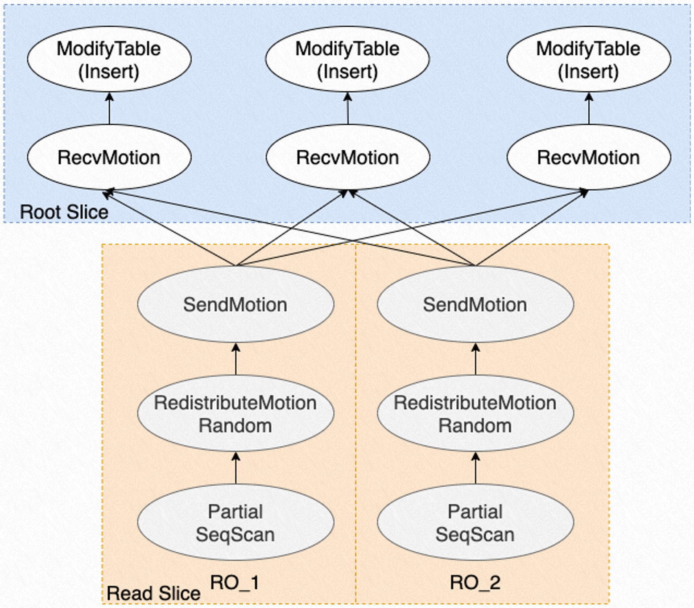

# 并行 INSERT

<Badge type="tip" text="V11 / v1.1.17-" vertical="top" />

<ArticleInfo :frontmatter=$frontmatter></ArticleInfo>

[[toc]]

## 背景介绍

PolarDB-PG 支持 ePQ 弹性跨机并行查询，能够利用集群中多个计算节点提升只读查询的性能。此外，ePQ 也支持在读写节点上通过多进程并行写入，实现对 `INSERT` 语句的加速。

## 功能介绍

ePQ 的并行 `INSERT` 功能可以用于加速 `INSERT INTO ... SELECT ...` 这种读写兼备的 SQL。对于 SQL 中的 `SELECT` 部分，ePQ 将启动多个进程并行执行查询；对于 SQL 中的 `INSERT` 部分，ePQ 将在读写节点上启动多个进程并行执行写入。执行写入的进程与执行查询的进程之间通过 **Motion 算子** 进行数据传递。

能够支持并行 `INSERT` 的表类型有：

- 普通表
- 分区表
- （部分）外部表

并行 `INSERT` 支持动态调整写入并行度（写入进程数量），在查询不成为瓶颈的条件下性能最高能提升三倍。

## 使用方法

创建两张表 `t1` 和 `t2`，向 `t1` 中插入一些数据：

```sql:no-line-numbers
CREATE TABLE t1 (id INT);
CREATE TABLE t2 (id INT);
INSERT INTO t1 SELECT generate_series(1,100000);
```

打开 ePQ 及并行 `INSERT` 的开关：

```sql:no-line-numbers
SET polar_enable_px TO ON;
SET polar_px_enable_insert_select TO ON;
```

通过 `INSERT` 语句将 `t1` 表中的所有数据插入到 `t2` 表中。查看并行 `INSERT` 的执行计划：

```sql:no-line-numbers
=> EXPLAIN INSERT INTO t2 SELECT * FROM t1;
                                       QUERY PLAN
-----------------------------------------------------------------------------------------
 Insert on t2  (cost=0.00..952.87 rows=33334 width=4)
   ->  Result  (cost=0.00..0.00 rows=0 width=0)
         ->  PX Hash 6:3  (slice1; segments: 6)  (cost=0.00..432.04 rows=100000 width=8)
               ->  Partial Seq Scan on t1  (cost=0.00..431.37 rows=16667 width=4)
 Optimizer: PolarDB PX Optimizer
(5 rows)
```

其中的 `PX Hash 6:3` 表示 6 个并行查询 `t1` 的进程通过 Motion 算子将数据传递给 3 个并行写入 `t2` 的进程。

通过参数 `polar_px_insert_dop_num` 可以动态调整写入并行度，比如：

```sql:no-line-numbers
=> SET polar_px_insert_dop_num TO 12;
=> EXPLAIN INSERT INTO t2 SELECT * FROM t1;
                                        QUERY PLAN
------------------------------------------------------------------------------------------
 Insert on t2  (cost=0.00..952.87 rows=8334 width=4)
   ->  Result  (cost=0.00..0.00 rows=0 width=0)
         ->  PX Hash 6:12  (slice1; segments: 6)  (cost=0.00..432.04 rows=100000 width=8)
               ->  Partial Seq Scan on t1  (cost=0.00..431.37 rows=16667 width=4)
 Optimizer: PolarDB PX Optimizer
(5 rows)
```

执行计划中的 `PX Hash 6:12` 显示，并行查询 `t1` 的进程数量不变，并行写入 `t2` 的进程数量变更为 `12`。

## 使用说明

调整 `polar_px_dop_per_node` 和 `polar_px_insert_dop_num` 可以分别修改 `INSERT INTO ... SELECT ...` 中查询和写入的并行度。

1. 当查询并行度较低时，逐步提升写入并行度，SQL 执行时间将会逐渐下降并趋于平缓；趋于平缓的原因是查询速度跟不上写入速度而成为瓶颈
2. 当查询并行度较高时，逐步提升写入并行度，SQL 执行时间将会逐渐下降并趋于平缓；趋于平缓的原因是并行写入只能在读写节点上进行，写入速度因多个写入进程对表页面扩展锁的争抢而跟不上查询速度，成为瓶颈

## 原理介绍

ePQ 对并行 `INSERT` 的处理如下：

1. ePQ 优化器以查询解析得到的语法树作为输入，产生计划树
2. ePQ 执行器将计划树分发到各计算节点，并创建并行查询/并行写入进程，开始执行各自负责执行的子计划
3. 并行查询进程从存储中并行读取各自负责的数据分片，并将数据发送到 Motion 算子
4. 并行写入进程从 Motion 算子中获取数据，向存储并行写入数据

并行查询和并行写入是以流水线的形式同时进行的。上述执行过程如图所示：


