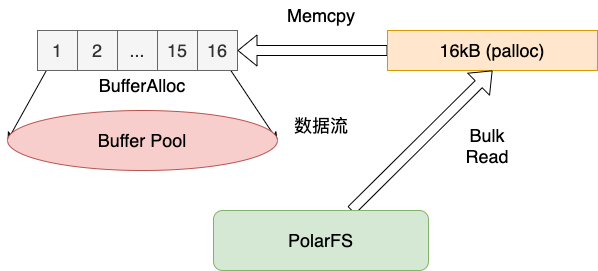
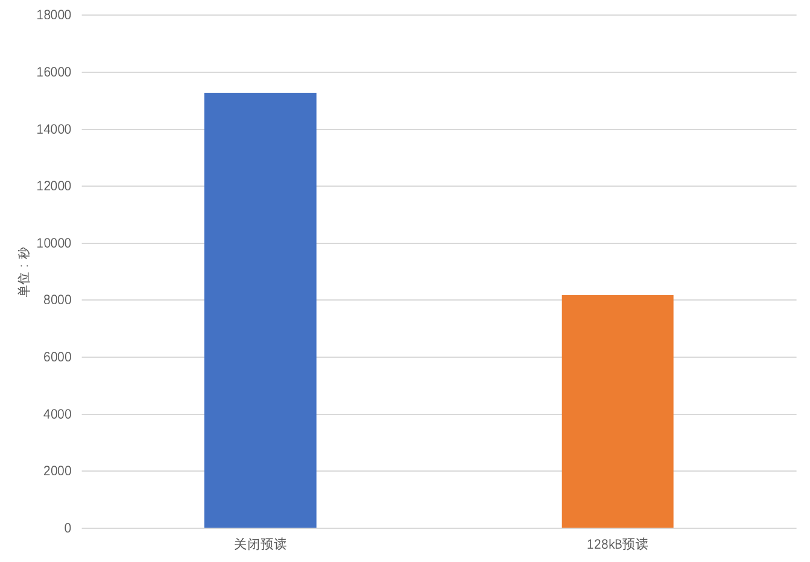
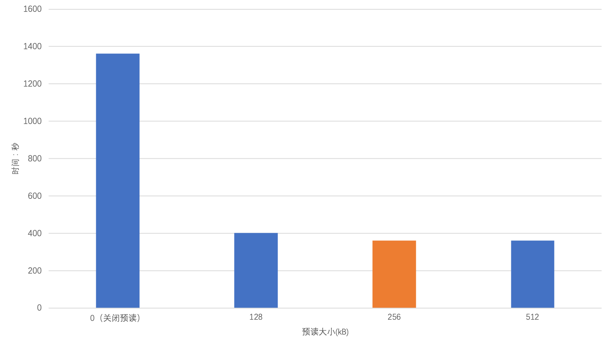
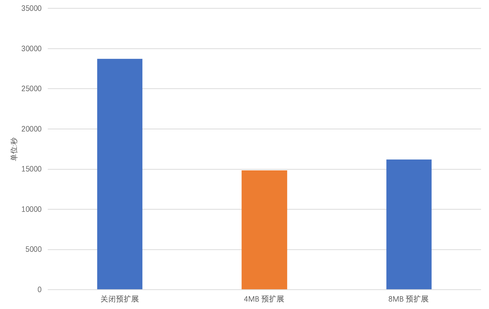
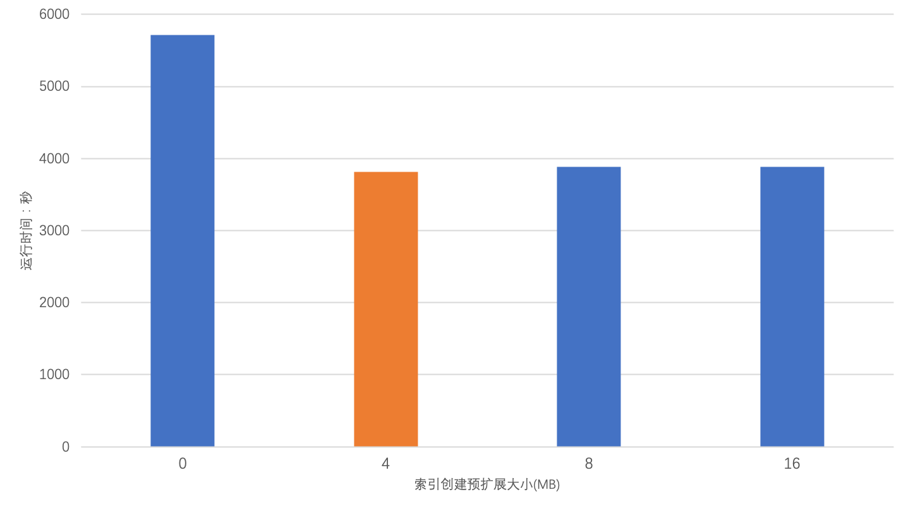

# 预读 / 预扩展

<Badge type="tip" text="V11 / v1.1.1-" vertical="top" />

<ArticleInfo :frontmatter=$frontmatter></ArticleInfo>

[[toc]]

## 背景介绍

PolarDB for PostgreSQL（以下简称 PolarDB）底层使用 PolarFS（以下简称为 PFS）作为文件系统。不同于 [ext4](https://en.wikipedia.org/wiki/Ext4) 等单机文件系统，PFS 在页扩展过程中，元数据更新开销较大；且 PFS 的最小页扩展粒度为 4MB。而 PostgreSQL 8kB 的页扩展粒度并不适合 PFS，将会导致写表或创建索引时性能下降；同时，PFS 在读取大块页面时 I/O 效率更高。为了适配上述特征，我们为 PolarDB 设计了堆表预读、堆表预扩展、索引创建预扩展的功能，使运行在 PFS 上的 PolarDB 能够获得更好的性能。

## 功能介绍

### 堆表预读

在 PostgreSQL 读取堆表的过程中，会以 8kB 页为单位通过文件系统读取页面至内存缓冲池（Buffer Pool）中。PFS 对于这种数据量较小的 I/O 操作并不是特别高效。所以，PolarDB 为了适配 PFS 而设计了 **堆表批量预读**。当读取的页数量大于 1 时，将会触发批量预读，一次 I/O 读取 128kB 数据至 Buffer Pool 中。预读对顺序扫描（Sequential Scan）、Vacuum 两种场景性能可以带来一倍左右的提升，在索引创建场景下可以带来 18% 的性能提升。

### 堆表预扩展

在 PostgreSQL 中，表空间的扩展过程中将会逐个申请并扩展 8kB 的页。即使是 PostgreSQL 支持的批量页扩展，进行一次 N 页扩展的流程中也包含了 N 次 I/O 操作。这种页扩展不符合 PFS 最小页扩展粒度为 4MB 的特性。为此，PolarDB 设计了堆表批量预扩展，在扩展堆表的过程中，一次 I/O 扩展 4MB 页。在写表频繁的场景下（如装载数据），能够带来一倍的性能提升。

### 索引创建预扩展

索引创建预扩展与堆表预扩展的功能类似。索引创建预扩展特别针对 PFS 优化索引创建过程。在索引创建的页扩展过程中，一次 I/O 扩展 4MB 页。这种设计可以在创建索引的过程中带来 30% 的性能提升。

::: warning
当前索引创建预扩展只适配了 B-Tree 索引。其他索引类型暂未支持。
:::

## 功能设计

### 堆表预读

堆表预读的实现步骤主要分为四步：

1. 在 Buffer Pool 中申请 N 个 Buffer
2. 通过 `palloc` 在内存中申请一段大小为 `N * 页大小` 的空间，简称为 `p`
3. 通过 PFS 批量读取堆表中 `N * 页大小` 的数据拷贝至 `p` 中
4. 将 `p` 中 N 个页的内容逐个拷贝至从 Buffer Pool 申请的 N 个 Buffer 中。

后续的读取操作会直接命中 Buffer。数据流图如下所示：



### 堆表预扩展

预扩展的实现步骤主要分为三步：

1. 从 Buffer Pool 中申请 N 个 Buffer，不触发文件系统的页扩展
2. 通过 PFS 的文件写入接口进行批量页扩展，并且写入为全零页
3. 对申请出来的页逐个进行页初始化，标识页的可用空间，结束预扩展

### 索引创建预扩展

索引创建预扩展的实现步骤与预扩展类似，但没有涉及 Buffer 的申请。步骤如下：

1. 写索引页时，通过 PFS 的文件写入接口进行批量页扩展，并且写入为全零页
2. 将 Buffer Pool 中已经构建好的索引页写入文件系统中

## 使用指南

### 堆表预读

堆表预读的参数名为 `polar_bulk_read_size`，功能默认开启，默认大小为 128kB。不建议用户自行修改该参数，128kB 是贴合 PFS 的最优值，自行调整并不会带来性能的提升。

关闭功能：

```sql:no-line-numbers
ALTER SYSTEM SET polar_bulk_read_size = 0;
SELECT pg_reload_conf();
```

打开功能并设置预读大小为 128kB：

```sql:no-line-numbers
ALTER SYSTEM SET polar_bulk_read_size = '128kB';
SELECT pg_reload_conf();
```

### 堆表预扩展

堆表预扩展的参数名为 `polar_bulk_extend_size`，功能默认开启，预扩展的大小默认是 4MB。不建议用户自行修改该参数值，4MB 是贴合 PFS 的最优值。

关闭功能：

```sql:no-line-numbers
ALTER SYSTEM SET polar_bulk_extend_size = 0;
SELECT pg_reload_conf();
```

打开功能并设置预扩展大小为 4MB：

```sql:no-line-numbers
ALTER SYSTEM SET polar_bulk_extend_size = '4MB';
SELECT pg_reload_conf();
```

### 索引创建预扩展

索引创建预扩展的参数名为 `polar_index_create_bulk_extend_size`，功能默认开启。索引创建预扩展的大小默认是 4MB。不建议用户自行修改该参数值，4MB 是贴合 PFS 的最优值。

关闭功能：

```sql:no-line-numbers
ALTER SYSTEM SET polar_index_create_bulk_extend_size = 0;
SELECT pg_reload_conf();
```

打开功能，并设置预扩展大小为 4MB：

```sql:no-line-numbers
ALTER SYSTEM SET polar_index_create_bulk_extend_size = 512;
SELECT pg_reload_conf();
```

## 性能表现

为了展示堆表预读、堆表预扩展、索引创建预扩展的性能提升效果，我们在 PolarDB for PostgreSQL 14 的实例上进行了测试。

- 规格：8 核 32GB 内存
- 测试场景：400GB pgbench 测试

### 堆表预读

400GB 表的 Vacuum 性能：



400GB 表的 SeqScan 性能：



结论：

- 堆表预读在 Vacuum 和 SeqScan 场景上，性能提升了 1-2 倍
- 堆表预读大小在超过默认值 128kB 之后对性能提升没有明显帮助

### 堆表预扩展

400GB 表数据装载性能：



结论：

- 堆表预扩展在数据装载场景下带来一倍的性能提升
- 堆表预扩展大小在超过默认值 4MB 后对性能没有明显帮助

### 索引创建预扩展

400GB 表创建索引性能：



结论：

- 索引创建预扩展在索引创建场景下能够带来 30% 的性能提升
- 加大索引创建预扩展大小超过默认值 4MB 对性能没有明显帮助
