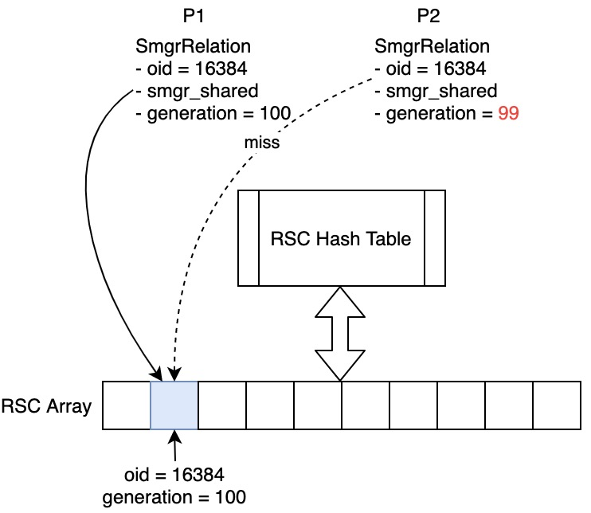
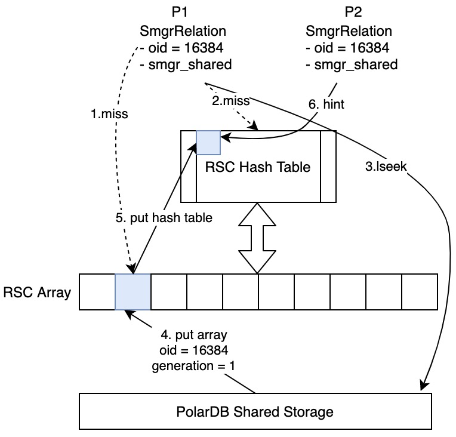

# 表大小缓存

<Badge type="tip" text="V11 / v1.1.10-" vertical="top" />

<ArticleInfo :frontmatter=$frontmatter></ArticleInfo>

[[toc]]

## 背景介绍

在 SQL 执行的过程中，存在若干次对系统表和用户表的查询。PolarDB for PostgreSQL 通过文件系统的 lseek 系统调用来获取表大小。频繁执行 lseek 系统调用会严重影响数据库的执行性能，特别是对于存储计算分离架构的 PolarDB for PostgreSQL 来说，在 PolarFS 上的 **PFS lseek** 系统调用会带来更大的 RTO 时延。为了降低 lseek 系统调用的使用频率，PolarDB for PostgreSQL 在自身存储引擎上提供了一层表大小缓存接口，用于提升数据库的运行时性能。

## 术语

- RSC (Relation Size Cache)：表大小缓存。
- Smgr (Storage manager)：PolarDB for PostgreSQL 存储管理器。
- SmgrRelation：PolarDB for PostgreSQL 存储侧的表级元信息。

## 功能介绍

PolarDB for PostgreSQL 为了实现 RSC，在 smgr 层进行了重新适配与设计。在整体上，RSC 是一个 **缓存数组 + 两级索引** 的结构设计：一级索引通过内存地址 + 引用计数来寻找共享内存 RSC 缓存中的一个缓存块；二级索引通过共享内存中的哈希表来索引得到一个 RSC 缓存块的数组下标，根据下标进一步访问 RSC 缓存，获取表大小信息。

## 功能设计

### 总体设计

在开启 RSC 缓存功能后，各个 smgr 层接口将会生效 RSC 缓存查询与更新的逻辑：

- `smgrnblocks`：获取表大小的实际入口，将会通过查询 RSC 一级或二级索引得到 RSC 缓存块地址，从而得到物理表大小。如果 RSC 缓存命中则直接返回缓存中的物理表大小；否则需要进行一次 lseek 系统调用，并将实际的物理表大小更新到 RSC 缓存中，并同步更新 RSC 一级与二级索引。
- `smgrextend`：表文件扩展接口，将会把物理表文件扩展一个页，并更新对应表的 RSC 索引与缓存。
- `smgrextendbatch`：表文件的预扩展接口，将会把物理表文件预扩展多个页，并更新对应表的 RSC 索引与缓存。
- `smgrtruncate`：表文件的删除接口，将会把物理表文件删除，并清空对应表的 RSC 索引与缓存。

### RSC 缓存数组

在共享内存中，维护了一个数组形式的 RSC 缓存。数组中的每个元素是一个 RSC 缓存块，其中保存的关键信息包含：

- 表标识符
- 一个长度为 64 位的引用计数 `generation`：表发生更新操作时，这个计数会自增
- 表大小

### RSC 一级索引

对于每个执行用户操作的会话进程而言，其所需访问的表被维护在进程私有的 `SmgrRelation` 结构中，其中包含：

- 一个指向 RSC 缓存块的指针，初始值为空，后续将被更新
- 一个长度为 64 位的 `generation` 计数

当执行表访问操作时，如果引用计数与 RSC 缓存中的 `generation` 一致，则认为 RSC 缓存没有被更新过，可以直接通过指针得到 RSC 缓存，获得物理表的当前大小。RSC 一级索引整体上是一个共享引用计数 + 共享内存指针的设计，在对大多数特定表的读多写少场景中，这样的设计可以有效降低对 RSC 二级索引的并发访问。



### RSC 二级索引

当表大小发生更新（例如 `INSERT`、`UPDATE`、`COPY` 等触发表文件大小元信息变更的操作）时，会导致 RSC 一级索引失效（`generation` 计数不一致），会话进程会尝试访问 RSC 二级索引。RSC 二级索引的形式是一个共享内存哈希表：

- Key 为表 OID
- Value 为表的 RSC 缓存块在 RSC 缓存数组中的下标

通过待访问物理表的 OID，查找位于共享内存中的 RSC 二级索引：如果命中，则直接得到 RSC 缓存块，取得表大小，同时更新 RSC 一级索引；如果不命中，则使用 lseek 系统调用获取物理表的实际大小，并更新 RSC 缓存及其一二级索引。RSC 缓存更新的过程可能因缓存已满而触发缓存淘汰。



### RSC 缓存更新与淘汰

在 RSC 缓存被更新的过程中，可能会因为缓存总容量已满，进而触发缓存淘汰。RSC 实现了一个 SLRU 缓存淘汰算法，用于在缓存块满时选择一个旧缓存块进行淘汰。每一个 RSC 缓存块上都维护了一个引用计数器，缓存每被访问一次，计数器的值加 1；缓存被淘汰时计数器清 0。当缓存淘汰被触发时，将从 RSC 缓存数组上一次遍历到的位置开始向前遍历，递减每一个 RSC 缓存上的引用计数，直到找到一个引用计数为 0 的缓存块进行淘汰。遍历的长度可以通过 GUC 参数控制，默认为 8：当向前遍历 8 个块后仍未找到一个可以被淘汰的 RSC 缓存块时，将会随机选择一个缓存块进行淘汰。

### 备节点的 RSC 缓存

PolarDB for PostgreSQL 的备节点分为两种，一种是提供只读服务的共享存储 Read Only 节点（RO），一种是提供跨数据中心高可用的 Standby 节点。对于 Standby 节点，由于其数据同步机制采用传统流复制 + WAL 日志回放的方式进行，故 RSC 缓存的使用与更新方式与 Read Write 节点（RW）无异。但对于 RO 节点，其数据是通过 PolarDB for PostgreSQL 实现的 LogIndex 机制实现同步的，故需要额外支持该机制下 RO 节点的 RSC 缓存同步方式。对于每种 WAL 日志类型，都需要根据当前是否存在 New Page 类型的日志，进行缓存更新与淘汰处理，保证 RO 节点下 RSC 缓存的一致性。

## 使用指南

该功能默认生效。提供如下 GUC 参数控制：

- `polar_nblocks_cache_mode`：是否开启 RSC 功能，取值为：
  - `scan`（默认值）：表示仅在 `scan` 顺序查询场景下开启
  - `on`：在所有场景下全量开启 RSC
  - `off`：关闭 RSC；参数从 `scan` 或 `on` 设置为 `off`，可以直接通过 `ALTER SYSTEM SET` 进行设置，无需重启即可生效；参数从 `off` 设置为 `scan` / `on`，需要修改 `postgresql.conf` 配置文件并重启生效
- `polar_enable_replica_use_smgr_cache`：RO 节点是否开启 RSC 功能，默认为 `on`。可配置为 `on` / `off`。
- `polar_enable_standby_use_smgr_cache`：Standby 节点是否开启 RSC 功能，默认为 `on`。可配置为 `on` / `off`。

## 性能测试

通过如下 Shell 脚本创建一个带有 1000 个子分区的分区表：

```shell:no-line-numbers
psql -c "CREATE TABLE hp(a INT) PARTITION BY HASH(a);"
for ((i=1; i<1000; i++)); do
    psql -c "CREATE TABLE hp$i PARTITION OF hp FOR VALUES WITH(modulus 1000, remainder $i);"
done
```

此时分区子表无数据。接下来借助一条在所有子分区上的聚合查询，来验证打开或关闭 RSC 功能时，lseek 系统调用所带来的时间性能影响。

开启 RSC：

```sql
ALTER SYSTEM SET polar_nblocks_cache_mode = 'scan';
ALTER SYSTEM

ALTER SYSTEM SET polar_enable_replica_use_smgr_cache = on;
ALTER SYSTEM

ALTER SYSTEM SET polar_enable_standby_use_smgr_cache = on;
ALTER SYSTEM

SELECT pg_reload_conf();
 pg_reload_conf
----------------
 t
(1 row)

SHOW polar_nblocks_cache_mode;
 polar_nblocks_cache_mode
--------------------------
 scan
(1 row)

SHOW polar_enable_replica_use_smgr_cache ;
 polar_enable_replica_use_smgr_cache
--------------------------
 on
(1 row)

SHOW polar_enable_standby_use_smgr_cache ;
 polar_enable_standby_use_smgr_cache
--------------------------
 on
(1 row)

SELECT COUNT(*) FROM hp;
 count
-------
     0
(1 row)

Time: 97.658 ms

SELECT COUNT(*) FROM hp;
 count
-------
     0
(1 row)

Time: 108.672 ms

SELECT COUNT(*) FROM hp;
 count
-------
     0
(1 row)

Time: 93.678 ms
```

关闭 RSC：

```sql
ALTER SYSTEM SET polar_nblocks_cache_mode = 'off';
ALTER SYSTEM

ALTER SYSTEM SET polar_enable_replica_use_smgr_cache = off;
ALTER SYSTEM

ALTER SYSTEM SET polar_enable_standby_use_smgr_cache = off;
ALTER SYSTEM

SELECT pg_reload_conf();
 pg_reload_conf
----------------
 t
(1 row)

SELECT COUNT(*) FROM hp;
 count
-------
     0
(1 row)

Time: 164.772 ms

SELECT COUNT(*) FROM hp;
 count
-------
     0
(1 row)

Time: 147.255 ms

SELECT COUNT(*) FROM hp;
 count
-------
     0
(1 row)

Time: 177.039 ms

SELECT COUNT(*) FROM hp;
 count
-------
     0
(1 row)

Time: 194.724 ms
```
