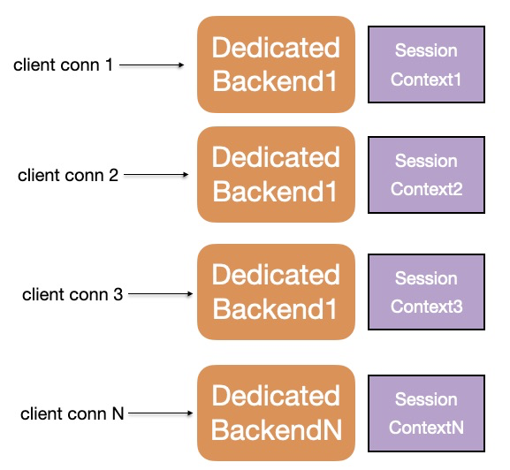
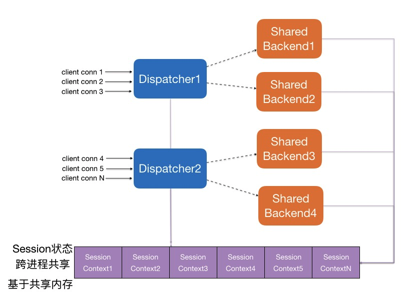
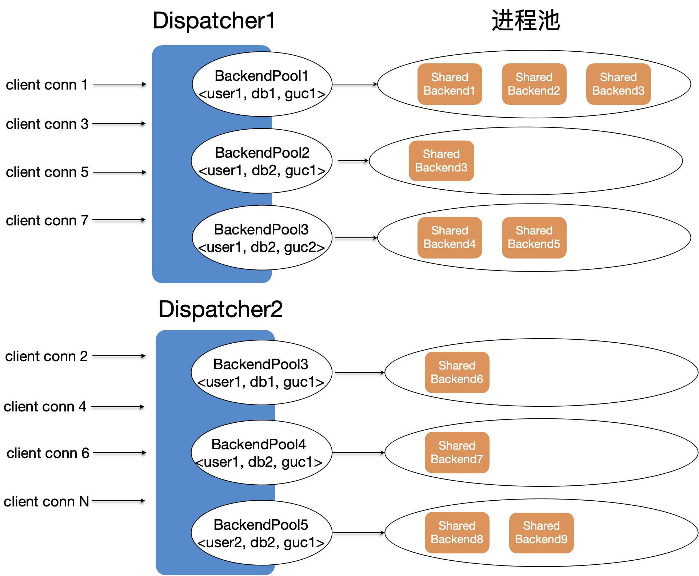
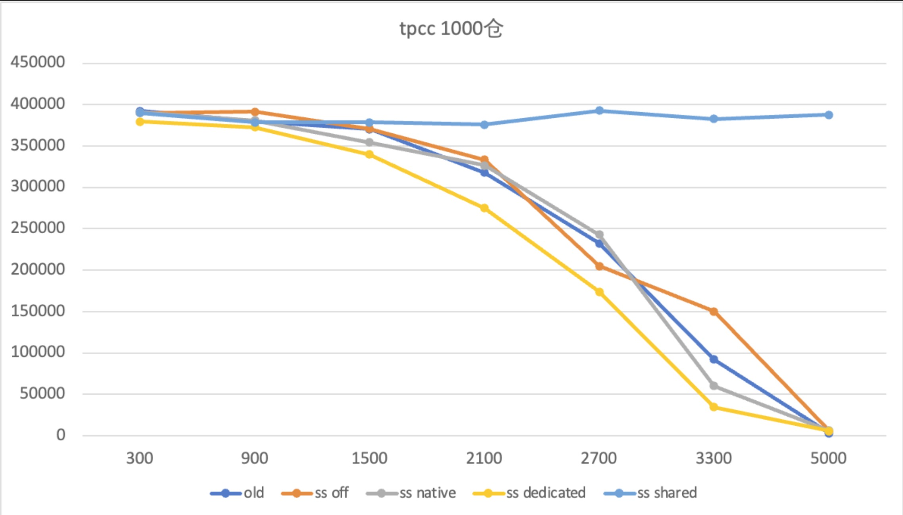
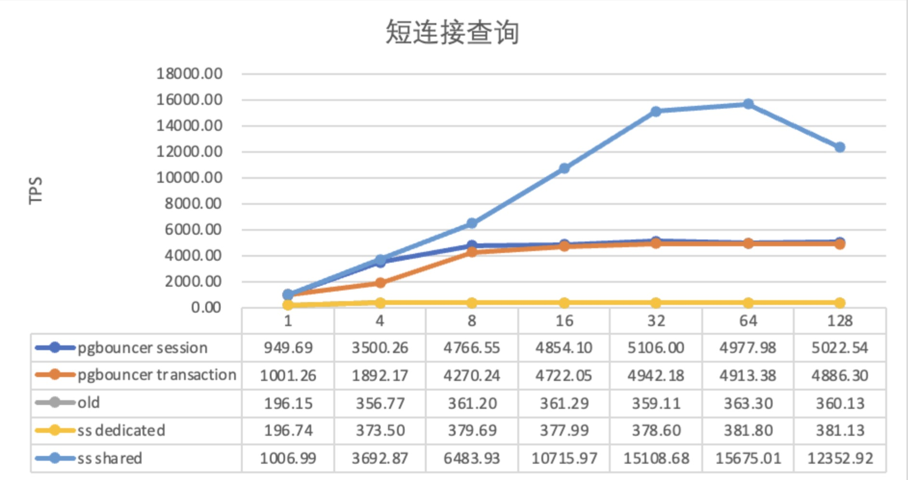
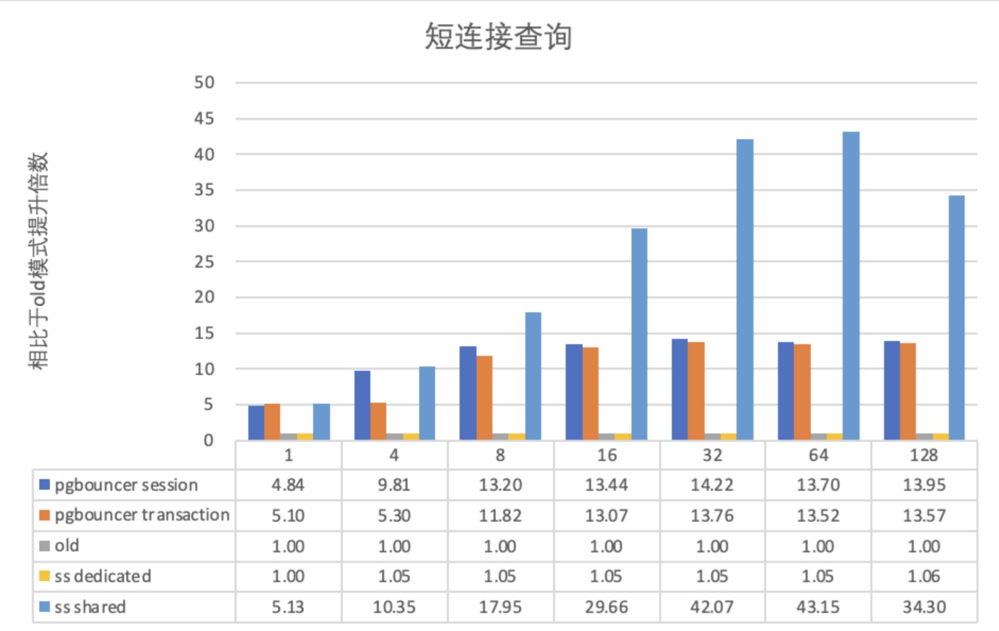

# Shared Server

<Badge type="tip" text="V11 / v1.1.30-" vertical="top" />

<ArticleInfo :frontmatter=$frontmatter></ArticleInfo>

[[toc]]

## 背景

原生 PostgreSQL 的连接调度方式是每一个进程对应一个连接 (One-Process-Per-Connection)，这种调度方式适合低并发、长连接的业务场景。而在高并发或大量短连接的业务场景中，进程的大量创建、销毁以及上下文切换，会严重影响性能。同时，在业务容器化部署后，每个容器通过连接池向数据库发起连接，业务在高峰期会弹性扩展出很多容器，后端数据库的连接数会瞬间增高，影响数据库稳定性，导致 OOM 频发。

为了解决上述问题，业界在使用 PostgreSQL 时通常会配置连接池组件，比如部署在数据库侧的后置连接池 [PgBouncer](https://www.pgbouncer.org/)，部署在应用侧的前置连接池 [Druid](https://github.com/alibaba/druid)。但后置连接池无法支持保留用户连接私有信息（如 GUC 参数、Prepared Statement）的相关功能，在面临进程被污染的情况（如加载动态链接库、修改 `role` 参数）时也无法及时清理。前置连接池不仅无法解决后置连接池的缺陷，还无法根据应用规模扩展而实时调整配置，仍然会面临连接数膨胀的问题。

PolarDB for PostgreSQL 针对上述问题，从数据库内部提供了 **Shared Server**（后文简称 SS）内置连接池功能，采用共享内存 + Session Context + Dispatcher 转发 + Backend Pool 的架构，实现了用户连接与后端进程的解绑。后端进程具备了 Native、Shared、Dedicated 三种执行模式，并且在运行时可以根据实时负载和进程污染情况进行动态转换。负载调度算法充分吸收 AliSQL 对社区版 MySQL 线程池的缺陷改进，使用 Stall 机制弹性控制 Worker 数量，同时避免用户连接饿死。从根本上解决了高并发或者大量短连接带来的性能、稳定性问题。

## 原理

在 PostgreSQL 原生的 One-Process-Per-Connection 连接调度策略中，用户发起的连接与后端进程一一绑定：这里不仅是生命周期的绑定，同时还是服务与被服务关系的绑定。

在 Shared Server 内置连接池中，通过提取出会话相关上下文 Session Context，将用户连接和后端进程进行了解绑，并且引入 Dispatcher 来进行代理转发：

- Session Context 保存 Session 相关数据，存放于共享内存中，跨进程共享。存放数据包括：Prepared Statement、连接私有参数、临时表元数据等，后续还可以不断扩展。
- Dispatcher 进程承载代理转发工作，用户连接通过 Dispatcher 分发调度到不同的后端进程上，后端进程通过 Dispatcher 被多个用户连接共享使用。Dispatcher 进程可以配置多个。
- 每个 Dispatcher 管理的后端进程按 `<user, database, GUCs>` 为 key，划分成不同的后端进程池。每个后端进程池都有自己独占的后端进程组，单个后端进程池内的后端进程数量随着负载增高而增多，随着负载降低而减少。
- 用户连接中的一个事务会始终被同一个后端进程服务，不同事务可能会被不同的后端进程服务

在 Shared Server 中，后端进程有三种执行模式。进程执行模式在运行时会根据实时负载和进程污染情况进行动态转换：

- Native 模式（原生模式）：一个后端进程只服务一个用户连接，不存在 Dispatcher 转发数据
  - SS 关闭后，所有后端进程都处于 Native 模式
  - SS 开启后，对于以下场景，后端进程也会在用户连接的登录阶段回退为 Native 模式：
    - WAL Sender 进程
    - MPP 进程
    - SS 共享内存耗尽
    - 在参数 `polar_ss_dedicated_dbuser_names` 黑名单范围内的数据库或用户
- Shared 模式（共享模式）：后端进程作为可共享的工作进程提供给各个用户连接使用。Shared 模式是标准的、期望的连接池状态，表示后端进程是可复用的；SS 开启后，后端进程会优先使用 Shared 模式，同时会在触发兜底机制时转换为 Dedicated 模式。
- Dedicated 模式（兜底模式）：由于各种原因导致后端进程被污染，退化为当前后端进程只能服务当前用户连接，用户连接退出后，后端进程也退出
  - 用户连接不再使用新的 SS 共享内存，而是使用本地进程内存。
  - 用户连接与后端进程之间的数据传输依旧经过 Dispatcher 转发
  - 以下场景中会触发兜底机制，执行模式会由 Shared 转变为 Dedicated：
    - 更新了 SS 黑名单内的 GUC 参数
    - 使用了 SS 黑名单内的插件
    - 执行了 `DECLARE CURSOR` 命令
    - 对 ONCOMMIT DELETE ROWS 属性的表进行操作
    - 执行 `CURSOR WITH HOLD` 操作
    - 使用自定义 GUC 参数
    - 加载动态链接库

## 性能对比

Shared Server 主要应用于高并发或大量短连接的业务场景，因此这里使用 TPC-C 进行测试。

### TPC-C 高并发

使用 104c 512GB 的物理机单机部署，测试 TPC-C 1000 仓下，并发数从 300 增大到 5000 时，不同配置下的分数对比。如下图所示：

- old：不使用任何连接池，使用 PostgreSQL 的原生执行模式（即 Native 模式）
- ss off：使用 Shared Server 内置连接池，**启动前关闭 SS 开关**，退化为 Native 模式
- ss native：使用 Shared Server 内置连接池，**启动后关闭 SS 开关**，退化为 Native 模式
- ss didicated：使用 Shared Server 内置连接池，**启动后开启 SS 开关**，但强制使用 Dedicated 模式
- ss shared：使用 Shared Server 内置连接池，**启动后开启 SS 开关**，使用标准的 Shared 模式

从图中可以看出：

- 原生 PostgreSQL 场景、Shared Server 关闭的场景、Shared Server 兜底场景中，均无法稳定进行 TPC-C 高并发测试。性能从并发数为 1500 时开始下跌，在并发数为 5000 时已经不能提供服务
- Shared Server 开启并进入 Shared 模式后，TPC-C 性能不受高并发数影响，始终保持在稳定状态，很好地支持了高并发场景

### PgBench 短连接

使用 104c 512GB 的物理机单机部署，利用 `pgbench` 分别测试以下配置中，并发短连接数从 1 到 128 的场景下的性能表现：

- pgbouncer session：使用 PgBouncer 后置连接池， 配置为 [session pooling](https://www.pgbouncer.org/features.html) 模式
- pgbouncer transaction：使用 PgBouncer 后置连接池， 配置为 [transaction pooling](https://www.pgbouncer.org/features.html) 模式
- old：不使用任何连接池，使用 PostgreSQL 的原生执行模式
- ss dedicated：使用 Shared Server 内置连接池，但强制设置为 Dedicated 模式
- ss shared：使用 Shared Server 内置连接池，配置为标准的 Shared 模式

从图中可以看出，使用连接池后，对于短连接，PgBouncer 和 Shared Server 的性能均有所提升。但 PgBouncer 最高只能提升 14 倍性能，Shared Server 最高可以提升 42 倍性能。

## 功能特性

### PgBouncer 对比

业界典型的后置连接池 PgBouncer 具有多种模式。其中 session pooling 模式仅对短连接友好，一般不使用；transaction pooling 模式对短连接、长连接都友好，是默认推荐的模式。与 PgBouncer 相比，Shared Server 的差异化功能特点如下：

| Feature                       | PgBouncer Session Pooling | PgBouncer Transaction Pooling |     Shared Server      |
| ----------------------------- | :--------------------------: | :------------------------------: | :--------------------: |
| Startup parameters            |             受限             |               受限               |          支持          |
| SSL                           |             支持             |               支持               |       未来将支持       |
| LISTEN/NOTIFY                 |             支持             |              不支持              |    支持 触发兜底    |
| LOAD statement                |             支持             |              不支持              |    支持 触发兜底    |
| Session-level advisory locks  |             支持             |              不支持              |    支持 触发兜底    |
| SET/RESET GUC                 |             支持             |              不支持              |          支持          |
| Protocol-level prepared plans |             支持             |            未来将支持            |          支持          |
| PREPARE / DEALLOCATE          |             支持             |              不支持              |          支持          |
| Cached Plan Reset             |             支持             |               支持               |          支持          |
| WITHOUT HOLD CURSOR           |             支持             |               支持               |          支持          |
| WITH HOLD CURSOR              |             支持             |              不支持              | 未来将支持 触发兜底 |
| PRESERVE/DELETE ROWS temp     |             支持             |              不支持              | 未来将支持 触发兜底 |
| ON COMMIT DROP temp           |             支持             |               支持               |          支持          |

注：

- PgBouncer 的 Startup 参数仅包括：
  - `client_encoding`
  - `datestyle`
  - `timezone`
  - `standard_conforming_strings`
- 触发进入 Dedicated 兜底模式，用户连接断开后，后端进程也会释放，避免污染后的进程被其他用户连接使用

### 自定义配置

为了适应不同的环境，Shared Server 支持丰富了参数配置：

1. 支持配置 Dispatcher 进程和后端进程的最大数量，可以实时调整出最佳性能模式
2. 支持总连接数超过阈值后才启用 SS 的 Shared 模式，避免连接数较少时 SS 性能不显著
3. 支持配置强制启用 Dedicated 模式，避免后端进程被污染后持续影响其他用户连接
4. 支持配置指定的数据库/用户不使用 Shared Server，给专用账户和管理员留下应急通道
5. 支持配置指定插件不使用 Shared Server，避免外部插件异常导致 Shared Server 不稳定
6. 支持配置指定 GUC 参数不使用 Shared Server，避免 GUC 功能复杂导致 Shared Server 不稳定
7. 支持 Dispatcher 阻塞连接数量超过阈值后回退到 Native 模式，避免 Dispatcher 缺陷导致不可用
8. 支持配置用户连接的超时等待时间，避免用户连接长时间等待后端进程
9. 支持配置后端进程空闲时间阈值，避免后端进程长时间空闲，占用系统资源
10. 支持配置后端进程活跃时间阈值, 避免后端进程长时间活跃，占用系统资源
11. 支持配置每个后端进程池中保留后端进程的最小个数，保持连接池热度，避免进程被全部释放
12. 支持配置 Shared Server 调试日志，方便排查后端进程调度相关的任何问题

## 使用说明

### 常用参数

Shared Server 的典型配置参数说明如下：

- `polar_enable_shm_aset`：是否开启全局共享内存，当前默认关闭，重启生效
- `polar_ss_shared_memory_size`：Shared Server 全局共享内存的使用上限，单位 kB，为 `0` 时表示关闭，默认 1MB。重启生效。
- `polar_ss_dispatcher_count`：Dispatcher 进程的最大个数，默认为 `2`，最大为 CPU 核心数，建议配置与 CPU 核心数相同。重启生效。
- `polar_enable_shared_server`：Shared Server 功能是否开启，默认关闭。
- `polar_ss_backend_max_count`：后端进程的最大数量，默认为 `-5`，表示为 `max_connection` 的 1/5；`0` / `-1` 表示与 `max_connection` 保持一致。建议设置为 CPU 核心数的 10 倍为佳。
- `polar_ss_backend_idle_timeout`：后端进程的空闲退出时间，默认 3 分钟
- `polar_ss_session_wait_timeout`：后端进程被用满时，用户连接等待被服务的最大时间，默认 60 秒
- `polar_ss_dedicated_dbuser_names`：记录指定数据库/用户使用时进入 Native 模式，默认为空，格式为 `d1/_,_/u1,d2/u2`，表示对使用数据库 `d1` 的任意连接、使用用户 `u1` 的任意连接、使用数据库 `d2` 且用户 `u2` 的任意连接，都会回退到 Native 模式
