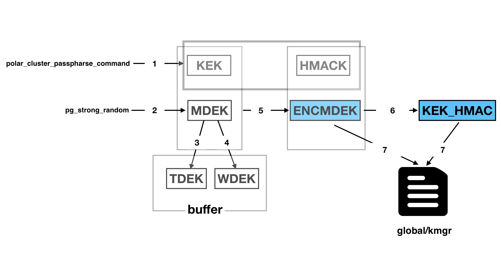

# TDE 透明数据加密

<Badge type="tip" text="V11 / v1.1.1-" vertical="top" />

<ArticleInfo :frontmatter=$frontmatter></ArticleInfo>

[[toc]]

## 背景

**TDE（Transparent Data Encryption）**，即 **透明数据加密**。TDE 通过在数据库层执行透明的数据加密，阻止可能的攻击者绕过数据库直接从存储层读取敏感信息。经过数据库身份验证的用户可以 **透明**（不需要更改应用代码或配置）地访问数据，而尝试读取表空间文件中敏感数据的 OS 用户以及尝试读取磁盘或备份信息的不法之徒将不允许访问明文数据。在国内，为了保证互联网信息安全，国家要求相关服务开发商需要满足一些数据安全标准，例如：

- [《国家密码法》](http://www.npc.gov.cn/npc/c30834/201910/6f7be7dd5ae5459a8de8baf36296bc74.shtml)（2020 年 1 月 1 日施行）
- [《网络安全等级保护基本要求》](http://gxxxzx.gxzf.gov.cn/szjcss/wlyxxaq/P020200429546812083554.pdf)（GB/T 22239-2019）
- ...

在国际上，一些相关行业也有监管数据安全标准，例如：

- Payment Card Industry Data Security Standard (PCI DSS)
- Health Insurance Portability and Accountability Act (HIPAA)
- General Data Protection Regulation (GDPR)
- California Consumer Protection Act (CCPA)
- Sarbanes-Oxley Act (SOX)

为了满足保护用户数据安全的需求，我们在 PolarDB 中实现 TDE 功能。

## 术语

- KEK：密钥加密密钥（Key Encryption Key)。
- MDEK：`pg_strong_random` 随机生成，存在内存中，作为实际加密数据的密码。
- TDEK：Table Data Encryption Key，由 MDEK 经 HKDF 算法生成，存在内存中，作为实际加密数据的密码。
- WDEK：Wal Data Encryption Key，MDEK 经 HKDF 算法生成，存在内存中，作为实际加密数据的密码。
- HMACK：passphrase 经 SHA-512 加密后生成 KEK 和 HMACK。
- KEK_HMAC：ENCMDEK 和 HMACK 经过 HMAC 算法生成 KEK_HMAC，用于还原密钥时的校验信息。
- ENCMDEK：用 KEK 加密 MDEK 生成 ENCMDEK。

## 使用

对于用户来说：

- `initdb` 时增加 `--cluster-passphrase-command 'xxx' -e aes-256` 参数就会生成支持 TDE 的集群，其中 `cluster-passphrase-command` 参数为得到加密密钥的密钥的命令，`-e` 代表数据加密采用的加密算法，目前支持 AES-128、AES-256 和 SM4。

  ```bash:no-line-numbers
  initdb --cluster-passphrase-command 'echo \"abc123\"' -e aes-256
  ```

- 在数据库运行过程中，只有超级用户可以执行如下命令得到对应的加密算法：

  ```sql:no-line-numbers
  show polar_data_encryption_cipher;
  ```

- 在数据库运行过程中，可以创建插件 `polar_tde_utils` 来修改 TDE 的加密密钥或者查询 TDE 的一些执行状态，目前支持：

  1. 修改加密密钥，其中函数参数为获取加密密钥的方法（该方法保证只能在宿主机所在网络才可以获得），该函数执行后，`kmgr` 文件内容变更，等下次重启后生效。

     ```sql:no-line-numbers
     select polar_tde_update_kmgr_file('echo \"abc123456\"');
     ```

  2. 得到当前的 kmgr 的 info 信息。

     ```sql:no-line-numbers
     select * from polar_tde_kmgr_info_view();
     ```

  3. 检查 kmgr 文件的完整性。

     ```sql:no-line-numbers
     select polar_tde_check_kmgr_file();
     ```

- 执行 `pg_filedump` 解析加密后的页面，用于一些极端情况下，做页面解析。

  ```bash:no-line-numbers
  pg_filedump -e aes-128 -C 'echo \"abc123\"' -K global/kmgr base/14543/2608
  ```

## 原理

### 密钥管理模块

#### 密钥结构

采用 2 层密钥结构，即密钥加密密钥和表数据加密密钥。表数据加密密钥是实际对数据库数据进行加密的密钥。密钥加密密钥则是对表数据加密密钥进行进一步加密的密钥。两层密钥的详细介绍如下：

- 密钥加密密钥（KEK），以及 KEK 的校验值 HMACK：通过运行 `polar_cluster_passphrase_command` 参数中命令并计算 SHA-512 后得到 64 字节的数据，其中前 32 字节为顶层加密密钥 KEK，后 32 字节为 HMACK。
- 表数据加密密钥（TDEK）和 WAL 日志加密密钥（WDEK）：通过密码学中的安全随机数生成器生成的密钥，是数据和 WAL 日志加密的真正密钥。两个密钥加密后的密文使用 HMACK 作为密钥，经过 HMAC 算法得到 rdek_hmac 和 wdek_hmac，用于密钥 KEK 的校验，保存在共享存储上。

KEK 和 HMACK 每次都是通过外部获取，例如 KMS，测试的时候可以直接 `echo passphrase` 得到。ENCMDEK 和 KEK_HMAC 需要保存在共享存储上，用来保证下次启动时 RW 和 RO 都可以读取该文件，获取真正的加密密钥。其数据结构如下：

```c
typedef struct KmgrFileData
{
    /* version for kmgr file */
    uint32      kmgr_version_no;

    /* Are data pages encrypted? Zero if encryption is disabled */
    uint32      data_encryption_cipher;

    /*
     * Wrapped Key information for data encryption.
     */
    WrappedEncKeyWithHmac tde_rdek;
    WrappedEncKeyWithHmac tde_wdek;

    /* CRC of all above ... MUST BE LAST! */
    pg_crc32c   crc;
} KmgrFileData;
```

该文件当前是在 `initdb` 的时候产生，这样就可以保证 Standby 通过 `pg_basebackup` 获取到。

在实例运行状态下，TDE 相关的控制信息保存在进程的内存中，结构如下：

```c
static keydata_t keyEncKey[TDE_KEK_SIZE];
static keydata_t relEncKey[TDE_MAX_DEK_SIZE];
static keydata_t walEncKey[TDE_MAX_DEK_SIZE];
char *polar_cluster_passphrase_command = NULL;
extern int data_encryption_cipher;
```

#### 密钥加密

数据库初始化时需要生成密钥，过程示意图如下：



1. 运行 `polar_cluster_passphrase_command` 得到 64 字节的 KEK + HMACK，其中 KEK 长度为 32 字节，HMACK 长度为 32 字节。
2. 调用 [OpenSSL](https://www.openssl.org/) 中的随机数生成算法生成 MDEK。
3. 使用 MDEK 调用 OpenSSL 的 HKDF 算法生成 TDEK。
4. 使用 MDEK 调用 OpenSSL 的 HKDF 算法生成 WDEK。
5. 使用 KEK 加密 MDEK 生成 ENCMDEK。
6. ENCMDEK 和 HMACK 经过 HMAC 算法生成 KEK_HMAC 用于还原密钥时的校验信息。
7. 将 ENCMDEK 和 KEK_HMAC 补充其他 `KmgrFileData` 结构信息写入 `global/kmgr` 文件。

#### 密钥解密

当数据库崩溃或重新启动等情况下，需要通过有限的密文信息解密出对应的密钥，其过程如下：


1. 读取 `global/kmgr` 文件获取 ENCMDEK 和 KEK_HMAC。
2. 运行 `polar_cluster_passphrase_command` 得到 64 字节的 KEK + HMACK。
3. ENCMDEK 和 HMACK 经过 HMAC 算法生成 KEK_HMAC'，比较 KEK_HMAC 和 KEK_HMAC' 两者是否相同，如果相同，继续下一步；如果不同则报错返回。
4. 使用 KEK 解密 ENCMDEK 生成 MDEK。
5. 使用 MDEK 调用 OpenSSL 的 HKDF 算法生成 TDEK，因为是特定的 info 所以可以生成相同 TDEK。
6. 使用 MDEK 调用 OpenSSL 的 HKDF 算法生成 WDEK，因为是特定的 info 所以可以生成相同 WDEK。

#### 密钥更换

密钥更换的过程可以理解为先用旧的 KEK 还原密钥，然后再用新的 KEK 生成新的 kmgr 文件。其过程如下图：


1. 读取 `global/kmgr` 文件获取 ENCMDEK 和 KEK_HMAC。
2. 运行 `polar_cluster_passphrase_command` 得到 64 字节的 KEK + HMACK
3. ENCMDEK 和 HMACK 经过 HMAC 算法生成 KEK_HMAC'，比较 KEK_HMAC 和 KEK_HMAC' 两者是否相同，如果相同，继续下一步；如果不同则报错返回。
4. 使用 KEK 解密 ENCMDEK 生成 MDEK。
5. 运行 `polar_cluster_passphrase_command` 得到 64 字节新的 new_KEK + new_HMACK。
6. 使用 new_KEK 加密 MDEK 生成 new_ENCMDEK。
7. new_ENCMDEK 和 new_HMACK 经过 HMAC 算法生成 new_KEK_HMAC 用于在还原密钥时校验信息。
8. 将 new_ENCMDEK 和 new_KEK_HMAC 补充其他 `KmgrFileData` 结构信息写入 `global/kmgr` 文件。

### 加密模块

我们期望对所有的用户数据按照 Page 的粒度进行加密，加密方法采用 AES-128/256 加密算法（产品化默认使用 AES-256）。`(page LSN，page number)` 作为每个数据页加密的 IV，IV 是可以保证相同内容加密出不同结果的初始向量。

每个 Page 的头部数据结构如下：

```c
typedef struct PageHeaderData
{
    /* XXX LSN is member of *any* block, not only page-organized ones */
    PageXLogRecPtr pd_lsn;      /* LSN: next byte after last byte of xlog
                                 * record for last change to this page */
    uint16      pd_checksum;    /* checksum */
    uint16      pd_flags;       /* flag bits, see below */
    LocationIndex pd_lower;     /* offset to start of free space */
    LocationIndex pd_upper;     /* offset to end of free space */
    LocationIndex pd_special;   /* offset to start of special space */
    uint16      pd_pagesize_version;
    TransactionId pd_prune_xid; /* oldest prunable XID, or zero if none */
    ItemIdData  pd_linp[FLEXIBLE_ARRAY_MEMBER]; /* line pointer array */
} PageHeaderData;
```

在上述结构中：

- `pd_lsn` 不能加密：因为解密时需要使用 IV 来解密。
- `pd_flags` 增加是否加密的标志位 `0x8000`，并且不加密：这样可以兼容明文 page 的读取，为增量实例打开 TDE 提供条件。
- `pd_checksum` 不加密：这样可以在密文条件下判断 Page 的校验和。

#### 加密文件

当前加密含有用户数据的文件，比如数据目录中以下子目录中的文件：

- `base/`
- `global/`
- `pg_tblspc/`
- `pg_replslot/`
- `pg_stat/`
- `pg_stat_tmp/`
- ...

#### 何时加密

当前对于按照数据 Page 来进行组织的数据，将按照 Page 来进行加密的。Page 落盘之前必定需要计算校验和，即使校验和相关参数关闭，也会调用校验和相关的函数 `PageSetChecksumCopy`、`PageSetChecksumInplace`。所以，只需要计算校验和之前加密 Page，即可保证用户数据在存储上是被加密的。

### 解密模块

存储上的 Page 读入内存之前必定经过 checksum 校验，即使相关参数关闭，也会调用校验函数 `PageIsVerified`。所以，只需要在校验和计算之后解密，即可保证内存中的数据已被解密。
